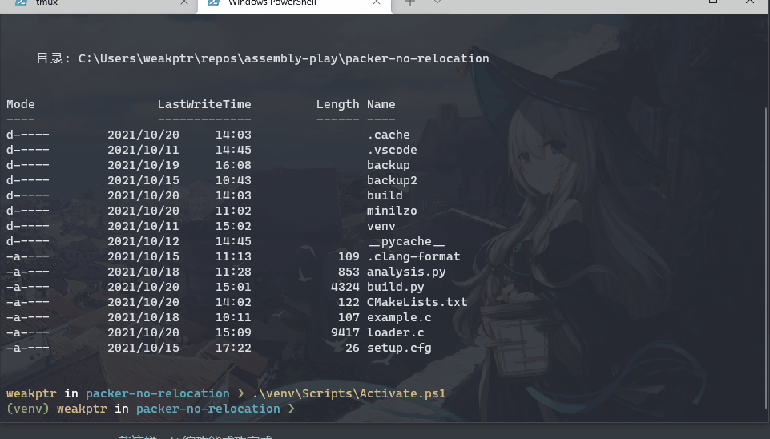
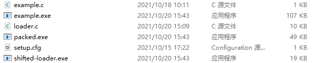
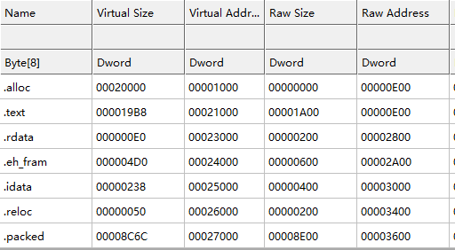

## 前言

本文在前一篇基础上，写一个使用 zlib 的压缩壳案例。

## 0x01 zlib 解压

### 1.1 概述

关于 zlib 的用法找了这些参考资料：

- [zlib.net/zpipe.c](https://zlib.net/zpipe.c)
- [zlib Usage Example](https://zlib.net/zlib_how.html)
- [Compress and Decompress a string with zlib](https://gist.github.com/arq5x/5315739)

尝试了 zlib、lzo、Windows Compression API，对压缩和解压 API 的基本模式的基本认识大概是这样：

- 首先，你得有被压缩数据的大小（要么分块压缩，要么有整个压缩后的大小）
- 然后得有解压后的预期大小，这个能通过 *尝试解压* 的操作来实现。比如 Windows Compression API 和 lzo 都可以在解压 buffer 传 NULL，尝试取得解压后的大小，再分配好内存解压。
- zlib 这样的流式压缩、解压处理文件比较友好，但全程在内存里进行的话，流式解压就会导致大量内存分配 =。= 除非一开始就分配足够的空间，不然一个一个内存块申请和合并会很蛋疼。

### 1.2 内存布局

压缩后的 `.packed` 节在头部留出 8 个字节，分别保存压缩后大小和压缩前大小，以便一次分配好内存完成解压。

| 偏移 | 大小  | 内容               |
| ---- | ----- | ------------------ |
| 0    | DWORD | 小端序，压缩后大小 |
| 4    | DWORD | 小端序，压缩前大小 |
| 8    | 可变  | 压缩后的数据       |

### 1.3 解压代码

解压过程在加载 PE 之前，找到 `.packed` 节后，开始读取头部大小，并调用解压代码。

```c
if (packed != NULL) {
    DWORD compressed_size = *((DWORD *)packed);         // compressed size little-endian
    DWORD decompressed_size = *((DWORD *)(packed + 4)); // decompressed size little-endian
    void *compressed = (void *)(packed + 8);            // compressed buffer
    void *decompressed = malloc(decompressed_size);     // decompressed buffer
    if (decompressed == NULL) {
        MessageBoxA(NULL, "memory allocate failed", "malloc", MB_OK);
        return 0;
    }

    decompress(compressed, compressed_size, decompressed, decompressed_size);

    void (*entrypoint)(void) = (void (*)(void))load_PE(decompressed);
    entrypoint();

    return 0;
}
```

应该没有太多疑问。接下来的是解压代码。

```c
void decompress(void *compressed, size_t length, void *decompressed, size_t decompressed_length) {
  z_stream inflate_stream;
  inflate_stream.zalloc = Z_NULL;
  inflate_stream.zfree = Z_NULL;
  inflate_stream.opaque = Z_NULL;
  inflate_stream.avail_in = (uInt)length;
  inflate_stream.next_in = (Bytef *)compressed;
  inflate_stream.avail_out = (uInt)decompressed_length;
  inflate_stream.next_out = (Bytef *)decompressed;
  inflateInit(&inflate_stream);

  int err = inflate(&inflate_stream, Z_NO_FLUSH);
  if (err != Z_STREAM_END) {
    inflateEnd(&inflate_stream);
    MessageBoxA(NULL, "zlib decompression failed", "zlib", MB_OK);
    return;
  }
  inflateEnd(&inflate_stream);
  return;
}
```

定义 inflate 流：

- `avail_in` 是可用的输入 buffer 大小
- `avail_out` 是可用的输出 buffer 大小
- `next_in` 是输入 buffer 的指针
- `next_out` 是输出 buffer 的指针
- `zalloc`、`zfree`、`opaque` 初始化成 NULL

使用 `inflateInit()` 初始化流，然后调用 `inflate()` 解压。`inflate()` 会返回错误码，如果长度正好，会返回 `Z_STREAM_END`。如果输出 buffer 长度不足，但解压成功，会返回 `Z_OK`。其他情况会返回错误码。因为这里很清楚给定的压缩前长度，解压必定返回 `Z_STREAM_END`，其他情况都有问题，所以只做了一个判断。

对于其他情况，错误码可以用 `zError` 获取错误描述。

解压结束后要使用 `inflateEnd()` 关闭流。

## 0x02 zlib压缩

因为使用 python 写加壳机，就不用这么麻烦了。

在处理 `.packed` 节的时候，使用 `struct` 和 `zlib` 两个 python 自带的库就能完成压缩和填充头。

在脚本头部添加两句 `import`

```python
import struct
import zlib
```

然后修改加壳代码中，添加 `.packed` 节的代码。

```python
# add packed section
with open('example.exe', 'rb') as f:
    file_content = f.read()
    origin_length = len(file_content)
    compressed = zlib.compress(file_content, 9)
    compressed_length = len(compressed)
    section_content = struct.pack('<II', compressed_length, origin_length)
    section_content += compressed

    packed_section = lief.PE.Section('.packed')
    packed_section.content = list(section_content)
    packed_section.characteristics = (lief.PE.SECTION_CHARACTERISTICS.MEM_READ |
                                      lief.PE.SECTION_CHARACTERISTICS.CNT_INITIALIZED_DATA)
    output.add_section(packed_section)
```

可以看到使用 `zlib.compress` 就完成了压缩，不用原始 zlib 流那么麻烦。

`struct.pack` 指定了小端序，两个4字节int，分别填写压缩后大小和原始大小，连接压缩后的数据，填充进`.packed` 节。

就这样，压缩功能成功完成。

## 0x03 成果展示







## 总结

偷懒了，用了一些 msvcrt 的函数，比如 malloc，要加个 `-lmsvcrt` 链接选项。最终成品压缩率还可以，从107KB 压缩到了 49KB，zlib 不负期望。

写好壳程序之后，不管是加密还是压缩都是很容易的事情（指单纯做个简单实现），但问题依然存在：

- 64位程序——我觉得可以以后再说吧？我连64位汇编都还不会（泪）。
- 脱壳跟玩一样——现在看 .packed 已经没有 MZ 这个摆明了是原始程序的标志了，但并没有卵用。壳程序也没混淆和反调试，节表也是清晰可见，根本不用分析。

下一篇还没想好做什么，得先继续学习充实下自己，找个方向。