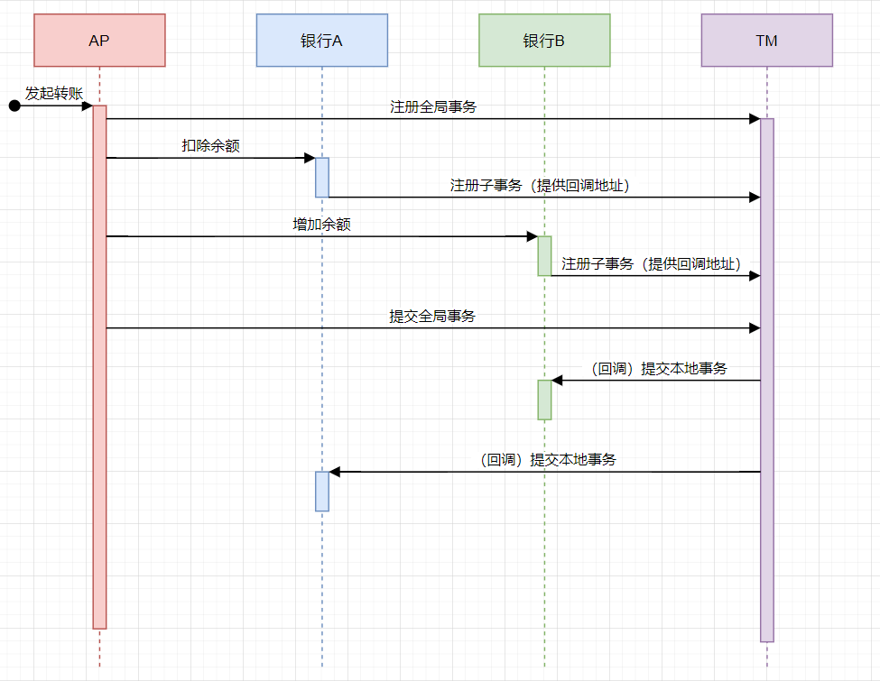
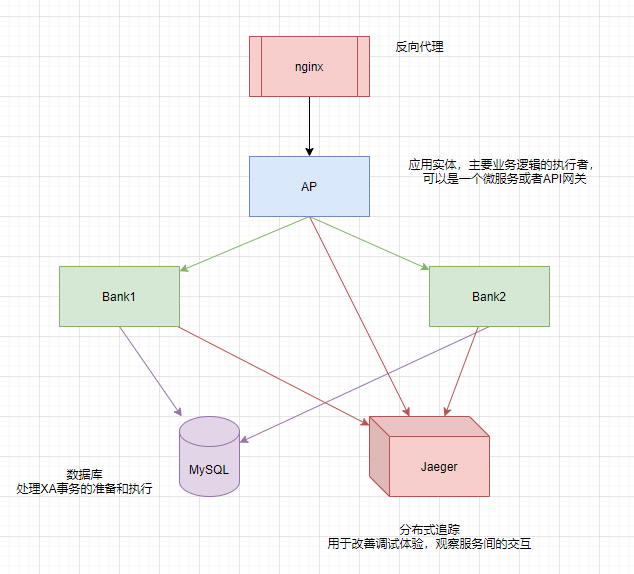

## 前言

有言道，纸上得来终觉浅，绝知此事要躬行。分布式事务的具体方案，看几篇文章就基本有了概念，但实际应用的机会很少。这不有点闲暇，就试试看把理论化作代码，在实践中检验。

## #1 案例设计

采用分布式事务经典的转账案例：用户从银行A转账到银行B，银行A扣除余额，银行B增加余额。

XA事务官方规范文档给出的示意图如下。


用 XA 事务描述，用户的转账操作发生在AP，AP调用TM注册全局事务后，调用银行A（RM）完成扣款（PREPARE），调用银行B（RM）完成增加余额（PREPARE），然后调用TM提交全局事务，TM回调银行A和B提交本地事务。

图示如下。



上面的时序图是读了 [github.com/yedf/dtm](https://github.com/yedf/dtm/) 代码后胡乱分析出来的，图略去了错误处理的部分。根据这个时序图可以做出一个简单的服务划分设计。



为了更好地观察服务的交互情况，引入了 Jaeger ，如果是为了简化整个案例代码考虑也可以不要。但大部分时候 Jaeger 应该是没什么存在感的。

nginx 反向代理将 AP 的接口还有 Bank1/Bank2的接口导出给用户访问，实际上案例中没有需要访问 Bank1/Bank2 接口的情况，所以 去掉 nginx 反向代理应该也没什么大关系。

## #2 技术栈

所有服务使用docker-compose部署，kubernetes也没问题。

MySQL使用5.7版本，jaeger和nginx最新稳定版。AP/Bank服务都使用 Go 语言编写， 使用 Gin 作为 HTTP 服务框架，OpenTelemetry 跟踪，sqlx 做 ORM。

## #3 接口设计

接口url设计有参考 Google APIs 规范，但并不是硬套 RESTful 。

AP服务提供接口

- `/v1alpha1/transfer` 转账接口

Bank服务提供接口

- `/v1alpha1/trans_in` 余额转入
- `/v1alpha1/trans_out` 余额转出
- `/v1alpha1/tm_callback` 事务回调，当AP提交事务或者回滚时，TM回调这个接口并告知需要提交还是回滚

TM服务提供接口

- `/v1alpha1/create_global_tx` 注册全局事务。
- `/v1alpha1/register_local_tx` 注册本地事务，指定关联哪个全局事务。在AP提交或者回滚的时候TM可以查找出所有本地事务并回调。
- `/v1alpha1/commit_global_tx` 提交全局事务。
- `/v1alpha1/rollback_global_tx` 回滚全局事务。

一共需要实现8个接口，接口会尽量简化。

## #4 框架构建

创建好各个服务的样板（就是简单的用Gin把上面的接口定义好，写好主程序），接着写 Dockerfile 和 docker-compose.yml 把之前设计的服务划分实现出来。

```yaml
version: '3.1'
services:
  jaeger:
    image: jaegertracing/all-in-one:1.29
    environment:
      - COLLECTOR_ZIPKIN_HOST_PORT=:9411
    expose:
      - 5775
      - 6831
      - 6832
      - 5778
      - 16686
      - 14268
      - 14250
      - 9411
    ports:
      - 16686:16686
    restart: always
  mysql:
    image: mysql:5.7
    ports:
      - "3306:3306"
    environment:
      MYSQL_ROOT_PASSWORD: root
    restart: always
    volumes:
      - ./scripts/initdb.d/:/docker-entrypoint-initdb.d/:ro
  reverseproxy:
    image: nginx:mainline
    ports:
      - 8080:80
    restart: always
    depends_on:
      - bank1
      - bank2
      - app
    volumes:
      - ./scripts/nginx/default.conf:/etc/nginx/conf.d/default.conf:ro
  tm:
    build:
      context: .
      dockerfile: docker/tm.Dockerfile
    expose:
      - 5000
    restart: always
    depends_on:
      - mysql
  bank1:
    build:
      context: .
      dockerfile: docker/bank.Dockerfile
    command: [ "/bank", "-bank-id", "1" ]
    expose:
      - 5000
    restart: always
    depends_on:
      - tm
      - mysql
  bank2:
    build:
      context: .
      dockerfile: docker/bank.Dockerfile
    command: [ "/bank", "-bank-id", "2" ]
    expose:
      - 5000
    restart: always
    depends_on:
      - tm
      - mysql
  app:
    build:
      context: .
      dockerfile: docker/app.Dockerfile
    expose:
      - 5000
    restart: always
    depends_on:
      - tm
      - bank1
      - bank2
      - mysql
```

其中 Bank1/Bank2 用的同一套代码，以命令行参数来区分连接不同的数据库。

## #5 TM 实现

### 创建全局事务

```go
func createGlobalTx(c *gin.Context) {
	req := &tm.CreateGlobalTxReq{}
	c.BindJSON(req)

	db := c.MustGet("db").(*sqlx.DB)
	_, err := db.NamedExecContext(c.Request.Context(), `INSERT INTO global_tx(gid) VALUES(:gid)`, &tm.GlobalTx{GID: req.GID})
	if err != nil {
		c.Error(err)
		return
	}

	c.JSONP(200, map[string]interface{}{
		"code":    0,
		"message": "ok",
	})
}
```

暂时没有考虑更多全局事务的用法，只是单纯的保存。

### 注册本地事务

```go
func registerLocalTx(c *gin.Context) {
	req := &tm.RegisterLocalTxReq{}
	c.BindJSON(req)

	db := c.MustGet("db").(*sqlx.DB)
	_, err := db.NamedExecContext(
		c.Request.Context(),
		`INSERT INTO local_tx(gid,branch_id,callback_url) values(:gid, :branch_id, :callback_url)`,
		&tm.LocalTx{
			GID:         req.GID,
			BranchID:    req.BranchID,
			CallbackUrl: req.CallbackUrl,
		},
	)
	if err != nil {
		c.Error(err)
		return
	}

	c.JSONP(200, map[string]interface{}{
		"code":    0,
		"message": "ok",
	})
}
```

本地事务需要记录下对应的全局事务ID和分支ID（就是这个本地事务的ID，用于回调的时候告诉RM提交哪个本地事务，在MySQL XA里就是XID 的 bqual 部分），以及回调的地址。

### 提交全局事务

```go
func commitGlobalTx(c *gin.Context) {
	req := &tm.CommitGlobalTxReq{}
	c.BindJSON(req)

	db := c.MustGet("db").(*sqlx.DB)
	allLocalTx := make([]tm.LocalTx, 0)
	err := db.SelectContext(c.Request.Context(), &allLocalTx, "SELECT * FROM local_tx WHERE gid=?", req.GID)
	if err != nil {
		c.Error(err)
		return
	}

	// TODO 极端情况下，回调 RM 时出现部分失败要如何处理？
	cli := &http.Client{Transport: otelhttp.NewTransport(http.DefaultTransport)}
	for _, tx := range allLocalTx {
		callbackPayload := &bank.TMCallbackReq{Action: "commit", GID: req.GID, BranchID: tx.BranchID}
		callbackResp := bank.TMCallbackResp{}
		err = client.WrappedPost(c.Request.Context(), cli, tx.CallbackUrl, callbackPayload, &callbackResp)
		if err != nil {
			c.Error(err)
			return
		}

		if callbackResp.Code != 0 {
			c.JSONP(500, &tm.CommitGlobalTxResp{
				Code:    -1,
				Message: fmt.Sprintf("commit local tx failed, response code %d, %s", callbackResp.Code, callbackResp.Message),
			})
			return
		}
	}

	c.JSONP(200, map[string]interface{}{
		"code":    0,
		"message": "ok",
	})
}
```

全局事务的提交，本质是由TM负责逐个告知RM提交自己的本地事务，也是整个 XA 过程里最重要也最脆弱的一步。理论上来说这时的 XA 事务无论是提交还是回滚都应该无条件成功。

但TM本身，以及TM和RM之间的网络存在故障的可能。如果TM崩溃，或者TM和RM之间出现网络分区，导致TM无法发出提交或回滚的消息时，就会导致参与者陷入长时间的阻塞，直到TM恢复运行，或网络恢复畅通，参与者收到TM发出的Commit或Rollback消息为止。

更可能出现的情况是，一个或几个参与者出现网络分区或崩溃，没有收到 Commit 消息，只能继续阻塞等待，TM也需要不断重试。参与者不能依据超时时间武断提交或回滚，因为TM很可能发出了提交的指令，只是因为网络状况不佳等原因未能及时送达。这一情况也可以通过参与者之间互相询问来解决，等待超时的参与者可以询问其他参与者，如果有参与者未准备则可以确定需要回滚，如果有参与者已经提交，则也可以确定需要提交。但如果所有参与者都处于就绪状态，则无法判断TM的最终决策，只能继续傻等。

另外关于网络分区（就是CAP中的P），假如说消息发送者会不断重试发送，直到接收者告知成功，暂且认为多次发送消息产生的结果是幂等的，那么接收者因为网络原因未能接收到消息，和接收到了消息，但因为接收者本身的故障或资源不足等原因未能处理消息就崩溃重启的话，实质上和网络分区的结果是差不多的，都可以看作是接收者未能收到消息。举例来说就是一个HTTP请求在程序中间件里触发了崩溃，没有执行任何业务逻辑，直到压力缓解后才恢复，这种情况放在上面的场景（TM回调提交本地事务）里分析，和出现网络分区的情况是很接近的。（PS：开脑洞，别当真啊，应该和 P 还是不大一样的）

所以总结就是，TM要保证最终一致，所有的XA事务都被提交或回滚。一旦进入提交或回滚全局事务的状态，则**需要无限次尝试回调提交或回滚本地事务，直至全部成功**。上面的案例代码是没有考虑重试的情况，实际应该在函数里不断重试，直到成功。或者直接放到后台去跑，返回个提交进行中也是一种办法。大部分情况下应该是不会有问题的，直接重试也还能接受。可以给个超时，如果出现部分失败就放到后台去慢慢跑，先返回个进行中。

虽然保证了一致性（CAP里的C），也容忍了叫参与者提交本地事务失败而产生的分区（P），但这样做必然是要舍弃一部分可用性（A）的。所以 XA 事务是一种保证 CP 的分布式事务解决方案。

### 回滚本地事务

```go
func rollbackGlobalTx(c *gin.Context) {
	req := &tm.RollbackGlobalTxReq{}
	c.BindJSON(req)

	db := c.MustGet("db").(*sqlx.DB)
	allLocalTx := make([]tm.LocalTx, 0)
	err := db.SelectContext(c.Request.Context(), &allLocalTx, "SELECT * FROM local_tx WHERE gid=?", req.GID)
	if err != nil {
		c.Error(err)
		return
	}

	// TODO 极端情况下，回调 RM 时出现部分失败要如何处理？
	cli := &http.Client{Transport: otelhttp.NewTransport(http.DefaultTransport)}
	for _, tx := range allLocalTx {
		callbackPayload := &bank.TMCallbackReq{Action: "rollback", GID: req.GID, BranchID: tx.BranchID}
		callbackResp := bank.TMCallbackResp{}
		err = client.WrappedPost(c.Request.Context(), cli, tx.CallbackUrl, callbackPayload, &callbackResp)
		if err != nil {
			c.Error(err)
			return
		}

		if callbackResp.Code != 0 {
			c.JSONP(500, &tm.RollbackGlobalTxResp{
				Code:    -1,
				Message: fmt.Sprintf("rollback local tx failed, response code %d, %s", callbackResp.Code, callbackResp.Message),
			})
			return
		}
	}

	c.JSONP(200, map[string]interface{}{
		"code":    0,
		"message": "ok",
	})
}
```

回滚的逻辑和提交是一样的，不多做解释了。

## #6 Bank 实现

### 转入

```go
func transIn(c *gin.Context) {
	req := &bank.TransInReq{}
	c.BindJSON(req)
	db := c.MustGet("db").(*sqlx.DB)
	cli := client.NewTMClient("http://tm:5000")
	branchID := tm.MustGenBranchID("TransIn")

	resp, err := cli.RegisterLocalTx(c.Request.Context(), &tm.RegisterLocalTxReq{
		GID:         req.GID,
		BranchID:    branchID,
		CallbackUrl: fmt.Sprintf("http://bank%d:5000/v1alpha1/tm_callback", flgBankID),
	})
	if err != nil {
		c.Error(err)
		return
	}
	if resp.Code != 0 {
		c.JSONP(500, &bank.TransInResp{
			Code:    -1,
			Message: "register local tx failed",
		})
		return
	}

	// 业务逻辑
	// 准备 XA 事务
	xid := fmt.Sprintf("'%s','%s'", req.GID, branchID)
	_, err = db.ExecContext(c.Request.Context(), fmt.Sprintf("XA BEGIN %s", xid))
	if err != nil {
		c.Error(err)
		return
	}

	_, err = db.ExecContext(c.Request.Context(), "UPDATE wallet SET balance=balance+? WHERE id=?", req.Amount, req.ID)
	if err != nil {
		c.Error(err)
		return
	}

	_, err = db.ExecContext(c.Request.Context(), fmt.Sprintf("XA END %s", xid))
	if err != nil {
		c.Error(err)
		return
	}

	_, err = db.ExecContext(c.Request.Context(), fmt.Sprintf("XA PREPARE %s", xid))
	if err != nil {
		c.Error(err)
		return
	}

	c.JSONP(200, map[string]interface{}{
		"code":    0,
		"message": "ok",
	})
}
```

如果把MySQL视作RM的话，Bank服务就是连通TM和AP的桥梁。放到转账的场景里，假设AP是支付宝，那能指望支付宝去直接访问银行的数据库吗？比如支付宝从基金里提款，调用基金的提款接口和银行的转账，也是个类似的场景。当然具体业务不能直接套XA，就是举个例子。

转入的接口本身就是代理了一下 MySQL 的 `update` 语句，实际业务场景里可能还会有更多业务逻辑上的判断。

### 转出

```go
func transOut(c *gin.Context) {
	req := &bank.TransOutReq{}
	c.BindJSON(req)
	db := c.MustGet("db").(*sqlx.DB)
	cli := client.NewTMClient("http://tm:5000")
	branchID := tm.MustGenBranchID("TransOut")

	// 注册本地事务
	resp, err := cli.RegisterLocalTx(c.Request.Context(), &tm.RegisterLocalTxReq{
		GID:         req.GID,
		BranchID:    branchID,
		CallbackUrl: fmt.Sprintf("http://bank%d:5000/v1alpha1/tm_callback", flgBankID),
	})
	if err != nil {
		c.Error(err)
		return
	}
	if resp.Code != 0 {
		c.JSONP(500, &bank.TransInResp{
			Code:    -1,
			Message: "register local tx failed",
		})
		return
	}

	// 业务逻辑
	// 准备 XA 事务
	xid := fmt.Sprintf("'%s','%s'", req.GID, branchID)
	_, err = db.ExecContext(c.Request.Context(), fmt.Sprintf("XA BEGIN %s", xid))
	if err != nil {
		c.Error(err)
		return
	}

	_, err = db.ExecContext(c.Request.Context(), "UPDATE wallet SET balance=balance-? WHERE id=?", req.Amount, req.ID)
	if err != nil {
		c.Error(err)
		return
	}

	_, err = db.ExecContext(c.Request.Context(), fmt.Sprintf("XA END %s", xid))
	if err != nil {
		c.Error(err)
		return
	}

	_, err = db.ExecContext(c.Request.Context(), fmt.Sprintf("XA PREPARE %s", xid))
	if err != nil {
		c.Error(err)
		return
	}

	c.JSONP(200, map[string]interface{}{
		"code":    0,
		"message": "ok",
	})
}
```

转出的代码其实有点问题，漏掉了检查余额，其他和转入的接口就没什么区别了。

## #7 AP 实现

### 转账

```go
func transfer(c *gin.Context) {
	req := &TransferReq{}
	c.BindJSON(req)

	tmcli := client.NewTMClient("http://tm:5000")
	gid := tm.MustGenGID()
	resp, err := tmcli.CreateGlobalTx(c.Request.Context(), &tm.CreateGlobalTxReq{GID: gid})
	if err != nil {
		c.Error(err)
		return
	}

	if resp.Code != 0 {
		c.JSONP(500, &GeneralResp{
			Code:    -1,
			Message: "create global transaction failed",
		})
		return
	}

	cli1 := client.NewBankClient("http://bank1:5000")
	transInResp, err := cli1.TransIn(c.Request.Context(), &bank.TransInReq{GID: gid, ID: req.ToID, Amount: req.Amount})
	if err != nil {
		// 失败的话就等着超时
		c.Error(err)
		_, _ = tmcli.RollbackGlobalTx(c.Request.Context(), &tm.RollbackGlobalTxReq{GID: gid})
		c.JSONP(500, &GeneralResp{
			Code:    -1,
			Message: "trans in failed",
		})
		return
	}

	if transInResp.Code != 0 {
		// 失败的话就等着超时
		_, _ = tmcli.RollbackGlobalTx(c.Request.Context(), &tm.RollbackGlobalTxReq{GID: gid})

		c.JSONP(500, &GeneralResp{
			Code:    -1,
			Message: "trans in failed",
		})
		return
	}

	cli2 := client.NewBankClient("http://bank2:5000")
	transOutResp, err := cli2.TransOut(c.Request.Context(), &bank.TransOutReq{GID: gid, ID: req.ToID, Amount: req.Amount})
	if err != nil {
		// 失败的话就等着超时
		c.Error(err)
		_, _ = tmcli.RollbackGlobalTx(c.Request.Context(), &tm.RollbackGlobalTxReq{GID: gid})
		c.JSONP(500, &GeneralResp{
			Code:    -1,
			Message: "trans out failed",
		})
		return
	}

	if transOutResp.Code != 0 {
		// 失败的话就等着超时
		_, _ = tmcli.RollbackGlobalTx(c.Request.Context(), &tm.RollbackGlobalTxReq{GID: gid})

		c.JSONP(500, &GeneralResp{
			Code:    -1,
			Message: "trans out failed",
		})
		return
	}

	commitResp, err := tmcli.CommitGlobalTx(c.Request.Context(), &tm.CommitGlobalTxReq{GID: gid})
	if err != nil {
		// 失败的话就等着超时
		c.Error(err)
		_, _ = tmcli.RollbackGlobalTx(c.Request.Context(), &tm.RollbackGlobalTxReq{GID: gid})
		c.JSONP(500, &GeneralResp{
			Code:    -1,
			Message: "commit failed",
		})
		return
	}

	if commitResp.Code != 0 {
		// 失败的话就等着超时
		_, _ = tmcli.RollbackGlobalTx(c.Request.Context(), &tm.RollbackGlobalTxReq{GID: gid})
		c.JSONP(500, &GeneralResp{
			Code:    -1,
			Message: "commit failed",
		})
		return
	}

	c.JSONP(200, map[string]interface{}{
		"code":    0,
		"message": "ok",
	})
}
```

AP代码主要就是调各个RM，发起转入/转出操作，以及在出现问题的情况下回滚全局事务。

当然，AP回滚全局事务也会出现网络分区的情况，AP崩溃或者网络故障而无法连接TM，也就无法告诉TM是不是所有参与者都准备就绪，TM只能自己等超时后去回调参与者，让参与者回滚所有本地事务。

这里和参与者出现分区又不大一样，AP出现分区最多是导致原本该提交的事务被回滚，并不会破坏一致性，也就满足了CP。但事务被回滚，等于是失去了可用性，不满足CAP中的A。

## #8 关于TCC

TCC 是 Try-Confirm-Cancel 的缩写，最早是由 Pat Helland 于 2007 年发表的一篇名为《Life beyond Distributed Transactions:an Apostate’s Opinion》的论文提出。这里只讲一下个人理解，因为 TCC 的时序图和 XA 可以说是一模一样。

TCC 也是一种 2 阶段提交的协议，和 XA 模型的主要区别是本地事务的准备和提交是业务层面上做的接口，业务上可控性更好的同时，也要求对服务接口进行大刀阔斧的修改，开发量会大很多。TCC 也可以用数据库的 XA 实现。

TCC 的一个重要优点是可以减少数据库资源锁定，比如说，采用 TCC 方式开发一个添加账单的接口，Try 阶段可以直接 INSERT 一个隐藏的账单，Confirm 阶段把账单设置为可见，Cancel 阶段则删除。如果因为某些原因，很长时间没有进入 Confirm 阶段，TCC 服务也不会有什么影响。而 XA 方式一方面要数据库支持，一方面数据库要维持锁，消耗会更大。

## #9 分布式事务问题

分布式事务需要服务在接口做好一定的保护措施，遵循一定的编程规范，来避免错误发生。

### 空补偿

空补偿问题，指的是服务因为一些原因没有收到 PREPARE 请求，在 TM 发起了回滚操作时收到了 ROLLBACK 请求。此时服务并没有需要回滚的本地事务，也就是空补偿（或者叫空回滚）。

如果服务没有处理空补偿，返回了错误，TM就会认为服务没有回滚成功进而不断重试。

### 防悬挂

事务悬挂问题，指的是因为网络拥塞等原因，PREPARE 请求晚于 ROLLBACK 请求到来的情况。此时服务已经做了空补偿，全局事务被回滚，迟到的 PREPARE 请求不对应任何全局事务，也就是“垂悬的”。

关于垂悬这个术语，是从 `dangling (dangle的进行时)` 翻译而来。比如垂悬指针 *dangling pointer* 指的是已经被指向已经被释放的空间的指针，垂悬事务对应的就是指向已经被回滚的全局事务的本地事务。

对于全局事务已经被回滚的情况，服务应该不执行 PREPARE，超时到 TM 都回滚了，大概也没法返回错误，客户端连接都可能断开了。

### 幂等

因为网络延迟和抖动的存在，服务可能会收到多次 PREPARE/COMMIT/ROLLBACK 。对这种情况也要保证同样的条件下，一次请求和多次请求产生的结果是一致的。

换言之，同样的参数PREPARE多次，和一次 PREPARE 一致。多余的 PREPARE 可以啥也不做。同样的 COMMIT/ROLLBACK 多次，也是等于只 COMMIT/ROLLBACK 一次。

## 总结

主要研究了2阶段提交的主要过程、接口设计、TM实现以及2阶段提交协议中可能遇到的一些问题。代码主要是辅助思考，并没有真正的成果。

2阶段提交过程：

- prepare
- commit/rollback

2阶段提交的基本时序：

- 注册全局事务
- 注册本地事务（prepare）
  - 如果失败，则回滚全局事务
- 提交全局事务

全局事务的提交和回滚都不允许部分失败的情况，一旦PREPARE成功，提交或回滚都必须成功。如果出现临时失败（网络问题或者崩溃），则不断重试直到全部成功。

分布式事务常见问题：

- 空补偿问题。出现在没有 PREPARE 就调用了 ROLLBACK 的情况。需要支持。
- 垂悬问题。出现在先调用了 ROLLBACK 才调用 PREPARE 的情况。不进行 PREPARE。
- 幂等问题。出现在以同样的条件多次调用 PREPARE/COMMIT/ROLLBACK 的情况。多次调用应和一次调用结果一致。

之后可能再研究下分布式事务问题的具体实践，或者实现下 TCC 之类其他的分布式事务模型。

最终代码在 [github.com/nnnewb/dt](https://github.com/nnnewb/dt)
