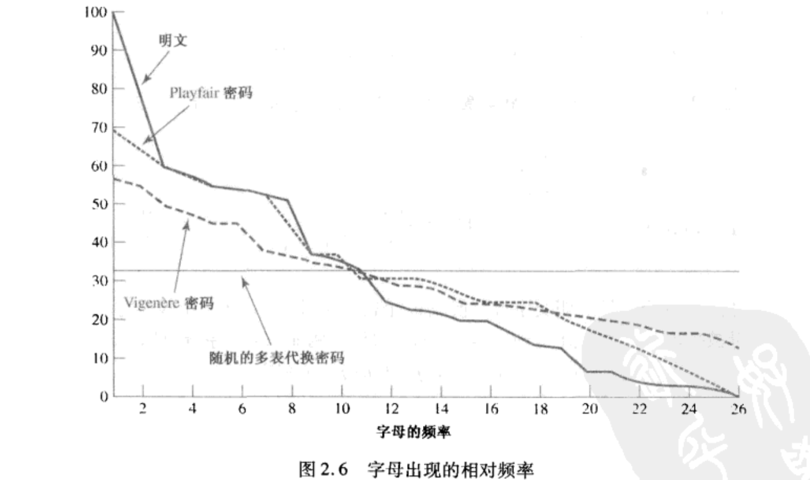

## 前言

从单表代替密码开始，继续学习古典密码。

## 0x01 playfair 密码

*playfair* 这个词乍一听我甚至有点迷惑，啥意思，公平竞赛吗。之后才知道原来是人名。

### 概述

playfair 密码是最著名的多字母代替密码，它把明文中的字母对转换成密文的字母对，每次加密输入两个字母，输出两个字母。

playfair 算法基于一个由密钥词构成的 5x5 字母矩阵，将密钥词去除重复字母后，和字母表剩余的字母按左至右、上至下的顺序填充进表里。

举例来说，用 `pojie` 作为密钥词。

| -    | -    | -    | -    | -    |
| ---- | ---- | ---- | ---- | ---- |
| p    | o    | j    | i    | e    |
| a    | b    | c    | d    | f    |
| g/h  | k    | l    | m    | n    |
| q    | r    | s    | t    | u    |
| v    | w    | x    | y    | z    |

需要注意的是字母表有26个字母，但 playfair 的字母矩阵只有 25 个空格。出现字母表不是 5 的整数倍的情况时可以选择将多出来的字母视作同一个，或者去掉不常用的字母，使其正好填满矩阵。比如图中的`g`/`h`，好孩子不要学哦。常见的情况是`i`/`j`或者去掉`z`或`q`。

### 加密过程

加密过程如下。

第一步：将明文分成两个字母一组，两个字母重复的话就在中间填`x`重新分组；如果最后剩下一个字母的话，也添加`x`分成一组。举例来说，对单词`balloon`，直接分组的话就是`ba`、`ll`、`on`，填`x`重新分组就是`ba`、`lx`、`lo`、`on`。

分组后，对每个组进行加密，依然是 `balloon` 为例。首先第一组 `ba`。

第二步：找出两个字母在上面表格里的行列坐标。

- `b` 是第 2 行第 2 列。
- `a` 是第 1 行第 2 列。

第三步：按规则选择代替的字母

- 如果两个字母不同行也不同列，则选择本字母所在行、分组中另一个字母所在列的字母代替。
- 如果两个字母在同一行，则选择明文右边的字母代替。明文在最右边则由最左边的字母代替。
- 如果两个字母在同一列，则选择明文下边的字母代替。明文在最底下则由最上边的字母代替。

比如 `balloon` 加密后，就是 `bcsjkjek` 。

### 特点

playfair 有 26x26 个字母对，因此识别出单个字母对相对简单的单表代替算法要困难得多。字母对的相对频率比字母的相对频率变化幅度小，利用频率分析字母对更困难。

playfair 仍然是相对容易攻破的，因为它的密文仍然完好保留了明文语言的大部分结构特征，几百个字母的密文就足够分析出规律了。



图中显示了 playfair 密码和其他一些密码加密的有效性，标有明文的曲线画出了超过从7w个字母的文章中得到的频率分布。曲线代表这样的含义：对文章中出现的每个字母计数，计数结果除以使用频率最高的字母出现次数。假设使用频率最高的字母 `e` 出现的频率为 1 ，那么 `t` 出现的频率就是 `0.76` 等等。

图中的横轴表示字母，纵轴表示字母出现的频率。 曲线体现了加密后字母频率分布被掩盖的程度。如果频率分布的信息完全被加密过程给隐藏了，那么密文的频率曲线应该是一条水平的线，唯密文密码分析由此下手将一无所获。

图中所示的频率曲线表明 playfair 密码虽然有比明文稍平坦的频率分布曲线，但仍然透露了大量信息给密码分析者。

### 代码实现

```cpp
#include <algorithm>
#include <array>
#include <cctype>
#include <cstddef>
#include <cstdlib>
#include <iostream>
#include <iterator>
#include <ostream>
#include <set>
#include <string>
#include <unordered_set>
#include <utility>

constexpr const char *lowercase = "abcdefghijklmnopqrstuvwxyz";

// 保持顺序的情况下，对输入文本去重，并且从文本里把字符j替换成i
std::string my_unique(const std::string &text) {
  std::string ret = text;
  std::replace(ret.begin(), ret.end(), 'j', 'i');
  std::unordered_set<char> s;
  auto last = std::stable_partition(ret.begin(), ret.end(), [&s](int n) {
    bool ret = !s.count(n); // not exists
    s.insert(n);
    return ret;
  });
  ret.erase(last, ret.end());
  return ret;
}

// 从密钥字符串构造出 playfair 密钥矩阵
std::array<std::string, 5> playfair_matrix(const std::string &key) {
  // 初始化密钥，构造的密钥中没有 j，加密时 j 视作 i 处理
  std::string fullkey = my_unique(key + lowercase);
  if (fullkey.length() % 5) {
    std::cerr << "invalid key length" << std::endl;
    exit(1);
  }

  // 构造矩阵
  std::array<std::string, 5> matrix;
  int count = 0;
  for (auto c : fullkey) {
    matrix[count / 5].push_back(c);
    ++count;
  }
  return matrix;
}

// 用迭代器读取一组两个字符（从当前位置开始，*iter 和 *(iter+1) 为一组）。
// 如果后续两个字符重复，则取一个字符加上 x 返回；
// 如果后续仅剩一个字符也加上 x 返回。
std::array<char, 2> next2(std::string::const_iterator &it, std::string::const_iterator end) {
  std::array<char, 2> ret;
  if (it + 1 == end || *it == *(it + 1)) {
    ret[0] = tolower(*(it++));
    ret[1] = 'x';
  } else {
    ret[0] = tolower(*(it++));
    ret[1] = tolower(*(it++));
  }
  return ret;
}

// 获得字符在密钥矩阵中的坐标，返回 (行,列)
std::pair<int, int> get_row_col(std::array<std::string, 5> matrix, char c) {
  for (size_t r = 0; r < matrix.size(); ++r) {
    const auto &row = matrix[r];
    auto col = row.find(c);
    if (col != row.npos) {
      return std::make_pair(r, col);
    }
  }
  return std::make_pair(-1, -1);
}

// playfair 加密函数
std::string playfair_cipher(const std::string &input, const std::string &key) {
  std::string ciphertext;
  auto matrix = playfair_matrix(key);
  auto it = input.cbegin();
  while (it != input.cend()) {
    auto char_pair = next2(it, input.cend());
    auto c1_pos = get_row_col(matrix, char_pair[0] == 'j' ? 'i' : char_pair[0]);
    auto c2_pos = get_row_col(matrix, char_pair[1] == 'j' ? 'i' : char_pair[1]);

    if (c1_pos.first == c2_pos.first) {
      // 同一行，取同行下一个字符
      auto row = c1_pos.first;
      auto c1_col = c1_pos.second + 1 >= 5 ? 0 : c1_pos.second + 1;
      auto c2_col = c2_pos.second + 1 >= 5 ? 0 : c2_pos.second + 1;

      ciphertext.push_back(matrix[row][c1_col]);
      ciphertext.push_back(matrix[row][c2_col]);
    } else if (c1_pos.second == c2_pos.second) {
      // 同一列，取同列下一个字符
      auto col = c1_pos.second;
      auto c1_row = c1_pos.first + 1 >= 5 ? 0 : c1_pos.first + 1;
      auto c2_row = c2_pos.first + 1 >= 5 ? 0 : c2_pos.first + 1;

      ciphertext.push_back(matrix[c1_row][col]);
      ciphertext.push_back(matrix[c2_row][col]);
    } else {
      // 不同行也不同列，取本行，另一字符所在列的字符
      auto row = c1_pos.first;
      auto c1_col = c2_pos.second;
      auto c2_col = c1_pos.second;

      ciphertext.push_back(matrix[row][c1_col]);
      ciphertext.push_back(matrix[row][c2_col]);
    }
  }
  return ciphertext;
}

int main(void) {
  for (const auto &row : playfair_matrix("haoye")) {
    std::cout << row << std::endl;
  }

  std::cout << "ciphertext:" << playfair_cipher("helloworld", "haoye") << std::endl;
  return 0;
}

```

以上是 playfair 加密的 c++ 实现。比较怪的是 playfair 网上可以找到很多变体，比如 [practice cryptography](http://www.practicalcryptography.com/ciphers/classical-era/playfair/#javascript-example-of-the-playfair-cipher) 描述和实现的 playfair 算法是在分组阶段，把重复出现的第二个字符替换成 `x` 。

解密没有在这里实现，解密函数规则如下：

- 如果一组两个字母在同一行，则用前一列字母替换，第一列用最后一列字母替换。
- 如果一组两个字母在同一列，则用前一行字母替换，第一行用最后一行字母替换。
- 如果一组两个字符不在同一列同一行，则取同一行，一组中另一字母所在列的字母替换。

就是把加密规则反过来执行，唯一的区别是在分组阶段不用考虑相同字母，出现相同字母说明密文有问题，可以跳过这一组字母。最后解密结果会出现多余的`x`，如果明文包含`j`的话解密结果会变成`i`。

## 结论

简要描述 playfair 算法加密过程：

- 从密钥构造 5x5 矩阵
- 对明文按两个字母一组分组，分组过程中处理连续重复字符（重复字母间插入`x`）和孤立字母（末尾剩余的最后一个字母也加上`x`）
- 按规则，对一组两个字母进行替换，直到所有明文都被替换完成
  - 如果两个字母在矩阵同一行，取字母在本行的下一个字母替换，行末字母取行首。
  - 如果两个字母在矩阵同一列，取字母在本列的下一个字母替换，列末字母取列首。
  - 如果不同行不同列，取字母本行，本组另一字母所在列的字母替换。

playfair 密码的相比简单单表替换，分析难度大得多。但依然完整保留了语言的结构特征，因此分析依然比较容易。

