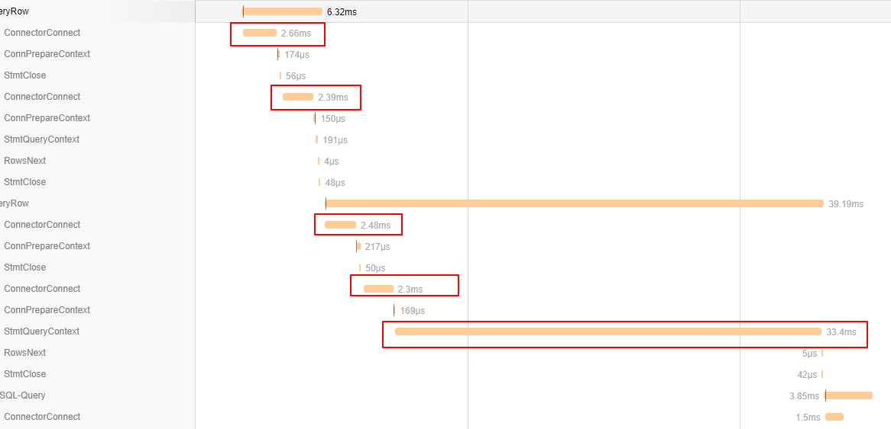
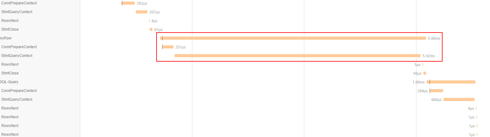

## 前言

刚接手管理后台的后端服务，先随便挑个什么东西下手看看。正好注意到一个简单的接口返回时间都蛮长的，于是拿刚从 opentelemetry 的 issue/pr 里抄来的 sqlmw 包装驱动来分析优化下性能。

## 0x01 性能分析

### 预判

下手前预估下可能存在瓶颈的地方。对于这次下手的接口（`get_users`），整个实现也没几行代码，只有两三个查询，数据量也不大，但是耗时有80ms+。

其他接口有快有慢，并没有表现出同时增加耗时，而且开发服务器架在内网，排除网络原因，大概还是服务本身的存在的问题。于是考虑瓶颈在数据库或代码中，但具体肯定是要看代码去分析的。既然判断是代码里的问题，那下一步就是测量下耗时情况了。

对于go，`pprof`虽然是个不错的主意，但实话说部署在 kubernetes 里，配 `pprof` 去拉结果有点麻烦，而且还有点点用不惯。正好这个项目里早就配置了 `opentracing`+`jaeger`做分布式跟踪，所以就直接抄一下 opentelemetry 的 [otelsql](https://github.com/seslattery/otelsql/blob/master/otelsql.go) ，把SQL查询的详细耗时情况记录下来，就可以开始分析了。

### opentracing收集数据

`otelsql` 原理是用 [sqlmw](https://github.com/ngrok/sqlmw) 在 sql 驱动层级上进行包装`sql ==> sqlmw.Driver{mysql.Driver}` 。go的`sql`调用`sqlmw.Driver`，`sqlmw.Driver`调用`mysql.Driver`，如此而已，具体不解释。

从`otelsql`借鉴下思路即可，现在 `opentracing` 已经和 `opencensus` 合并成了 `opentelemetry`，但项目也没法说升级就升级，毕竟项目架构设计稀烂，太多地方和 `opentracing`、`jaeger-client` 强耦合了。把`otelsql`里用`sqlmw`的部分抄出来，改成`opentracing`的方式创建`span`完事。

```go
func (in *sqlInterceptor) ConnExecContext(ctx context.Context, conn driver.ExecerContext, query string, args []driver.NamedValue) (driver.Result, error) {
	span, ctx := opentracing.StartSpanFromContext(ctx, "ConnExecContext")
	defer span.Finish()
	span.LogKV("sql.query", query)
	return conn.ExecContext(ctx, query, args)
}
```

如此一来， 当go的`sql`库访问数据库的时候，就会在`jaeger`里记录一个`span`，可以清晰地看到耗时情况。

### 分析



收集到耗时情况后开始观察，注意到两个问题：

1. `ConnectorConnect` 在每个请求前出现，每次耗时 2ms 左右。但 `sql` 是有连接池的，这里每次执行查询都产生一次连接显然不对劲。
2. `StmtQueryContext` 出现一个耗时极长的查询，占据接近1/2的请求耗时，这条查询就是主要瓶颈。

慢查询的SQL如下。

```sql
select count(1) from user where role=1 and create_timestamp>? and create_timestamp<?
```

是一个简单的 `select count(1)` 查询，初步考虑是 `where` 里少了索引。

## 0x02 优化

### 索引优化

既然少索引，那就考虑下加索引。看了下数据库，`role`和`create_timestamp`字段都没有索引，于是先分别加上了索引，再 `explain` ，发现查询类型已经变成了 `ref` 。再运行查询，发现耗时依然有 20ms+。

参考 [multiple-column index](https://dev.mysql.com/doc/refman/5.7/en/multiple-column-indexes.html) 中的话：

> MySQL can use multiple-column indexes for queries that test all the columns in the index, or queries that test just the first column, the first two columns, the first three columns, and so on. If you specify the columns in the right order in the index definition, a single composite index can speed up several kinds of queries on the same table.

文档中还说：

>If a multiple-column index exists on `col1` and `col2`, the appropriate rows can be fetched directly. If separate single-column indexes exist on `col1` and `col2`, the optimizer attempts to use the Index Merge optimization (see [Section 8.2.1.3, “Index Merge Optimization”](https://dev.mysql.com/doc/refman/5.7/en/index-merge-optimization.html)), or attempts to find the most restrictive index by deciding which index excludes more rows and using that index to fetch the rows.

也就是说，如果`role`和`create_timestamp`分别有索引，`mysql`会尝试用 *Index Merge Optimization* 算法来优化查询。但如果有多列索引的话，就能直接获取（文档里的场景能直接获取，但上文的 `count(1)` 查询应该不行）。

于是加上多列索引，再`explain`，发现查询类型变成了`range`，实际执行发现查询耗时降低至 5ms 左右。

### 连接池优化

go的`sql`包自带连接池应该是比较清楚的。原本怀疑是不是对`sql.DB`这个结构的用法有问题，但翻了下源码，发现`sql.DB.ExecContext`之类的接口都会通过连接池取连接，完成后返回连接池。所以理论上来说都应该走连接池的连接，而不是每次查询都创建——除非连接池里没有可用的连接了。另外也谷歌了一圈，`sql.DB` 似乎也没有什么特别的最佳实践，并没有人提到要手动`DB.Conn`取连接后自己处理。

于是初步怀疑下是不是哪里设置了连接池属性出了问题。通过排查源码中设置连接池属性的地方，发现一个自己埋下的坑。

```go
if env.DEBUG {
    mysqldb.SetMaxIdleConns(0)

    cfg, err := mysql.ParseDSN(host)
    if err != nil {
        cfg = &mysql.Config{}
    }

    StartObverseSQLConnPool(cfg.DBName, *mysqlDB, time.Duration(5)*time.Second)
}
```

因为我司这个项目没有配置 metrics 收集和分析，自然也没收集服务的连接池情况。所以当初入职后遇到一个奇怪的连接池耗尽，服务假死，调用栈全部卡在连接池上的问题时，为了判断是不是出现连接泄露，写了个goroutine去监测连接池里连接获取和释放的情况...

为了调试方便，还把`SetMaxIdleConns`设置为了0。

于是初步怀疑就是这个原因导致连接池罢工，将整段调试代码注释掉之后，再次访问接口，响应时间降低至9.8ms。


最大头的耗时依然是`count(1)`查询。



默认情况下 IdleConn 只有 2，超时也比较短。实际参数应该根据业务访问情况来安排。我这也没什么好的计算公式。连接池参数有问题会影响单条SQL的基本耗时，请求里三四条查询，每条加上几个ms，整个请求时间就拖长了十几ms。在微服务系统里影响还可能放大，别的服务要是多次调用，积累的时延可能就要上百ms了。

### 缓存优化

进一步的优化思路就是做缓存。是为了提高服务响应速度，也是为了提高负载能力、减轻查询压力，保护 MySQL 服务。过去年轻无知犯过错，就是考虑性能的时候只关注到了自己写的代码，认为代码跑得快重要——比如把 C 的执行性能吹上天。但事情从来不是这么简单——辩证法说实事求是，要具体问题具体分析。后端从来不是“我的代码”这么简单，如果不能从整个系统的角度出发发现问题，那就算是 CPU 成精了也没辙。

对于实时性要求不高的接口，将数据缓存一段时间是绝对没问题的。不过因为做缓存是个系统性的事情——要考虑缓存更新的嘛，也不是每个接口都适合缓存，实时性有要求或者查询太复杂的话宁可考虑换成 ES 一类的分布式系统，把压力分摊到更多机器上。当然也意味着要花更多的钱，更难维护。

我司项目就是个很沙雕的例子，因为最初就没设计缓存，连SQL都在用手工拼接，现在干脆变成了混用 `xorm` 和 `sql`。虽然也可以考虑下用 `sqlmw` 插个缓存，但毕竟没验证过，做第一个吃螃蟹的也意味着要第一个背锅。

总之，要做那可简单了，直接调 `redis` 客户端（已经包装过一个 `cachetools`）设置下缓存，给个时限就完了。缓存过期的时候加个 `redlock`，让其他客户端先返回旧数据，更新完解锁，所有客户端都返回新数据。

更系统化的处理，就要考虑下怎么做一个或多个更通用（对业务场景而言更通用，而不是真的对 *所有* 场景都通用）的缓存层——在SQL驱动层做缓存？ORM层缓存？在请求/响应中做缓存？业务/数据访问层（如`DAO`）做缓存？缓存用什么键？怎么覆盖尽可能多的查询场景？整个重构的工程量如何把握？值不值得？

## 结论

收集性能数据的主要方式：

- metrics
- pprof
- opentracing/opentelemetry

优化手段：

- `explain` 分析查询、优化和建立索引
- 优化连接池参数
- 加缓存

还有最重要的，**具体问题具体分析**。