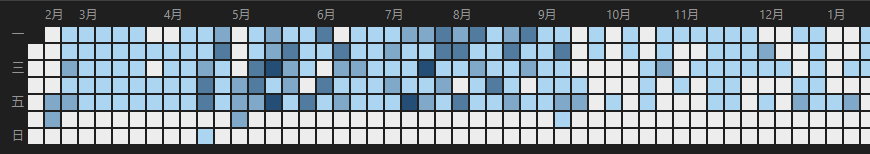
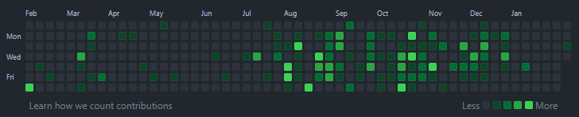
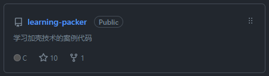
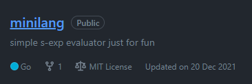
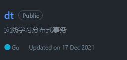
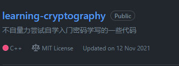

## 一

其实年前还有一篇写了蛮长的，但因为种种原因反正假期内是没继续动笔写完，今天本来打算继续写，但是看了眼开头，还是把全文 ctrl+a delete 了。

这次就短一点。

## 二

回顾过去，2021年对我而言是怎样的一年？

当我问自己这个问题，我才发现似乎没有一个能脱口而出的答案。

普普通通地正常工作，顺便也摸摸鱼。

偶尔也上GitHub看两眼，有没有什么新鲜玩意儿。

学了点没用的逆向技术，demo也勉强凑出9+1个star。不过趁这个机会倒是了解了下x86汇编语言，姑且算是个没什么卵用的进步，主流64位的汇编和arm的汇编还是不懂，x86也只能算是盲人摸象。

又一个玩具，这类玩具太多了。我水平不够，完成度也低，只能说是写这个的时候就是打发时间。

本来不是很看得上 dtm 这个项目。不为别的，就是觉得作者 segmentfault 上刷博文宣传自己的框架有种保险推销员的感觉，让人觉得不靠谱。但还是老实去看了代码，毕竟比起 Java 写得 seata 之类的框架，dtm 封装比较薄，源码稍微好读一点。

实际读起来感觉还是有点混乱，最后照着 dtm 文档的时序图写了个案例，配置了opentelemetry。分布式追踪真的很好用，讲真，要是单体应用也能跟着函数追踪出这样一个图就绝了。我觉得可以拿 python 开刀试试。

尝试入门密码学，但数学基础不好，为了搞明白希尔密码用到的矩阵运算翻了半天搜索引擎才写出来。结果还是没继续学下去。2022也许继续看？好歹把传统密码里的DES、AES学完吧，不求能手写，大概能看明白过程就好。要是能再把原理懂个大概就更好了。

至于别的，也许我能报菜名一样提一大堆名字，但终究骗不了我自己。是，2021一年时间，各种杂七杂八的技术概念和新名词碰了一堆，但杂而不精，几乎没有什么真正吸收、融会贯通的内容。

## 三

工作和生活上还是老一套。

产品经理走了，于是部门间的矛盾和磨合又来了。我甚至不愿意管这个叫“磨合”，无非是两边一起摆烂罢了。所以还是到此为止，只能期盼好聚好散，2022尝试跳个愿意出更高工资的地方，也许能在中年危机前攒够本钱，下半生是自己做点生意也好，安心打工也好，至少能安顿好一家人，即便不能富足，也得温饱。真心希望这个渺小的愿望可以实现。

生活上，年底才收到一个坏消息，爷爷病了，可能是肺癌。很难描述听到这个消息的时候我的心情。上初中的时候我的曾祖父去世了，我和曾祖父交流接触很少，但还是有种心里缺了一块的感觉。

是，人终有一死。但出奇的是我一点也没想什么轻于鸿毛重于泰山。死亡就只是死亡而已，没有意义，什么也没有。时间最终会抚平一切。

好了。

2022，还是祝愿爷爷他手术顺利，能活到120岁。

## 四

还是要展望下未来的。

2022年，很快就要26周岁了，还是单身，一年的收入大概能在广州买一两平米的卫生间，存款不比一间卫生间的价值多多少。有一点焦虑。

焦虑的原因在于我觉得自己配得上更高的工资，或者说，更好的生活，有看得到希望的未来。但理想和现实的矛盾始终无法解决。

不说那么多了。

今年有跳槽的想法，也有考个系统分析师证书的想法，但两者恐怕不好兼顾。还好的是系统分析师考试在5月，这段时间来个百日冲刺，运气好的话有机会拿到证书，再在下半年靠证书跳个更高薪的职位。运气不好的话，今年没考上，下半年跳槽还有悬念，那就明年再说了。

另外更新简历的时候发现，多写点博客还是挺唬人的。21年下半年几个月写了40篇，2022年继续保持的话起码一年一百篇不过分吧，坚持多写几篇，笔耕不辍。

最好再参与下知名的开源项目，发几个PR。

小说也想写，短篇整个十几万字总得有。

梦想嘛，还是要有的。

## 来吧，2022！
