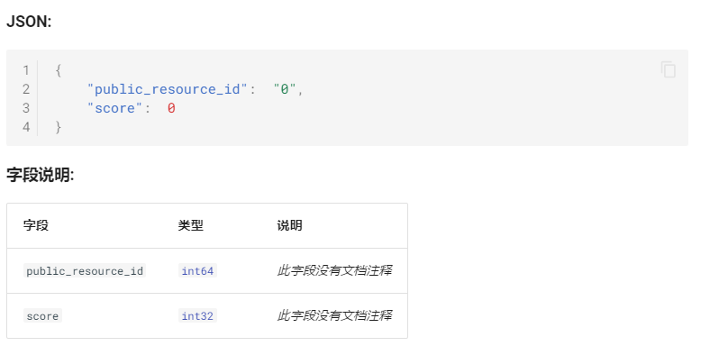

## 前言

最大的问题其实是 proto 直接生成的 swagger 不好用，过去的 gRPC 写法只在服务端，客户端没享受到静态类型定义的接口的快乐，而且手工写的文档还有一堆很无语的问题，整个系统维护起来蛋疼无比。

后来解决办法也简单，代码生成，缺什么生成什么，先后经历了用 `go` + proto解析写改成用 `typescript` 写，再改回 `go` + `protogen`，一番折腾下来最后还是用 `protogen` 最简单舒服。

这篇博客主要就是介绍下 `protogen` 配上 go 模板能做到的事情。

## `protogen`介绍

`protogen`的官方文档在[这里](https://pkg.go.dev/google.golang.org/protobuf/compiler/protogen)，`protogen`是google官方`protoc-gen-go`插件使用的支持库，代码托管在[github.com/protocolbuffers/protobuf-go](https://github.com/protocolbuffers/protobuf-go) 。可以通过 [`protoc-gen-go` 的 `main` 包代码](https://github.com/protocolbuffers/protobuf-go/blob/master/cmd/protoc-gen-go/main.go) 初窥门径。

不过在开始前，还得先了解下 `protoc` 插件是怎么工作的。从官方文档[other languages and plugins](https://developers.google.com/protocol-buffers/docs/reference/other)摘录如下。

>`protoc`, the Protocol Buffers Compiler, can be extended to support new languages via plugins. **A plugin is just a program which reads a** `CodeGeneratorRequest` **protocol buffer from standard input and then writes a** `CodeGeneratorResponse` **protocol buffer to standard output.** These message types are defined in `plugin.proto`. We recommend that all third-party code generators be written as plugins, as this allows all generators to provide a consistent interface and share a single parser implementation.

简单地说，`protoc`插件从`stdin`读取一个`protobuf`消息，往`stdout`写一个`protobuf`消息。把`protoc`插件理解成服务器，`protoc`发送请求，插件返回响应，交互过程不经过网络，而是标准输入/输出，就这样。

我也不想解释为什么不从零开始写了。`protogen`提供了相当完善的封装，很轻松就可以写出一个完整的 `protoc` 插件。

### HelloWorld

先来个惯例。

```go
package main

import (
    "log"
	"flags"
    "google.golang.org/protobuf/compiler/protogen"
)

func main() {
    log.SetFlags(0)
    log.SetPrefix("protoc-gen-hello: ")
    flags := flag.FlagSet{}
    protogen.Options{ParamFunc: flags.Set}.Run(Gen)
}

func Gen(plugin *protogen.Plugin) error {
    log.Printf("Hello world")
    return nil
}
```

什么也不生成，就只是输出一句 Hello world。

### 简单生成

一个简单的`proto`文件。

```protobuf
syntax = "proto3";
option go_package = "play/proto";

message Hello { string name = 1; }

message World { string greeting = 1; }

service greeter { rpc SayHello(Hello) returns (World); }
```

输出文件里所有的结构、服务、RPC方法名称。

```go
package main

import (
	"flag"
	"log"

	"google.golang.org/protobuf/compiler/protogen"
)

func main() {
	log.SetFlags(0)
	log.SetPrefix("protoc-gen-hello: ")
	flags := flag.FlagSet{}
	protogen.Options{ParamFunc: flags.Set}.Run(Gen)
}

func Gen(plugin *protogen.Plugin) error {
	for _, filename := range plugin.Request.FileToGenerate {
		file := plugin.FilesByPath[filename]
		for _, msg := range file.Messages {
			log.Printf("message: %s", msg.Desc.FullName())
		}

		for _, svc := range file.Services {
			log.Printf("service: %s", svc.Desc.FullName())
			for _, method := range svc.Methods {
				log.Printf("method: %s", method.Desc.FullName())
			}
		}
	}
	return nil
}

```

可以看出来使用非常简单，但需要注意的是 `message` 是可以嵌套的，`message`内还能定义`message`和`enum`，上面的例子没有处理。

接下来我们把命令行输出改成输出到文件，让程序有点实际用途。

```go
package main

import (
	"flag"
	"log"
	"path"
	"strings"

	"google.golang.org/protobuf/compiler/protogen"
)

func main() {
	log.SetFlags(0)
	log.SetPrefix("protoc-gen-hello: ")
	flags := flag.FlagSet{}
	protogen.Options{ParamFunc: flags.Set}.Run(Gen)
}

func Gen(plugin *protogen.Plugin) error {
	for _, filename := range plugin.Request.FileToGenerate {
		g := plugin.NewGeneratedFile(strings.ReplaceAll(path.Base(filename), ".proto", ".md"), "")
		g.P("# API 文档")
		g.P()
		g.P("## 结构定义")
		g.P()

		file := plugin.FilesByPath[filename]
		for _, msg := range file.Messages {
			log.Printf("message: %s", msg.Desc.FullName())
			g.P("### ", msg.Desc.Name())
			g.P()
		}

		for _, svc := range file.Services {
			g.P("## 服务 ", svc.Desc.FullName())
			g.P()
			log.Printf("service: %s", svc.Desc.FullName())
			for _, method := range svc.Methods {
				log.Printf("method: %s", method.Desc.FullName())
				g.P("### 接口 ", method.Desc.Name())
			}
		}
	}
	return nil
}

```

注意使用了 `plugin.NewGeneratedFile`而不是直接`os.Open`，因为这是`protoc`插件的约定之一。`protoc`插件系统允许插件提供`insert point`，让别的插件修改插件生成的代码。不过目前我们没有这种功能，但遵循约定的方式来编写代码总是没坏处的。

代码里会有很多没看懂的东西，比如 `Desc` ，其实是`Descriptor`的缩写。`Descriptor`是一种设计模式，我自己的粗暴理解就是`Descriptor`“描述”对象的结构和属性，借助`Descriptor`来访问和修改对象。听起来像是反射，用起来也是反射的感觉。在 Python 里也有个 `descriptor`，[Descriptor HowTo Guide](https://docs.python.org/3/howto/descriptor.html)，和这里的`Descriptor`有相似的地方，仅供参考。

### 模板化

虽然也能直接在代码里用 `g.P` 完成生成工作，但是未免麻烦。`g.P`这个接口实话说我觉得不行，怎么不实现一个`StringWriter`。

这里用模板最大的好处是能轻松地完成一大堆字符串拼接混合一些简单的逻辑的情况，如果用 go 代码实现会非常啰嗦。

先展示下我使用的模板，代码太罗嗦就不贴了。 

````markdown
{{ define "message-link" -}}
{{ if .Message -}}
../../../{{ .Message.ParentFile.Path | base | replace ".proto" "" }}/types/{{ .Message.FullName | toString | replace "." "_"}}/
{{- else if .Enum -}}
../../../{{ .Enum.ParentFile.Path | base | replace ".proto" "" }}/types/{{ .Enum.FullName | toString | replace "." "_" }}/
{{- end }}
{{- end -}}

{{ define "message" -}}
**JSON:**

```json
{{ .Desc | GenerateExample }}
```

**字段说明:**

|字段|类型|说明|
|----|----|----|
{{ range .Fields -}}
|`{{- .Desc.Name }}`|[`{{ template "field-type" .Desc }}`]({{template "message-link" .Desc }})|{{ .Comments | InlineMarkdownDocString | default "*此字段没有文档注释*"}}|
{{ end }}
{{- end -}}

# {{ .Desc.FullName | toString | replace "." "_" }}

{{ template "message" . }}

````

最终生成结果就像是这样。



## 总结

本身是个很简单的东西。原先用解析proto文件语法树再生成文档的方法不是不行，但一来第三方的解析库经常有不支持的语法和奇怪的bug，`protoc`本身又是事实标准，官方的 DSL Specification 文档就是个废物文档，连 `option(http) {}` 这样的都算是 specification 之外，还有 `optional` 在 proto3 还能用之类的让人想骂傻逼的问题。

后来改成了 `typescript` + `protobuf.js` ，官方支持的稳定性一下子就好多了，但这个跑起来性能实在有点拉，而且 ts 版本用了 `ejs` 作为模板引擎，`ejs`的标签写起来罗嗦到不行，内嵌 js 的写法一时爽，爽完自己都快看不懂写了什么玩意儿了。

最后换回 `go`+`protogen`，一下子就舒服多了。