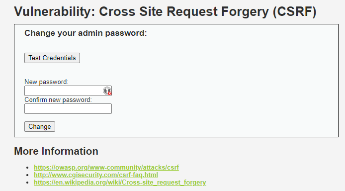
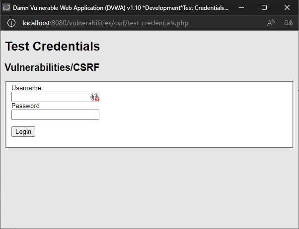
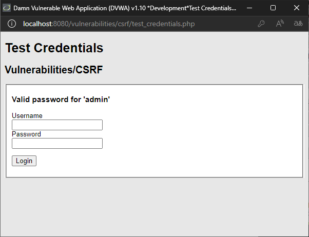
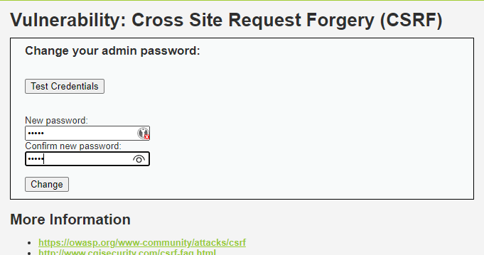
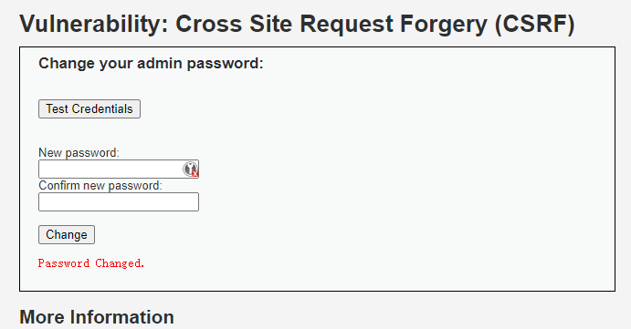
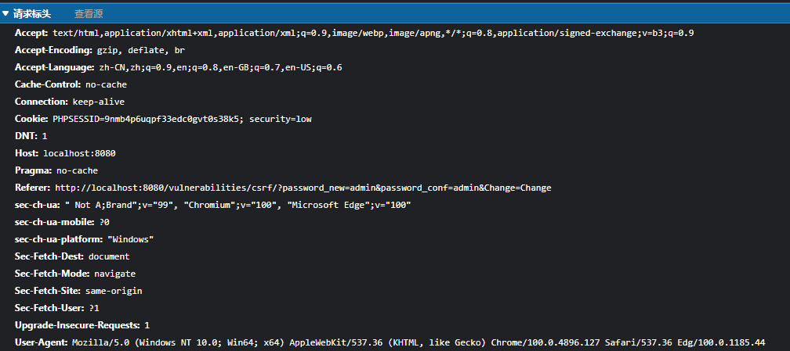
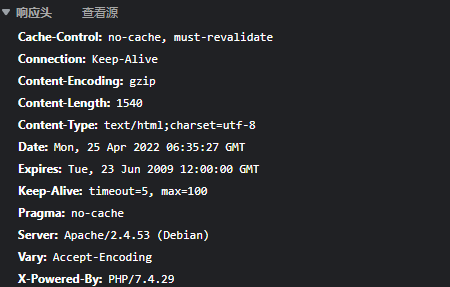
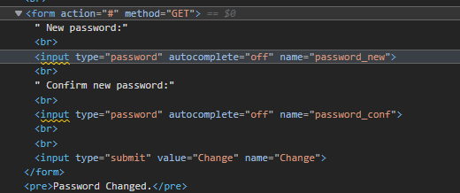
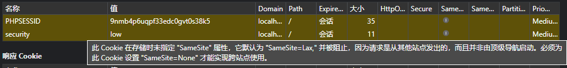
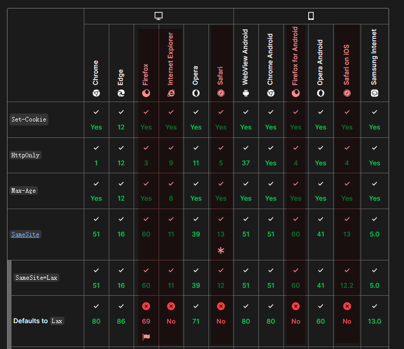

## 前言

这次看下 DVWA 的 CSRF 题。

昨天忙完了工作，闲下来的时间顺便看了下 DVWA 的部署。在我的 fork 分支里添加了 docker 支持。因为是纯新增，不太可能有 breaking change，直接在 GitHub 网页点点鼠标就能同步上游代码。这样就能用上最新的 DVWA 同时享受 docker 一键启动 DVWA 环境的快乐了。

用法很简单：

```bash
git clone https://github.com/nnnewb/dvwa
cd dvwa
docker-compose up -d --build
```

就这样！

当然还有可能遇到一些网络问题，什么`deb.debian.org`访问慢或者`timeout`、`connection reset`之类的，但我觉得想玩这个的多少得有点自己动手解决问题的能力吧，不能跟三岁小孩一样等别人喂嘴里。

## 原理

### 利用方式

CSRF 全名是跨站请求伪造 *Cross Site Request Forgery* 。

简单地说，服务器相信收到的请求是用户控制浏览器发起的，是出于用户自身的意图做某些操作。但实际上，是另一个恶意网站的 js 脚本控制了用户的浏览器，在用户不知情的情况下，冒充用户的身份请求服务器做一些并非出自用户本意的操作。

CSRF 利用中有三个组成部分：

- 用户浏览器
- 目标服务器
- 恶意网站

用户不访问恶意网站，CSRF 攻击就无从谈起。

### 和CORS的关系

说没关系其实也有。CORS全称是 *Cross Origin Resource Sharing*，跨域资源共享，也是防浏览器被恶意网站控制着，背着用户拿自己的数据。但有所不同的是，CORS 其实是相当宽松的，因为 CORS 只要求浏览器对 “复杂请求” 发送预检，但简单请求（注意哦，包括 POST 请求，但只能包含指定的 Header 和限定的 `Content-Type`）会直接呈交给服务器。

而且这个请求是可以带 Cookies 的，也就是说只要接口满足条件（接受限定的 `Content-Type`，对 Header 没有要求），CORS 策略就没法阻止 CSRF 攻击。

举一个更实际的例子，哪怕恶意网站只是写了一个简单的表单：

```html
<form method="POST" action="http://good.com/some/action">
    <input type="text" value="hello"/>
    <button type="submit">submit</button>
</form>
```

也满足 CORS 对于 *简单请求* 的定义，浏览器不会阻止或预检。

因此，即使配置良好的 CORS，也无法杜绝 CSRF 攻击。但 CORS 确实是防御 CSRF 攻击的重要环节。

### 防御

防御CSRF攻击说难不难，因为[发起 CSRF 攻击有几个重要前提](https://portswigger.net/web-security/CSRF)：

- 基于 Cookies 的会话控制
- 没有不可预测的请求参数

基于上面两点：

如果会话控制存在于自定义的 HTTP 头或 Cookies 之外的 HTTP 头（比如`Authorization`），那么 CORS 就会要求先发出一个预检请求，只有在服务器返回 `Access-Control-Allow-Origin` 包含当前域名的时候才会正式发出请求。这样一来除非先 bypass CORS ，不然就无法发起 CSRF 攻击。

另一种就是增加一个攻击者不可预测的参数，也就是常说的 CSRF Token。

CSRF Token 是一个和会话绑定的随机（至少对攻击者来说不可预知的）字符串（或别的数据类型）。CSRF 的作用原理依然是要依靠 CORS，恶意网站如果要伪造请求提交一个表单，那就必须拿到 CSRF Token，想获取 CSRF Token 就必须拿到表单所在的页面，而请求表单页面就必须满足 CORS 策略——即使是简单请求，没有预检，浏览器在收到响应后也会根据 `Access-Control-Allow-Origin` 的设定拒绝给 XHR 返回数据。网页拿不到 CSRF Token，自然也就没办法伪造出请求。

## 解题

### 信息收集

好的，就是踩点。



一个修改密码的页面，只有登陆用户能修改自己的密码（因为不登陆根本看不到这个页面）。另外还提供了一个测试登陆的地方，就是那个 *Test Credentials* 按钮。



在测试登陆这里输入自己的用户名密码（默认是 `admin`,`password`）会提示`valid password for 'admin'`。



修改密码的地方我们也试一试。





修改后提示 `Password changed`，观察下 F12 调试器里的请求和响应头。





接着看一眼表单代码。



只有我觉得`form`里`method=GET`是很怪的事情吗？感觉学会写 HTML 以来就没想过在 `form` 里用 `GET` 方法...

咳，回到正题。

到这里踩点差不多就结束了，可以发现 Low 难度下表单没有 CSRF Token 保护，因此可以简单直接写一个 XHR 修改掉密码。

### 题解

必须先提一个我实际下手写的时候才踩到的坑，浏览器发展速度实在太快了。

在[RFC6265bis](https://datatracker.ietf.org/doc/html/draft-ietf-httpbis-rfc6265bis-05#section-5.3.7)里引入了一个新的 Cookies 属性，`SameSite`。[2019年5月份，谷歌宣布推出了一个默认安全的 Cookie 安全模型](https://developers.google.com/search/blog/2020/01/get-ready-for-new-samesitenone-secure?hl=zh-cn)，由新的 Cookie 分类系统（[规范](https://tools.ietf.org/html/draft-west-cookie-incrementalism-00)）提供支持。在规范（PS：同样是谷歌提出的）中将 `SameSite` 默认设置为 `Lax`，只允许 Cookies 与顶级导航（包括第三方网站发起的GET请求）一起发送。

这么说可能有点不好理解，我写了一个简单的 demo，在这项改动之前应该是带上 Cookies 直接发出的请求。

```javascript
var xhr = new XMLHttpRequest();
xhr.open("get", "http://localhost:8080/vulnerabilities/csrf/?password_new=admin&password_conf=admin&Change=Change");
xhr.withCredentials = true;
xhr.send();
```

但在这项改动之后（现在是2022年4月25日，Chrome内核版本 100，Edge 浏览器），虽然这是个简单请求，无需预检就会发送，但因为 Cookies 的 `SameSite` 属性变更为默认 `Lax` 的原因，即使设置了 `withCredentials=true` 请求里也不会带上 Cookies。



这就有点恼人，不过稍作变通，还是可以直接控制用户的浏览器发起修改密码的请求，只是没 xhr 那么悄无声息。

```javascript
window.location.href='http://localhost:8080/vulnerabilities/csrf/?password_new=123456&password_conf=123456&Change=Change'
```

如此一来，就满足了 `SameSite=Lax` 的由顶级导航启动的要求。

这里额外再说一句就是，`iframe` 似乎也不被视作顶级导航，因此`<iframe src="..." width="1" height="1"></iframe>`也行不通，不会带上 Cookies。

简单看了下 MDN 对默认 `Lax` 策略的支持情况，只有少数几个浏览器还没跟进了。



### 代码审计

又是很短一段 php 代码。

```php
<?php

if( isset( $_GET[ 'Change' ] ) ) {
    // Get input
    $pass_new  = $_GET[ 'password_new' ];
    $pass_conf = $_GET[ 'password_conf' ];

    // Do the passwords match?
    if( $pass_new == $pass_conf ) {
        // They do!
        $pass_new = ((isset($GLOBALS["___mysqli_ston"]) && is_object($GLOBALS["___mysqli_ston"])) ? mysqli_real_escape_string($GLOBALS["___mysqli_ston"],  $pass_new ) : ((trigger_error("[MySQLConverterToo] Fix the mysql_escape_string() call! This code does not work.", E_USER_ERROR)) ? "" : ""));
        $pass_new = md5( $pass_new );

        // Update the database
        $insert = "UPDATE `users` SET password = '$pass_new' WHERE user = '" . dvwaCurrentUser() . "';";
        $result = mysqli_query($GLOBALS["___mysqli_ston"],  $insert ) or die( '<pre>' . ((is_object($GLOBALS["___mysqli_ston"])) ? mysqli_error($GLOBALS["___mysqli_ston"]) : (($___mysqli_res = mysqli_connect_error()) ? $___mysqli_res : false)) . '</pre>' );

        // Feedback for the user
        echo "<pre>Password Changed.</pre>";
    }
    else {
        // Issue with passwords matching
        echo "<pre>Passwords did not match.</pre>";
    }

    ((is_null($___mysqli_res = mysqli_close($GLOBALS["___mysqli_ston"]))) ? false : $___mysqli_res);
}

?>
```

逻辑很清晰不啰嗦，注意到几个点：

1. md5 未加盐哈希作为密码字段保存到数据库，得到了哈希有可能被逆推出密码。
2. 直接拼了 `dvwaCurrentUser()`，目前不清楚这个函数里有没有做好转义处理，没处理可能存在 SQL 注入。

全程这个 `$GLOBALS["___mysqli_ston"]` 到底是个什么玩意儿让我有点懵，搜索了下好像是 SQL 连接，类似 Go 中的 `sql.DB` 对象（意会好嘛）。

别的问题就没看出来了。

### 提高难度（败北）

直接使用 Low 难度下的方法，`window.location.href`，会报错：`That request didn't look correct`。

简单看一下 Medium 难度下的代码。

```php
<?php

if( isset( $_GET[ 'Change' ] ) ) {
    // Checks to see where the request came from
    if( stripos( $_SERVER[ 'HTTP_REFERER' ] ,$_SERVER[ 'SERVER_NAME' ]) !== false ) {
        // Get input
        $pass_new  = $_GET[ 'password_new' ];
        $pass_conf = $_GET[ 'password_conf' ];

        // Do the passwords match?
        if( $pass_new == $pass_conf ) {
            // They do!
            $pass_new = ((isset($GLOBALS["___mysqli_ston"]) && is_object($GLOBALS["___mysqli_ston"])) ? mysqli_real_escape_string($GLOBALS["___mysqli_ston"],  $pass_new ) : ((trigger_error("[MySQLConverterToo] Fix the mysql_escape_string() call! This code does not work.", E_USER_ERROR)) ? "" : ""));
            $pass_new = md5( $pass_new );

            // Update the database
            $insert = "UPDATE `users` SET password = '$pass_new' WHERE user = '" . dvwaCurrentUser() . "';";
            $result = mysqli_query($GLOBALS["___mysqli_ston"],  $insert ) or die( '<pre>' . ((is_object($GLOBALS["___mysqli_ston"])) ? mysqli_error($GLOBALS["___mysqli_ston"]) : (($___mysqli_res = mysqli_connect_error()) ? $___mysqli_res : false)) . '</pre>' );

            // Feedback for the user
            echo "<pre>Password Changed.</pre>";
        }
        else {
            // Issue with passwords matching
            echo "<pre>Passwords did not match.</pre>";
        }
    }
    else {
        // Didn't come from a trusted source
        echo "<pre>That request didn't look correct.</pre>";
    }

    ((is_null($___mysqli_res = mysqli_close($GLOBALS["___mysqli_ston"]))) ? false : $___mysqli_res);
}

?>
```

注意到主要变化在于进入业务处理前，加上了一条判断：`if( stripos( $_SERVER[ 'HTTP_REFERER' ] ,$_SERVER[ 'SERVER_NAME' ]) !== false )`。

`stripos` 函数查找子串出现在字符串里的位置，没找到的情况下返回`false`，这条判断的意思是在 `HTTP_REFERER` 里查找 `SERVER_NAME` 是否出现，如果出现才进一步处理。所以 Medium 难度下问题变成了怎么 bypass 这个判断。

搜索 `SERVER_NAME` 的文档可以找到这样的说明：

> 'SERVER_NAME'
>
> The name of the server host under which the current script is executing. If the script is running on a virtual host, this will be the value defined for that virtual host.
>
> > **Note**: Under Apache 2, you must set `UseCanonicalName = On` and `ServerName`. Otherwise, this value reflects the hostname supplied by the client, which can be spoofed. It is not safe to rely on this value in security-dependent contexts.

在 Apache2 环境下，如果没有正确配置 `UseCanonicalName = On`和`ServerName`的话，`$_SERVER['SERVER_NAME']`的值就是 HTTP 请求头里的 Hostname。

`HTTP_REFERER` 的文档这样说：

> 'HTTP_REFERER'
>
> The address of the page (if any) which referred the user agent to the current page. This is set by the user agent. Not all user agents will set this, and some provide the ability to modify HTTP_REFERER as a feature. In short, it cannot really be trusted.

但遗憾的是，不管 `Host` 还是 `Referer` 都无法修改（受制于浏览器的约束），所以尽管文档里说可能存在安全隐患，但反正我这会儿想不出利用方法。

于是看眼帮助文档，提示需要结合 XSS 之类的洞攻破。这么一说就茅塞顿开了，虽然说是个练习靶场但也不是题目说CSRF就非要顶着CSRF死磕，别的洞一个不碰。（大佬说不定能死磕成功，我也想变大佬啊=。=）

考虑多个漏洞联合利用确实常见也一定要学，但现在暂且还是免了吧=。=累死。后面捅 XSS 的时候再回头顺便把 Medium 难度做了。

看了眼 High 难度下同样要结合多个漏洞利用，我寻思能突破 CORS 的话即使有 CSRF Token 也好办，直接 xhr 把表单页拿下来就好。

## 总结

好的，现在 CSRF 感觉有点难利用了。主要还是现代浏览器的同源策略越来越严格，往默认安全靠拢，迭代速度快的一批。流传下来的利用方法如今一试就寄，半点屁用没有，连搭一个能复现漏洞的环境都麻烦的一批（比如具体哪个版本的 Chrome 修了`SameSite`，去哪儿下载历史版本，搞出一堆浏览器共存巴拉巴拉）

然后就很难不想起互联网上不停重复的观点了。为什么不要做伸手党？抛开对大环境的影响，伸手党一直有个通病，就是没有学习的能力。这里的学习说的是 *收集、整理、归纳、总结、利用* 信息的能力。在一个领域独立探索未知，这是真正独立的标志。

讲真，太怀念上学的日子了，脑子空空无忧无虑。真正出来工作卖力之后才会渐渐意识到什么叫不进则退。我觉得与其说什么社会在惩罚不努力的人，不如说这个社会在惩罚所有人。也不该说是社会，而是人的天性，让人生来就要受尽苦难。

扯远了。就这样吧。