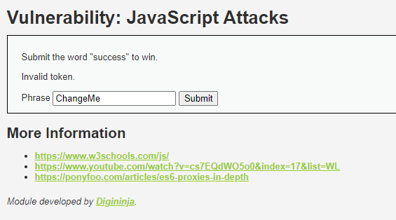
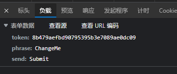
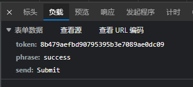
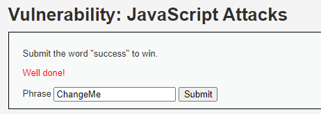
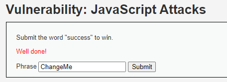
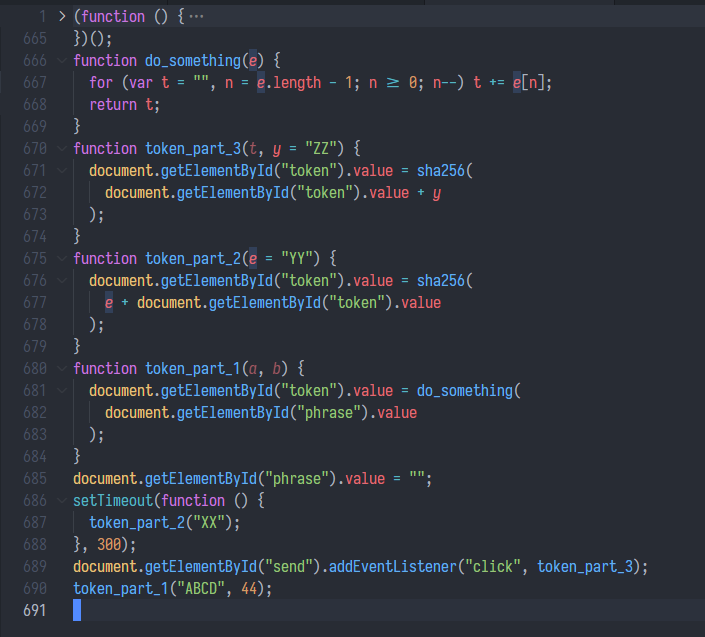
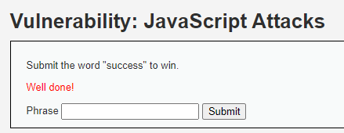

## 前言

DVWA最后一题了。

## 原理

没有原理。

> The attacks in this section are designed to help you learn about how JavaScript is used in the browser and how it can be manipulated. The attacks could be carried out by just analysing network traffic, but that isn't the point and it would also probably be a lot harder.

本质是 bypass 各种前端的检查或加密、签名。大概在搞爬虫的时候会很有用。

## 解题

### Low：收集信息



直接点击 Submit 看看。



修改为 `success` 再点击 Submit 看看。



注意到两件事：

1. `phrase` 是明文。
2. `token` 一直不变。

所以初步怀疑题意是逆向出 `token` 的算法，让 `phrase` 和 `token` 匹配以通过检查。后来看帮助确实如此。

提取出前端相关js。

```js
function generate_token() {
    var phrase = document.getElementById("phrase").value;
    document.getElementById("token").value = md5(rot13(phrase));
}

generate_token();
```

这个脚本运行后设置`token`的值，运行肯定是比人看到页面早的。

### Low：解题

输入框填好 `success`，然后直接在开发者工具控制台里跑一次 `generate_token()` 就行了。



### Medium：收集信息

UI上和Low难度没区别。直接看 js 变化。

```js
function do_something(e) {
    for (var t = "", n = e.length - 1; n >= 0; n--)
        t += e[n];
    return t
}
setTimeout(function() {
    do_elsesomething("XX")
}, 300);
function do_elsesomething(e) {
    document.getElementById("token").value = do_something(e + document.getElementById("phrase").value + "XX")
}
```

字符串逆转，然后前后加上了 `XX`。

### Medium：解题

填好`success`后，直接在控制台运行一次 `do_elsesomething("XX")` 就完事了。



### High: 收集信息

UI还是不变，看脚本，发现做了混淆。

```js
var a = ['fromCharCode', 'toString', 'replace', 'BeJ', '\x5cw+', 'Lyg', 'SuR', '(w(){\x273M\x203L\x27;q\x201l=\x273K\x203I\x203J\x20T\x27;q\x201R=1c\x202I===\x271n\x27;q\x20Y=1R?2I:{};p(Y.3N){1R=1O}q\x202L=!1R&&1c\x202M===\x271n\x27;q\x202o=!Y.2S&&1c\x202d===\x271n\x27&&2d.2Q&&2d.2Q.3S;p(2o){Y=3R}z\x20p(2L){Y=2M}q\x202G=!Y.3Q&&1c\x202g===\x271n\x27&&2g.X;q\x202s=1c\x202l===\x27w\x27&&2l.3P;q\x201y=!Y.3H&&1c\x20Z!==\x272T\x27;q\x20m=\x273G\x27.3z(\x27\x27);q\x202w=[-3y,3x,3v,3w];q\x20U=[24,16,8,0];q\x20K=[3A,3B,3F,3E,3D,3C,3T,3U,4d,4c,4b,49,4a,4e,4f,4j,4i,4h,3u,48,47,3Z,3Y,3X,3V,3W,40,41,46,45,43,42,4k,3f,38,36,39,37,34,33,2Y,31,2Z,35,3t,3n,3m,3l,3o,3p,3s,3r,3q,3k,3j,3d,3a,3c,3b,3e,3h,3g,3i,4g];q\x201E=[\x271e\x27,\x2727\x27,\x271G\x27,\x272R\x27];q\x20l=[];p(Y.2S||!1z.1K){1z.1K=w(1x){A\x204C.Q.2U.1I(1x)===\x27[1n\x201z]\x27}}p(1y&&(Y.50||!Z.1N)){Z.1N=w(1x){A\x201c\x201x===\x271n\x27&&1x.1w&&1x.1w.1J===Z}}q\x202m=w(1X,x){A\x20w(s){A\x20O\x20N(x,1d).S(s)[1X]()}};q\x202a=w(x){q\x20P=2m(\x271e\x27,x);p(2o){P=2P(P,x)}P.1T=w(){A\x20O\x20N(x)};P.S=w(s){A\x20P.1T().S(s)};1g(q\x20i=0;i<1E.W;++i){q\x20T=1E[i];P[T]=2m(T,x)}A\x20P};q\x202P=w(P,x){q\x201S=2O(\x222N(\x271S\x27)\x22);q\x201Y=2O(\x222N(\x271w\x27).1Y\x22);q\x202n=x?\x271H\x27:\x271q\x27;q\x202z=w(s){p(1c\x20s===\x272p\x27){A\x201S.2x(2n).S(s,\x274S\x27).1G(\x271e\x27)}z{p(s===2q||s===2T){1u\x20O\x201t(1l)}z\x20p(s.1J===Z){s=O\x202r(s)}}p(1z.1K(s)||Z.1N(s)||s.1J===1Y){A\x201S.2x(2n).S(O\x201Y(s)).1G(\x271e\x27)}z{A\x20P(s)}};A\x202z};q\x202k=w(1X,x){A\x20w(G,s){A\x20O\x201P(G,x,1d).S(s)[1X]()}};q\x202f=w(x){q\x20P=2k(\x271e\x27,x);P.1T=w(G){A\x20O\x201P(G,x)};P.S=w(G,s){A\x20P.1T(G).S(s)};1g(q\x20i=0;i<1E.W;++i){q\x20T=1E[i];P[T]=2k(T,x)}A\x20P};w\x20N(x,1v){p(1v){l[0]=l[16]=l[1]=l[2]=l[3]=l[4]=l[5]=l[6]=l[7]=l[8]=l[9]=l[10]=l[11]=l[12]=l[13]=l[14]=l[15]=0;k.l=l}z{k.l=[0,0,0,0,0,0,0,0,0,0,0,0,0,0,0,0,0]}p(x){k.C=4I;k.B=4H;k.E=4l;k.F=4U;k.J=4J;k.I=4K;k.H=4L;k.D=4T}z{k.C=4X;k.B=4W;k.E=4Y;k.F=4Z;k.J=4V;k.I=4O;k.H=4F;k.D=4s}k.1C=k.1A=k.L=k.2i=0;k.1U=k.1L=1O;k.2j=1d;k.x=x}N.Q.S=w(s){p(k.1U){A}q\x202h,T=1c\x20s;p(T!==\x272p\x27){p(T===\x271n\x27){p(s===2q){1u\x20O\x201t(1l)}z\x20p(1y&&s.1J===Z){s=O\x202r(s)}z\x20p(!1z.1K(s)){p(!1y||!Z.1N(s)){1u\x20O\x201t(1l)}}}z{1u\x20O\x201t(1l)}2h=1d}q\x20r,M=0,i,W=s.W,l=k.l;4t(M<W){p(k.1L){k.1L=1O;l[0]=k.1C;l[16]=l[1]=l[2]=l[3]=l[4]=l[5]=l[6]=l[7]=l[8]=l[9]=l[10]=l[11]=l[12]=l[13]=l[14]=l[15]=0}p(2h){1g(i=k.1A;M<W&&i<1k;++M){l[i>>2]|=s[M]<<U[i++&3]}}z{1g(i=k.1A;M<W&&i<1k;++M){r=s.1Q(M);p(r<R){l[i>>2]|=r<<U[i++&3]}z\x20p(r<2v){l[i>>2]|=(2t|(r>>6))<<U[i++&3];l[i>>2]|=(R|(r&V))<<U[i++&3]}z\x20p(r<2A||r>=2E){l[i>>2]|=(2D|(r>>12))<<U[i++&3];l[i>>2]|=(R|((r>>6)&V))<<U[i++&3];l[i>>2]|=(R|(r&V))<<U[i++&3]}z{r=2C+(((r&23)<<10)|(s.1Q(++M)&23));l[i>>2]|=(2X|(r>>18))<<U[i++&3];l[i>>2]|=(R|((r>>12)&V))<<U[i++&3];l[i>>2]|=(R|((r>>6)&V))<<U[i++&3];l[i>>2]|=(R|(r&V))<<U[i++&3]}}}k.2u=i;k.L+=i-k.1A;p(i>=1k){k.1C=l[16];k.1A=i-1k;k.1W();k.1L=1d}z{k.1A=i}}p(k.L>4r){k.2i+=k.L/2H<<0;k.L=k.L%2H}A\x20k};N.Q.1s=w(){p(k.1U){A}k.1U=1d;q\x20l=k.l,i=k.2u;l[16]=k.1C;l[i>>2]|=2w[i&3];k.1C=l[16];p(i>=4q){p(!k.1L){k.1W()}l[0]=k.1C;l[16]=l[1]=l[2]=l[3]=l[4]=l[5]=l[6]=l[7]=l[8]=l[9]=l[10]=l[11]=l[12]=l[13]=l[14]=l[15]=0}l[14]=k.2i<<3|k.L>>>29;l[15]=k.L<<3;k.1W()};N.Q.1W=w(){q\x20a=k.C,b=k.B,c=k.E,d=k.F,e=k.J,f=k.I,g=k.H,h=k.D,l=k.l,j,1a,1b,1j,v,1f,1h,1B,1Z,1V,1D;1g(j=16;j<1k;++j){v=l[j-15];1a=((v>>>7)|(v<<25))^((v>>>18)|(v<<14))^(v>>>3);v=l[j-2];1b=((v>>>17)|(v<<15))^((v>>>19)|(v<<13))^(v>>>10);l[j]=l[j-16]+1a+l[j-7]+1b<<0}1D=b&c;1g(j=0;j<1k;j+=4){p(k.2j){p(k.x){1B=4m;v=l[0]-4n;h=v-4o<<0;d=v+4p<<0}z{1B=4v;v=l[0]-4w;h=v-4G<<0;d=v+4D<<0}k.2j=1O}z{1a=((a>>>2)|(a<<30))^((a>>>13)|(a<<19))^((a>>>22)|(a<<10));1b=((e>>>6)|(e<<26))^((e>>>11)|(e<<21))^((e>>>25)|(e<<7));1B=a&b;1j=1B^(a&c)^1D;1h=(e&f)^(~e&g);v=h+1b+1h+K[j]+l[j];1f=1a+1j;h=d+v<<0;d=v+1f<<0}1a=((d>>>2)|(d<<30))^((d>>>13)|(d<<19))^((d>>>22)|(d<<10));1b=((h>>>6)|(h<<26))^((h>>>11)|(h<<21))^((h>>>25)|(h<<7));1Z=d&a;1j=1Z^(d&b)^1B;1h=(h&e)^(~h&f);v=g+1b+1h+K[j+1]+l[j+1];1f=1a+1j;g=c+v<<0;c=v+1f<<0;1a=((c>>>2)|(c<<30))^((c>>>13)|(c<<19))^((c>>>22)|(c<<10));1b=((g>>>6)|(g<<26))^((g>>>11)|(g<<21))^((g>>>25)|(g<<7));1V=c&d;1j=1V^(c&a)^1Z;1h=(g&h)^(~g&e);v=f+1b+1h+K[j+2]+l[j+2];1f=1a+1j;f=b+v<<0;b=v+1f<<0;1a=((b>>>2)|(b<<30))^((b>>>13)|(b<<19))^((b>>>22)|(b<<10));1b=((f>>>6)|(f<<26))^((f>>>11)|(f<<21))^((f>>>25)|(f<<7));1D=b&c;1j=1D^(b&d)^1V;1h=(f&g)^(~f&h);v=e+1b+1h+K[j+3]+l[j+3];1f=1a+1j;e=a+v<<0;a=v+1f<<0}k.C=k.C+a<<0;k.B=k.B+b<<0;k.E=k.E+c<<0;k.F=k.F+d<<0;k.J=k.J+e<<0;k.I=k.I+f<<0;k.H=k.H+g<<0;k.D=k.D+h<<0};N.Q.1e=w(){k.1s();q\x20C=k.C,B=k.B,E=k.E,F=k.F,J=k.J,I=k.I,H=k.H,D=k.D;q\x201e=m[(C>>28)&o]+m[(C>>24)&o]+m[(C>>20)&o]+m[(C>>16)&o]+m[(C>>12)&o]+m[(C>>8)&o]+m[(C>>4)&o]+m[C&o]+m[(B>>28)&o]+m[(B>>24)&o]+m[(B>>20)&o]+m[(B>>16)&o]+m[(B>>12)&o]+m[(B>>8)&o]+m[(B>>4)&o]+m[B&o]+m[(E>>28)&o]+m[(E>>24)&o]+m[(E>>20)&o]+m[(E>>16)&o]+m[(E>>12)&o]+m[(E>>8)&o]+m[(E>>4)&o]+m[E&o]+m[(F>>28)&o]+m[(F>>24)&o]+m[(F>>20)&o]+m[(F>>16)&o]+m[(F>>12)&o]+m[(F>>8)&o]+m[(F>>4)&o]+m[F&o]+m[(J>>28)&o]+m[(J>>24)&o]+m[(J>>20)&o]+m[(J>>16)&o]+m[(J>>12)&o]+m[(J>>8)&o]+m[(J>>4)&o]+m[J&o]+m[(I>>28)&o]+m[(I>>24)&o]+m[(I>>20)&o]+m[(I>>16)&o]+m[(I>>12)&o]+m[(I>>8)&o]+m[(I>>4)&o]+m[I&o]+m[(H>>28)&o]+m[(H>>24)&o]+m[(H>>20)&o]+m[(H>>16)&o]+m[(H>>12)&o]+m[(H>>8)&o]+m[(H>>4)&o]+m[H&o];p(!k.x){1e+=m[(D>>28)&o]+m[(D>>24)&o]+m[(D>>20)&o]+m[(D>>16)&o]+m[(D>>12)&o]+m[(D>>8)&o]+m[(D>>4)&o]+m[D&o]}A\x201e};N.Q.2U=N.Q.1e;N.Q.1G=w(){k.1s();q\x20C=k.C,B=k.B,E=k.E,F=k.F,J=k.J,I=k.I,H=k.H,D=k.D;q\x202b=[(C>>24)&u,(C>>16)&u,(C>>8)&u,C&u,(B>>24)&u,(B>>16)&u,(B>>8)&u,B&u,(E>>24)&u,(E>>16)&u,(E>>8)&u,E&u,(F>>24)&u,(F>>16)&u,(F>>8)&u,F&u,(J>>24)&u,(J>>16)&u,(J>>8)&u,J&u,(I>>24)&u,(I>>16)&u,(I>>8)&u,I&u,(H>>24)&u,(H>>16)&u,(H>>8)&u,H&u];p(!k.x){2b.4A((D>>24)&u,(D>>16)&u,(D>>8)&u,D&u)}A\x202b};N.Q.27=N.Q.1G;N.Q.2R=w(){k.1s();q\x201w=O\x20Z(k.x?28:32);q\x201i=O\x204x(1w);1i.1p(0,k.C);1i.1p(4,k.B);1i.1p(8,k.E);1i.1p(12,k.F);1i.1p(16,k.J);1i.1p(20,k.I);1i.1p(24,k.H);p(!k.x){1i.1p(28,k.D)}A\x201w};w\x201P(G,x,1v){q\x20i,T=1c\x20G;p(T===\x272p\x27){q\x20L=[],W=G.W,M=0,r;1g(i=0;i<W;++i){r=G.1Q(i);p(r<R){L[M++]=r}z\x20p(r<2v){L[M++]=(2t|(r>>6));L[M++]=(R|(r&V))}z\x20p(r<2A||r>=2E){L[M++]=(2D|(r>>12));L[M++]=(R|((r>>6)&V));L[M++]=(R|(r&V))}z{r=2C+(((r&23)<<10)|(G.1Q(++i)&23));L[M++]=(2X|(r>>18));L[M++]=(R|((r>>12)&V));L[M++]=(R|((r>>6)&V));L[M++]=(R|(r&V))}}G=L}z{p(T===\x271n\x27){p(G===2q){1u\x20O\x201t(1l)}z\x20p(1y&&G.1J===Z){G=O\x202r(G)}z\x20p(!1z.1K(G)){p(!1y||!Z.1N(G)){1u\x20O\x201t(1l)}}}z{1u\x20O\x201t(1l)}}p(G.W>1k){G=(O\x20N(x,1d)).S(G).27()}q\x201F=[],2e=[];1g(i=0;i<1k;++i){q\x20b=G[i]||0;1F[i]=4z^b;2e[i]=4y^b}N.1I(k,x,1v);k.S(2e);k.1F=1F;k.2c=1d;k.1v=1v}1P.Q=O\x20N();1P.Q.1s=w(){N.Q.1s.1I(k);p(k.2c){k.2c=1O;q\x202W=k.27();N.1I(k,k.x,k.1v);k.S(k.1F);k.S(2W);N.Q.1s.1I(k)}};q\x20X=2a();X.1q=X;X.1H=2a(1d);X.1q.2V=2f();X.1H.2V=2f(1d);p(2G){2g.X=X}z{Y.1q=X.1q;Y.1H=X.1H;p(2s){2l(w(){A\x20X})}}})();w\x202y(e){1g(q\x20t=\x22\x22,n=e.W-1;n>=0;n--)t+=e[n];A\x20t}w\x202J(t,y=\x224B\x22){1m.1o(\x221M\x22).1r=1q(1m.1o(\x221M\x22).1r+y)}w\x202B(e=\x224E\x22){1m.1o(\x221M\x22).1r=1q(e+1m.1o(\x221M\x22).1r)}w\x202K(a,b){1m.1o(\x221M\x22).1r=2y(1m.1o(\x222F\x22).1r)}1m.1o(\x222F\x22).1r=\x22\x22;4u(w(){2B(\x224M\x22)},4N);1m.1o(\x224P\x22).4Q(\x224R\x22,2J);2K(\x223O\x22,44);', '||||||||||||||||||||this|blocks|HEX_CHARS||0x0F|if|var|code|message||0xFF|t1|function|is224||else|return|h1|h0|h7|h2|h3|key|h6|h5|h4||bytes|index|Sha256|new|method|prototype|0x80|update|type|SHIFT|0x3f|length|exports|root|ArrayBuffer|||||||||||s0|s1|typeof|true|hex|t2|for|ch|dataView|maj|64|ERROR|document|object|getElementById|setUint32|sha256|value|finalize|Error|throw|sharedMemory|buffer|obj|ARRAY_BUFFER|Array|start|ab|block|bc|OUTPUT_TYPES|oKeyPad|digest|sha224|call|constructor|isArray|hashed|token|isView|false|HmacSha256|charCodeAt|WINDOW|crypto|create|finalized|cd|hash|outputType|Buffer|da||||0x3ff||||array|||createMethod|arr|inner|process|iKeyPad|createHmacMethod|module|notString|hBytes|first|createHmacOutputMethod|define|createOutputMethod|algorithm|NODE_JS|string|null|Uint8Array|AMD|0xc0|lastByteIndex|0x800|EXTRA|createHash|do_something|nodeMethod|0xd800|token_part_2|0x10000|0xe0|0xe000|phrase|COMMON_JS|4294967296|window|token_part_3|token_part_1|WEB_WORKER|self|require|eval|nodeWrap|versions|arrayBuffer|JS_SHA256_NO_NODE_JS|undefined|toString|hmac|innerHash|0xf0|0xa2bfe8a1|0xc24b8b70||0xa81a664b||0x92722c85|0x81c2c92e|0xc76c51a3|0x53380d13|0x766a0abb|0x4d2c6dfc|0x650a7354|0x748f82ee|0x84c87814|0x78a5636f|0x682e6ff3|0x8cc70208|0x2e1b2138|0xa4506ceb|0x90befffa|0xbef9a3f7|0x5b9cca4f|0x4ed8aa4a|0x106aa070|0xf40e3585|0xd6990624|0x19a4c116|0x1e376c08|0x391c0cb3|0x34b0bcb5|0x2748774c|0xd192e819|0x0fc19dc6|32768|128|8388608|2147483648|split|0x428a2f98|0x71374491|0x59f111f1|0x3956c25b|0xe9b5dba5|0xb5c0fbcf|0123456789abcdef|JS_SHA256_NO_ARRAY_BUFFER|is|invalid|input|strict|use|JS_SHA256_NO_WINDOW|ABCD|amd|JS_SHA256_NO_COMMON_JS|global|node|0x923f82a4|0xab1c5ed5|0x983e5152|0xa831c66d|0x76f988da|0x5cb0a9dc|0x4a7484aa|0xb00327c8|0xbf597fc7|0x14292967|0x06ca6351||0xd5a79147|0xc6e00bf3|0x2de92c6f|0x240ca1cc|0x550c7dc3|0x72be5d74|0x243185be|0x12835b01|0xd807aa98|0x80deb1fe|0x9bdc06a7|0xc67178f2|0xefbe4786|0xe49b69c1|0xc19bf174|0x27b70a85|0x3070dd17|300032|1413257819|150054599|24177077|56|4294967295|0x5be0cd19|while|setTimeout|704751109|210244248|DataView|0x36|0x5c|push|ZZ|Object|143694565|YY|0x1f83d9ab|1521486534|0x367cd507|0xc1059ed8|0xffc00b31|0x68581511|0x64f98fa7|XX|300|0x9b05688c|send|addEventListener|click|utf8|0xbefa4fa4|0xf70e5939|0x510e527f|0xbb67ae85|0x6a09e667|0x3c6ef372|0xa54ff53a|JS_SHA256_NO_ARRAY_BUFFER_IS_VIEW', 'split'];
(function(c, d) {
    var e = function(f) {
        while (--f) {
            c['push'](c['shift']());
        }
    };
    e(++d);
}(a, 0x1f4));
var b = function(c, d) {
    c = c - 0x0;
    var e = a[c];
    return e;
};
eval(function(d, e, f, g, h, i) {
    h = function(j) {
        return (j < e ? '' : h(parseInt(j / e))) + ((j = j % e) > 0x23 ? String[b('0x0')](j + 0x1d) : j[b('0x1')](0x24));
    }
    ;
    if (!''[b('0x2')](/^/, String)) {
        while (f--) {
            i[h(f)] = g[f] || h(f);
        }
        g = [function(k) {
            if ('wpA' !== b('0x3')) {
                return i[k];
            } else {
                while (f--) {
                    i[k(f)] = g[f] || k(f);
                }
                g = [function(l) {
                    return i[l];
                }
                ];
                k = function() {
                    return b('0x4');
                }
                ;
                f = 0x1;
            }
        }
        ];
        h = function() {
            return b('0x4');
        }
        ;
        f = 0x1;
    }
    ;while (f--) {
        if (g[f]) {
            if (b('0x5') === b('0x6')) {
                return i[h];
            } else {
                d = d[b('0x2')](new RegExp('\x5cb' + h(f) + '\x5cb','g'), g[f]);
            }
        }
    }
    return d;
}(b('0x7'), 0x3e, 0x137, b('0x8')[b('0x9')]('|'), 0x0, {}));
```

### High：解题

前面的立即函数和 `b` 分析后认为价值不大。后面的`eval`引起注意。`eval`里是一个立即函数，首参数 `a[0x7]`内容如下。

```js
(w(){\x273M\x203L\x27;q\x201l=\x273K\x203I\x203J\x20T\x27;q\x201R=1c\x202I===\x271n\x27;q\x20Y=1R?2I:{};p(Y.3N){1R=1O}q\x202L=!1R&&1c\x202M===\x271n\x27;q\x202o=!Y.2S&&1c\x202d===\x271n\x27&&2d.2Q&&2d.2Q.3S;p(2o){Y=3R}z\x20p(2L){Y=2M}q\x202G=!Y.3Q&&1c\x202g===\x271n\x27&&2g.X;q\x202s=1c\x202l===\x27w\x27&&2l.3P;q\x201y=!Y.3H&&1c\x20Z!==\x272T\x27;q\x20m=\x273G\x27.3z(\x27\x27);q\x202w=[-3y,3x,3v,3w];q\x20U=[24,16,8,0];q\x20K=[3A,3B,3F,3E,3D,3C,3T,3U,4d,4c,4b,49,4a,4e,4f,4j,4i,4h,3u,48,47,3Z,3Y,3X,3V,3W,40,41,46,45,43,42,4k,3f,38,36,39,37,34,33,2Y,31,2Z,35,3t,3n,3m,3l,3o,3p,3s,3r,3q,3k,3j,3d,3a,3c,3b,3e,3h,3g,3i,4g];q\x201E=[\x271e\x27,\x2727\x27,\x271G\x27,\x272R\x27];q\x20l=[];p(Y.2S||!1z.1K){1z.1K=w(1x){A\x204C.Q.2U.1I(1x)===\x27[1n\x201z]\x27}}p(1y&&(Y.50||!Z.1N)){Z.1N=w(1x){A\x201c\x201x===\x271n\x27&&1x.1w&&1x.1w.1J===Z}}q\x202m=w(1X,x){A\x20w(s){A\x20O\x20N(x,1d).S(s)[1X]()}};q\x202a=w(x){q\x20P=2m(\x271e\x27,x);p(2o){P=2P(P,x)}P.1T=w(){A\x20O\x20N(x)};P.S=w(s){A\x20P.1T().S(s)};1g(q\x20i=0;i<1E.W;++i){q\x20T=1E[i];P[T]=2m(T,x)}A\x20P};q\x202P=w(P,x){q\x201S=2O(\x222N(\x271S\x27)\x22);q\x201Y=2O(\x222N(\x271w\x27).1Y\x22);q\x202n=x?\x271H\x27:\x271q\x27;q\x202z=w(s){p(1c\x20s===\x272p\x27){A\x201S.2x(2n).S(s,\x274S\x27).1G(\x271e\x27)}z{p(s===2q||s===2T){1u\x20O\x201t(1l)}z\x20p(s.1J===Z){s=O\x202r(s)}}p(1z.1K(s)||Z.1N(s)||s.1J===1Y){A\x201S.2x(2n).S(O\x201Y(s)).1G(\x271e\x27)}z{A\x20P(s)}};A\x202z};q\x202k=w(1X,x){A\x20w(G,s){A\x20O\x201P(G,x,1d).S(s)[1X]()}};q\x202f=w(x){q\x20P=2k(\x271e\x27,x);P.1T=w(G){A\x20O\x201P(G,x)};P.S=w(G,s){A\x20P.1T(G).S(s)};1g(q\x20i=0;i<1E.W;++i){q\x20T=1E[i];P[T]=2k(T,x)}A\x20P};w\x20N(x,1v){p(1v){l[0]=l[16]=l[1]=l[2]=l[3]=l[4]=l[5]=l[6]=l[7]=l[8]=l[9]=l[10]=l[11]=l[12]=l[13]=l[14]=l[15]=0;k.l=l}z{k.l=[0,0,0,0,0,0,0,0,0,0,0,0,0,0,0,0,0]}p(x){k.C=4I;k.B=4H;k.E=4l;k.F=4U;k.J=4J;k.I=4K;k.H=4L;k.D=4T}z{k.C=4X;k.B=4W;k.E=4Y;k.F=4Z;k.J=4V;k.I=4O;k.H=4F;k.D=4s}k.1C=k.1A=k.L=k.2i=0;k.1U=k.1L=1O;k.2j=1d;k.x=x}N.Q.S=w(s){p(k.1U){A}q\x202h,T=1c\x20s;p(T!==\x272p\x27){p(T===\x271n\x27){p(s===2q){1u\x20O\x201t(1l)}z\x20p(1y&&s.1J===Z){s=O\x202r(s)}z\x20p(!1z.1K(s)){p(!1y||!Z.1N(s)){1u\x20O\x201t(1l)}}}z{1u\x20O\x201t(1l)}2h=1d}q\x20r,M=0,i,W=s.W,l=k.l;4t(M<W){p(k.1L){k.1L=1O;l[0]=k.1C;l[16]=l[1]=l[2]=l[3]=l[4]=l[5]=l[6]=l[7]=l[8]=l[9]=l[10]=l[11]=l[12]=l[13]=l[14]=l[15]=0}p(2h){1g(i=k.1A;M<W&&i<1k;++M){l[i>>2]|=s[M]<<U[i++&3]}}z{1g(i=k.1A;M<W&&i<1k;++M){r=s.1Q(M);p(r<R){l[i>>2]|=r<<U[i++&3]}z\x20p(r<2v){l[i>>2]|=(2t|(r>>6))<<U[i++&3];l[i>>2]|=(R|(r&V))<<U[i++&3]}z\x20p(r<2A||r>=2E){l[i>>2]|=(2D|(r>>12))<<U[i++&3];l[i>>2]|=(R|((r>>6)&V))<<U[i++&3];l[i>>2]|=(R|(r&V))<<U[i++&3]}z{r=2C+(((r&23)<<10)|(s.1Q(++M)&23));l[i>>2]|=(2X|(r>>18))<<U[i++&3];l[i>>2]|=(R|((r>>12)&V))<<U[i++&3];l[i>>2]|=(R|((r>>6)&V))<<U[i++&3];l[i>>2]|=(R|(r&V))<<U[i++&3]}}}k.2u=i;k.L+=i-k.1A;p(i>=1k){k.1C=l[16];k.1A=i-1k;k.1W();k.1L=1d}z{k.1A=i}}p(k.L>4r){k.2i+=k.L/2H<<0;k.L=k.L%2H}A\x20k};N.Q.1s=w(){p(k.1U){A}k.1U=1d;q\x20l=k.l,i=k.2u;l[16]=k.1C;l[i>>2]|=2w[i&3];k.1C=l[16];p(i>=4q){p(!k.1L){k.1W()}l[0]=k.1C;l[16]=l[1]=l[2]=l[3]=l[4]=l[5]=l[6]=l[7]=l[8]=l[9]=l[10]=l[11]=l[12]=l[13]=l[14]=l[15]=0}l[14]=k.2i<<3|k.L>>>29;l[15]=k.L<<3;k.1W()};N.Q.1W=w(){q\x20a=k.C,b=k.B,c=k.E,d=k.F,e=k.J,f=k.I,g=k.H,h=k.D,l=k.l,j,1a,1b,1j,v,1f,1h,1B,1Z,1V,1D;1g(j=16;j<1k;++j){v=l[j-15];1a=((v>>>7)|(v<<25))^((v>>>18)|(v<<14))^(v>>>3);v=l[j-2];1b=((v>>>17)|(v<<15))^((v>>>19)|(v<<13))^(v>>>10);l[j]=l[j-16]+1a+l[j-7]+1b<<0}1D=b&c;1g(j=0;j<1k;j+=4){p(k.2j){p(k.x){1B=4m;v=l[0]-4n;h=v-4o<<0;d=v+4p<<0}z{1B=4v;v=l[0]-4w;h=v-4G<<0;d=v+4D<<0}k.2j=1O}z{1a=((a>>>2)|(a<<30))^((a>>>13)|(a<<19))^((a>>>22)|(a<<10));1b=((e>>>6)|(e<<26))^((e>>>11)|(e<<21))^((e>>>25)|(e<<7));1B=a&b;1j=1B^(a&c)^1D;1h=(e&f)^(~e&g);v=h+1b+1h+K[j]+l[j];1f=1a+1j;h=d+v<<0;d=v+1f<<0}1a=((d>>>2)|(d<<30))^((d>>>13)|(d<<19))^((d>>>22)|(d<<10));1b=((h>>>6)|(h<<26))^((h>>>11)|(h<<21))^((h>>>25)|(h<<7));1Z=d&a;1j=1Z^(d&b)^1B;1h=(h&e)^(~h&f);v=g+1b+1h+K[j+1]+l[j+1];1f=1a+1j;g=c+v<<0;c=v+1f<<0;1a=((c>>>2)|(c<<30))^((c>>>13)|(c<<19))^((c>>>22)|(c<<10));1b=((g>>>6)|(g<<26))^((g>>>11)|(g<<21))^((g>>>25)|(g<<7));1V=c&d;1j=1V^(c&a)^1Z;1h=(g&h)^(~g&e);v=f+1b+1h+K[j+2]+l[j+2];1f=1a+1j;f=b+v<<0;b=v+1f<<0;1a=((b>>>2)|(b<<30))^((b>>>13)|(b<<19))^((b>>>22)|(b<<10));1b=((f>>>6)|(f<<26))^((f>>>11)|(f<<21))^((f>>>25)|(f<<7));1D=b&c;1j=1D^(b&d)^1V;1h=(f&g)^(~f&h);v=e+1b+1h+K[j+3]+l[j+3];1f=1a+1j;e=a+v<<0;a=v+1f<<0}k.C=k.C+a<<0;k.B=k.B+b<<0;k.E=k.E+c<<0;k.F=k.F+d<<0;k.J=k.J+e<<0;k.I=k.I+f<<0;k.H=k.H+g<<0;k.D=k.D+h<<0};N.Q.1e=w(){k.1s();q\x20C=k.C,B=k.B,E=k.E,F=k.F,J=k.J,I=k.I,H=k.H,D=k.D;q\x201e=m[(C>>28)&o]+m[(C>>24)&o]+m[(C>>20)&o]+m[(C>>16)&o]+m[(C>>12)&o]+m[(C>>8)&o]+m[(C>>4)&o]+m[C&o]+m[(B>>28)&o]+m[(B>>24)&o]+m[(B>>20)&o]+m[(B>>16)&o]+m[(B>>12)&o]+m[(B>>8)&o]+m[(B>>4)&o]+m[B&o]+m[(E>>28)&o]+m[(E>>24)&o]+m[(E>>20)&o]+m[(E>>16)&o]+m[(E>>12)&o]+m[(E>>8)&o]+m[(E>>4)&o]+m[E&o]+m[(F>>28)&o]+m[(F>>24)&o]+m[(F>>20)&o]+m[(F>>16)&o]+m[(F>>12)&o]+m[(F>>8)&o]+m[(F>>4)&o]+m[F&o]+m[(J>>28)&o]+m[(J>>24)&o]+m[(J>>20)&o]+m[(J>>16)&o]+m[(J>>12)&o]+m[(J>>8)&o]+m[(J>>4)&o]+m[J&o]+m[(I>>28)&o]+m[(I>>24)&o]+m[(I>>20)&o]+m[(I>>16)&o]+m[(I>>12)&o]+m[(I>>8)&o]+m[(I>>4)&o]+m[I&o]+m[(H>>28)&o]+m[(H>>24)&o]+m[(H>>20)&o]+m[(H>>16)&o]+m[(H>>12)&o]+m[(H>>8)&o]+m[(H>>4)&o]+m[H&o];p(!k.x){1e+=m[(D>>28)&o]+m[(D>>24)&o]+m[(D>>20)&o]+m[(D>>16)&o]+m[(D>>12)&o]+m[(D>>8)&o]+m[(D>>4)&o]+m[D&o]}A\x201e};N.Q.2U=N.Q.1e;N.Q.1G=w(){k.1s();q\x20C=k.C,B=k.B,E=k.E,F=k.F,J=k.J,I=k.I,H=k.H,D=k.D;q\x202b=[(C>>24)&u,(C>>16)&u,(C>>8)&u,C&u,(B>>24)&u,(B>>16)&u,(B>>8)&u,B&u,(E>>24)&u,(E>>16)&u,(E>>8)&u,E&u,(F>>24)&u,(F>>16)&u,(F>>8)&u,F&u,(J>>24)&u,(J>>16)&u,(J>>8)&u,J&u,(I>>24)&u,(I>>16)&u,(I>>8)&u,I&u,(H>>24)&u,(H>>16)&u,(H>>8)&u,H&u];p(!k.x){2b.4A((D>>24)&u,(D>>16)&u,(D>>8)&u,D&u)}A\x202b};N.Q.27=N.Q.1G;N.Q.2R=w(){k.1s();q\x201w=O\x20Z(k.x?28:32);q\x201i=O\x204x(1w);1i.1p(0,k.C);1i.1p(4,k.B);1i.1p(8,k.E);1i.1p(12,k.F);1i.1p(16,k.J);1i.1p(20,k.I);1i.1p(24,k.H);p(!k.x){1i.1p(28,k.D)}A\x201w};w\x201P(G,x,1v){q\x20i,T=1c\x20G;p(T===\x272p\x27){q\x20L=[],W=G.W,M=0,r;1g(i=0;i<W;++i){r=G.1Q(i);p(r<R){L[M++]=r}z\x20p(r<2v){L[M++]=(2t|(r>>6));L[M++]=(R|(r&V))}z\x20p(r<2A||r>=2E){L[M++]=(2D|(r>>12));L[M++]=(R|((r>>6)&V));L[M++]=(R|(r&V))}z{r=2C+(((r&23)<<10)|(G.1Q(++i)&23));L[M++]=(2X|(r>>18));L[M++]=(R|((r>>12)&V));L[M++]=(R|((r>>6)&V));L[M++]=(R|(r&V))}}G=L}z{p(T===\x271n\x27){p(G===2q){1u\x20O\x201t(1l)}z\x20p(1y&&G.1J===Z){G=O\x202r(G)}z\x20p(!1z.1K(G)){p(!1y||!Z.1N(G)){1u\x20O\x201t(1l)}}}z{1u\x20O\x201t(1l)}}p(G.W>1k){G=(O\x20N(x,1d)).S(G).27()}q\x201F=[],2e=[];1g(i=0;i<1k;++i){q\x20b=G[i]||0;1F[i]=4z^b;2e[i]=4y^b}N.1I(k,x,1v);k.S(2e);k.1F=1F;k.2c=1d;k.1v=1v}1P.Q=O\x20N();1P.Q.1s=w(){N.Q.1s.1I(k);p(k.2c){k.2c=1O;q\x202W=k.27();N.1I(k,k.x,k.1v);k.S(k.1F);k.S(2W);N.Q.1s.1I(k)}};q\x20X=2a();X.1q=X;X.1H=2a(1d);X.1q.2V=2f();X.1H.2V=2f(1d);p(2G){2g.X=X}z{Y.1q=X.1q;Y.1H=X.1H;p(2s){2l(w(){A\x20X})}}})();w\x202y(e){1g(q\x20t=\x22\x22,n=e.W-1;n>=0;n--)t+=e[n];A\x20t}w\x202J(t,y=\x224B\x22){1m.1o(\x221M\x22).1r=1q(1m.1o(\x221M\x22).1r+y)}w\x202B(e=\x224E\x22){1m.1o(\x221M\x22).1r=1q(e+1m.1o(\x221M\x22).1r)}w\x202K(a,b){1m.1o(\x221M\x22).1r=2y(1m.1o(\x222F\x22).1r)}1m.1o(\x222F\x22).1r=\x22\x22;4u(w(){2B(\x224M\x22)},4N);1m.1o(\x224P\x22).4Q(\x224R\x22,2J);2K(\x223O\x22,44);
```

显然是一段加密过的js脚本，现在有个偷懒的办法，直接执行`eval`的参数看看效果，成功得到下面的代码。

```js
(function(){'use strict';var ERROR='input is invalid type';var WINDOW=typeof window==='object';var root=WINDOW?window:{};if(root.JS_SHA256_NO_WINDOW){WINDOW=false}var WEB_WORKER=!WINDOW&&typeof self==='object';var NODE_JS=!root.JS_SHA256_NO_NODE_JS&&typeof process==='object'&&process.versions&&process.versions.node;if(NODE_JS){root=global}else if(WEB_WORKER){root=self}var COMMON_JS=!root.JS_SHA256_NO_COMMON_JS&&typeof module==='object'&&module.exports;var AMD=typeof define==='function'&&define.amd;var ARRAY_BUFFER=!root.JS_SHA256_NO_ARRAY_BUFFER&&typeof ArrayBuffer!=='undefined';var HEX_CHARS='0123456789abcdef'.split('');var EXTRA=[-2147483648,8388608,32768,128];var SHIFT=[24,16,8,0];var K=[0x428a2f98,0x71374491,0xb5c0fbcf,0xe9b5dba5,0x3956c25b,0x59f111f1,0x923f82a4,0xab1c5ed5,0xd807aa98,0x12835b01,0x243185be,0x550c7dc3,0x72be5d74,0x80deb1fe,0x9bdc06a7,0xc19bf174,0xe49b69c1,0xefbe4786,0x0fc19dc6,0x240ca1cc,0x2de92c6f,0x4a7484aa,0x5cb0a9dc,0x76f988da,0x983e5152,0xa831c66d,0xb00327c8,0xbf597fc7,0xc6e00bf3,0xd5a79147,0x06ca6351,0x14292967,0x27b70a85,0x2e1b2138,0x4d2c6dfc,0x53380d13,0x650a7354,0x766a0abb,0x81c2c92e,0x92722c85,0xa2bfe8a1,0xa81a664b,0xc24b8b70,0xc76c51a3,0xd192e819,0xd6990624,0xf40e3585,0x106aa070,0x19a4c116,0x1e376c08,0x2748774c,0x34b0bcb5,0x391c0cb3,0x4ed8aa4a,0x5b9cca4f,0x682e6ff3,0x748f82ee,0x78a5636f,0x84c87814,0x8cc70208,0x90befffa,0xa4506ceb,0xbef9a3f7,0xc67178f2];var OUTPUT_TYPES=['hex','array','digest','arrayBuffer'];var blocks=[];if(root.JS_SHA256_NO_NODE_JS||!Array.isArray){Array.isArray=function(obj){return Object.prototype.toString.call(obj)==='[object Array]'}}if(ARRAY_BUFFER&&(root.JS_SHA256_NO_ARRAY_BUFFER_IS_VIEW||!ArrayBuffer.isView)){ArrayBuffer.isView=function(obj){return typeof obj==='object'&&obj.buffer&&obj.buffer.constructor===ArrayBuffer}}var createOutputMethod=function(outputType,is224){return function(message){return new Sha256(is224,true).update(message)[outputType]()}};var createMethod=function(is224){var method=createOutputMethod('hex',is224);if(NODE_JS){method=nodeWrap(method,is224)}method.create=function(){return new Sha256(is224)};method.update=function(message){return method.create().update(message)};for(var i=0;i<OUTPUT_TYPES.length;++i){var type=OUTPUT_TYPES[i];method[type]=createOutputMethod(type,is224)}return method};var nodeWrap=function(method,is224){var crypto=eval("require('crypto')");var Buffer=eval("require('buffer').Buffer");var algorithm=is224?'sha224':'sha256';var nodeMethod=function(message){if(typeof message==='string'){return crypto.createHash(algorithm).update(message,'utf8').digest('hex')}else{if(message===null||message===undefined){throw new Error(ERROR)}else if(message.constructor===ArrayBuffer){message=new Uint8Array(message)}}if(Array.isArray(message)||ArrayBuffer.isView(message)||message.constructor===Buffer){return crypto.createHash(algorithm).update(new Buffer(message)).digest('hex')}else{return method(message)}};return nodeMethod};var createHmacOutputMethod=function(outputType,is224){return function(key,message){return new HmacSha256(key,is224,true).update(message)[outputType]()}};var createHmacMethod=function(is224){var method=createHmacOutputMethod('hex',is224);method.create=function(key){return new HmacSha256(key,is224)};method.update=function(key,message){return method.create(key).update(message)};for(var i=0;i<OUTPUT_TYPES.length;++i){var type=OUTPUT_TYPES[i];method[type]=createHmacOutputMethod(type,is224)}return method};function Sha256(is224,sharedMemory){if(sharedMemory){blocks[0]=blocks[16]=blocks[1]=blocks[2]=blocks[3]=blocks[4]=blocks[5]=blocks[6]=blocks[7]=blocks[8]=blocks[9]=blocks[10]=blocks[11]=blocks[12]=blocks[13]=blocks[14]=blocks[15]=0;this.blocks=blocks}else{this.blocks=[0,0,0,0,0,0,0,0,0,0,0,0,0,0,0,0,0]}if(is224){this.h0=0xc1059ed8;this.h1=0x367cd507;this.h2=0x3070dd17;this.h3=0xf70e5939;this.h4=0xffc00b31;this.h5=0x68581511;this.h6=0x64f98fa7;this.h7=0xbefa4fa4}else{this.h0=0x6a09e667;this.h1=0xbb67ae85;this.h2=0x3c6ef372;this.h3=0xa54ff53a;this.h4=0x510e527f;this.h5=0x9b05688c;this.h6=0x1f83d9ab;this.h7=0x5be0cd19}this.block=this.start=this.bytes=this.hBytes=0;this.finalized=this.hashed=false;this.first=true;this.is224=is224}Sha256.prototype.update=function(message){if(this.finalized){return}var notString,type=typeof message;if(type!=='string'){if(type==='object'){if(message===null){throw new Error(ERROR)}else if(ARRAY_BUFFER&&message.constructor===ArrayBuffer){message=new Uint8Array(message)}else if(!Array.isArray(message)){if(!ARRAY_BUFFER||!ArrayBuffer.isView(message)){throw new Error(ERROR)}}}else{throw new Error(ERROR)}notString=true}var code,index=0,i,length=message.length,blocks=this.blocks;while(index<length){if(this.hashed){this.hashed=false;blocks[0]=this.block;blocks[16]=blocks[1]=blocks[2]=blocks[3]=blocks[4]=blocks[5]=blocks[6]=blocks[7]=blocks[8]=blocks[9]=blocks[10]=blocks[11]=blocks[12]=blocks[13]=blocks[14]=blocks[15]=0}if(notString){for(i=this.start;index<length&&i<64;++index){blocks[i>>2]|=message[index]<<SHIFT[i++&3]}}else{for(i=this.start;index<length&&i<64;++index){code=message.charCodeAt(index);if(code<0x80){blocks[i>>2]|=code<<SHIFT[i++&3]}else if(code<0x800){blocks[i>>2]|=(0xc0|(code>>6))<<SHIFT[i++&3];blocks[i>>2]|=(0x80|(code&0x3f))<<SHIFT[i++&3]}else if(code<0xd800||code>=0xe000){blocks[i>>2]|=(0xe0|(code>>12))<<SHIFT[i++&3];blocks[i>>2]|=(0x80|((code>>6)&0x3f))<<SHIFT[i++&3];blocks[i>>2]|=(0x80|(code&0x3f))<<SHIFT[i++&3]}else{code=0x10000+(((code&0x3ff)<<10)|(message.charCodeAt(++index)&0x3ff));blocks[i>>2]|=(0xf0|(code>>18))<<SHIFT[i++&3];blocks[i>>2]|=(0x80|((code>>12)&0x3f))<<SHIFT[i++&3];blocks[i>>2]|=(0x80|((code>>6)&0x3f))<<SHIFT[i++&3];blocks[i>>2]|=(0x80|(code&0x3f))<<SHIFT[i++&3]}}}this.lastByteIndex=i;this.bytes+=i-this.start;if(i>=64){this.block=blocks[16];this.start=i-64;this.hash();this.hashed=true}else{this.start=i}}if(this.bytes>4294967295){this.hBytes+=this.bytes/4294967296<<0;this.bytes=this.bytes%4294967296}return this};Sha256.prototype.finalize=function(){if(this.finalized){return}this.finalized=true;var blocks=this.blocks,i=this.lastByteIndex;blocks[16]=this.block;blocks[i>>2]|=EXTRA[i&3];this.block=blocks[16];if(i>=56){if(!this.hashed){this.hash()}blocks[0]=this.block;blocks[16]=blocks[1]=blocks[2]=blocks[3]=blocks[4]=blocks[5]=blocks[6]=blocks[7]=blocks[8]=blocks[9]=blocks[10]=blocks[11]=blocks[12]=blocks[13]=blocks[14]=blocks[15]=0}blocks[14]=this.hBytes<<3|this.bytes>>>29;blocks[15]=this.bytes<<3;this.hash()};Sha256.prototype.hash=function(){var a=this.h0,b=this.h1,c=this.h2,d=this.h3,e=this.h4,f=this.h5,g=this.h6,h=this.h7,blocks=this.blocks,j,s0,s1,maj,t1,t2,ch,ab,da,cd,bc;for(j=16;j<64;++j){t1=blocks[j-15];s0=((t1>>>7)|(t1<<25))^((t1>>>18)|(t1<<14))^(t1>>>3);t1=blocks[j-2];s1=((t1>>>17)|(t1<<15))^((t1>>>19)|(t1<<13))^(t1>>>10);blocks[j]=blocks[j-16]+s0+blocks[j-7]+s1<<0}bc=b&c;for(j=0;j<64;j+=4){if(this.first){if(this.is224){ab=300032;t1=blocks[0]-1413257819;h=t1-150054599<<0;d=t1+24177077<<0}else{ab=704751109;t1=blocks[0]-210244248;h=t1-1521486534<<0;d=t1+143694565<<0}this.first=false}else{s0=((a>>>2)|(a<<30))^((a>>>13)|(a<<19))^((a>>>22)|(a<<10));s1=((e>>>6)|(e<<26))^((e>>>11)|(e<<21))^((e>>>25)|(e<<7));ab=a&b;maj=ab^(a&c)^bc;ch=(e&f)^(~e&g);t1=h+s1+ch+K[j]+blocks[j];t2=s0+maj;h=d+t1<<0;d=t1+t2<<0}s0=((d>>>2)|(d<<30))^((d>>>13)|(d<<19))^((d>>>22)|(d<<10));s1=((h>>>6)|(h<<26))^((h>>>11)|(h<<21))^((h>>>25)|(h<<7));da=d&a;maj=da^(d&b)^ab;ch=(h&e)^(~h&f);t1=g+s1+ch+K[j+1]+blocks[j+1];t2=s0+maj;g=c+t1<<0;c=t1+t2<<0;s0=((c>>>2)|(c<<30))^((c>>>13)|(c<<19))^((c>>>22)|(c<<10));s1=((g>>>6)|(g<<26))^((g>>>11)|(g<<21))^((g>>>25)|(g<<7));cd=c&d;maj=cd^(c&a)^da;ch=(g&h)^(~g&e);t1=f+s1+ch+K[j+2]+blocks[j+2];t2=s0+maj;f=b+t1<<0;b=t1+t2<<0;s0=((b>>>2)|(b<<30))^((b>>>13)|(b<<19))^((b>>>22)|(b<<10));s1=((f>>>6)|(f<<26))^((f>>>11)|(f<<21))^((f>>>25)|(f<<7));bc=b&c;maj=bc^(b&d)^cd;ch=(f&g)^(~f&h);t1=e+s1+ch+K[j+3]+blocks[j+3];t2=s0+maj;e=a+t1<<0;a=t1+t2<<0}this.h0=this.h0+a<<0;this.h1=this.h1+b<<0;this.h2=this.h2+c<<0;this.h3=this.h3+d<<0;this.h4=this.h4+e<<0;this.h5=this.h5+f<<0;this.h6=this.h6+g<<0;this.h7=this.h7+h<<0};Sha256.prototype.hex=function(){this.finalize();var h0=this.h0,h1=this.h1,h2=this.h2,h3=this.h3,h4=this.h4,h5=this.h5,h6=this.h6,h7=this.h7;var hex=HEX_CHARS[(h0>>28)&0x0F]+HEX_CHARS[(h0>>24)&0x0F]+HEX_CHARS[(h0>>20)&0x0F]+HEX_CHARS[(h0>>16)&0x0F]+HEX_CHARS[(h0>>12)&0x0F]+HEX_CHARS[(h0>>8)&0x0F]+HEX_CHARS[(h0>>4)&0x0F]+HEX_CHARS[h0&0x0F]+HEX_CHARS[(h1>>28)&0x0F]+HEX_CHARS[(h1>>24)&0x0F]+HEX_CHARS[(h1>>20)&0x0F]+HEX_CHARS[(h1>>16)&0x0F]+HEX_CHARS[(h1>>12)&0x0F]+HEX_CHARS[(h1>>8)&0x0F]+HEX_CHARS[(h1>>4)&0x0F]+HEX_CHARS[h1&0x0F]+HEX_CHARS[(h2>>28)&0x0F]+HEX_CHARS[(h2>>24)&0x0F]+HEX_CHARS[(h2>>20)&0x0F]+HEX_CHARS[(h2>>16)&0x0F]+HEX_CHARS[(h2>>12)&0x0F]+HEX_CHARS[(h2>>8)&0x0F]+HEX_CHARS[(h2>>4)&0x0F]+HEX_CHARS[h2&0x0F]+HEX_CHARS[(h3>>28)&0x0F]+HEX_CHARS[(h3>>24)&0x0F]+HEX_CHARS[(h3>>20)&0x0F]+HEX_CHARS[(h3>>16)&0x0F]+HEX_CHARS[(h3>>12)&0x0F]+HEX_CHARS[(h3>>8)&0x0F]+HEX_CHARS[(h3>>4)&0x0F]+HEX_CHARS[h3&0x0F]+HEX_CHARS[(h4>>28)&0x0F]+HEX_CHARS[(h4>>24)&0x0F]+HEX_CHARS[(h4>>20)&0x0F]+HEX_CHARS[(h4>>16)&0x0F]+HEX_CHARS[(h4>>12)&0x0F]+HEX_CHARS[(h4>>8)&0x0F]+HEX_CHARS[(h4>>4)&0x0F]+HEX_CHARS[h4&0x0F]+HEX_CHARS[(h5>>28)&0x0F]+HEX_CHARS[(h5>>24)&0x0F]+HEX_CHARS[(h5>>20)&0x0F]+HEX_CHARS[(h5>>16)&0x0F]+HEX_CHARS[(h5>>12)&0x0F]+HEX_CHARS[(h5>>8)&0x0F]+HEX_CHARS[(h5>>4)&0x0F]+HEX_CHARS[h5&0x0F]+HEX_CHARS[(h6>>28)&0x0F]+HEX_CHARS[(h6>>24)&0x0F]+HEX_CHARS[(h6>>20)&0x0F]+HEX_CHARS[(h6>>16)&0x0F]+HEX_CHARS[(h6>>12)&0x0F]+HEX_CHARS[(h6>>8)&0x0F]+HEX_CHARS[(h6>>4)&0x0F]+HEX_CHARS[h6&0x0F];if(!this.is224){hex+=HEX_CHARS[(h7>>28)&0x0F]+HEX_CHARS[(h7>>24)&0x0F]+HEX_CHARS[(h7>>20)&0x0F]+HEX_CHARS[(h7>>16)&0x0F]+HEX_CHARS[(h7>>12)&0x0F]+HEX_CHARS[(h7>>8)&0x0F]+HEX_CHARS[(h7>>4)&0x0F]+HEX_CHARS[h7&0x0F]}return hex};Sha256.prototype.toString=Sha256.prototype.hex;Sha256.prototype.digest=function(){this.finalize();var h0=this.h0,h1=this.h1,h2=this.h2,h3=this.h3,h4=this.h4,h5=this.h5,h6=this.h6,h7=this.h7;var arr=[(h0>>24)&0xFF,(h0>>16)&0xFF,(h0>>8)&0xFF,h0&0xFF,(h1>>24)&0xFF,(h1>>16)&0xFF,(h1>>8)&0xFF,h1&0xFF,(h2>>24)&0xFF,(h2>>16)&0xFF,(h2>>8)&0xFF,h2&0xFF,(h3>>24)&0xFF,(h3>>16)&0xFF,(h3>>8)&0xFF,h3&0xFF,(h4>>24)&0xFF,(h4>>16)&0xFF,(h4>>8)&0xFF,h4&0xFF,(h5>>24)&0xFF,(h5>>16)&0xFF,(h5>>8)&0xFF,h5&0xFF,(h6>>24)&0xFF,(h6>>16)&0xFF,(h6>>8)&0xFF,h6&0xFF];if(!this.is224){arr.push((h7>>24)&0xFF,(h7>>16)&0xFF,(h7>>8)&0xFF,h7&0xFF)}return arr};Sha256.prototype.array=Sha256.prototype.digest;Sha256.prototype.arrayBuffer=function(){this.finalize();var buffer=new ArrayBuffer(this.is224?28:32);var dataView=new DataView(buffer);dataView.setUint32(0,this.h0);dataView.setUint32(4,this.h1);dataView.setUint32(8,this.h2);dataView.setUint32(12,this.h3);dataView.setUint32(16,this.h4);dataView.setUint32(20,this.h5);dataView.setUint32(24,this.h6);if(!this.is224){dataView.setUint32(28,this.h7)}return buffer};function HmacSha256(key,is224,sharedMemory){var i,type=typeof key;if(type==='string'){var bytes=[],length=key.length,index=0,code;for(i=0;i<length;++i){code=key.charCodeAt(i);if(code<0x80){bytes[index++]=code}else if(code<0x800){bytes[index++]=(0xc0|(code>>6));bytes[index++]=(0x80|(code&0x3f))}else if(code<0xd800||code>=0xe000){bytes[index++]=(0xe0|(code>>12));bytes[index++]=(0x80|((code>>6)&0x3f));bytes[index++]=(0x80|(code&0x3f))}else{code=0x10000+(((code&0x3ff)<<10)|(key.charCodeAt(++i)&0x3ff));bytes[index++]=(0xf0|(code>>18));bytes[index++]=(0x80|((code>>12)&0x3f));bytes[index++]=(0x80|((code>>6)&0x3f));bytes[index++]=(0x80|(code&0x3f))}}key=bytes}else{if(type==='object'){if(key===null){throw new Error(ERROR)}else if(ARRAY_BUFFER&&key.constructor===ArrayBuffer){key=new Uint8Array(key)}else if(!Array.isArray(key)){if(!ARRAY_BUFFER||!ArrayBuffer.isView(key)){throw new Error(ERROR)}}}else{throw new Error(ERROR)}}if(key.length>64){key=(new Sha256(is224,true)).update(key).array()}var oKeyPad=[],iKeyPad=[];for(i=0;i<64;++i){var b=key[i]||0;oKeyPad[i]=0x5c^b;iKeyPad[i]=0x36^b}Sha256.call(this,is224,sharedMemory);this.update(iKeyPad);this.oKeyPad=oKeyPad;this.inner=true;this.sharedMemory=sharedMemory}HmacSha256.prototype=new Sha256();HmacSha256.prototype.finalize=function(){Sha256.prototype.finalize.call(this);if(this.inner){this.inner=false;var innerHash=this.array();Sha256.call(this,this.is224,this.sharedMemory);this.update(this.oKeyPad);this.update(innerHash);Sha256.prototype.finalize.call(this)}};var exports=createMethod();exports.sha256=exports;exports.sha224=createMethod(true);exports.sha256.hmac=createHmacMethod();exports.sha224.hmac=createHmacMethod(true);if(COMMON_JS){module.exports=exports}else{root.sha256=exports.sha256;root.sha224=exports.sha224;if(AMD){define(function(){return exports})}}})();function do_something(e){for(var t="",n=e.length-1;n>=0;n--)t+=e[n];return t}function token_part_3(t,y="ZZ"){document.getElementById("token").value=sha256(document.getElementById("token").value+y)}function token_part_2(e="YY"){document.getElementById("token").value=sha256(e+document.getElementById("token").value)}function token_part_1(a,b){document.getElementById("token").value=do_something(document.getElementById("phrase").value)}document.getElementById("phrase").value="";setTimeout(function(){token_part_2("XX")},300);document.getElementById("send").addEventListener("click",token_part_3);token_part_1("ABCD",44);
```

美化一下代码再观察。



第一个立即函数是 SHA256 的实现，忽略。后续内容很清晰：

```js
document.getElementById("phrase").value = "";
setTimeout(function () {
  token_part_2("XX");
}, 300);
document.getElementById("send").addEventListener("click", token_part_3);
token_part_1("ABCD", 44);
```

按执行顺序排列一下。

1. 把`phrase`置空。
2. 执行`token_part_1`，此时 `token` 值是 `reverse(phrase)`。
3. 延迟执行`token_part_2`，此时 `token` 值是 `sha256("YY"+reverse(phrase))`。
4. 点击时执行`token_part_3`，此时 `token` 值是 `sha256("YY"+sha256(reverse(phrase))+"ZZ")`。

所以我们要做的只有输入`success`，调用 `token_part_1`和`token_part_2`，然后点击按钮。

```js
token_part_1()
token_part_2('XX')
```



完成。

## 总结

前端逆向不是我擅长的领域，不过还好 High 难度的 js 逆向还能应付得过来。

过程里发现自己有个非常糟糕的问题，粗心大意。此外就是js逆向功底不太行，尝试分析`eval`里那个函数，发现除了人肉分析就没有什么别的主意了。如果没分析出来就只能寄，分析太慢也没有办法。但是过去看大佬们搞js逆向的时候都有用babel之类的工具，这方面还需要加强。

以上，结束。


