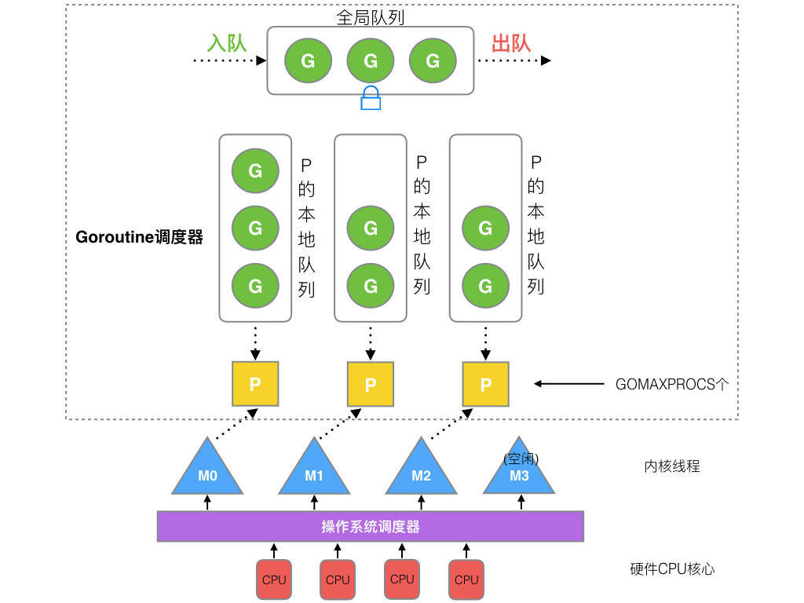
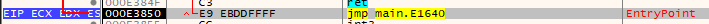
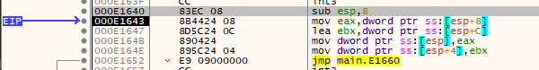
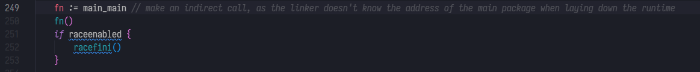

## 前言

应付面试做的准备吧。当然单纯背书也没意思，所以还是结合源码尝试去理解。

## GMP 模型

### 一图概述



### G、M、P之间的关系

`G`=`goroutine`，毫无疑问。`G`本身维护了一个跟踪它自己执行状态的结构。

`P`=`Logical Processors`，可以被视作一种抽象的资源或上下文，需要被OS线程`M`获取后，`M`才能执行`G`。

`M`=`OS Thread`，取得`P`后，弹出`P`队列中的`G`并执行。

这是一个很简化的说法，实际`G`、`M`、`P`之间的交互有很多复杂的细节。

### Go程序的启动

#### 八股

`M0`是编号0的主线程，在全局变量`runtime.m0`中，不需要在堆上分配。`M0`负责初始化和启动第一个`G`，之后`M0`就和其他`M`一样了。

`G0`是每次启动`M`第一个创建的`goroutine`。`G0`仅负责调度，不指向任何可执行的函数，每个`M`都有自己的`G0`。可以这样看：`G0`=调度器循环。

启动`G0`后开始正常调度，运行`main.main`。

#### 实践

网上有很多 go 程序分析的文章，一个基本的点是 go 程序入口点在 `rt0_<os>_<arch>.s` 里，我们对照 go 编译器吐出来的汇编和 x64dbg 读。先准备一个最简单的程序。

```asm
package main

func main() {
	println("Hello world!")
}

// $env:GOARCH=386
// go build main.go
```

386架构的入口汇编如下。

```assembly
// rt0_windows_386.s
TEXT _rt0_386_windows(SB),NOSPLIT,$0
	JMP	_rt0_386(SB)
```

对应的汇编



跳转到 `_rt0_386`

```assembly
// asm_386.s
// _rt0_386 is common startup code for most 386 systems when using
// internal linking. This is the entry point for the program from the
// kernel for an ordinary -buildmode=exe program. The stack holds the
// number of arguments and the C-style argv.
TEXT _rt0_386(SB),NOSPLIT,$8
	MOVL	8(SP), AX	// argc
	LEAL	12(SP), BX	// argv
	MOVL	AX, 0(SP)
	MOVL	BX, 4(SP)
	JMP	runtime·rt0_go(SB)
```

在调试器跟到汇编如下。



接着我们看 `runtime.rt0_go`

```assembly
TEXT runtime·rt0_go(SB),NOSPLIT|NOFRAME|TOPFRAME,$0
	// 一大堆初始化和检查代码，略
ok:
	// set up m and g "registers"
	get_tls(BX)
	LEAL	runtime·g0(SB), DX
	MOVL	DX, g(BX)
	LEAL	runtime·m0(SB), AX

	// save m->g0 = g0
	MOVL	DX, m_g0(AX)
	// save g0->m = m0
	MOVL	AX, g_m(DX)

	CALL	runtime·emptyfunc(SB)	// fault if stack check is wrong

	// convention is D is always cleared
	CLD

	CALL	runtime·check(SB)

	// saved argc, argv
	MOVL	120(SP), AX
	MOVL	AX, 0(SP)
	MOVL	124(SP), AX
	MOVL	AX, 4(SP)
	CALL	runtime·args(SB)
	CALL	runtime·osinit(SB)
	CALL	runtime·schedinit(SB)
	// create a new goroutine to start program
	PUSHL	$runtime·mainPC(SB)	// entry
	CALL	runtime·newproc(SB)
	POPL	AX

	// start this M
	CALL	runtime·mstart(SB)

	CALL	runtime·abort(SB)
	RET
```

几个关键节点大概谈一下。

第一个是关于`m`和`g`，看过`proc.go`会发现很多地方调了一个迷之函数`getg`，注释里写道由编译器插入实现，从寄存器或者Thread Local Storage 取当前 `G` 指针。看代码：

```assembly
// set up m and g "registers"
get_tls(BX)
LEAL	runtime·g0(SB), DX
MOVL	DX, g(BX)
LEAL	runtime·m0(SB), AX

// save m->g0 = g0
MOVL	DX, m_g0(AX)
// save g0->m = m0
MOVL	AX, g_m(DX)
```

这里把当前的`g`设置为了`g0`，并且关联到`m0`。

第二是 `schedinit`，里面调用了 `procresize` ，从 `allp` 获取到 `p` 绑定到了 `m0` 上。

再然后是在初始化之后看到一个 `newproc` 的调用，传入参数 `mainPC`，也就是 `runtime·main` 函数的地址。`newproc` 把 `runtime.main` 函数包装成 `G` 放进可运行的队列中，具体的请读源码`newproc`和`newproc1`。

这里插一嘴，`runtime.main` 函数里启动了我们的 `main.main` 函数，也就是我们平时代码的入口点就在这了。



但到底为止还没有出现调度代码，我们继续看接下来调用的`mstart`

```assembly
	// start this M
	CALL	runtime·mstart(SB)

TEXT runtime·mstart(SB),NOSPLIT|TOPFRAME,$0
	CALL	runtime·mstart0(SB)
	RET // not reached
```

`mstart`是`mstart0`的别名，`mstart0`是一个 go 函数，里面除了初始化 g 的栈之外就是调用了 `mstart1`，`mstart1`依然是一个`go`函数。

```go
// The go:noinline is to guarantee the getcallerpc/getcallersp below are safe,
// so that we can set up g0.sched to return to the call of mstart1 above.
//
//go:noinline
func mstart1() {
	_g_ := getg()

	if _g_ != _g_.m.g0 {
		throw("bad runtime·mstart")
	}

	// Set up m.g0.sched as a label returning to just
	// after the mstart1 call in mstart0 above, for use by goexit0 and mcall.
	// We're never coming back to mstart1 after we call schedule,
	// so other calls can reuse the current frame.
	// And goexit0 does a gogo that needs to return from mstart1
	// and let mstart0 exit the thread.
	_g_.sched.g = guintptr(unsafe.Pointer(_g_))
	_g_.sched.pc = getcallerpc()
	_g_.sched.sp = getcallersp()

	asminit()
	minit()

	// Install signal handlers; after minit so that minit can
	// prepare the thread to be able to handle the signals.
	if _g_.m == &m0 {
		mstartm0()
	}

	if fn := _g_.m.mstartfn; fn != nil {
		fn()
	}

	if _g_.m != &m0 {
		acquirep(_g_.m.nextp.ptr())
		_g_.m.nextp = 0
	}
	schedule()
}
```

而`mstart1`中我们看到最后一句就是最重要的`schedule()`，这个函数会从可运行队列里取一个`g`并开始执行。在这个场景下，我们只有另一个`g`，`runtime.main`。经过`schedule`后，主线程就从`g0`，也就是刚才的调度代码，切换到了`runtime.main`，我们的用户代码中。

### 调度策略

#### 八股

- `G`运行超过一定时间则换其他任务运行
- `G`同步系统调用阻塞则`M`和`G`继续挂起等待，`P`绑定新的`M`继续运行
- `G`网络调用则挂到`netpoller`队列里等待，`M`继续调度其他`G`运行。
- `P`没有任务的时候会尝试从全局队列和其他`P`的本地队列偷取`G`来运行。

#### sysmon、抢占、handoff

在`runtime.main`里，go 在启动`main.main`之前，除了`wasm`之外都会先启动一个叫`sysmon`的`M`，这个`M`只负责运行调度。

在`sysmon`函数里可以看到一个`retake`调用和注释

```go
// retake P's blocked in syscalls
// and preempt long running G's
if retake(now) != 0 {
    idle = 0
} else {
    idle++
}
```

`retake`函数里检查调用时间，处理两种场景：

1. 在同步系统调用状态，而且运行了很长时间
2. `G`已经运行了很长时间

```go
if s == _Prunning || s == _Psyscall {
    // Preempt G if it's running for too long.
    t := int64(_p_.schedtick)
    if int64(pd.schedtick) != t {
        pd.schedtick = uint32(t)
        pd.schedwhen = now
    } else if pd.schedwhen+forcePreemptNS <= now {
        preemptone(_p_)
        // In case of syscall, preemptone() doesn't
        // work, because there is no M wired to P.
        sysretake = true
    }
}
```

观察到，当`pd.schedwhen+forcePreemptNS <= now`，也就是这个`G`已经运行了超过`forcePreemptNS`（常量，10毫秒）这么久时，使用`preemptone`来通知`M`换一个`G`运行。

但是在同步系统调用的状态下，`preemptone`不起效，这里做了个简单的标记，在之后的代码中我们会看到如何处理。

```go
if s == _Psyscall {
    // Retake P from syscall if it's there for more than 1 sysmon tick (at least 20us).
    t := int64(_p_.syscalltick)
    if !sysretake && int64(pd.syscalltick) != t {
        pd.syscalltick = uint32(t)
        pd.syscallwhen = now
        continue
    }
    // On the one hand we don't want to retake Ps if there is no other work to do,
    // but on the other hand we want to retake them eventually
    // because they can prevent the sysmon thread from deep sleep.
    if runqempty(_p_) && atomic.Load(&sched.nmspinning)+atomic.Load(&sched.npidle) > 0 && pd.syscallwhen+10*1000*1000 > now {
        continue
    }
    // Drop allpLock so we can take sched.lock.
    unlock(&allpLock)
    // Need to decrement number of idle locked M's
    // (pretending that one more is running) before the CAS.
    // Otherwise the M from which we retake can exit the syscall,
    // increment nmidle and report deadlock.
    incidlelocked(-1)
    if atomic.Cas(&_p_.status, s, _Pidle) {
        n++
        _p_.syscalltick++
        handoffp(_p_)
    }
    incidlelocked(1)
    lock(&allpLock)
}
```

首先是，没有标记`sysretake`，也就是没有超时，那就随它去。如果`p`队列为空，而且没超过一定时长（`pd.syscallwhen+10*1000*1000`），那也暂时不管。中间的`spinning`状态和`idle`不提。

确定是同步系统调用中，而且无法被抢占，这里就要提到Go的调度策略之 `handoff`，注意倒数第五行的`handoffp(_p_)`。

`handoffp` 在 `P` 队列里还有任务的时候，会调度一个空闲的 `M`（或者创建一个）绑定 `P`，继续执行。

#### sysmon和netpoll

在 `sysmon` 中还有一段关于网络`netpoll`的代码。

```go
if netpollinited() && lastpoll != 0 && lastpoll+10*1000*1000 < now {
    atomic.Cas64(&sched.lastpoll, uint64(lastpoll), uint64(now))
    list := netpoll(0) // non-blocking - returns list of goroutines
    if !list.empty() {
        // Need to decrement number of idle locked M's
        // (pretending that one more is running) before injectglist.
        // Otherwise it can lead to the following situation:
        // injectglist grabs all P's but before it starts M's to run the P's,
        // another M returns from syscall, finishes running its G,
        // observes that there is no work to do and no other running M's
        // and reports deadlock.
        incidlelocked(-1)
        injectglist(&list)
        incidlelocked(1)
    }
}
```

`sysmon`检查到有可用的连接后（`netpoll`返回的`list`），将可用的`G`加入可运行的队列（这里是`sysmon`这个特殊`M`，没有`P`，所以是加入全局队列）。

#### work stealing

回到Go程序启动时我们看到的`schedule`函数，里面调用了`findRunnable`这个工具函数来获取可用的任务。注释里写的很清楚。

> ```go
> // Finds a runnable goroutine to execute.
> // Tries to steal from other P's, get g from local or global queue, poll network.
> // tryWakeP indicates that the returned goroutine is not normal (GC worker, trace
> // reader) so the caller should try to wake a P.
> ```

我们看下内部怎么工作的。

```go
// Check the global runnable queue once in a while to ensure fairness.
// Otherwise two goroutines can completely occupy the local runqueue
// by constantly respawning each other.
if _p_.schedtick%61 == 0 && sched.runqsize > 0 {
    lock(&sched.lock)
    gp = globrunqget(_p_, 1)
    unlock(&sched.lock)
    if gp != nil {
        return gp, false, false
    }
}
```

首先，如果队列非空而且已经跑本地队列一段时间了（`schedtick%61==0`），会尝试从全局队列取一半的`G`到本地队列运行（`globrunqget`），保证公平调度，防止全局队列的`G`饿死。

```go
// local runq
if gp, inheritTime := runqget(_p_); gp != nil {
    return gp, inheritTime, false
}

// global runq
if sched.runqsize != 0 {
    lock(&sched.lock)
    gp := globrunqget(_p_, 0)
    unlock(&sched.lock)
    if gp != nil {
        return gp, false, false
    }
}
```

接着先后尝试从本地队列和全局队列取`G`，如果本地队列没有任务，全局队列也没有了，再从其他地方找。

```go
// Poll network.
// This netpoll is only an optimization before we resort to stealing.
// We can safely skip it if there are no waiters or a thread is blocked
// in netpoll already. If there is any kind of logical race with that
// blocked thread (e.g. it has already returned from netpoll, but does
// not set lastpoll yet), this thread will do blocking netpoll below
// anyway.
if netpollinited() && atomic.Load(&netpollWaiters) > 0 && atomic.Load64(&sched.lastpoll) != 0 {
    if list := netpoll(0); !list.empty() { // non-blocking
        gp := list.pop()
        injectglist(&list)
        casgstatus(gp, _Gwaiting, _Grunnable)
        if trace.enabled {
            traceGoUnpark(gp, 0)
        }
        return gp, false, false
    }
}
```

尝试过一次`netpoll`找出就绪的`G`。还是没有，尝试从其他`P` *偷* `G`来执行。

```go
// Spinning Ms: steal work from other Ps.
//
// Limit the number of spinning Ms to half the number of busy Ps.
// This is necessary to prevent excessive CPU consumption when
// GOMAXPROCS>>1 but the program parallelism is low.
procs := uint32(gomaxprocs)
if _g_.m.spinning || 2*atomic.Load(&sched.nmspinning) < procs-atomic.Load(&sched.npidle) {
    gp, inheritTime, tnow, w, newWork := stealWork(now)
    now = tnow
    if gp != nil {
        // Successfully stole.
        return gp, inheritTime, false
    }
}
```

`stealWork`会尝试从其他`P`偷一半`G`到自己的`P`的本地队列里。

### goroutine的启动

简而言之，`go f()`其实就是`runtime.newproc(f)`，`newproc`的实现逻辑就是把函数包装成`G`结构，加入当前`P`的本地队列，仅此而已。之后就是正常调度。

### 普通M的启动

`runtime.newm`函数。`m`会分配到堆上（`allocm`），加入`allm`全局`M`池，在`newm`里调用了`newm1`，`newm1`里使用`newosproc`启动了一个操作系统线程来运行创建的`M`。看注释还有一种做法是 `template thread`，用于处理 `locked M`或者被 C 代码启动的情况。

## 总结

又是有些突兀的结束。

关于`runtime`其实还是有不少好玩的东西的，但问题就是不太好拿调试器去跟，现在也没看到什么特别好的go源码解读的文章或者书本吧。

Go 官方自己在 release note 里说过，不要依赖调度器的行为。GMP 学一学，看看 runtime 里怎么实现的，都挺好的。我是说，出于兴趣，那都挺好的。学到就是赚到，就算写代码的时候用不上也可以当谈资。

但应付面试的话=。=我感觉对照着八股文知识点去翻一下 runtime 对应的代码其实也就差不多了，甚至翻都不用翻，背呗。就是没乐趣了。

这篇博客主要是加强八股，所以GMP的知识点浅尝辄止吧。时间有限，八股说每个 `M` 创建都有个 `g0` ，但还没在代码里找到哪儿给新 `M` 设置的 `g0`；`scavenger` 也没看，记得第一次翻 go 源码就是为了找出 scavenger 到底怎么向 os 返还内存，现在也没结论。剩下的问题太多了。

就这样吧，结束，辛苦自己了。
