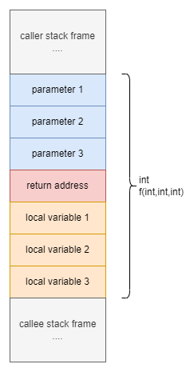
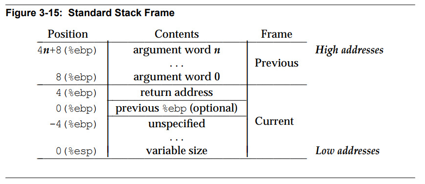

## 前言

本来想继续前篇八股写GC的博客，但花了一天多的时间读`mgc.go`还有推荐的那本 *GC handbook* 发现还真不是一句两句话能讲清楚GC设计背后的理论。特别是关于写屏障的作用和如何生效这块尤其难读，go是个有编译器配合打辅助的GC，写屏障并不全在 runtime，还涉及编译时插入的代码，要深入还得分析 go 的内存模型巴拉巴拉 ...

但背八股就和这个没关系了，八股不用去看`mgc.go`也不用分析编译器怎么插入的写屏障。

总而言之，时隔那么多天之后，决定把一本以前读过一点的书捡起来继续读，顺便做下读书笔记。书叫做 *Programming from the Ground Up* ，我看没中译本所以瞎叫它程序平地起，无所谓啦。

书是开源的，开源协议 GNU Free Documentation License，成书于 2004 年，目前处于 Production/Stable 状态。[网站地址](http://savannah.nongnu.org/projects/pgubook/)。讲道理还别嫌旧，王爽那本汇编语言还是 03 年发的初版，我也读过，讲道理门槛还是有点高不好实践的，毕竟上手就跟你讲一大堆理论和实模式下编程你就配个环境都要花不少时间......

这本 PGU 起码是用户态开始了，C语言会吧，把`return 0`换成`movl $0, %eax`总能读懂了吧，从编译链接这些更贴近已有知识的地方开始学起我个人感觉是学习曲线平滑了很多，不至于一章劝退，乐趣也多很多。

那废话不多说啦，这书300多页，快速过一下已经看过的部分。

## 语法

### AT&T vs Intel

之前说学过王爽那本汇编语言，和 PGU 这书最明显的区别可能就是用了不同的汇编语法。PGU用的是 AT&T 语法，形如`movl $0,%eax`，Intel 语法就是 `mov eax, 0` 。

AT&T 语法一方面多了很多符号`$ %`看起来比较“脏”，另一方面操作数顺序和 Intel 语法是反的。

这里稍微逼逼两句，语法这个东西能读能写就完了，没有谁家真的是完全照着什么specification设计的语言，扩展数不胜数。比如学王爽那本的时候我用的不是 masm 而是 nasm ，大部分东西一样，不同的地方翻文档。汇编就是一套助记符，语言律师在高级语言里没前途在汇编里也没前途。

### 寻址模式和语法

除了立即数和寄存器两种寻址模式稍特殊一点，后续的寻址模式在AT&T（我还是直接说 GCC 汇编吧）语法里都遵循一个一般形式。

```
ADDRESS_OR_OFFSET(%BASE_OR_OFFSET,%INDEX,MULTIPLIER)
```

里面的所有字段都是可选的，地址的计算公式是：

```
FINAL ADDRESS = ADDRESS_OR_OFFSET + %BASE_OR_OFFSET + MULTIPLIER * %INDEX
```

例如，`4(%eax)` 就是 `4 + %eax + 0 * 0`。`%eax(,1,4)` 就是 `%eax + 0 + 1 * 4`。

#### 立即数 immediate mode 和寄存器  register addressing mode

立即数寻址模式形如`$123`，`$`开头，就是立即数。

寄存器寻址模式形如`%eax`，以`%`开头后面跟寄存器名字。

#### 直接寻址 direct addressing mode

参考上述的一般形式，直接寻址就是只给出 `ADDRESS_OR_OFFSET` 字段。

在指令里直接给出地址，比如`movl 400010, %eax` 就是把地址 `400010` 处 4 个字节复制到寄存器 `eax` 。

#### 索引寻址 indexed addressing mode

参考一般形式，索引寻址模式就是给出 `ADDRESS_OR_OFFSET(,%INDEX,MULTIPLIER)` 这样的地址。

例如 `movl %eax(,0,4), %eax` 相当于是 `%eax` 指向一个 int32 数组，取这个数组第一个元素赋值给`%eax`，`eax = eax[0]`。以此类推，`movl %eax(,1,4), %eax` 就是 `eax = eax[1]` 。

#### 间接寻址 indirect addressing mode

参考一般形式，间接寻址就是只给`%BASE_OR_OFFSET`字段。

间接寻址模式下指令包含一个保存指向数据的指针的寄存器，比如`movl (%eax),%ebx`。

#### 基指针 base pointer addressing mode

和间接寻址类似，指针+偏移值，如`movl 4(%eax), %eax`。

## 函数、栈、系统调用

### 栈

说调用约定一般会讲 C calling conventions *cdecl* 的吧，特点是调用方清栈。但继续之前必须先说栈，因为好久没看汇编连进程的内存布局都快忘了。


这部分可以参考 APUE (*Advanced Programming in the UNIX Environment*) 一书第七章第六小节 C 程序的存储空间布局。

之前看 Windows PE 文件结构的时候提到 PE 文件的节表写了PE文件里的节映射到具体哪个地址上，Linux ELF 文件的节表也有 `sh_addr` 这样的属性指定映射到内存的哪个位置。在 `gdb` 里可以用 `maintenance info sections` 指令查看节映射到的内存地址。另外和 Windows PE 文件一样，Linux 下 ELF 也有 ASLR 和重定位，两者历史包袱还是挺接近的。

总之，这个布局图可供参考。比较重要的是图中的 stack 和 heap 增长方向。stack 往低地址增长，意味着要扩展栈需要的指令就是 `subq $8, %rsp` 这样的形式，回缩就是 `addq`。

另外个人觉得比较有趣的一点是，因为栈是往低地址增长的，但栈上开个数组之类的情况，布局反而是从低到高。这也意味着大多时候出现越界读写，都是从低地址往高地址方向的越界，影响栈帧和更高地址上的环境变量。如果把栈设计为从低到高，那越界读写的威胁是否就小很多呢。

扯远了。

### 函数和栈帧

汇编不像是其他高级语言，将函数视作一个客观、规范的语言结构，汇编里的函数是人为定义的概念，只是一段独立的汇编代码，被称作“函数”而已。

函数调用就是`pushq %rsp`加上`jmp`；返回就是`popq %rsp`再`jmp`，再加上可选的 `addq $..., %rsp`，仅此而已。但如果要这样说的话未免有点太不负责任了。还是看一个实例吧，从PGU这书的例子改出来的 x86-64 版本。

```assembly
.section .text
    .globl _start

_start:
    pushq $1
    pushq $2
    call add
    pushq %rax
    call exit_syscall

add:
    pushq %rbp
    movq %rsp, %rbp
    movq $0, %rax
    addq 16(%rbp), %rax
    addq 24(%rbp), %rax
    popq %rbp
    ret $16

exit_syscall:
    movq 8(%rsp), %rdi
    movq $60, %rax
    syscall
```

除了 `_start` 是个特殊的标签用来标识程序入口外，`add`和`exit_syscall`都是所谓的“函数”。其中`add`我尝试用`stdcall`约定（被调方清栈）来编写。

可以亲手用 gdb 调试一下上面的程序，观察栈的变化。

还是说栈帧。栈帧是一个人为定义的概念，就和函数一样。从函数出发我们可以看到一个函数的上下文包括：返回地址、参数、局部变量，把这些东西在栈上排列好：



其中参数和返回地址由调用方 *caller* 通过 `push` 和 `call` 指令传入，局部变量由函数自己`sub $24,%rsp`开辟。

中间有个可能造成误会的地方是 `%ebp` 寄存器为什么没在布局里画出来，根据 [System V Application Binary Interface Intel386 Architecture Processor Supplement](https://refspecs.linuxfoundation.org/elf/x86_64-abi-0.95.pdf) 中 Figure 3-15 可以看到这是可选的。



### 系统调用

系统调用和普通函数调用有很大不同，造成不同的内在原因等我啥时候读讲操作系统的书的时候再说。这里就单独看下调用约定。

一般的进程内函数调用都是直接 `call func`，已知`call`其实就是压栈返回地址加上无条件跳转，仅此而已，但系统调用完全不同，因为OS的代码压根不在用户进程的虚拟地址空间里，想跳也无处可跳。用户代码里想调用内核直接提供的接口就需要一些特殊方法。

1. `int 0x80` 软中断法实现
3. AMD64 提供的 `syscall` 指令实现

系统调用自然也有调用约定，确定要调用哪个函数，如何传递参数，如何取得返回值。这方面不同OS规范不一样，Linux 遵循 System V ABI 规范（注意不同处理器架构规范也有差异）。

对于AMD64架构使用 `syscall` 指令进入系统调用（[System V Application Binary Interface x86-64 Architecture Processor Supplement Draft Version 0.95 - A.2 AMD64 Linux Kernel Conventions - Calling Conventions](https://refspecs.linuxfoundation.org/elf/x86_64-abi-0.95.pdf)）参数传递顺序如下：

| 位置   | 含义       |
| ------ | ---------- |
| `%rax` | 系统调用号 |
| `%rdi` | 参数 #1    |
| `%rsi` | 参数 #2    |
| `%rdx` | 参数 #3    |
| `%r10` | 参数 #4    |
| `%r8`  | 参数 #5    |
| `%r9`  | 参数 #6    |

值得注意的是，调用约定中限制了整个系统调用最多不超过 6 个参数，全部都放在寄存器里，没有参数通过栈传递。另外，内核会破坏 `%rcx` 和 `%r11` 两个寄存器的内容，所以如果这两个寄存器需要调用方自己保存到栈上。

IA32 架构用 `int 0x80` 软中断实现系统调用（没找到具体规范），`%eax`传递调用号，`%ebx`, `%ecx`, `%edx`, `%esi`, `%edi`, `%ebp` 六个寄存器用于传递参数，同样限制系统调用最多不超过6个参数。

知道这些之后就可以用系统调用 `write` 写一个简单的 Hello world 了。

## 实验

```assembly
.section .data
helloworld:
    .ascii "Hello world\n"
helloworld_end:
    .equ helloworld_len, helloworld_end - helloworld
    .equ SYS_WRITE,1
    .equ STDOUT,1
.section .text
    .globl _start
_start:
    movq $SYS_WRITE, %rax       # write
    movq $STDOUT, %rdi          # int fd
    movq $helloworld, %rsi      # char* buf
    movq $helloworld_len, %rdx  # size_t len
    syscall

    # call _exit()
    movq %rax, %rdi
    movq $60, %rax
    syscall
```

用 gdb 单步调试，在第一个 `syscall` 前后可以看到这样的结果。

```plaintext
(gdb) l
10      _start:
11          movq $SYS_WRITE, %rax       # write
12          movq $STDOUT, %rdi          # int fd
13          movq $helloworld, %rsi      # char* buf
14          movq $helloworld_len, %rdx  # size_t len
15          syscall
16
17          # call _exit()
18          movq %rax, %rdi
19          movq $60, %rax
(gdb) i r $rsi
rsi            0x402000            4202496
(gdb) i r $rdi
rdi            0x1                 1
(gdb) i r $rdx
rdx            0xc                 12
(gdb) x/s $rsi
0x402000:       "Hello world\n"
(gdb) ni
Hello world
18          movq %rax, %rdi
```

用`file`命令可以看到编译后的文件信息：

```plaintext
$ file hello
hello: ELF 64-bit LSB executable, x86-64, version 1 (SYSV), statically linked, with debug_info, not stripped
```

## 总结

了解怎么用系统调用后，就能很大程度发挥想象了。

这篇读书笔记卡了我一个星期，本来计划读GC那本书也没读，PGU原书讲的也是 x86，和 x86-64 有些不同的地方，直接套用先前学汇编的时候 nasm 的一丁点经验对学习的帮助也有限。

光是找 System V ABI 规范文档和文档里关于系统调用的约定就花了一下午不止，最后还没找到 32 位 `INT 0X80` 到底哪儿规定的。

随着拿到新工作的 offer，事情忽然就开始堆积起来了。数据库系统原理的网课讲得稀烂，只能靠自己刷题。马原自从看完之后也没复习和刷题。10月不知道能报上几门。工作上一边要交接，一边要把剩下的一个大功能捋清楚。偏偏这功能产品部还火急火燎要在6月底前上线，还刚好卡在我提离职后让我干。明知这功能铁定全是坑也没辙了，选了个最保守的技术方案，别等我闪人了再搞出大问题让我救火就行。

至于博客，想水两篇还是有机会的，但偏偏想学的东西都不是好水的。GC那书偏理论，浅尝辄止那就跟抄书没两样，结合实践那就不是一两天能调试好的。PGU这书倒是很实践，但偏偏我又是个实践的时候喜欢钻牛角尖的，没事儿非要找个规范或者依据出来。即便如此博客还是口胡居多。

我寻思是不是应该多写点没那么多抱怨的生活内容，比如给周末刷的电影和动画写个观后感什么的。

六月第一篇博客拖到了14号才发，就先这样吧。
