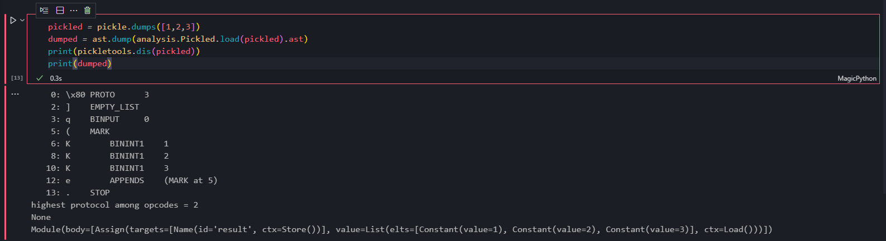
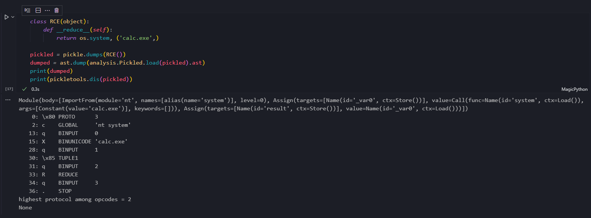

## 前言

挑了个好捏的软柿子下手，来看下反序列化漏洞一般什么原理。

## 原理

### 概述

Python 是个动态类型且高度灵活的语言，这意味着直接按内存布局序列化基本是没戏的。想序列化一个Python中的实例，很大程度要依靠Python的高度灵活性。

pickle 是一种 Python 的序列化库（或者，序列化协议？），其优势是几乎能序列化任何 Python 对象，但为了实现这种优势，pickle 会根据输入而执行指定的函数，从而造成RCE。

可以用 `fickling` 和 `pickletools` 这两个工具分析 pickle 序列化后的字节序列。



### 反序列化

接着分析下序列化后的这些数据是怎么还原成 Python 对象的。以 `pickle.dumps([1,2,3])` 的结果为例，以 `pickletools.dis` 还原成字节码，Python 3.7.9 pickle 模块源码 [pickle.py](https://github.com/python/cpython/blob/13c94747c74437e594b7fc242ff7da668e81887c/Lib/pickle.py)

```plaintext
    0: \x80 PROTO      3
    2: ]    EMPTY_LIST
    3: q    BINPUT     0
    5: (    MARK
    6: K        BININT1    1
    8: K        BININT1    2
   10: K        BININT1    3
   12: e        APPENDS    (MARK at 5)
   13: .    STOP
```

pickle 反序列化是一个类似基于栈的虚拟机，上面恢复的字节码等于这个虚拟机的汇编指令。上面第一列是偏移值，单位字节。第二、三列理解成指令，第四列自然是操作数。

然后我们看 `pickle.py` 中如何把上面这些”指令“恢复成 Python 对象。

#### vm模型

先看 `pickle.py` 中的 `_Unpickler` 类，跳转到`load`方法。

```python
    def load(self):
        """Read a pickled object representation from the open file.

        Return the reconstituted object hierarchy specified in the file.
        """
        # Check whether Unpickler was initialized correctly. This is
        # only needed to mimic the behavior of _pickle.Unpickler.dump().
        if not hasattr(self, "_file_read"):
            raise UnpicklingError("Unpickler.__init__() was not called by "
                                  "%s.__init__()" % (self.__class__.__name__,))
        self._unframer = _Unframer(self._file_read, self._file_readline)
        self.read = self._unframer.read
        self.readline = self._unframer.readline
        self.metastack = []
        self.stack = []
        self.append = self.stack.append
        self.proto = 0
        read = self.read
        dispatch = self.dispatch
        try:
            while True:
                key = read(1)
                if not key:
                    raise EOFError
                assert isinstance(key, bytes_types)
                dispatch[key[0]](self)
        except _Stop as stopinst:
            return stopinst.value
```

这里已经出现了核心逻辑和最重要的几个属性：`stack`、`metastack`、`dispatch`。

`stack`顾名思义即可，`dispatch`则是一个 opcode  到 `_Unpickler`  方法的映射字典。opcode 定义在这个文件的 98~179 行。

在重要数据结构初始化后，接下来是主循环，从输入中读`key`（指令），派发执行。

#### PROTO

回顾上一节的字节码，我们从 `PROTO 3` 开始看 pickle 如何处理这些指令。

```python
    def load_proto(self):
        proto = self.read(1)[0]
        if not 0 <= proto <= HIGHEST_PROTOCOL:
            raise ValueError("unsupported pickle protocol: %d" % proto)
        self.proto = proto
    dispatch[PROTO[0]] = load_proto
```

`PROTO 3` 指令读了操作数 `3` 并赋值。注意看

```plaintext
    0: \x80 PROTO      3
    2: ]    EMPTY_LIST
```

`PROTO 3` 正好 2 字节，在`load`中读取的第一个字节表示`proto`指令，操作数`3`是第二个字节。

#### EMPTY_LIST

`    EMPTY_LIST` 我们继续看这个指令。

```python
    def load_empty_list(self):
        self.append([])
    dispatch[EMPTY_LIST[0]] = load_empty_list
```

`self.append` 是 `self.stack.append` 的别名，我们在 `load` 函数定义里已经知道了这一点。这一步往栈中压了一个空的列表`list`。

#### BINPUT

`BINPUT 0`

```python
    def load_binput(self):
        i = self.read(1)[0]
        if i < 0:
            raise ValueError("negative BINPUT argument")
        self.memo[i] = self.stack[-1]
    dispatch[BINPUT[0]] = load_binput
```

在`PUT`系列指令的定义处有注释：

```python
PUT            = b'p'   # store stack top in memo; index is string arg
BINPUT         = b'q'   #   "     "    "   "   " ;   "    " 1-byte arg
LONG_BINPUT    = b'r'   #   "     "    "   "   " ;   "    " 4-byte arg
```

`BINPUT` 指令的含义是将栈顶变量（空列表）放到 `memo` 中（理解为寄存器？）。这个指令的操作数就相当于是寄存器名了。

#### MARK

```plaintext
    0: \x80 PROTO      3
    2: ]    EMPTY_LIST
    3: q    BINPUT     0
    5: (    MARK
```

```python
MARK           = b'('   # push special markobject on stack

# ...

def load_mark(self):
    self.metastack.append(self.stack)
    self.stack = []
    self.append = self.stack.append
dispatch[MARK[0]] = load_mark
```

`MARK` 指令将栈压到了 `metastack` 中，替换了当前栈。应该是一个类似栈帧的机制。

#### BININT

```python
BININT         = b'J'   # push four-byte signed int
BININT1        = b'K'   # push 1-byte unsigned int
LONG           = b'L'   # push long; decimal string argument
BININT2        = b'M'   # push 2-byte unsigned int
```

`BININT` 系列的指令都是压栈一个操作数。在`MARK`指令后，是连续的三条`BININT1`指令。

```plaintext
    5: (    MARK
    6: K        BININT1    1
    8: K        BININT1    2
   10: K        BININT1    3
```

#### APPENDS

```plaintext
   10: K        BININT1    3
   12: e        APPENDS    (MARK at 5)
```

```python
    def load_appends(self):
        items = self.pop_mark()
        list_obj = self.stack[-1]
        try:
            extend = list_obj.extend
        except AttributeError:
            pass
        else:
            extend(items)
            return
        # Even if the PEP 307 requires extend() and append() methods,
        # fall back on append() if the object has no extend() method
        # for backward compatibility.
        append = list_obj.append
        for item in items:
            append(item)
    dispatch[APPENDS[0]] = load_appends
```

`appends`将`memo`中保存的前一个栈弹出，然后把当前栈上的所有值压到前一个栈顶的空列表中。如此就成功得到了我们输入的列表。

#### STOP

最后的 `STOP` 指令没有操作数。

```python
    def load_stop(self):
        value = self.stack.pop()
        raise _Stop(value)
    dispatch[STOP[0]] = load_stop
```

效果也很简单，将栈顶的对象弹出，这个对象就是最终被 pickle 恢复完成的对象了。

### RCE利用

pickle 的反序列化任意代码执行漏洞来自 pickle 序列化/反序列化实例的一种约定，即`__reduce__`魔术方法。

对自定义类的实例，pickle 没法保证一定能还原出原对象。比如类里包含一个打开了的文件描述符，fd是没法保存的，程序一重启先前保存的 fd 就失效了，如果要恢复唯一的办法就是重新打开一次，或重新构造一次这个实例。

提供 `__reduce__` 魔术方法以允许 pickle 将当前对象转为一系列构造和恢复实例所需的参数：类型、构造参数、状态参数等。

一般对 `__reduce__` 的利用就是构造参数的部分，将构造方法指定为 `os.system` 即可执行任意命令。

同样这里提供一个例子，在反序列化时会弹出计算器。



```plaintext
    0: \x80 PROTO      3
    2: c    GLOBAL     'nt system'
   13: q    BINPUT     0
   15: X    BINUNICODE 'calc.exe'
   28: q    BINPUT     1
   30: \x85 TUPLE1
   31: q    BINPUT     2
   33: R    REDUCE
   34: q    BINPUT     3
   36: .    STOP
highest protocol among opcodes = 2
None
```

接着我们具体分析我们没见过的指令。

#### GLOBAL

```python
    def load_global(self):
        module = self.readline()[:-1].decode("utf-8")
        name = self.readline()[:-1].decode("utf-8")
        klass = self.find_class(module, name)
        self.append(klass)
    dispatch[GLOBAL[0]] = load_global
```

global 指令查找指定的模块，注意`find_class`并不**只**找类，函数也能被找出来。这一条指令执行后，栈顶保存的就是 `nt.system` 了。

#### BINUNICODE

```plaintext
   13: q    BINPUT     0
   15: X    BINUNICODE 'calc.exe'
```

在`BINPUT`把`nt.system`所在的栈记到 `memo[0]` 后，是一个 `BINUNICODE`。

和`BININT`差不多，压栈一个unicode字符串。

#### TUPLE1

```plaintext
   28: q    BINPUT     1
   30: \x85 TUPLE1
```

再次更换栈，`TUPLE1`从栈顶构造一个元组。

```python
    def load_tuple1(self):
        self.stack[-1] = (self.stack[-1],)
    dispatch[TUPLE1[0]] = load_tuple1
```

这一步将刚压栈的`calc.exe`构造成了`('calc.exe',)`。

#### REDUCE

```plaintext
   31: q    BINPUT     2
   33: R    REDUCE
```

将刚构造好的元组记录到`memo[2]`后，开始 `REDUCE` 指令。正是这一步触发了任意代码执行。

```python
REDUCE         = b'R'   # apply callable to argtuple, both on stack

    def load_reduce(self):
        stack = self.stack
        args = stack.pop()
        func = stack[-1]
        stack[-1] = func(*args)
    dispatch[REDUCE[0]] = load_reduce
```

这段代码中`args`是我们刚构造好的`('calc.exe',)`，`func`是`nt.system`，这个函数的调用结果成为最后留在栈里的对象。

而我们的恶意代码（弹计算器）也执行了。

## 总结