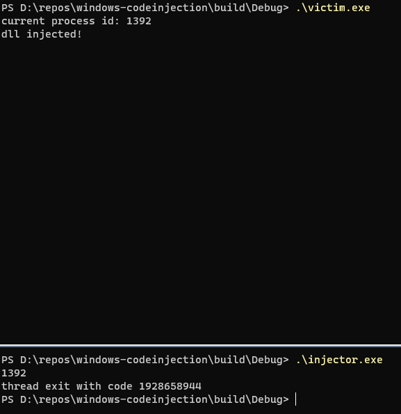

## 前言

翻到一本Windows编程书上介绍 DLL 注入，简单验证了一下并做个记录。

同时书上还介绍了另一种代码注入方法，APC 注入，有时间验证了再另写一篇。

## 原理

`CreateRemoteThread` 注入 DLL 的大体流程如下。

1. `OpenProcess` 打开目标进程，受害进程权限高的话可能要特权。
2. `VirtualAllocEx` 在目标进程的地址空间里分配足够存放待注入 DLL 路径的空间。
3. `WriteProcessMemory` 在目标进程写 DLL 路径，位置是上一步分配好的地址。
4. `GetProcAddress(GetModuleHandle("kernel32.dll"), "LoadLibraryA")` 待调用函数地址。
5. `CreateRemoteThread` 在目标进程里启动线程，线程入口就是 `LoadLibraryA`。

整个流程就是在目标进程的地址空间里写好参数（1~3步），然后调一个已经存在于目标进程地址空间中的函数（`kernel32.dll`里的`LoadLibraryA`）加载我们的 DLL（4~5步）。

其中有个坑值得注意下：

> [DLL injection with CreateRemoteThread - stackoverflow](https://stackoverflow.com/questions/22750112/dll-injection-with-createremotethread)
>
> The thing confuses me is that `GetProcAddress` returns the `LoadLibraryA` fucntion address of **the current process**, how can you pass it as a parameter to `CreateRemoteThread` and expect **the target process** to run it?
>
> accepted answer:
>
> > It works by accident. It is a *very* common accident, Microsoft makes a great deal of effort to ensure that the operating system DLLs, like kernel32.dll, have a base address that doesn't conflict with any other DLLs. Further enhanced by kernel32.dll getting loaded very early at process initialization so low odds that it has to fight to get its preferred base address.
> >
> > You'll get away with easily. It is notable that this **has** gone wrong in the past, there was an XP security update oops that caused gdi32.dll to get relocated and made lots of machines fall over at boot. The correct way is fairly painful, CreateToolhelp32Snapshot() + Module32First/Next() to find the relocation offset isn't great joy. Frankly, you probably ought to not do this at all if the operating system is "weird" like that.

在第四步使用 `GetProcAddress` 拿到的显然是当前进程地址空间里 `LoadLibraryA` 的地址，但另一个进程的地址空间里，`LoadLibraryA` 也是在同样的地址上吗？说好的地址空间随机化呢？

从上面贴出的 stackoverflow 链接里，可以看到相关的讨论。主要就是两个观点：

- works by accident (very common accident).
- Microsoft intentionally implemented it.

没有查找到更权威的说法的情况下暂且按下不谈。

## 案例

案例分三个部分：

1. `injector`，注入者，负责执行 DLL 注入。
2. `payload`，待注入的 DLL，里面仅输出一行文字标识注入成功。
3. `victim`，一个简单的猜数字游戏，在案例中扮演受害者。

使用 cmake 编译。所有源码如下。

```cpp
// injector.cpp
#include <iostream>

#include <Windows.h>
#include <Psapi.h>

LPCSTR libPath = "D:\\repos\\windows-codeinjection\\build\\Debug\\payload.dll";

int main()
{
  // 从命令行读被注入进程的ID
  DWORD pid = 0;
  std::cin >> pid;
  if (pid == 0)
  {
    std::cout << "invalid pid input" << std::endl;
  }
  // 打开被注入进程
  HANDLE hProcess = OpenProcess(PROCESS_ALL_ACCESS, FALSE, pid);
  if (NULL == hProcess)
  {
    return 1;
  }
  // 在目标进程里分配存放 DLL 路径的空间
  LPVOID lpRemoteDllName = VirtualAllocEx(hProcess, NULL, strlen(libPath) + 1, MEM_COMMIT, PAGE_READWRITE);
  if (lpRemoteDllName == NULL)
  {
    std::cout << "[ERROR] VirtualAllocEx failed, last error " << GetLastError() << std::endl;
    return -1;
  }
  // 写入 DLL 路径
  if (WriteProcessMemory(hProcess, lpRemoteDllName, libPath, strlen(libPath) + 1, NULL) == FALSE)
  {
    std::cout << "[ERROR] WriteProcessMemory failed, last error " << GetLastError() << std::endl;
    return -1;
  }
  // 从本进程地址空间读取 LoadLibraryA 函数的地址
  LPVOID lpProcAddr = (LPVOID)GetProcAddress(GetModuleHandle("kernel32.dll"), "LoadLibraryA");
  // 在目标进程创建线程，执行 LoadLibraryA(我们的DLL路径)
  HANDLE hThread = CreateRemoteThread(hProcess, NULL, NULL, (LPTHREAD_START_ROUTINE)lpProcAddr, (LPVOID)lpRemoteDllName, NULL, NULL);
  // 收尾
  if (WaitForSingleObject(hThread, INFINITE) != WAIT_OBJECT_0)
  {
    CloseHandle(hProcess);
    return 0;
  }

  DWORD exitCode = 0;
  GetExitCodeThread(hThread, &exitCode);
  std::cout << "thread exit with code " << exitCode << std::endl;
  CloseHandle(hProcess);
  return -1;
}
```

```cpp
// victim.cpp
#include <cmath>
#include <iostream>

#include <Windows.h>

int main()
{
  int guess;
  int result = std::rand();
  DWORD pid = GetCurrentProcessId();
  std::cout << "current process id: " << pid << std::endl;
  for (;;)
  {
    std::cin >> guess;
    if (guess > result)
    {
      std::cout << "too big" << std::endl;
    }
    else if (guess < result)
    {
      std::cout << "too small" << std::endl;
    }
    else
    {
      std::cout << "correct!" << std::endl;
      break;
    }
  }
  return 0;
}
```

```cpp
// payload.cpp
#include <Windows.h>

#include <iostream>

BOOL WINAPI DllMain(
    HINSTANCE hinstDLL, // handle to DLL module
    DWORD fdwReason,    // reason for calling function
    LPVOID lpReserved)  // reserved
{
    // Perform actions based on the reason for calling.
    switch (fdwReason)
    {
    case DLL_PROCESS_ATTACH:
        // Initialize once for each new process.
        // Return FALSE to fail DLL load.
        std::cout << "dll injected!" << std::endl;
        break;

    case DLL_THREAD_ATTACH:
        // Do thread-specific initialization.
        break;

    case DLL_THREAD_DETACH:
        // Do thread-specific cleanup.
        break;

    case DLL_PROCESS_DETACH:
        // Perform any necessary cleanup.
        break;
    }
    return TRUE; // Successful DLL_PROCESS_ATTACH.
}
```

```cmake
# CMakeLists.txt
cmake_minimum_required(VERSION 3.20)
project(
    windows-codeinjection
    VERSION 0.1.0
    LANGUAGES CXX
)

add_executable(injector injector/main.cpp)
add_executable(victim victim/main.cpp)
add_library(payload SHARED payload/main.cpp)
```

最终验证结果



## 总结

哈，魔术师的秘密。