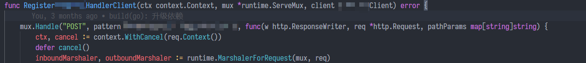
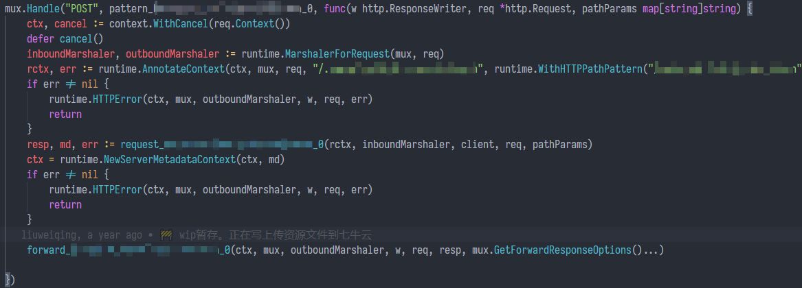
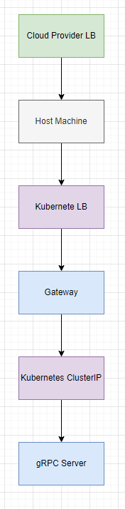

## 前言

众所周知，API网关是微服务架构的重要组件，起到一个整流过滤的作用。虽然 gRPC-Gateway 要啥没啥，和 API 网关的模式也扯不上太多关系，但总之先起个高调。

然后就是真正遇到的问题了。在旧的架构里，gRPC-Gateway 的用法，是对每个需要暴露 HTTP 服务的 gRPC 服务都起一个对应的 gRPC-Gateway 。最早的做法是 gRPC-Gateway 服务单独作为一个 POD ，gRPC 服务实现也单独一个 POD 。后来我改成了 Gateway 和 服务在同一个 POD 内，起两个 container 。

之前的做法都存在一个问题，就是 gRPC-Gateway 要分配少量的 CPU 和内存配额，虽然每个 gRPC-Gateway 服务分到的内存和CPU都很少，但架不住服务多，内存和 CPU 的配额都占用了不少，实际用到的少得可怜，大部分配额都是浪费。

下面具体分析下怎么把 gateway 单独提取成一个 POD，给所有 gRPC 服务当网关，同时保持负载均衡发挥作用，提供无缝扩容。

## 实现网关

### 官方demo

```go
// Create a client connection to the gRPC server we just started
// This is where the gRPC-Gateway proxies the requests
conn, err := grpc.DialContext(
    context.Background(),
    "0.0.0.0:8080",
    grpc.WithBlock(),
    grpc.WithTransportCredentials(insecure.NewCredentials()),
)
if err != nil {
    log.Fatalln("Failed to dial server:", err)
}

gwmux := runtime.NewServeMux()
// Register Greeter
err = helloworldpb.RegisterGreeterHandler(context.Background(), gwmux, conn)
if err != nil {
    log.Fatalln("Failed to register gateway:", err)
}

gwServer := &http.Server{
    Addr:    ":8090",
    Handler: gwmux,
}

log.Println("Serving gRPC-Gateway on http://0.0.0.0:8090")
log.Fatalln(gwServer.ListenAndServe())
```

核心逻辑在这两行：

```go
gwmux := runtime.NewServeMux()
// Register Greeter
err = helloworldpb.RegisterGreeterHandler(context.Background(), gwmux, conn)
if err != nil {
    log.Fatalln("Failed to register gateway:", err)
}
```

`gwmux`是 gRPC-Gateway 的运行时 `mux` 实例，可以理解成路由。 标准库的 `http` 包也有自己的 `mux` ，但 gRPC-Gateway 项目自己实现了一个。看到 `gwmux`应该就能想到这肯定是注册路由，理论上来说——如果你有多个 gRPC 服务，而且 url 没有冲突的话，注册多个服务到路由上应该是没有问题的。

所以剩下的问题就是这个 `RegisterGreeterHandler` 内是不是我们预期的那样，类似 `mux` 注册路由的用法？

### RegisterXXXHandlerClient 实现



顺着 `RegisterXXXHandler`很快就能找到实现，`RegisterXXXHandlerClient`。`Handle`的用法正如预期的那样，是一个类似 `http.ServeMux` 的对象。处理函数里的逻辑很清晰。



函数体可以简单划分成两部分：

- 构造和发送请求
  - 根据请求的 `Content-Type` 选择 `Marshaler` 。
  - 构造请求上下文，从HTTP请求里提取`grpc-metadata`开头的元数据到 `context` 里。
  - `request_XXX_0` 反序列化 HTTP 请求体到 protobuf 生成的结构，并发送请求。
- 构造和返回响应
  - 从响应元数据里构造上下文
  - 构造和返回 HTTP 响应

整个流程是无状态也和 `gwmux` 本身无绑定的。换言之，理论上来说完全可以把所有 gRPC-Gateway 生成的 `Register` 函数注册到同一个 `gwmux` 上。

### Backend和注册

出于清晰化的考虑，Gateway 服务的构造过程我写成了 Builder 模式。

```go
type registerHandlerFn func(ctx context.Context, mux *runtime.ServeMux, conn *grpc.ClientConn) (err error)

type GRPCBackend struct {
	RegisterHandlerFunc registerHandlerFn
	BackendAddr         string
}

func (s *DonviewGRPCGatewayServer) Serve() error {
	mux := runtime.NewServeMux(s.muxOptions...)

	for _, backend := range s.backends {
		conn, err := grpc.DialContext(context.TODO(), backend.BackendAddr, s.dialOptions...)
		if err != nil {
			return err
		}

		err = backend.RegisterHandlerFunc(context.TODO(), mux, conn)
		if err != nil {
			return err
		}
	}

	var handler http.Handler = mux
	for _, wrapperFn := range s.httpHandlerWrappers {
		handler = wrapperFn(handler)
	}

	return http.ListenAndServe(fmt.Sprintf("0.0.0.0:%d", s.port), handler)
}

```

所有 gRPC 后端被注册到 `s.backends` ，在开始服务的时候调用 `Serve` 函数，把 gRPC 服务注册到 `mux` 里。因为事前确保了服务路由不会重叠，理论上来说注册完就能用。

## 负载均衡

最初的架构里，一个 gRPC-Gateway 服务对应一个 gRPC 服务，请求进入服务的过程是从云服务提供商的 LB => kubernetes service (load balancer) => gateway => ClusterIP => gRPC Server 。

后来改成一个 POD 包含 gateway 和 gRPC 两个 container 后，gateway 访问 gRPC 服务就不在经过 ClusterIP 这一层代理了，路径变成云服务商的 LB => kubernetes service (load balancer) => gateway => gRPC Server 。

最后是现在的版本，网关统一成一个容器，路径和上述一样。

三者的区别在于负载均衡的时机。Kubernetes 的 ClusterIP 是同样具备负载均衡能力的，最初架构中负载均衡一共进行了三次，从云服务商的LB到主机端口（kubernetes），kubernetes再次负载均衡，转发到 gateway。gateway再经由 ClusterIP 转发至 gRPC 服务，每一次转发都经历一次负载均衡，分别提供了虚拟主机的扩容能力、gateway服务的扩容能力、gRPC服务的扩容能力。

第二版修改去掉了 gateway 到 gRPC 服务的负载均衡，变成了直连，延迟表现上理论上来说会有改善，但我没做过基准测试，所以这个“理论上”也只是凭感觉说。但可以明确的是 gateway 会额外占据资源配额，造成浪费，不好说值不值，个人感觉没太大意义。

第三版，统一了 gateway，还是三次负载均衡。不过Gateway对资源配额的使用效率会更好一点，依然保持了主机、gateway、gRPC 服务的可伸缩性。



## 总结

单从理论上来说这样设计应该是 OK 的，但是 gRPC-Gateway 官方对负载均衡没有说法，对能不能注册多个 gRPC 服务到一个 `mux` 上也没有官方的文档说明，很难说这帮人能不能保证向后兼容，万一之后的版本不支持注册到一个 `mux` 上了，到时候改起来就麻烦了，比较坏的情况就是你得自己写一个 `protoc-gen-gateway` 这样的玩意儿来生成一个自己的网关。

此外还有一个缺陷，gRPC-Gateway 到 gRPC Server 的负载均衡由 Kubernetes ClusterIP 提供，但是 [ClusterIP 的负载均衡算法是 Round Robin/Random](https://stackoverflow.com/questions/49888133/kubernetes-service-cluster-ip-how-is-this-internally-load-balanced-across-diffe) ，并不支持根据负载或其他维度的测量数据来决定如何均衡负载，未来如果需要根据负载情况分发请求，可能还得在网关到 gRPC 服务之间加个负载均衡组件，再提供一个服务发现/注册中心来帮助调度。