## 前言

DVWA 全程 *Damn Vunerable Web Application* ，是一个开源的基于 PHP+MariaDB 开发的漏洞靶场。

官方文档推荐XAMPP部署，但个人比较爱docker，先拿 README 里写的 vulnerables/web-dvwa 玩玩看。

> vulnerable/web-dvwa 这个容器最后一次更新已经是 2015 年了，作为纯萌新姑且先把玩看看，安全领域攻防发展这么快，我寻思这个版本是有点和时代脱节了。

## 安装

启动个虚拟机，debian bullseye，装好 docker 再配好 zsh 之类的工具。tmux 开个分窗然后一键跑起来：`docker run --rm -it -p 80:80 vulerables/web-dvwa`。

配置下虚拟机端口转发，把 SSH 和 HTTP 转发到宿主机：

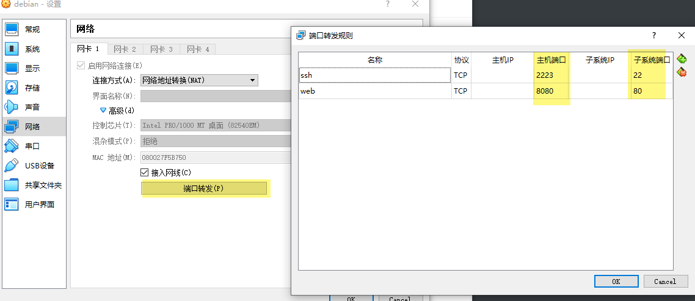

最后在浏览器打开 `http://localhost:8080/` 就能看到登录页了。在创建数据库前随便输入什么用户名密码都能进去，简单读一下`/setup.php` 上写的内容，点一下 `Create/Reset database`。

等跳转回登录页，就算是完成了。

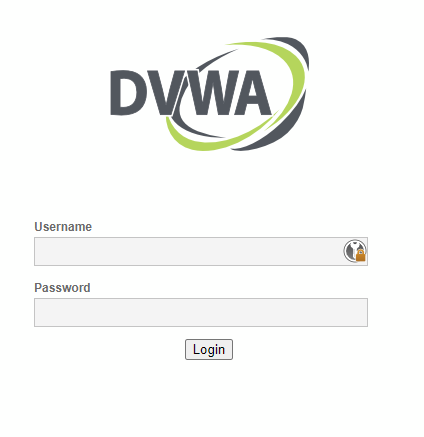

默认账号密码是 `admin` 和 `password` 。

## 信息收集

### 介绍

在侧边栏可以看到可用的模块。

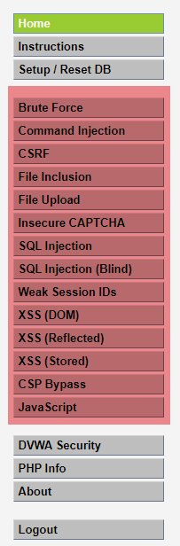

具体内容稍后再看，先把主页上的信息读一读。

介绍中这样说：

> It is up to the user how they approach DVWA. Either by working through every module at a fixed level, or selecting any module and working up to reach the highest level they can before moving onto the next one. There is not a fixed object to complete a module; however users should feel that they have successfully exploited the system as best as they possible could by using that particular vulnerability.

用户自己决定怎么玩这个靶场，没有固定目标。可以先把一个模块从低难度到高难度全打通再继续下一个，也可以低难度把所有模块打通再提高难度再来一轮。

> Please note, there are *both documented and undocumented vulnerability* with this software. This is intentional. You are encouraged to try and discover as many issues as possible.

并且还提到有意存在未文档化的漏洞，也就是攻破一个模块的方法并不局限于帮助文档里的方法，完全可能自己挖掘出别的问题。

> DVWA also includes a Web Application Firewall (WAF), PHPIDS, which can be enabled at any stage to further increase the difficulty.

DVWA 还包含了 WAF，可以自己开启或者关闭。开启等于是给自己提高了难度。

### PHP info

侧边栏下方有个 PHP Info 链接，点开看一眼，就是个经典的 phpinfo 页。

php 版本是 7.0.30-0+deb9u1，应该是 debian 打包的版本。

Apache 版本 2.4.25，Debian 打包的版本。

其他半懂不懂的全部略，就当没看见。

之后有需要再来看。

### 关于

在 About 页里提到发行时间是 2015-10-08，确实很老了。

里面还有些相关链接和资源、文档，把 dvwa 的官网主页加入收藏夹后剩下的内容暂且不管。

### DVWA security

安全配置页，显示当前的 DVWA 运行在哪个安全级别（就是前文介绍中提到的 **难度**）。

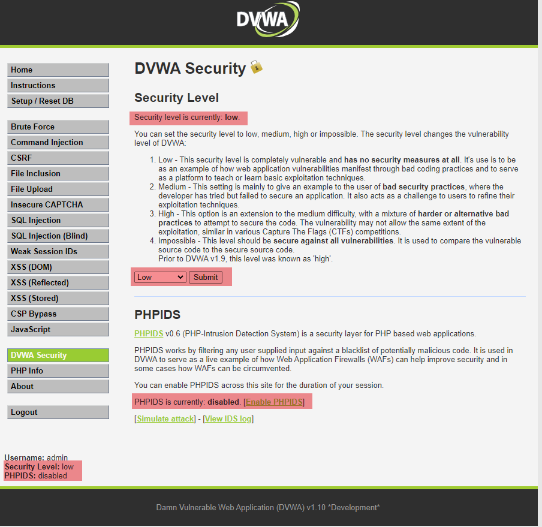

注意到页面这几个位置都有标注当前安全配置，在这个页面可以修改安全级别和 WAF （图中 PHPIDS）的开启状态。

### Setup/Reset DB

这个页面就是最初启动 DVWA 的时候初始化数据库的页面，可以在这个页面里重置数据库，也能在这个页面看到一些自检信息。

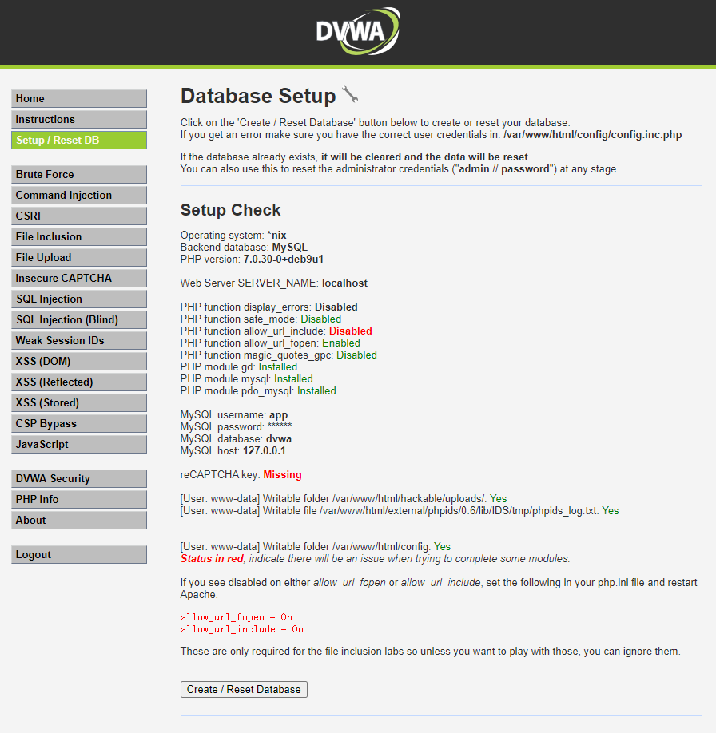

`allow_url_include`暂时不管，等玩到那个模块的时候再看情况。

`reCAPTCHA key` 是验证码模块需要的，等玩到的时候再找下怎么配。

最下面的 `Create / Reset Database` 的按钮就是重置数据库了。对于用 `docker --rm` 启动的我来说直接重启下容器清理地更干净，预计不会怎么用到这个功能。

### 模块速览

#### Brute Force

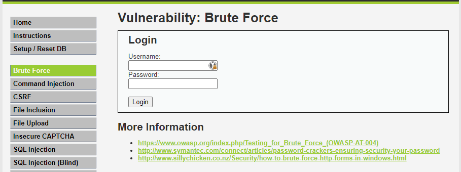

一般说 Brute Force 的时候就是暴力破解了，”跑字典“啊什么的。遍历可能存在的的弱密码。

#### Command Injection

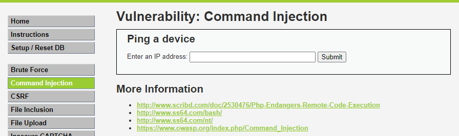

命令注入，相当经典的一个 ping，应该看一眼就知道指的什么了。

#### CSRF

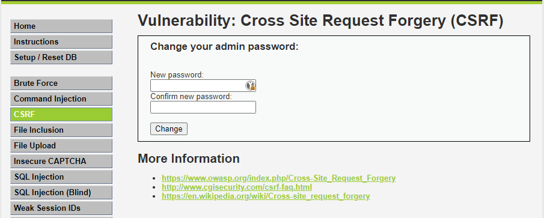

跨站请求伪造，有点摸不着头脑。emm，难道是说这个页面没有考虑 csrf （可能还有cors？），所以能在别的站直接发个 xhr 实现修改密码？

#### File Inclusion

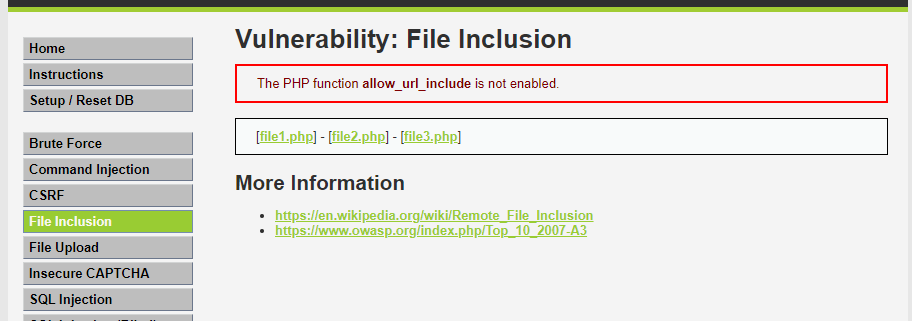

没思路。虽然看过 p 大博客信手拈来的文件包含利用，但对着这个页面暂时还是想不出要干啥。

> PS：刚发现地址栏有点意思
>
> 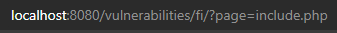

#### File Upload

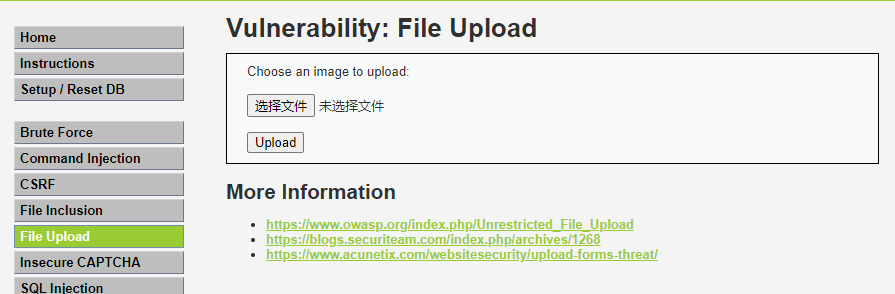

可能是任意文件上传相关的洞？

#### Insecure CAPTCHA

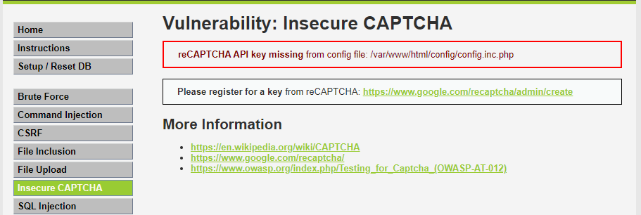

看标题还是有点意思的，不安全的验证码指的是可以绕过验证码么？

#### SQL Injection

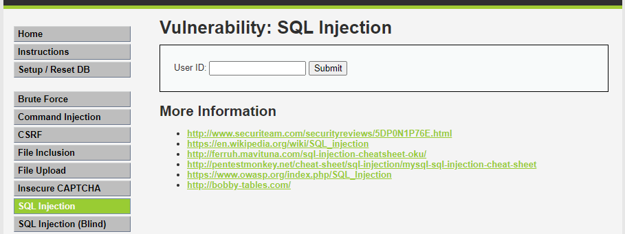

经典SQL注入。

#### SQL Injection (Blind)

和上面一样，不过是盲注。

#### Weak Session IDs

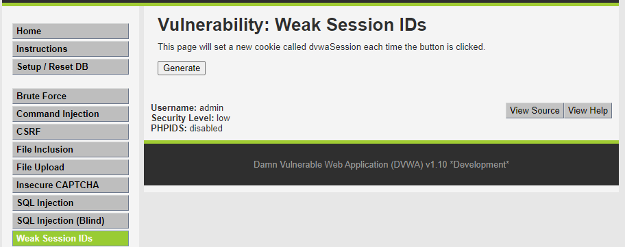

对 PHP 还不够了解，不知道 `Weak Session IDs` 指的是什么。可能和 Cookie 里的 `PHPSESSID` 有关系？

#### XSS (DOM)

见下。

#### XSS(Reflected)

见下。

#### XSS(Stored)

三类 XSS ，页面分别如下。

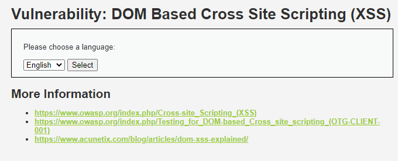

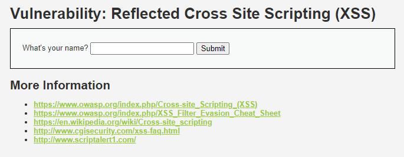

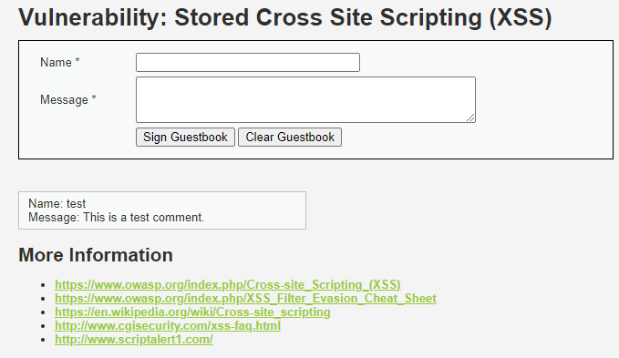

除了 DOM 型看页面没有思路，另外两个看注入点还是清楚的。

#### CSP Bypass

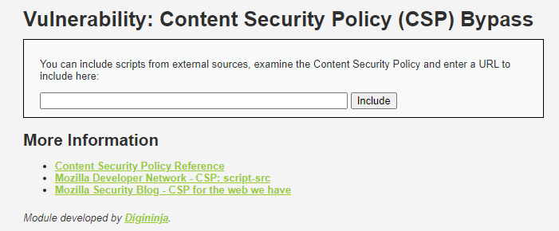

不了解 CSP，没头绪。

#### JavaScript

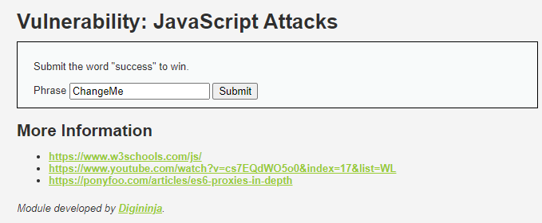

有点摸不着头脑，指的是在前端用 JS 检查表单不安全？

看链接里的 `es6-proxies-in-depth` 感觉是个绕过前端保护的题。

## 初体验总结

姑且算是把 DVWA 这个靶场在手里把玩了一下，初步看了看怎么玩、有什么可玩。

接下来考虑是一题一题难度从低到高慢慢刷过去，实在干不过再跳。

