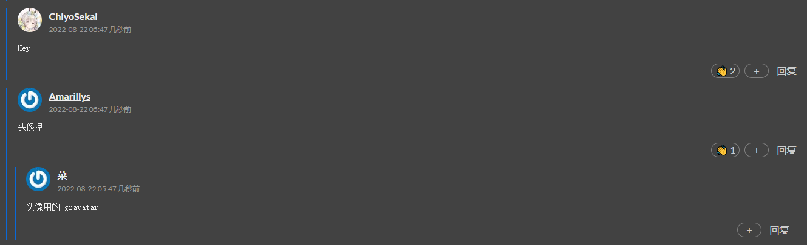
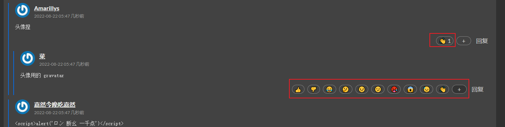
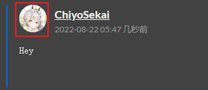

## 概述

当前测试的是 *comment management system v0.1* 简称 cms 。代码暂未开源。

前后端分离架构，前端采用 vue3 + dayjs 没别的库。后端 gin + gorm，ddd 方式设计，RESTful API。

## 功能

### 评论和回复

类贴吧风格但没有账号所以也没有显示回复对象是谁。

### 表情回应

仿 github 的 reaction 功能。本来想设计成赞和踩但想想表情回应其实更灵活一些。

因为匿名回应的缘故也没限制回应频率，想统计肯定是不准确的。就当娱乐吧。

### 头像

直接用 gravatar 功能。邮箱栏填写注册过 gravatar 的邮箱就能显示了。

## 安全

没有做什么保护。

怀疑过了一遍反代 CORS 配置可能有问题导致被盗用。xss 和 SQL 注入存在的可能性不大，没有使用不安全的 SQL 拼接或者赋值 innerHTML 什么的。如果存在的话可能是我误用了 vue 或 gorm 的某些函数。

暂时先这样。

## 总结

别压测，别的可以随意点玩。