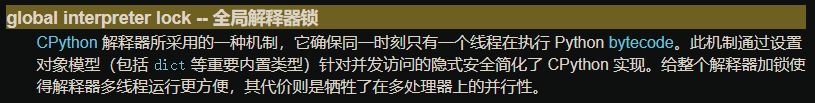

## 前言

面试完，结果只能说我对自己也不算很满意，顺带反思了一下是不是表现得太着急了。

原本以为一个小时足矣，结果面到快12点，才结束完面试，还没出门就碰到泼水一样的暴雨。花了一个多钟头到家，已经是下午1点十几分了。原本打算去公司继续上下午的班，但累到没有一点心情，于是把上午的假延长到下午。

typora 建好文件后就着住房改造家的视频吃了午饭，再看会儿 boss 上的的 jd ，还是劝自己把面试的复盘写完，迟早都是要写的。

## 技术面

开场技术面，自我介绍、关于离职原因一类的问题就略了。我不记得所有问题，所以就单独把还有映像的问题拿出来复盘下。鉴于我技术栈两门语言，面试官 Python 和 Go 的题混合问的，我回忆的顺序大概也对不上实际面试中问的顺序。

## 简答题

### 深浅拷贝

基础题。复盘中自我感觉回答应该没什么遗漏，但沟通中感觉和面试官就 **拷贝** 意指 `a=b` 还是 `a=list(b)` 有点误会，但总之问题不大。

### 哈希冲突、哈希表时间复杂度、哈希表实现、dict是不是哈希表

简单的算法和一点CPython实现细节。

哈希冲突实质是摘要函数输入空间和输出空间不对等，冲突无法避免。

哈希表的时间复杂度是 `O(1)` ，面试官还问了为什么是 `O(1)`，emm，我的回答是直接拿哈希值当索引的情况下空间换时间，最理想的情况一条指令就能取到元素了。回答不太准，问了下谷歌说是最坏O(n)，平均O1。显然最坏的情况就是碰撞了。

哈希表实现的话，当时没敢答。现在想想的话，在 leetcode 做过相关的题，简单的实现比如把ascii码表（或者随便什么序列）映射到一块连续内存上然后就能直接去索引了，复杂的实现问谷歌回答是 Java 的 HashMap 是红黑树实现，Go 的 map 也是哈希表，但实现也不是我说的那种直接映射到一块内存上。总之就是各有不同吧。

`dict` 底层也是哈希表，下次记得问 `map`/`dict` 都回答哈希表就是了。

具体 Go 和 Python 的实现抽时间再找解析看看，不行就硬读源码了。

### 并发和并行

可能是几年前看过，但当时印象不深，太偏理论了，实践中很少能碰到抠这俩字眼的情况。重温下。

并发是 concurrent，并行是 parallel ，有个比较形象的说法是并发是同一时间发生几件事，并行是这几件事同时发生。

放到操作系统原理来解释就是并发可以是单核CPU给两个进程都分了时间片，所以 **看起来** 两者同时执行，但实际上两者还是有先后，或者交错进行的。并行就是多核 CPU **同时**在跑两个进程的代码，两个程序是真的同时处于运行状态。

### GIL

基础题。我当时回答是执行字节码的时候加的锁，确保同时只有一个线程在执行字节码，目的是简化编程，后来因为各种原因就变成了历史遗留，各种去除GIL改成细粒度锁的尝试目前还没有很好的结果。

特地回顾了下python文档，确定了文档的说法和我记忆中是一样的。



但感觉面试官不太满意的样子…为啥呢。

### GMP

基础题。但没背八股，照着映像乱讲一通了。

G就是goroutine，M是操作系统线程，P是处理器。好像也有管P叫管理器。

整个模型就是 M 绑定 P，M 有个 G 队列，然后就是抢占式调度。

要说遗漏的内容的话 emm

- GMP 还有个全局 G 队列
- work stealing：M 在没有任务的时候会抢其他 M 队列里的 G 去调度
- hand off：M 阻塞的时候会释放 P，让其他线程跑。（不太理解）
- P 数量不一定对应物理核心或者逻辑核心数量，可以调。
- M 是 Go runtime 阻塞的时候自动创建新的，有上限。
- M0 和 G0

漏的东西还挺多的。因为面 Python 都忘了要看下 Go 的经典八股。

### GC

基础题。Go的 GC 是从 Mark-Sweep 到三色标记算法（黑白灰），面试中具体的算法内容没提。还提到Go的内存返还机制，但没表达清楚。`MADV_FREE` 的坑也没提。

### 混合写屏障

GC进阶一点的题？面试时没答上来。讲真应该把Go的八股先看看的…

写屏障是一个无STW场景才存在的问题，STW的话就不会在扫描的时候有谁在写了。写屏障是为了解决扫描的时候有人在写对象的问题，避免三色标记错误。

混合写屏障是混合了两种写屏障算法（ Dijkstra 插入屏障和 Yuasa 删除屏障）。

具体的我先放个链接在这里吧=。=

懒得抄一遍。

- [写屏障技术 - Go语言原本](https://golang.design/under-the-hood/zh-cn/part2runtime/ch08gc/barrier/#heading2)
- [Golang 三色标记、混合写屏障GC模式图文全分析](https://www.jianshu.com/p/4c5a303af470)

### InnoDB

数据库题。问题有点宽泛到摸不着头脑，但真要我介绍下 InnoDB 是个啥有啥特性我也真说不上来。

先留个链接等之后再细读。

- [mysql 5.7 innodb introduction](https://dev.mysql.com/doc/refman/5.7/en/innodb-introduction.html)
- 《MySQL技术内幕（InnoDB引擎）》

面试官居然问你们不用MySQL的吗…我…

行吧……

简直是暴击。

### docker隔离原理

基础题吧。

基本原理就是利用内核的 namespace 隔离了 pid、mount、network，chroot 隔离了文件系统，cgroup 控制资源使用。

面试的时候忘记了一个 `UTS` ，就是隔离 hostname ，还有 IPC，还有 USER 。另外就是 cgroup 也是有 namespace 的。

具体可以看 `unshare`，直接 `man unshare` 就行。

## 论述题

### python给函数加超时装饰器

面试的时候回答是`async def` 可以直接用 `future` 实现。普通函数可以用线程，完成后信号量统治下调用方。当时就中途返回的问题拉扯了一下，感觉还是没讲清楚。

```python
import threading
from time import sleep


def timeout(seconds: float):
    def wrapper(f):
        def wrapped(*args, **kwargs):
            # 构造一个 0 信号量
            s = threading.Semaphore(0)

            result = None

            # 包装一下，任务完成时返回结果并发出完成信号
            def _f(sem: threading.Semaphore):
                nonlocal result
                result = f(*args, **kwargs)
                sem.release(1)

            t = threading.Thread(target=lambda: _f(s))
            t.start()
            
            # acquire 会把信号量 -1 ，不满足时等待，这里利用了 acquire 自带的 timeout 参数
            # 如果问到更底层的话比如C/C++甚至汇编，可能要依赖OS功能（信号机制之类的）来唤醒，大概这样。
            if s.acquire(timeout=seconds) is False:
                raise Exception('timeout')
            return result
        return wrapped
    return wrapper


if __name__ == '__main__':
    @timeout(3.0)
    def f(seconds):
        print(seconds)
        sleep(seconds)
        return 'hahaha'

    print(f(1.0))
    print(f(2.0))
    print(f(3.0))
```

这就是我说的信号量解法。但面试官后来又问是不是每个装饰器都要一个信号量，我猜面试官对这个解还不满意。

不使用信号量也能实现，但无论如何这个等待和唤醒要依赖一个异步通知机制，总是没法避免。

分离到另一个线程里执行也是个比较头疼的做法，但面试那儿会想不出更好的主意。

### 三个goroutine循环输出abc

面试的时候下意识回答用`mutex`，但拿纸笔整理了下思路，改成了用`chan`感觉更好。

```go
package main

import "sync"

func main() {
	a, b, c := make(chan struct{}, 1), make(chan struct{}, 1), make(chan struct{}, 1)
	wg := &sync.WaitGroup{}
	wg.Add(3)
	go f("a", a, b, wg)
	go f("b", b, c, wg)
	go f("c", c, a, wg)
	a <- struct{}{}
	wg.Wait()
}

func f(s string, in, out chan struct{}, wg *sync.WaitGroup) {
	defer wg.Done()
	for i := 0; i < 5; i++ {
		_ = <-in
		print(s)
		out <- struct{}{}
	}
}

// abcabcabcabcabc
```

面试官还问到是不是无buffer的 `chan`，我说是1 。当时没想那么多，实际分析代码会发现必须是1，不能是无缓冲的，因为循环末尾`c`会再发信号给`a`，而那时候`a`已经退出了，无缓冲的情况下`c`会阻塞死，会报错 `all goroutines are asleep` 。但1缓冲就不会有这个问题。

### 分布式追踪架构和实现（侵入/非侵入）

这个主要是吹逼。

讲了下分布式追踪基本的架构，也就是从 `Agent` 到 `Collector` 再到存储，然后前端从存储查数据展示，基本数据结构 Span 啦什么的。

面试官还问能不能非侵入，非侵入和侵入有什么区别，这部分就是吹水了。侵入的话自然是什么都能做，把分布式追踪当日志用。非侵入的话就是外面挂 sidecar，代理流量，也能拿到 RPC 调用、HTTP请求之类的数据，举例就是服务网格。当然还有 pprof 也能拿到一些统计数据但那个是时序性的，应该叫 metrics ，和追踪又不太一样。

但后来发现和面试官理解有点偏差，面试官只想不侵入业务代码，但应用代码是可以侵入的，那就好办多了。不管是 sql.driver 还是自定义 logger 都行，很多组件都支持插中间件，这种情况下基本和侵入业务代码差不多了，除了一些更细致的像是统计某个循环跑了多久之类的还需要单独写 span 办不到之外（要是封装个`timeit`之类的也不算侵入的话那就0限制了，想干啥都行）。

### UPV 登录界面几个接口

面试官画了个图问这界面要几个后端接口。


U是用户名，P是密码，V是验证码。

我的回答是2~3个，看验证码刷新要不要单独给个接口。

然后又问你会怎么实现这个登录接口。

emm，感觉题有点怪，想考察思维全面不全面？答了几个点：

- 密码加盐哈希，一般就直接 HMAC
- SESSION_ID 取正确验证码来验证
- 给 ratelimit，验证码刷新和登录尝试都要限
- CSRF Token，可以是直接从服务端返回（服务端渲染）或者Ajax 拿到

现在的话想起来几个新的点

- 用户量很大的话查数据库压力太大，可以加一层缓存，验证密码的时候不访问数据库了
- 错误信息控制，防止爆破用户名
- 响应时间控制，防止 Timing Attack （虽然可能性真的很低，但结合下数据库压力，能让走数据库和不走数据库的请求有明显时间差异的话还是可能爆出用户名的，感觉是非常极端的情况了）
- 前后端分离的情况下前端单独nginx部署肯定是没有后端返回的会话ID或者验证码ID什么的，这种情况下会话标识、CSRF Token 都只能 Ajax 拿。最近PHP看多了感觉思路在往后端渲染跑。前后端分离最少也要2个接口，CSRF、验证码+验证码ID（或者会话ID，总之要把登录请求和验证码联系起来）

## 总结

薄弱点基本确定了。

一个是Go方面，八股背熟真的有用。

另一个是MySQL，一方面是需要切实再深入一下，另外MySQL的八股也得找找。

虽然面完让我有点幻灭的感觉，安全行业不止卷还抠=。=

虽然让我等联系，但估计也没下文了。骑驴找马还得继续。