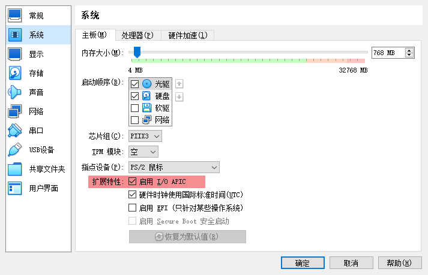

## 前言

为啥要装32位的？如果要问这问题我只能答你猜我乐不乐意装？

工作需要没办法。

## 问题描述

VirtualBox 版本 7.1.0 r158379 。

宿主机 Windows 10.0.18363.1556 x64 。

如果直接创建虚拟机后运行会出现 

````
atkbd_interrupt: 2834 callbacks suppressed
atkbd serio0: Spurious ACK on isa0060/serio0. some program might trying to access hardware directly.
atkbd serio0: Spurious ACK on isa0060/serio0. some program might trying to access hardware directly.
...
````

然后在这个界面卡住。顺便我还注意到键盘的CAPS LOCK、SCROLL LOCK、NUM LOCK 三个灯在疯狂闪烁。

## 解决方法

参考一个别人发给我的可以用的32位虚拟机配置，反复检查和对比实验后发现应该是虚拟机设置中的 `I/O APIC` 影响。



开启 `I/O APIC` 会导致这个奇诡的现象。关闭 `I/O APIC` 后能正常从 CentOS 7.9 i386 的 DVD 镜像进入安装界面，但关闭后只能分配一个 CPU 核心。尝试了调整其他选项，关掉了 USB 控制器、移除了所有网卡、没有串口、没有声卡，基本能关的都关了，只要开着 `I/O APIC` 就会出现这个问题。系统安装前、安装后都不行。顺便一提我也试过 VMWare Workstation Pro 创建虚拟机，问题表现和 VirtualBox 差不多。但不太清楚 VMWare 的 `I/O APIC` 开关在哪儿。

怀疑是内核原因，毕竟就是卡在内核启动过程中。尝试装完后升级内核（升级后版本 `3.10.0-1160.62.1.el7.centos.plus.i686`，升级前 `3.10.0-1160.2.2.el7.centos.plus.i686`）再开启 `I/O APIC` 就没问题啦。

## 总结

遇到此问题可以尝试在创建完虚拟机后关掉 `I/O APIC` ，启动虚拟机安装系统，装完再打开 `I/O APIC`。

