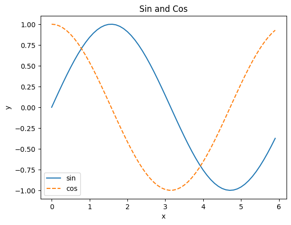
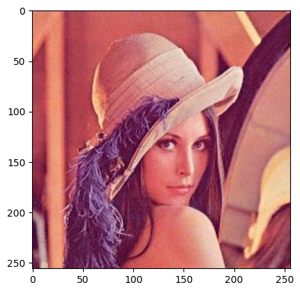

# python 入门

因为我已经工作用 python2/3 几年了，语言部分基本没有阻碍，所以这部分只做了粗读。

## python 版本选择

考虑生态，pytorch 和 tensorflow 目前二进制 whl 包都只针对 python3 提供，python3 目前又处于快速发展中，所以选一个相对新的版本是必须的。

这里我准备先用 python 3.9 。完整架构是 cp39m-win-amd64 。如果书中案例在这个版本跑不起来我尽量改到可以在这个版本跑。

## 依赖库

书中说法是从零开始，依赖仅限 `numpy` 和 `matplotlib` 。姑且听之。

因为没啥二进制包依赖需要走编译流程的，所以就不用 `anaconda` 了。 `anaconda` 真的很重量级，占空间。

## 初始化环境

我把所有练习放在同一个 python 包下面，依赖使用 `pyproject.toml` 管理。

### Linux

```bash
python39 -m venv .venv
source .venv/bin/activate
python -m pip install -U pip
pip install -r requirements.txt
```

### Windows

```powershell
py -3.9 -m venv venv
. .\venv\Scripts\activate.ps1
pip install -r requirements.txt
```

### 检查

```python
import sys
import numpy as np
import matplotlib as mpl

print('Python', sys.version)
print(sys.version_info)
print('numpy', np.__version__)
print('matplotlib', mpl.__version__)
```

    Python 3.11.7 (tags/v3.11.7:fa7a6f2, Dec  4 2023, 19:24:49) [MSC v.1937 64 bit (AMD64)]
    sys.version_info(major=3, minor=11, micro=7, releaselevel='final', serial=0)
    numpy 1.26.2
    matplotlib 3.8.2

## numpy 基本运算

### element-wise 逐元素运算

```python
import numpy as np

# 定义数组
print('数组定义')
arr = np.array([1.0, 2.0, 3.0])
print('numpy.array', arr)

# 多维数组逐元素计算
print('-'*79)
print('多维数组逐元素计算')
x = np.array([1.0, 2.0, 3.0])
y = np.array([2.0, 4.0, 6.0])
# 维度和长度必须相等才能运算
# 对应元素的加减乘除 (element-wise)
print(f'x: shape{x.shape}, x = ', x)
print(f'y: shape{y.shape}, y = ', y)
assert x.shape == y.shape
print('x + y = ', x+y)
print('x - y = ', x-y)
print('x * y = ', x*y)
print('x / y = ', x/y)
# 广播
print('-'*79)
print('广播计算')
print('x * 2 = ', x*2)
print('x / 2 = ', x/2)
```

    数组定义
    numpy.array [1. 2. 3.]
    -------------------------------------------------------------------------------
    多维数组逐元素计算
    x: shape(3,), x =  [1. 2. 3.]
    y: shape(3,), y =  [2. 4. 6.]
    x + y =  [3. 6. 9.]
    x - y =  [-1. -2. -3.]
    x * y =  [ 2.  8. 18.]
    x / y =  [0.5 0.5 0.5]
    -------------------------------------------------------------------------------
    广播计算
    x * 2 =  [2. 4. 6.]
    x / 2 =  [0.5 1.  1.5]

### 矩阵算数

```python
# 多维矩阵
x = np.array([[1, 2], [3, 4]])
print(f'x: {x.shape}, dtype={x.dtype}\n', x)

# 矩阵算数运算
y = np.array([[5, 6], [7, 8]])
print(f'y: {y.shape}, dtype={y.dtype}\n', y)

print('x + y =', x+y)
print('x - y =', x-y)
print('x dot y =',x.dot(y))
```

    x: (2, 2), dtype=int32
     [[1 2]
     [3 4]]
    y: (2, 2), dtype=int32
     [[5 6]
     [7 8]]
    x + y = [[ 6  8]
     [10 12]]
    x - y = [[-4 -4]
     [-4 -4]]
    x dot y = [[19 22]
     [43 50]]

## pyplot 绘图

```python
import numpy as np
import matplotlib.pyplot as plt

x = np.arange(0, 6, 0.1)
y = np.sin(x)
y2 = np.cos(x)

plt.plot(x, y, label='sin')
plt.plot(x, y2, linestyle='--', label='cos')
plt.xlabel('x')
plt.ylabel('y')
plt.title('Sin and Cos')
plt.legend()
plt.show()

image_path = '../dataset/lena.png'
lenna = plt.imread(image_path)
plt.imshow(lenna)
plt.show()
```




