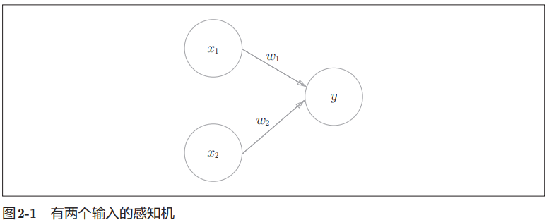
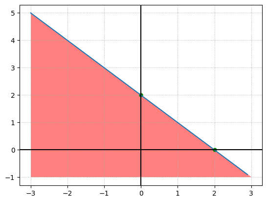
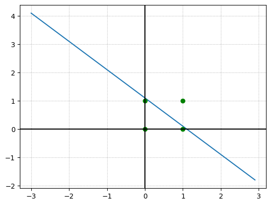
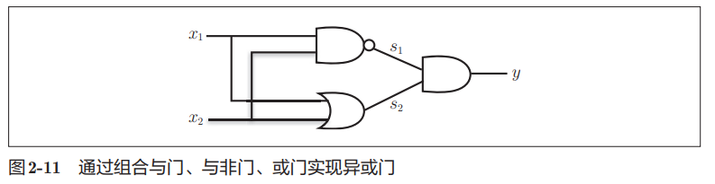

# 感知机

## 感知机原理

> 感知机是一种二分类模型，其核心思想是：给定一个数据集，其中每个数据点都有一个特征向量，我们希望找到一个超平面，将数据分成两类，使得超平面尽可能多地分开两个类别的数据点。
> 
> 感知机的学习目标是找到一个超平面，使得数据点到超平面的距离最大，即找到一个分割超平面，使得正负样本尽可能分开。



书中参考图是一个有两个输入信号 $x_1$ $x_2$ 的感知机。 $w_1$ 和 $w_2$ 是输入信号的权重(`w` 是 `weight` 的首字母)。 图中的大圆称为“神经元”或“节点”。 输入信号传入神经元时，会分别乘以固定的权重($x_{1}w_{1}$,$x_{2}w_{2}$)，神经元会计算传送过来的信号的总和。 只有当这个总和超过了某个界限值时，才会输出 1。这也称为“神经元被激活”。这里将这个界限值称为阈值，用符号 θ 表示。

数学表达如下：

$$
y=\begin{cases}
    0 & (w_1x_1 + w_2x_2 \le \theta) \\
    1 & (w_1x_1 + w_2x_2 \gt \theta)
\end{cases}
$$

感知机的不同输入分别对应各自的权重，权重越大表示信号的重要性越高。

## 简单感知机构造

### 逻辑电路：与门/或门/与非门

以两个输入的感知机为例，我们可以构造逻辑电路与/或/与非门。

三种门逻辑电路对应上图两个输入的感知机模型，假设输入信号取值范围是 0 或 1，实现逻辑门的权重和 $\theta$ 取值表如下。

| gate    | $w_1$ | $w_2$ | $\theta$   |
| ------- | ----- | ----- | ---------- |
| and     | 1.0   | 1.0   | $(1, 2)$   |
| or      | 1.0   | 1.0   | $(0, 1)$   |
| not and | -1.0  | -1.0  | $(-2, -1)$ |

python 实现如下。

```python
import numpy as np


class Perceptron:
    """
    感知机模型
    """

    def __init__(self, weights: np.ndarray):
        self.weights = weights

    def evaluate(self, x: np.ndarray) -> bool:
        return (x*self.weights).sum()


print('与门感知机，权重 [1. 1.] theta 取值区间 (1,2)')
p_and = Perceptron(np.array([1., 1.]))

p_theta = 1.1
x = np.array([0., 0.])
y = p_and.evaluate(x)
print(f'x={x}, theta={p_theta}, result =', y, 'activated ', y > p_theta)
x = np.array([1., 0.])
y = p_and.evaluate(x)
print(f'x={x}, theta={p_theta}, result =', y, 'activated ', y > p_theta)
x = np.array([0., 1.])
y = p_and.evaluate(x)
print(f'x={x}, theta={p_theta}, result =', y, 'activated ', y > p_theta)
x = np.array([1., 1.])
y = p_and.evaluate(x)
print(f'x={x}, theta={p_theta}, result =', y, 'activated ', y > p_theta)
```

    与门感知机，权重 [1. 1.] theta 取值区间 (1,2)
    x=[0. 0.], theta=1.1, result = 0.0 activated  False
    x=[1. 0.], theta=1.1, result = 1.0 activated  False
    x=[0. 1.], theta=1.1, result = 1.0 activated  False
    x=[1. 1.], theta=1.1, result = 2.0 activated  True

## 偏置和 theta

如果说权重表示输入的重要程度，偏置项(bias)就表示神经元被激活的容易程度。按感知机的定义，偏置项越高，则神经元越容易激活。

将偏置项 $b$ 定义为 $-\theta$ 则有下面的感知机模型。

$$
y=\begin{cases}
    0 & (w_1x_1 + w_2x_2 + b \le 0) \\
    1 & (w_1x_1 + w_2x_2 + b \gt 0)
\end{cases}
$$

可以看成 $\theta$ 为$0$的感知机模型，同时增加了一个偏置项。

python 定义如下。

```python
class Perceptron:
    """
    感知机模型
    """

    def __init__(self, weights: np.ndarray, bias: float):
        self.weights = weights
        self.bias = bias

    def evaluate(self, x: np.ndarray) -> bool:
        return np.sum(x*self.weights)+self.bias > 0
```

## 感知机的局限

这里需要一点高中数学知识。

以与门感知机为例，简化起见，权重设为 1，偏置设为-2.0，将权重和偏置代入感知机定义公式。

$$
y=\begin{cases}
    0 & (x_1 + x_2 - 2.0 \le 0) \\
    1 & (x_1 + x_2 - 2.0 \gt 0)
\end{cases}
$$

把不等式方程组画出图像，会发现是一个被 $x_1 + x_2 - 2.0 = 0$ 这条直线分割的两块空间。一块空间表示真值一块表示假。

```python
import numpy as np
import matplotlib.pyplot as plt

x1 = np.arange(-3, 3, 0.1)
x2 = 2.0-x1

plt.plot([0, 2], [2, 0], 'go', markersize=5)
plt.fill([-3, -3, 3, -3], [5, -1, -1, 5], 'red', alpha=0.5)
plt.plot(x1, x2)
plt.axhline(y=0, color='k')
plt.axvline(x=0, color='k')
plt.grid(True, axis='both',linestyle=':')
plt.show()
```



可以直观地看到，当输入的 $x_1$、$x_2$ 构成的点落在图中红色区域内，感知机输出假。反之输出真。

以与门为例。

```python
import numpy as np
import matplotlib.pyplot as plt

x1 = np.arange(-3, 3, 0.1)
x2 = 1.1-x1

plt.plot(x1, x2)
plt.plot(
    np.array([0., 0., 1., 1.]),
    np.array([1., 0., 1., 0.]),
    'go')
plt.axhline(y=0, color='k')
plt.axvline(x=0, color='k')
plt.grid(True, axis='both', linestyle=':')
plt.show()
```



当图中 $1<\theta<2$ 且有 $x_1=1,x_2=1$，蓝色点才会落到白色区域。而直线上的点按我们的感知机定义，会视为假值。

当我们修改偏置值时，这条直线就会上下移动。

- 当 $1<\theta<2$ 时，感知机就变成了与逻辑门，(1,1)被视为真值，(1,0)和(0,1)都被视为假值。
- 当 $0<\theta<1$ 时，则感知机就变成了或逻辑门，(1,0)和(0,1)都被视为真值。
- 当 $-2<\theta< -1$ 时且权值 $w_1=-1,w_2=-1$，图形中红色区域和白色区域反转，(0,0),(0,1),(1,0) 视为真值，直线位置和 $1<\theta<2$ 范围一致。

当需要分类的输入组合是 (0,0),(1,1) 和 (1,0),(0,1) 时，感知机就无法正确分类了。

对于这种情况，可以引入多层感知机。

## 多层感知机

多层感知机就是多个感知机的堆叠。

读过数电应该知道区分 (0,0)(1,1) 和 (1,0)(0,1) 其实就是实现一个异或门，不同时输出 1，相同时输出 0。

而异或门本身可以由或门、与非门和与门组成。



这里用 python 构建出多层感知机。

```python
class Perceptron:
    """
    感知机模型
    """

    def __init__(self, weights: np.ndarray, bias: float):
        self.weights = weights
        self.bias = bias

    def evaluate(self, x: np.ndarray) -> bool:
        return np.sum(x*self.weights)+self.bias > 0


def xor(x1: float, x2: float) -> bool:
    p_nand = Perceptron(np.array([-1.0, -1.0]), 1.5)
    p_or = Perceptron(np.array([1.0, 1.0]), -0.5)
    p_and = Perceptron(np.array([1.0, 1.0]), -1.5)

    s1 = 1.0 if p_nand.evaluate(np.array([x1, x2])) else 0.0
    s2 = 1.0 if p_or.evaluate(np.array([x1, x2])) else 0.0
    return p_and.evaluate(np.array([s1, s2]))


print('xor(0.0, 0.0)=', xor(0.0, 0.0))
print('xor(0.0, 1.0)=', xor(0.0, 1.0))
print('xor(1.0, 0.0)=', xor(1.0, 0.0))
print('xor(1.0, 1.0)=', xor(1.0, 1.0))
```

    xor(0.0, 0.0)= False
    xor(0.0, 1.0)= True
    xor(1.0, 0.0)= True
    xor(1.0, 1.0)= False

## 尾声

读完这一章有几个疑问：

1. 多层感知机能表示表示非线性空间，能给多层感知机画出函数图像吗？长什么样？
2. 如果给两个样本集合，怎么判断这个两个集合能不能被单层感知机分类？
