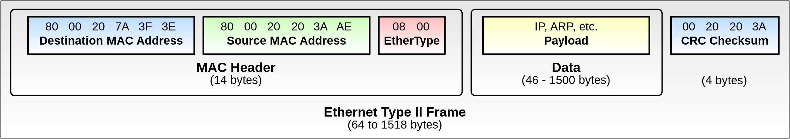

## 前言

目前的工作内容除了后端增删改查外多了一些比较有意思的内容，主要是网络方面。搞了几个月，感觉有学到点东西。就当是整理自己的知识体系，后面准备写一系列笔记，关于 Linux/Windows 网络相关的东西，从运维到开发各方面吧。

## 数据链路层协议

### 一些术语

| 术语 | 解读                                                 |
| ---- | ---------------------------------------------------- |
| MAC  | Media Access Control addressing                      |
| FCS  | Frame Check Sequence (CRC)                           |
| CRC  | Cyclic Redundancy Check                              |
| LPDU | An LLC frame is called LLC Protocol Data Unit (LPDU) |
| DIX  | Digital Equipment Corporation, Intel and Xerox       |

### Ethernet II

区别于 IEEE 802.3 标准集里的以太网协议，Ethernet II 也称 DIX ethernet ，最初由迪吉多（Digital Equipment Corporation）、因特尔（Intel）、和施乐公司（Xerox）为主要参与者制定。和 IEEE 802.3 主要差别在于以太网帧头部的 Ether Type 字段的两个字节如何释义。Ethernet II 解释为 Ether Type，而 IEEE 802.3 解释为 Length 。

另外除了上面同位置字段的释义差别，还有就是在 Ethernet II 格式中 payload 部分的开头，IEEE 802.3 加入了 802.2 LLC 头。

### 802.3 以太网协议

802.3 以太网帧格式比 Ethernet 2 更复杂一点。

帧头部分除 LENGTH/Ether Type 不同，都和 Ethernet II 没区别，主要关注 LLC 和 SNAP 这两部分。

#### 802.2 LLC -  Logical Link Control

802.2 LLC 直译过来就是逻辑链路控制。参考 [Understanding Logic Link Control - Cisco](https://www.cisco.com/c/en/us/support/docs/ibm-technologies/logical-link-control-llc/12247-45.html) 这篇文章。历史上，IBM 最初把 LLC 设计成 IBM 令牌环网络的一个子层。

LLC如前面图中所示分为 `DSAP`（Destination Service Access Point）、`SSAP`（Source Service Access Point）和`CNTL`（Control）三个字段。`DSAP`和`SSAP`表示的是创建消息的网络层实体的逻辑地址，具体每个位怎么定义参考前面的链接。一般承载 IP 报文的 LPDU 里 `DSAP` 和 `SSAP` 都定义为 `0xAA` ，`CNTL` 则定义为 `03` （参考 《TCP/IP 详解卷一：协议》）。

平时不怎么会折腾这个字段，除非很深度玩 L2 设备或协议或者需要解析或者手写 Ethernet 帧的时候可能会需要注意下。目前没这需求，现学现卖即可。

#### 802.2 SNAP - Sub-Network Access Protocol

802.2 SNAP 替代了 Ethernet II 帧格式里的 Ether Type 字段，加了个比较见鬼的 `ORG CODE` ，于是又变成了历史遗留问题。真就觉得自己公司千秋万代了呗。

`ORG CODE` 参考 [RFC 1340 - ASSIGNED NUMBERS](https://www.rfc-editor.org/rfc/rfc1340) 。一般就置 0 。`TYPE` 字段则和 Ethernet II 的 Ether Type 字段取值一样。取值可以参考 [Ether Type - Wikipedia](https://en.wikipedia.org/wiki/EtherType) ，比如 IPv4 是 `0x0800`，ARP 是 `0x0806`，IPv6 是 `0x86DD` 。

#### 802.1Q VLAN协议

802.1Q 协议和 802.3 以太网帧区别在于 Ether Type/Length 和 Source MAC 之间加入了一个 4 字节的 802.1Q Header 。

802.1Q Header 中 TPID (Tag Protocol Identifier)占用原 Ether Type 位置，取值 `0x8100`。正好起到和 Ether Type 一样的作用。

随后的3比特表示 [802.1p class of service](https://en.wikipedia.org/wiki/Class_of_service) ，理解为优先级。下一比特是 Drop Eligible Indicator，表示拥塞时是否允许丢弃包。这4个比特位都用于拥塞控制。

剩下12个比特位表示 VID，或者说 VLAN ID，用于区分 VLAN。

后面的 Ether Type 字段和 Payload 就和 802.3 Ethernet 没什么区别了，可以解析为 Ethernet II 也可以解析为 802.3 Ethernet。

### Hub 集线器

集线器就像是把网线给串联起来，集线器上一台设备发出的以太网帧，所有设备都会收到。

就是这种设备，靠 802.3 CSMA/CD 也能支撑基本的数据链路层通信。

### L2 交换机

L2 交换机是在以太网帧这一层的交换，按照以太网帧头部中的控制字段来决定把帧转发到哪个网口。为了实现这个目的，L2交换机还得能“学习”到每个网口连接的设备 MAC 地址是什么，以便做转发动作。

L2 交换机和路由器的最大区别在于交换机是根据 MAC 地址做的转发，计算机在以 IP 协议访问局域网设备时，会通过 ARP 协议获取目的 MAC 地址，然后直接构造以太网帧发送。交换机可以直接把以太网帧送给对应的设备而无需经过路由器解析 IP 报文再封包以太网帧。可以说交换机性能决定了局域网传输的速度。

这篇文章介绍了交换机是怎么学习 MAC 地址的 [How Switch learns the MAC addresses Explained](https://www.computernetworkingnotes.com/ccna-study-guide/how-switch-learns-the-mac-addresses-explained.html) 。

有些高级点的交换机还支持 VLAN 虚拟局域网，允许把交换机上几十个口再划分成更小的局域网以实现网络隔离。同时 VLAN 技术也让一张网卡一条网线接入多个局域网成为可能。

## 总结

一千来个字憋一两周，这工作要命，没时间看书没时间学习。