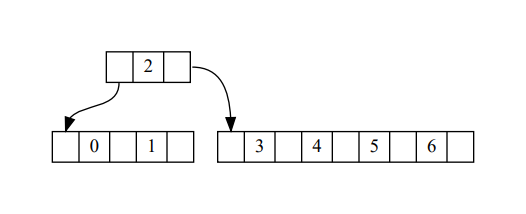
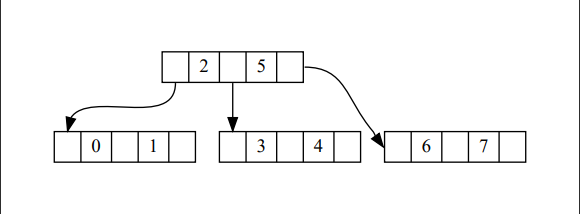

## 前言

B树和B树的变体（B+树）因为对磁盘IO/缓存友好的原因，常被用做数据库索引和文件系统的数据结构。

这篇博客主要是写一下B树如何插入和搜索，节点分裂机制以及如何自平衡。

## 节点结构

B树和一般的二叉搜索树在节点结构上有很大区别。B树是一种多路搜索树，B树的节点可以有多个后继节点，一个节点会保存多个键。单个节点最多保存M个键的B树称作M阶B树。

一个简单的 B 树节点结构如下。

```python
class BTreeNode:
    parent: 'BTreeNode'
    entries: List[int]
    children: List['BTreeNode']
```

B树要求除根节点外，每个节点最少包含`M/2`个元素，非叶子节点的 `children` 数量是 `len(entries)+1`。根节点不要求最少元素数量，其他约束不变。

## 插入节点

B树要求新的键只能在叶子节点上插入。如果叶子节点的键数量超过了上限`M`，则叶子节点执行 **分裂** 操作，将键分成三部分：中位数，小于中位数的部分，大于中位数的部分。

```python
# 分裂前
[1,2,3,4,5]
# 分裂后
[1,2],3,[4,5]
```

中位数插入父节点，小于中位数的部分或大于中位数的部分创建新的子节点，插入父级节点。以插入元素 1-7 为例，图示如下。





对于中位数在 `entries` 中间的情况不会更麻烦，只要记住新节点保存的都是大于中位数的部分，在`entries`插入键之后，找到对应的`children`下标插入即可。

```python
def add_child(self, entry, child):
    """非叶子节点添加新元素

        Args:
            entry (int): 新元素
            child (BTreeNode): 分裂出的新孩子
    """
    # 遍历寻找比新 entry 更大的元素，如果不存在，则新 entry 添加到最后
    for i, v in enumerate(self.entries):
        if v > entry:
            self.children.insert(i+1, child)
            self.entries.insert(i, entry)
            self.grow()
            return

        self.entries.append(entry)
        self.children.append(child)
        self.grow()
```

完整代码会在文末给出。

## 自平衡

B树是一种自平衡树，B树做到自平衡的方式比较特别。下面的内容都是我个人对B树的理解，偏见警告。

一般的二叉搜索树插入元素时，会把元素插入到叶子节点上，叶子节点就变成了中间节点，子树会随着插入的元素增长而变高，于是在子树之间出现不平衡。也就是说，一般的二叉搜索树生长方向是向下，往叶子方向扩展。

但B树正好相反：叶子节点不会变成中间节点，只会分裂兄弟节点，向父级节点插入键。而父级节点也会因为键超过`M`而分裂，一直到根节点。根节点分裂则会产生新的根，原来的根变成两个兄弟节点，树的高度随之上升。也就是说，B树的生长高度是向上的，插入操作对树高度的影响最终体现为根节点的分裂。

删除节点的规则也设计为保持这一特性，删除键对树高度的影响最终会体现为根节点和子节点合并，使得树高度降低。

## 搜索

B树的搜索和二叉搜索树差不多，不同的是节点会表示多个键，所以二叉搜索树中的比较操作会变成在多个键里查找值，并在中间节点没找到的时候递归搜索子节点。

```python
    def search(self, entry) -> bool:
        for i, v in enumerate(self.entries):
            if v == entry:
                return True
            # 如果没找到，而且当前元素比搜索值要大了
            # 就从小于当前元素的子节点里递归搜索
            if len(self.children) > 0 and v > entry:
                return self.children[i].search(entry)
        # 没有比搜索的键大的值，则从末尾的子节点（大于本节点全部键）递归搜索
        if len(self.children) > 0:
            return self.children[-1].search(entry)
        return False
```

## 分裂和需要注意的问题

分裂节点写起来很简单，比 AVL 旋转要好懂很多。

```python
    def grow(self):
        # 检查和处理分裂
        # B-Tree 的增长方向是横向+纵向，横向是扩展兄弟节点，纵向是往根节点方向生长
        if len(self.entries) > MAXIMUM_ENTRIES:
            middle = self.entries[MIDDLE_ENTRY_IDX]
            split_entries = self.entries[MIDDLE_ENTRY_IDX+1:]
            split_children = self.children[MIDDLE_CHILD_IDX:]

            self.entries = self.entries[:MIDDLE_ENTRY_IDX]
            self.children = self.children[:MIDDLE_CHILD_IDX]

            split_node = BTreeNode(self.parent)
            split_node.entries = split_entries
            split_node.children = split_children
            for child in split_children:
                child.parent = split_node

            # 中间节点分裂的情况
            if self.parent is not None:
                self.parent.add_child(middle, split_node)
                return

            # 根节点分裂，生成新的根节点
            self.parent = BTreeNode(None)
            split_node.parent = self.parent
            self.parent.children = [self, split_node]
            self.parent.entries = [middle]
```

主要注意：

1. 选择合适的中位数。如果`M`是奇数，`M+1`除二没有余数，也选不出中位数。
2. 新节点（`split_node`和`split_children`）都需要重新调整`parent`属性，不要漏了。
3. 中间节点的分裂要向上添加一个`entry`和`child`，分别表示键和大于这个键的节点。
   1. 这是个递归过程，上级节点也可能发生分裂，一直到根分裂。
   2. 这个过程会保留原节点（`self`），可以理解为`children`的下标`i`表示`children[i]`这棵子树所有键小于`entries[i]`。`children[-1]`没有对应的`entries`下标，表示的是大于节点所有键的子树，相当于是二叉搜索树中的右子树。
4. 根节点分裂会导致树的根发生改变，完成插入操作后需要重新确定根节点指针，不然会导致搜索出错或再次分裂的时候往错误的节点添加键，破坏搜索树的性质。

## B树性能

B树的性能优势来自树的高度增长相对比较慢，选择合适的阶可以减少磁盘IO次数。另外就是一个节点包含多个键，提高键的储存密度，更符合局部性原理，相对于二叉搜索树来说对CPU缓存也更较友好。

对这个场景我能想到的几个关键因素主要有：

- 内存缓存。尽可能榨干可用的内存，避免频繁进行磁盘IO。
- 局部性原理。

其中局部性原理又分几项。

一个是内存的分页机制，在内存紧张的情况下如果节点集合大小不是一页的整数倍的话，会产生更多的缺页异常，造成更频繁地读盘（考虑使用了交换分区或 windows 页文件，又或者 `mmap` 等方式读取）。

另一个是CPU的高速缓存，如果结构填不满或者超出cache line 大小的话都会有影响。

当然，最后还是具体问题具体分析。给这篇博客找资料的时候看到的这篇文章很不错 [gallery of processor cache effects](http://igoro.com/archive/gallery-of-processor-cache-effects/)，挺喜欢的。

## 总结

b树是多路搜索树。

b树插入节点总是在叶子，b树向根方向生长。

b树通过节点分裂和合并实现自平衡。

b树搜索和一般的二叉搜索树差别不大。

以及b树性能优势来自树更矮，节点更少，键更集中，符合局部性原理，减少磁盘io次数，合适的阶让结构对缓存更友好。