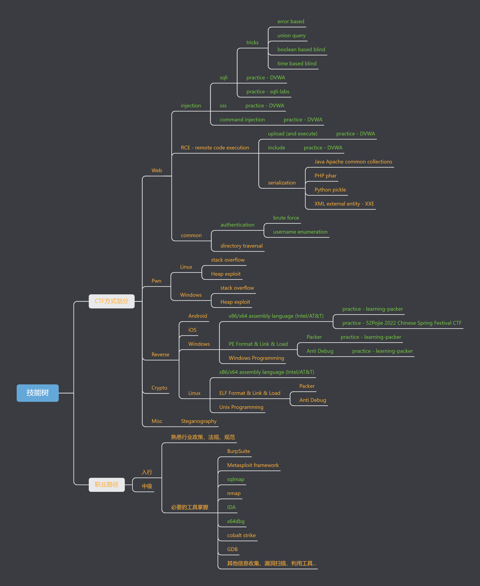
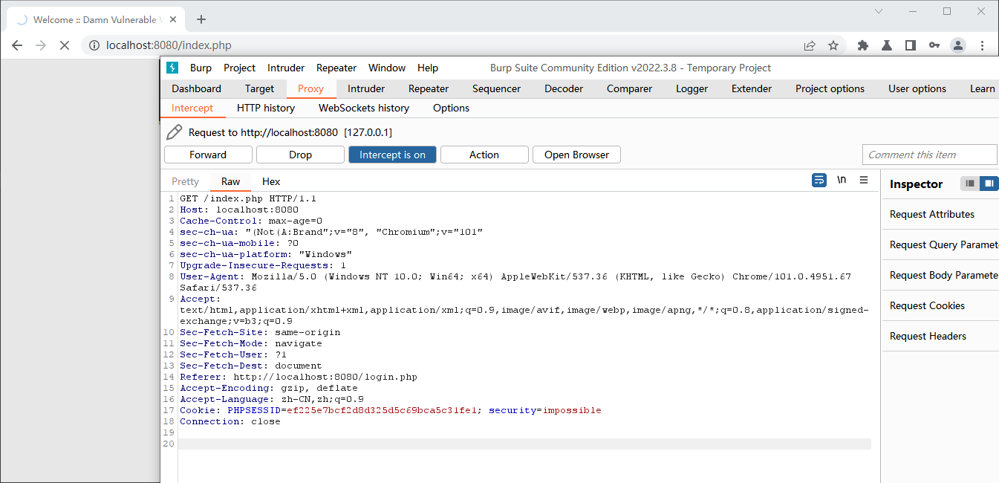
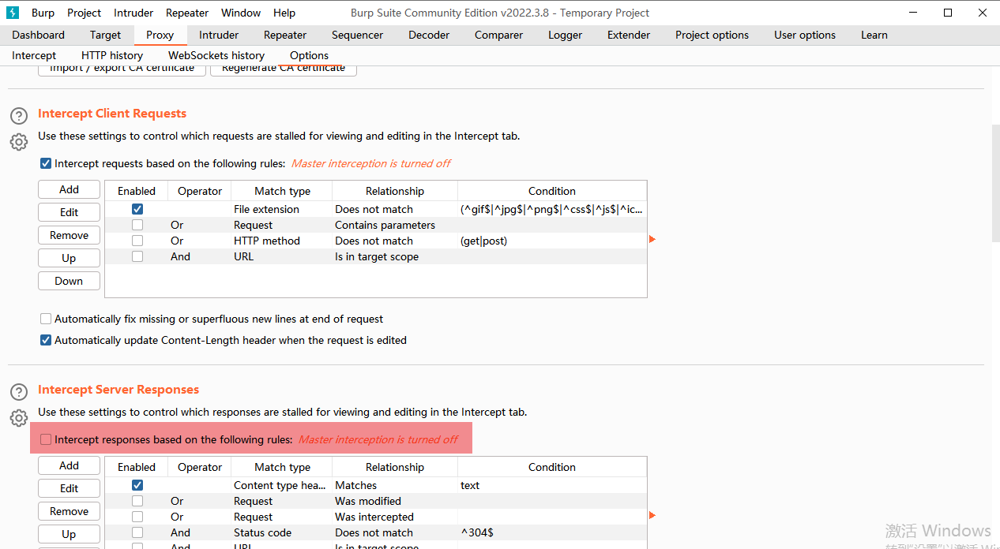
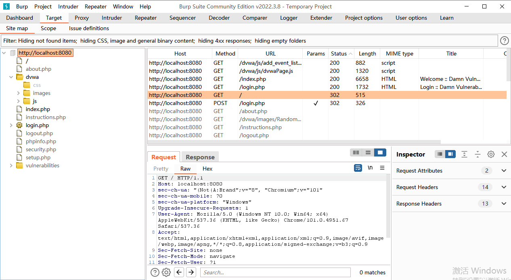
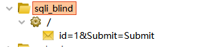
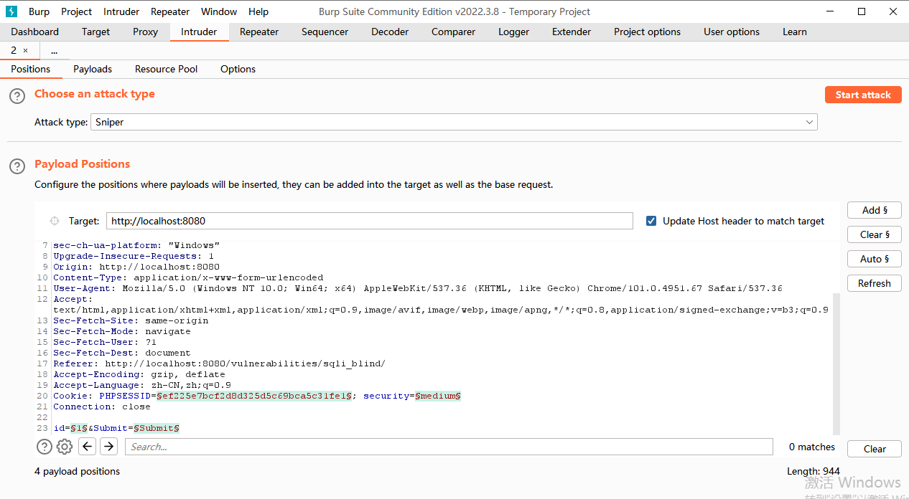
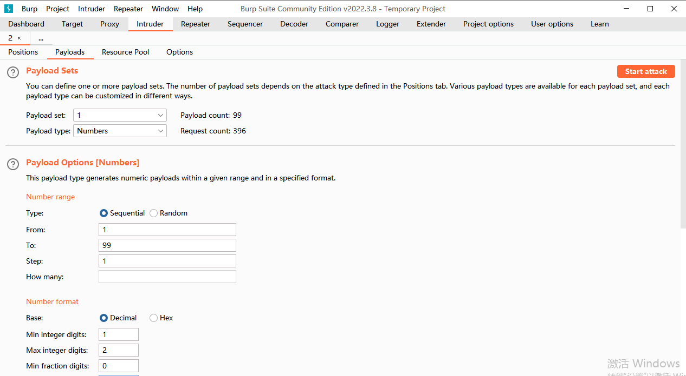
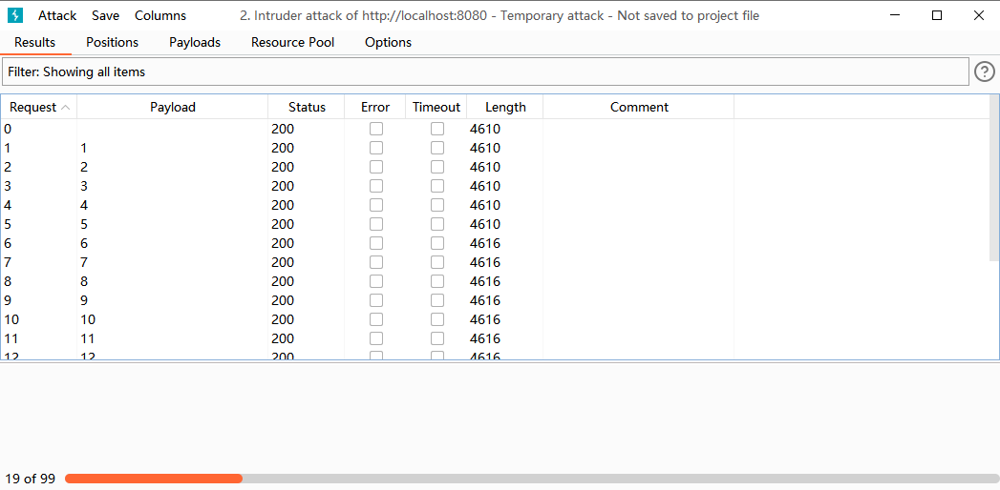
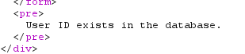
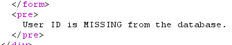

## 前言

因为一些不可抗力因素，不得不提前准备换工作事宜了。

早上尝试投了两家安全方向的企业，但目前还没有好消息传来。于是根据招聘App上看到各个企业招渗透测试给出的技术栈要求，决定下一步是对技术外的两个方面初步挖掘下。

一是工具掌握上，不知道是HR懒喜欢从别人公司的招聘要求上复制还是技术负责人确实在乎，反正大部分要求上都写要熟悉 BurpSuite、MSF 之类的玩意儿。这方面确实有欠缺，工具到现在还只在靶场用过 sqlmap，所以接下来计划熟悉下 BurpSuite 和 MSF，也看看 Kali Linux 这个常常和 script kid 联系起来的发行版有啥东西可以玩玩看。

二是行业内的法律规范和工作流程、测试报告写法之类的内容。目前看起来做乙方的公司对合规性还是普遍比较重视的。

## 技能树

目前这个技能树做得很粗糙，基本是靠映像捋了下。绿色是有针对性学过或者实践过，标成绿色的技能水平其实并不太一样。黄色是没有针对性学过的，但同样不代表完全不了解，比如 `gdb` 是写c/c++的老朋友了=。=但我从没有在 pwn 或者逆向之类的场景里用过 `gdb` ，所以还是标黄。`nmap`也用过，扫自己的路由器还有找不到树莓派的IP的时候扫网段什么的，但也没拿 `nmap` 做过渗透前信息收集之类的事情。

技能集中在 Web 领域，大概是入门的水平，反序列化漏洞还没有系统学过算是个知识漏洞。逆向领域因为之前研究加壳脱壳的缘故，也算是有入门的水准吧。正经 CTF 可能不太行，但52破解的 2022 新年 CTF 还是把中级题做出来了的（但正好那几天没时间，实际上只提交了初级题的flag，中级题做出来的时候已经连题解都有了）。

另外一个实际缺陷是没有真正重现和分析 CVE/CNVD 的经验，靶场练习有点纸上谈兵的意思。

大概就是这样，接着开始说 BurpSuite。

## BurpSuite

### 总览

BurpSuite 是个 Portswigger 出品的渗透测试工具。我直接说我的看法，BurpSuite 其实是一个中间人，类似 mitmporxy 或者 fiddler 的中间人代理工具，但集成了很多渗透测试领域实用的功能。但本体上给我的初步映像是这就是个 proxy。

### 功能

信息收集一类的工作有下面几个模块

- Burp Target 搜集站点信息如站点地图等
- Burp Spider 顾名思义爬虫，更深一步了解全站
- Burp Scanner 漏洞扫描工具

执行攻击，比如枚举用户名之类的工作

- Burp Intruder 尝试在不同位置带 payload 发起攻击
- Burp Repeater 请求重放
- Burp Sequencer 数据样本随机性质量检测，或者说随机数分析，找规律的工具

以及一些其他工具

- Burp Decoder
- Burp Comparer

顾名思义了。

### 实验

#### interceptor

一个简单的实验，用 BurpSuite 完成 DVWA 盲注。试用上面这些模块。

首先是 proxy 模块里的 interceptor 功能，顾名思义，拦截 HTTP 请求，可以在 burpsuite 里编辑请求和响应，选择转发还是丢弃。

需要注意响应拦截器默认不是开启状态。

#### sitemap

通过 proxy 随便拦一个请求下来之后就可以在 Target 里看到目标域名的站点地图了。

侧边栏里大部分结果应该是从网页里爬出来的链接，并不是实际执行了请求。我们打开盲注题随便请求一次后，burpsuite里就记录下了相关的信息。

这个齿轮图标表示能接收参数（可配置？）。邮件图标表示是 POST 方法。

#### intruder

在齿轮或者右键图标这一行记录上右键，发送到 intruder ，然后就可以在 intruder 里配置扫描方式了。

attack type 是怎么组织攻击 payload，比如 sniper 类型会把 payload 按顺序放到 payload positions 里定义的位置；再比如 batteies ram 会迭代 payload ，把同一个 payload 放到所有位置上。

在 payloads tab 页里可以配置 payload 类型什么的。

这里我打算测一下有多少id可用，所以改成了 numbers 类型，范围1~99，约束格式为10进制数，无小数，1~2位。接着 start attack 看看 BurpSuite 会怎么做。

注意到长度在 0~5 都是 4610，后续都是4616。点击其中的条目可以看到具体的请求和响应数据。一个特例是请求0发送的id=1，此时是payload position里定义的位置原始的参数。之后请求1开始就是intruder生成的了。

显然 intruder 还可以有很多玩法，比如自己指定一个 payload 集合去跑。intruder 也内置了 brute force 之类的 payload 集合，可以省点写脚本的时间。

## 总结

有点突兀是吧？暂且先写到这里。本来想看看 BurpSuite 的 scan 模块，但不清楚是 temporary project 的原因还是 community edition 就不支持，反正 new scan 这个按钮是灰的。

投了两家安全方向的厂商没什么结果，现在突如其来一堆事情搞得烦不胜烦。马原的网课才看了四分之三，找工作开始两天一个面试邀约也没有，身体上又有新毛病，膝盖疼起来了.....都不知道是不是有痛风的因素，就连脑子这两天都有点昏昏沉沉的。

博客虽然想保持高频率更新，但抵不过真的很烦心。除了叹气都不知道还有什么可说的。这么短一篇博客还写了两天。

记得刚面这家公司的时候就提过，不想再一年一跳了，能忍则忍，怎么就混成现在这样子了，才两年而已。越是想，越是从生气变成沮丧。难道真的是我不配。

就先这样吧，收拾收拾。先保持骑驴找马的状态。
