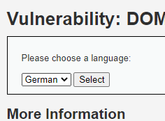
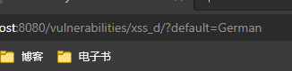
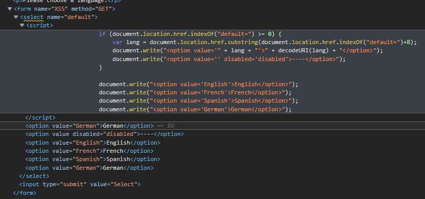
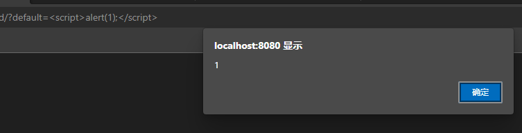
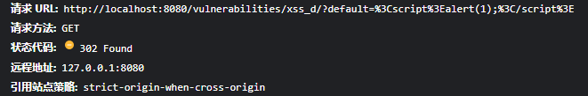
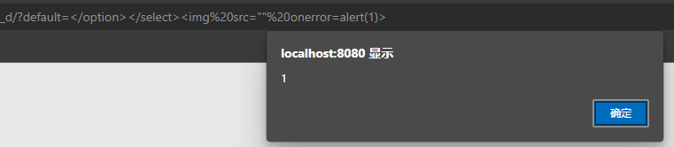
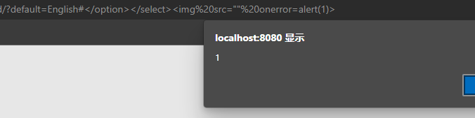
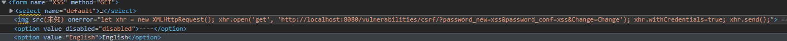
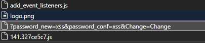
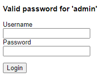

## 前言

终于做到了XSS题。先尝试把DOM型XSS做完。

## 原理

用JavaScript操作dom的时候没对用户数据做好过滤，导致将用户数据当HTML/JS解释执行。

## 解题

### Low难度：收集信息







所有值得关注的东西就是这些。

目标是获取用户的 Cookie。这里就尝试发起一个 CSRF攻击。

### Low难度：解题

两个写入DOM的地方，一个是 `+ lang +`，一个是 `decodeURI(lang)`。`decodeURI`更好操作一些，尝试注入一个合法标签，直接写`<script>alert(1);</script>`。



注入成功。

### Medium难度：解题

惊了，看起来js没变化。

```js
if (document.location.href.indexOf("default=") >= 0) {
    var lang = document.location.href.substring(document.location.href.indexOf("default=")+8);
    document.write("<option value='" + lang + "'>" + decodeURI(lang) + "</option>");
    document.write("<option value='' disabled='disabled'>----</option>");
}

document.write("<option value='English'>English</option>");
document.write("<option value='French'>French</option>");
document.write("<option value='Spanish'>Spanish</option>");
document.write("<option value='German'>German</option>");
```

尝试用Low难度的payload，发现被跳转：



大概是做了过滤，虽然有网上随便找的一堆 xss payload 但不想无脑试过去。看一眼源码。

```php

<?php

// Is there any input?
if ( array_key_exists( "default", $_GET ) && !is_null ($_GET[ 'default' ]) ) {
    $default = $_GET['default'];
    
    # Do not allow script tags
    if (stripos ($default, "<script") !== false) {
        header ("location: ?default=English");
        exit;
    }
}

?>
```

一个很鸡的过滤，`stripos`忽略大小写所以大小写 bypass 不行，一次 URI 编码也不行。考虑不用 `script` 标签，直接把 `option`和`select` 标签闭合了，然后插一个别的标签比如`img`。

payload就改成这样。

```html
</option></select>
```



也暴力解开了。

### High难度：解题

还是直接试一次刚才的payload，果不其然302了。看看代码。

```php
<?php

// Is there any input?
if ( array_key_exists( "default", $_GET ) && !is_null ($_GET[ 'default' ]) ) {

    # White list the allowable languages
    switch ($_GET['default']) {
        case "French":
        case "English":
        case "German":
        case "Spanish":
            # ok
            break;
        default:
            header ("location: ?default=English");
            exit;
    }
}

?>
```

白名单？这我有点不懂了。想一想先。

想 bypass 显然不能等进入 `switch`，只能在 `if` 这里就直接过，所以问题就是`array_key_exists`和`is_null`这两个函数能不能 bypass 。

没什么用的分析略，行不通。

不过还是有办法，可以用 URL 里的 Fragment。（url里的`#fragment`部分）。因为JS代码里是这么写的：

```js
var lang = document.location.href.substring(document.location.href.indexOf("default=")+8);
```

直接从`href`里取`substring`，偏移值是`href.indexOf`获得，并没有考虑是从 QueryString 还是 Fragment 取值。所以完全可以把原先的payload加上一个`#`解决问题。



好吧，我承认看了下帮助，差点钻了php的牛角尖，去硬找方法 bypass 服务端的检查。

### CSRF：解题

主要是解决 Cookies 默认 `samesite: lax` 导致的 xhr 行不通的问题。

把 payload 改成下面这样。

```html
</option></select>
```





然后验证下修改的密码`xss`是否有效。



相应的，提高到 Medium 和 High 难度其实也没有难度了。

Medium难度的 CSRF 只检查了 Host，XSS 方式发起的 CSRF 攻击无法通过检查同源和`Host`来解决。但严格检查 `Referer` 的话还是有可能发现的。

High 难度的 CSRF 添加了 `csrf_token`，但是 XSS 方式发起攻击完全可以 xhr 请求到表单页面的 HTML，也就可以拿到 token，`csrf_token` 无法防御。

## 总结

这个 XSS 题花样还是有点少，我还是挺期待能把大佬玩出花的 XSS payload 都学一学在什么场景玩，什么原因研发出来的。

将来有机会应该会找找有没有比较好玩的 XSS 靶场练练手。