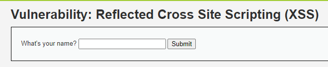
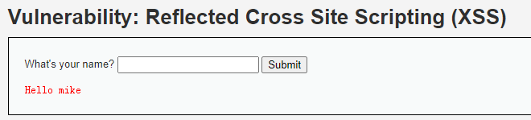
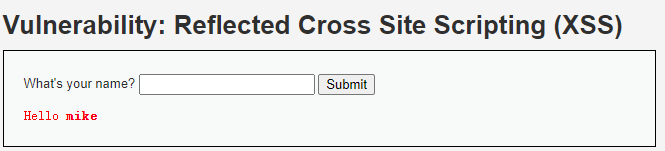
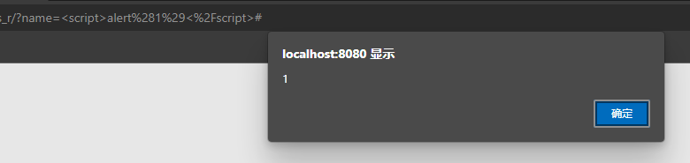
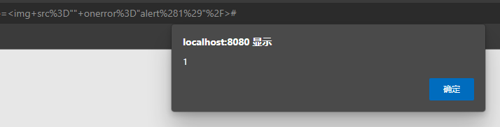
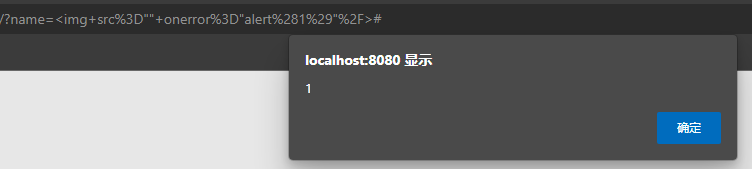

## 前言

比较简单，快速过。

## 原理

服务端把用户提交的内容没有做好过滤就渲染到了网页上。只有后端渲染才存在这个问题，前后端分离前端渲染的情况都是 DOM XSS。

## 解题

### 收集信息





尝试注入一个`<b>mike</b>`。



好，直接开干。

### Low难度

直接插一个 `script` 就完了。`<script>alert(1)</script>`



### Medium难度

尝试`<b>mike</b>`没有过滤，再试``



已经成功了，再看下代码。

```php
<?php

header ("X-XSS-Protection: 0");

// Is there any input?
if( array_key_exists( "name", $_GET ) && $_GET[ 'name' ] != NULL ) {
    // Get input
    $name = str_replace( '<script>', '', $_GET[ 'name' ] );

    // Feedback for end user
    echo "<pre>Hello ${name}</pre>";
}

?>
```

这个情况bypass的方法很多，大小写或者加个空格、多插一个`<script>`让服务端替换，都可以。

### High难度

试了下`<b>mike</b>`依然过了，再试一次``。



又直接过了，行吧...感觉有点无聊了。再看下代码里怎么防的。

```php
<?php

header ("X-XSS-Protection: 0");

// Is there any input?
if( array_key_exists( "name", $_GET ) && $_GET[ 'name' ] != NULL ) {
    // Get input
    $name = preg_replace( '/<(.*)s(.*)c(.*)r(.*)i(.*)p(.*)t/i', '', $_GET[ 'name' ] );

    // Feedback for end user
    echo "<pre>Hello ${name}</pre>";
}

?>
```

这正则就有点离谱了=。= 如何构造一个能被这个正则替换过之后还有效的东西呢。然后就想到了转义。

`<&#x73&#x63&#x72&#x69&#x70&#x74>alert(1)</&#x73&#x63&#x72&#x69&#x70&#x74>`

但是不行。想了想没有什么太好的办法，毕竟只要顺序出现`<script`这些字符就会被淦，而且是整个被淦，在tag中间加tag的办法也行不通。最后想想还是对啊，干嘛非揪着 `script` 不放。不用`<script`还是有大把的 payload 可以用。

想想这个过滤还是挺离谱的，目前见过的XSS过滤方法基本都是替换掉了 `<>()` 这些字符，反正构造不出函数调用和HTML标签。

## 总结

找个更好玩的 XSS 靶场的念头开始增强了。不过多少还有点担心 XSS 漏洞未来会不会退出主流（好像现在就有点退出主流的意思了），学了能不能涨点身价什么的...想太多。

没有特别好总结的，利用`script`或者别的标签执行 js 就完了。

