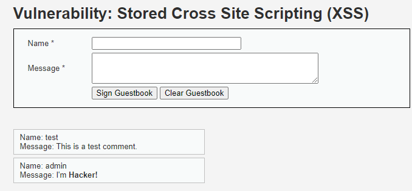
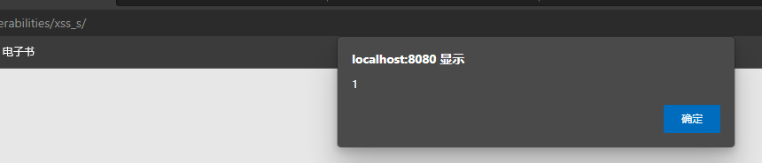
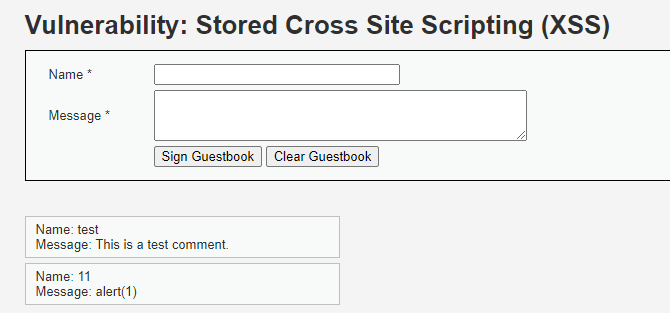
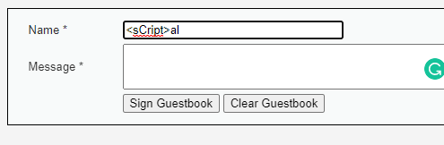
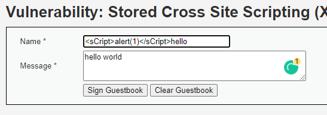
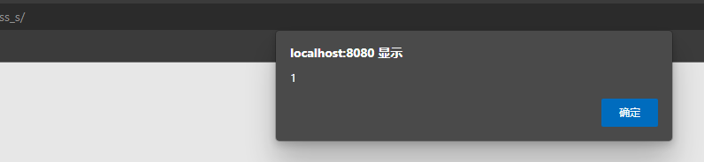
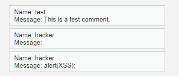

## 前言

还是很简单。

## 原理

没过滤就保存到了数据库里，渲染的时候也没做好过滤。

## 解题

### 收集信息



留言板，而且试了下没过滤 `<b>`，所以基本和反射型没什么区别，大概。

### Low难度

直接插入一个`<script>alert(1)</script>`。



### Medium难度

重置下数据库，再试试直接注入`<script>alert(1)</script>`。



发现标签没了。看下源码。

```php
<?php

if( isset( $_POST[ 'btnSign' ] ) ) {
    // Get input
    $message = trim( $_POST[ 'mtxMessage' ] );
    $name    = trim( $_POST[ 'txtName' ] );

    // Sanitize message input
    $message = strip_tags( addslashes( $message ) );
    $message = ((isset($GLOBALS["___mysqli_ston"]) && is_object($GLOBALS["___mysqli_ston"])) ? mysqli_real_escape_string($GLOBALS["___mysqli_ston"],  $message ) : ((trigger_error("[MySQLConverterToo] Fix the mysql_escape_string() call! This code does not work.", E_USER_ERROR)) ? "" : ""));
    $message = htmlspecialchars( $message );

    // Sanitize name input
    $name = str_replace( '<script>', '', $name );
    $name = ((isset($GLOBALS["___mysqli_ston"]) && is_object($GLOBALS["___mysqli_ston"])) ? mysqli_real_escape_string($GLOBALS["___mysqli_ston"],  $name ) : ((trigger_error("[MySQLConverterToo] Fix the mysql_escape_string() call! This code does not work.", E_USER_ERROR)) ? "" : ""));

    // Update database
    $query  = "INSERT INTO guestbook ( comment, name ) VALUES ( '$message', '$name' );";
    $result = mysqli_query($GLOBALS["___mysqli_ston"],  $query ) or die( '<pre>' . ((is_object($GLOBALS["___mysqli_ston"])) ? mysqli_error($GLOBALS["___mysqli_ston"]) : (($___mysqli_res = mysqli_connect_error()) ? $___mysqli_res : false)) . '</pre>' );

    //mysql_close();
}

?>
```

注意`sanitize message input`和`sanitize name input`，使用了两种不同的方法替换掉`script`标签。一个是`strip_tags`一个是`str_replace`。显然`str_replace`是更弱的方法，我们先过掉`str_replace`。payload 只需要改一下大小写：`<sCript>alert(1)</sCript>`。



但是尴尬地发现这个 `input` 标签限制了长度，直接改 HTML 解决。





好的，成功过了一个。重置数据库后再尝试 bypass 掉 `strip_tags`。

函数文档提到：

> Self-closing XHTML tags are ignored and only non-self-closing tags should be used in `allowed_tags`. 

而且

> **Warning**
>
> This function should not be used to try to prevent XSS attacks. Use more appropriate functions like [htmlspecialchars()](https://www.php.net/manual/en/function.htmlspecialchars.php) or other means depending on the context of the output.

所以可以肯定 `strip_tags` 是挡不住 XSS 的。文档提到会忽略 `self-closing XHTML tags`，所以用 `img` 标签试一下。payload改成：``


失败。直接谷歌一下怎么 bypass `strip_tags`。[这个链接](https://stackoverflow.com/questions/5788527/is-strip-tags-vulnerable-to-scripting-attacks)解释了`strip_tags`的实现为什么不能防御 XSS ，另一个回答提供了一个 payload：`<<a>script>alert(XSS);<</a>/script>`。直接试一试。



好的，证明并不靠谱。注意到php代码里还做了`addslashes`，保护比较好了，干脆放弃。继续做 High 难度。

### High难度

看代码。

```php
<?php

if( isset( $_POST[ 'btnSign' ] ) ) {
    // Get input
    $message = trim( $_POST[ 'mtxMessage' ] );
    $name    = trim( $_POST[ 'txtName' ] );

    // Sanitize message input
    $message = strip_tags( addslashes( $message ) );
    $message = ((isset($GLOBALS["___mysqli_ston"]) && is_object($GLOBALS["___mysqli_ston"])) ? mysqli_real_escape_string($GLOBALS["___mysqli_ston"],  $message ) : ((trigger_error("[MySQLConverterToo] Fix the mysql_escape_string() call! This code does not work.", E_USER_ERROR)) ? "" : ""));
    $message = htmlspecialchars( $message );

    // Sanitize name input
    $name = preg_replace( '/<(.*)s(.*)c(.*)r(.*)i(.*)p(.*)t/i', '', $name );
    $name = ((isset($GLOBALS["___mysqli_ston"]) && is_object($GLOBALS["___mysqli_ston"])) ? mysqli_real_escape_string($GLOBALS["___mysqli_ston"],  $name ) : ((trigger_error("[MySQLConverterToo] Fix the mysql_escape_string() call! This code does not work.", E_USER_ERROR)) ? "" : ""));

    // Update database
    $query  = "INSERT INTO guestbook ( comment, name ) VALUES ( '$message', '$name' );";
    $result = mysqli_query($GLOBALS["___mysqli_ston"],  $query ) or die( '<pre>' . ((is_object($GLOBALS["___mysqli_ston"])) ? mysqli_error($GLOBALS["___mysqli_ston"]) : (($___mysqli_res = mysqli_connect_error()) ? $___mysqli_res : false)) . '</pre>' );

    //mysql_close();
}

?>
```

老样子，直接用`img`的payload就可以过，不多写了。

### strip_tags

现在回头研究下 `strip_tags` 这个函数要怎么 bypass 。首先链接里的问题是11年前提出（大约是2011年）的，提问时的PHP版本是 5.3（见提问者给的链接），所以在 5.x 版本可能 `strip_tags` 确实会被 `<<a>script>alert(XSS);<</a>/script>` 给绕过。但我的DVWA配的环境是 PHP 7 + MySQL 5.7，所以这个问答里给出的 payload 可能是 PHP 7 已经修复了故而没用。

从 Teh playground 测试的结果看新实现可能是栈方式了，就是`<`计数+1，后面的全都删掉。因为`<`一定被x，最多只能留下`>`，想在 `strip_tags` 里留下标签大概是做不到了。

看下帮助手册，也是提到用`name`字段而不是`message`字段。现在是没辙了。

## 总结

最大的困难是`strip_tags`，这要放比赛里我就是个寄吧。

好了不说自己了。XSS三个板块感觉没有多少变化，一个`img`的payload就能通杀，感觉有点鸡了，缺乏实感，游戏体验略差。

暂时就这样吧。