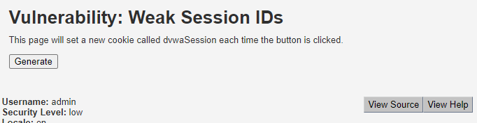
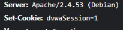
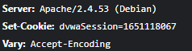
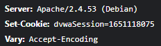
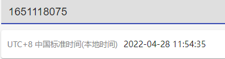
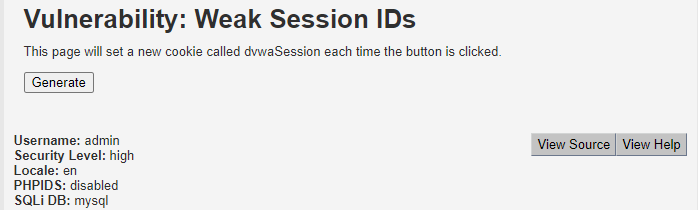
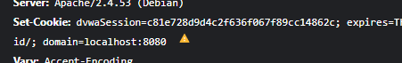

## 前言

感觉是比较鸡的问题，快速过一下。

## 原理

会话ID规律太明显导致被伪造。比如说直接把会话ID设置成数字的，那就有可能被枚举出别的用户的会话了。

## 解题

### Low难度

再点一次出现`2`。这就没啥好解的了。

### Medium难度

递增，这个数字模式看起来有点像 Unix 时间戳：

- 位数不长不短
- 16 开头
- 两个id递增的间隔和我映像里操作的时间比较接近

有了怀疑就看一看，转成时间戳后证明了我的猜测。

剩下就是枚举出可能的用户ID了。枚举的技巧就是从接近现在的时间往回找，离得越远越不可能。区间也可以限制在比较小的范围比如一周或者一个月。

### High难度

点击generate之后拿到一个`Set-Cookie`，观察`dvwaSession`内容怀疑是某种哈希，直接贴cmd5后发现是数字`2`。再点击一次后得到数字`3`。

所以规律就是`1,2,3,4,5...`这样的序列了，可以通过`md5('1')`这样的方式伪造出用户ID为1的用户的会话。

## 总结

我觉得应该没人干这种蠢事了。不过确实还是有人用随机数或者随机字节当会话ID的，用的还是`math.random`而不是`crypto.random`。我寻思这种虽然可能存在隐患，但要拿到随机种子才有机会利用吧。如果种子选的不好比如`0`，或者很容易猜出来比如开机时间+一段启动服务的时间偏差，精度秒。那做好随机迭代次数估计（比如1年前的随机种子，你要取头几个随机值肯定是无效的，因为会话有过期时间，根据网站热度可以估计一个大概的范围（已经取了N~M随机数），尝试N+x次的随机数就行）的话，应该还是有机会枚举出来的，我猜。

好了，WeakSessionID 这题就这样吧。