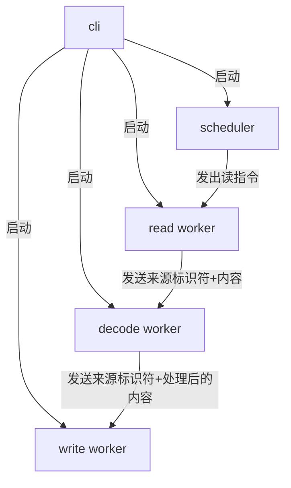

## Intro

ons 是一个开放源代码的视觉小说引擎，以简单实用出名。本博用 golang 来解密 ons 引擎的`.dat`和`.nt2`脚本，主要实践目标是异步解密输出。

## 算法

`.dat`的加密非常简单，一次异或。密码是`0x84`。

可以用 go 非常简单粗暴地写出以下代码。

```go
for i := 0; i < len(buf); i++ {
    buf[i] ^= 0x84
}
```

`.nt2`的加密同样简单，一次异或，密码是`0x85 & 0x97`。

可以用 go 非常粗暴地写出以下代码。

```go
for i := 0; i < len(buf); i++ {
    buf[i] = (buf[i] ^ (0x85 & 0x97)) - 1
}
```

## 异步读文件

go 方式比较多，`ioutil`或者`bufio`或者`os`都有文件模块。这里采用`bufio`套`os.Open`的方式读文件。

```go
func readFile(p string, outChannel chan []byte) {
    // 只读方式打开文件
	file, err := os.OpenFile(p, os.O_RDONLY, 0644)
	if err != nil {
		panic(err)
	}

    // 包装一层 bufio
    reader := bufio.NewReader(file)
    // 准备一个保存读取结果的buf
	var buf = new([1024000]byte)

	for {
        // 循环读
		n, err := reader.Read(buf[:])

        // 没有内容了就退出循环
		if n == 0 {
			break
		}

		if err != nil {
			panic(err)
        }

        // 把读到的结果用 channel 传递给下一道处理工序
		outChannel <- buf[:n]
	}

	defer func() {
		close(outChannel)
		err := file.Close()
		if err != nil {
			panic(err)
		}
	}()
}
```

## 异步写文件

写文件的方式和读文件的方式差不多，由那几个包提供。

```go
func writeFile(p string, outChannel chan []byte, done chan bool) {
    // 只读方式打开文件，已存在文件则清空内容，未存在文件则创建，文件权限 rw-r--r--
	file, err := os.OpenFile(p, os.O_WRONLY|os.O_TRUNC|os.O_CREATE, 0644)
	if err != nil {
		panic(err)
	}

	writer := bufio.NewWriter(file)

	for {
        // 从上一道工序取得解密后的数据
        buf, more := <-outChannel
        // 如果所有数据全部取得，则结束写入
		if !more {
			break
		}

        // 写入
		_, err := writer.Write(buf)
		if err != nil {
			panic(err)
		}
	}

	defer func() {
		err := writer.Flush()
		if err != nil {
			panic(err)
		}

		err = file.Close()
		if err != nil {
			panic(err)
		}

		done <- true
	}()
}
```

## 异步解密

解密过程就像是水管上的过滤器，水流进来处理好，流出去。内容乏善可陈，就直接丢代码好了。

```go
func decodeDat(inChannel chan []byte, outChannel chan []byte) {
	for {
		buf, more := <-inChannel
		if !more {
			break
		}

		for i := 0; i < len(buf); i++ {
			buf[i] ^= 0x84
		}
		outChannel <- buf
	}

	defer func() {
		close(outChannel)
	}()
}

func decodeNt2(inChannel chan []byte, outChannel chan []byte) {
	for {
		buf, more := <-inChannel
		if !more {
			break
		}

		for i := 0; i < len(buf); i++ {
			buf[i] = (buf[i] ^ (0x85 & 0x97)) - 1
		}
		outChannel <- buf
	}

	defer func() {
		close(outChannel)
	}()
}
```

## 调度

严肃地说，我认为这种调度模式是显然不对的。正确的调度方式应该是这样。



对于有多个 worker 的情况，也需要调度器协调才行，不过直觉上来说硬盘读写性能会是先一步的瓶颈。

```go
func main() {
	for i := 1; i < len(os.Args); i++ {
		decodeChannel, outChannel, done := make(chan []byte), make(chan []byte), make(chan bool)
		p := os.Args[i]
		go readFile(p, decodeChannel)

		switch path.Ext(p) {
		case ".dat":
			go decodeDat(decodeChannel, outChannel)
		case ".nt2":
			go decodeNt2(decodeChannel, outChannel)
		default:
			log.Println(path.Ext(p))
			panic("Input file should be .dat or .nt2 encrypted script!")
		}

		go writeFile(path.Base(p)+".txt", outChannel, done)
		<-done
	}
}
```

完整代码：

```go
package main

import (
	"bufio"
	"log"
	"os"
	"path"
)

func main() {
	for i := 1; i < len(os.Args); i++ {
		decodeChannel, outChannel, done := make(chan []byte), make(chan []byte), make(chan bool)
		p := os.Args[i]
		go readFile(p, decodeChannel)

		switch path.Ext(p) {
		case ".dat":
			go decodeDat(decodeChannel, outChannel)
		case ".nt2":
			go decodeNt2(decodeChannel, outChannel)
		default:
			log.Println(path.Ext(p))
			panic("Input file should be .dat or .nt2 encrypted script!")
		}

		go writeFile(path.Base(p)+".txt", outChannel, done)
		<-done
	}
}

func readFile(p string, outChannel chan []byte) {
	file, err := os.OpenFile(p, os.O_RDONLY, 0644)
	if err != nil {
		panic(err)
	}

	reader := bufio.NewReader(file)
	var buf = new([1024000]byte)

	for {
		n, err := reader.Read(buf[:])

		if n == 0 {
			break
		}

		if err != nil {
			panic(err)
		}
		outChannel <- buf[:n]
	}

	defer func() {
		close(outChannel)
		err := file.Close()
		if err != nil {
			panic(err)
		}
	}()
}

func writeFile(p string, outChannel chan []byte, done chan bool) {
	file, err := os.OpenFile(p, os.O_WRONLY|os.O_TRUNC|os.O_CREATE, 0644)
	if err != nil {
		panic(err)
	}

	writer := bufio.NewWriter(file)

	for {
		buf, more := <-outChannel
		if !more {
			break
		}

		_, err := writer.Write(buf)
		if err != nil {
			panic(err)
		}
	}

	defer func() {
		err := writer.Flush()
		if err != nil {
			panic(err)
		}

		err = file.Close()
		if err != nil {
			panic(err)
		}

		done <- true
	}()
}

func decodeDat(inChannel chan []byte, outChannel chan []byte) {
	for {
		buf, more := <-inChannel
		if !more {
			break
		}

		for i := 0; i < len(buf); i++ {
			buf[i] ^= 0x84
		}
		outChannel <- buf
	}

	defer func() {
		close(outChannel)
	}()
}

func decodeNt2(inChannel chan []byte, outChannel chan []byte) {
	for {
		buf, more := <-inChannel
		if !more {
			break
		}

		for i := 0; i < len(buf); i++ {
			buf[i] = (buf[i] ^ (0x85 & 0x97)) - 1
		}
		outChannel <- buf
	}

	defer func() {
		close(outChannel)
	}()
}
```
