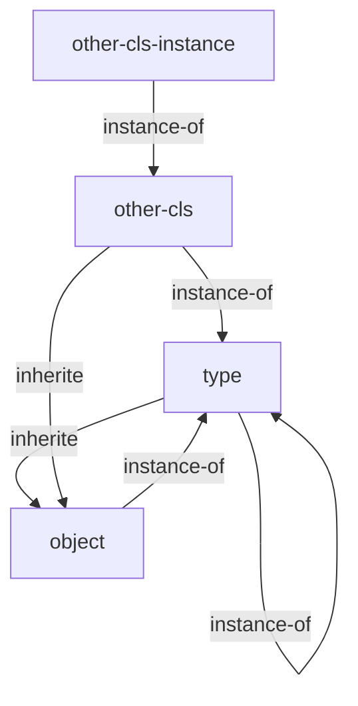

## 0. intro

元类是 python 里被说烂了的一个东西，然而日常用到的地方实在不多，每次想到都得查一下谷歌，想想干脆在博客留个笔记好了。

元类的主要用途是定制**类**的产生过程，以便于根据类声明包含的信息来创建出不同的类。

## 1. type

提到元类不得不说一下 python 的类型系统。

python 的 class 也被视作一个对象，定制一个 class 的构造过程其实就和平时在 class 定义里写`__init__`没啥区别。

python3 里类的类型是`type`，`type`又继承自`object`，`object`的父类是自己，构成一个奇怪的闭环。其中，`type`本身是一个特殊的类，他是自己的实例。



`type`有两种调用方式，一种是最常用的接受一个对象参数，返回该对象的类型，另一种是不怎么常用的，直接创建一个新的类型。

```python
# usage with one argument
type(object) # 返回对象的类型，这里返回的是 `type`

# usage with three arguments
type(name, bases, attr) # 返回新创建的类型
```

## 2. meta class

元类语法如下

```python
class MyClass(basecls1, basecls2, metaclass=MetaClass, named1=arg, named2=arg): ...
```

一般的元类可以是一个真正的`class`或者一个函数。

以函数为例：

```python
def meta_f(name, bases, attr):
	return type(name, bases, attr)

class A(metaclass=meta_f): ...
```

以类为例：

```python
class MetaC(type):
	def __new__(mcs, name, bases, attr):
		return type.__new__(mcs, name, bases, attr)

class A(metaclass=MetaC): ...
```

元类可以接受参数，参数必须是命名的，传递参数的方式是写在类声明的继承列表里。

```python
def meta(name, bases, attr, named_arg, optional_arg=None):
	return type(name, bases, dict(**attr, arg=named_arg, option=optional_arg))

class A(metaclass=meta, named_arg="hi"): ...

print(A.arg)  # output: hi
```

位置参数都会被当成继承列表，作为`bases`参数(list)的一部分传入元类。

## 3. 元类继承规则

有了元类那么就有了相应继承规则，显而易见。元类用于构造一个类，两个父类分别有一个不同的元类显然会造成冲突：这个子类用哪个元类构造？

首先看元类的在创建类的过程中的位置，摘自 python 文档[3.3.3.1. Metaclasses](https://docs.python.org/3/reference/datamodel.html#metaclasses)

> - MRO entries are resolved
> - the appropriate metaclass is determined
> - the class namespace is prepared
> - the class body is executed
> - the class object is created

一旦处理完继承链（mro, method resolve order）之后，就会决定采用哪个 metaclass 作为构造这个类的元类。

在 python 文档的[3.3.3.3 determining the appropriate metaclass](https://docs.python.org/3/reference/datamodel.html#determining-the-appropriate-metaclass)中描述了如何确定合适的元类，摘录如下。

> - if no bases and no explicit metaclass are given, then type() is used
> - if an explicit metaclass is given and it is not an instance of type(), then it is used directly as the metaclass
> - if an instance of type() is given as the explicit metaclass, or bases are defined, then the most derived metaclass is used

翻译如下

- 如果没有基类也没有指定 metaclass，那么`type()`将作为元类使用。
- 如果指定了元类，并且该元类不是 type 的实例，那么直接使用这个元类。
- 如果元类是一个 type 的实例，或者存在基类，那么使用最衍生的元类。

有一个比较难理解的点是

> most derived metaclass

也就是所谓的**最衍生的元类**。惯例，先放文档解释

> The most derived metaclass is selected from the explicitly specified metaclass (if any) and the metaclasses (i.e. type(cls)) of all specified base classes. The most derived metaclass is one which is a subtype of all of these candidate metaclasses. If none of the candidate metaclasses meets that criterion, then the class definition will fail with TypeError.

简单翻译如下

> 最衍生的元类会从类声明中明确提供的元类，还有所有明确继承的基类的元类中选择。最衍生的元类是以上所有候选元类的子类型，如果没有类型符合这一条件，则抛出`TypeError`异常。

重点在于，**最衍生的元类必须是**，所有继承的基类的元类和指定元类的**子类型**。

在这里提醒一下，`issubclass(cls, cls)`的结果是`True`。换句话说，必须有一个类是所有元类的子类，或者所有基类有相同的元类。

代码举例如下

```python
class MetaA(type):
    def __new__(mcs, name, bases, attr):
        print('MetaA <- '+name)
        return type.__new__(mcs, name, bases, attr)

class MetaB(type):
    def __new__(mcs, name, bases, attr):
        print('MetaB <- '+name)
        return type.__new__(mcs, name, bases, attr)

class BaseA: ...
class BaseB(metaclass=MetaA): ...
class BaseC(metaclass=MetaB): ...

# 未指定元类，基类元类分别是type和type的子类，则选择继承链底部的那个类
class A(BaseA, BaseB): ...  # Ok,元类是 MetaA

# 指定元类，元类和基类元类相同的情况下，元类就是那个元类
class C(BaseB, metaclass=MetaA): ...  # Ok，元类是 MetaA

# 指定元类，元类并不处于继承链底端的情况下，元类选择继承链底端的类
class D(BaseB, metaclass=type): ...  # Ok，元类是 MetaA

# 指定元类，但元类和父类无父子类关系
class E(BaseC, metaclass=MetaA): ...  # TypeError

# 不指定元类，基类具有不同的元类
class F(BaseA,BaseB,BaseC): ...  # TypeError
```

输出如下

```plain
MetaA <- A
MetaA <- C
MetaA <- D

In [71]: class E(BaseC, metaclass=MetaA): ...  # TypeError
---------------------------------------------------------------------------
TypeError                                 Traceback (most recent call last)
<ipython-input-71-9129a36c52b2> in <module>
----> 1 class E(BaseC, metaclass=MetaA): ...  # TypeError

TypeError: metaclass conflict: the metaclass of a derived class must be a (non-strict) subclass of the metaclasses of all its bases

In [72]: class F(BaseA,BaseB,BaseC): ...  # TypeError
---------------------------------------------------------------------------
TypeError                                 Traceback (most recent call last)
<ipython-input-72-1c510edd69d1> in <module>
----> 1 class F(BaseA,BaseB,BaseC): ...  # TypeError

TypeError: metaclass conflict: the metaclass of a derived class must be a (non-strict) subclass of the metaclasses of all its bases
```

但元类是函数的情况下会有比较特殊的表现，注意规则二。

> - 如果指定了元类，并且该元类不是 type 的实例，那么直接使用这个元类。

如果函数形式的元类作为父类的元类时不会列入选择，除非指定当前类的元类为函数，才会调用函数形式的元类，而且是无条件选择这个函数形式的元类。

```python
def MetaA(name, bases, attr):
    print("MetaA <- "+name)
    return type(name, bases, attr)

class MetaB(type):
    def __new__(mcs, name, bases, attr):
        return type.__new__(mcs, name, bases, attr)

class A(MetaB, metaclass=MetaA): ...  # Ok，无条件选择元类 MetaA
```
