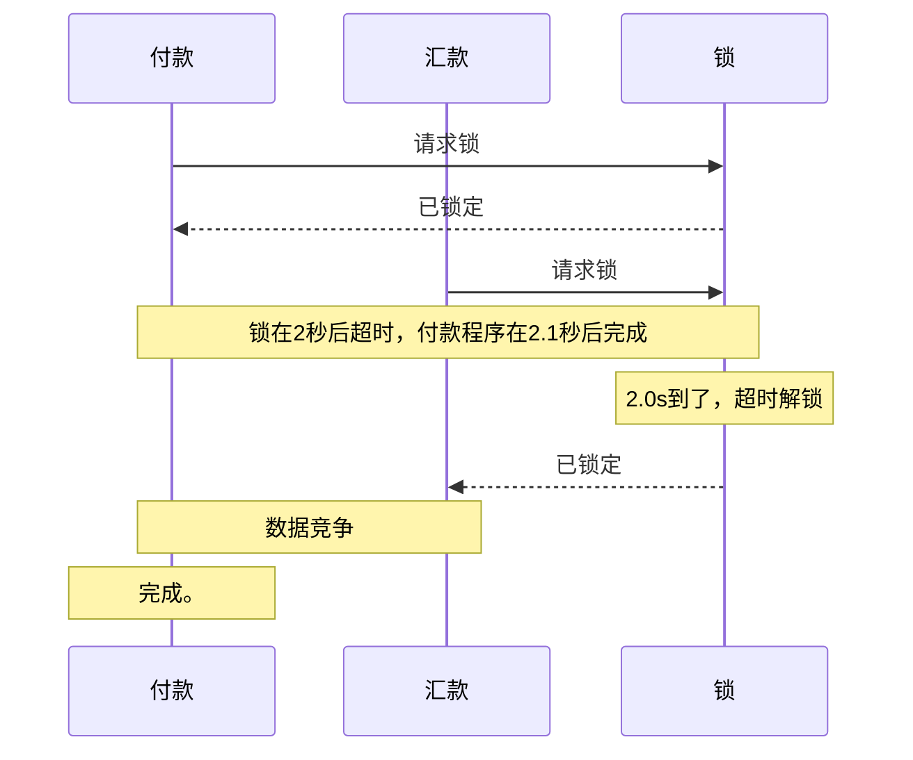

## Intro

分布式不是啥黑魔法，究其理念无非是用多台服务器处理更多的请求。提高每秒处理的数据量，并发就不可避免了。

在单机并发的情况下，我们可以用 mutex，可以用 os 的文件锁，全局锁，多台服务器的并发就需要另一个持有并保护锁的角色了。

概述如何使用 redis 实现一个分布式锁。

## 为何是 Lua

redis 保证了 lua 解释器执行脚本的事务性，即执行结果要么不可见，要么已完成。

参考[这篇文档](http://redisdoc.com/script/eval.html)。

## 简单锁

简单锁指的是简单互斥锁，一旦锁定，则其他锁定请求都必须等待。

### 加锁

直觉的想法是通过 redis 的键来保持锁，故准备一个用于锁定互斥的名字（比如说 mutex-1）然后指定为键。

直接使用 set 是显然不正确的，如果临界区内程序崩溃或意外断网将导致死锁，所以 setnx 和 expire 是必选项。

加锁需要判断锁的键为空，才能加锁，这两步必须保证原子性，要么都执行，要么一个都不执行。幸好 redis 提供了这方面保证，只要使用 lua 脚本的话。

```lua
-- 加锁
if redis.call("get", KEYS[1]) == nil then
    if redis.call("setnx", KEYS[1], ARGV[1]) == 1 then
        redis.call("expire", KEYS[1], ARGV[2])
        return 1
    else
        return
    end
end
```

上面的 lua 代码用 python 再封装一层，就是这样

```python
def lock(key, expire):
    redis.eval(
        '''
-- 加锁
if redis.call("get", KEYS[1]) == nil then
    if redis.call("setnx", KEYS[1], ARGV[1]) ~= nil then
        redis.call("expire", KEYS[1], ARGV[2])
        return 1
    else
        return
    end
end
        ''', 1, key, "lock", expire)
```

### 解锁

解锁代码同样是通过 lua 实现。

下面是**错误实现例子**。

```lua
return redis.call("del", KEYS[1])
```

错误之处在于会解除非自己加的锁。如果临界区内的工作时间超过预期时间，那么就会造成误解锁的问题。

下面是**正确例子**。

为了标记锁持有者，需要修改加锁代码。

```python
def lock(key, owner, expire):
    redis.eval(
        '''
-- 加锁
if redis.call("get", KEYS[1]) == nil then
    if redis.call("setnx", KEYS[1], ARGV[1]) ~= nil then
        redis.call("expire", KEYS[1], ARGV[2])
        return 1
    else
        return
    end
end
        ''', 1, key, owner, expire)
```

解锁的 lua 代码。

```lua
-- 解锁
if redis.call("get", KEYS[1]) == ARGV[1] then
    return redis.call("del", KEYS[1])
else
    return 0
end
```

解锁的 python 代码。

```python
def unlock(key, lock):
    redis.eval(
        '''
-- 解锁
if redis.call("get", KEYS[1]) == ARGV[1] then
    return redis.call("del", KEYS[1])
else
    return 0
end
        ''',
        1, key, lock
    )
```

### 超时和一致性

关于超时有这样一个问题在。如果超时时间过长，那么超时的设置意义就不大，服务宕机 1 小时和宕机 24 小时都是事故。如果超时时间过短，那么超时就可能造成一致性上的损害。

举例来说，付款处理花了 2.1s，但是锁超时 2.0s。这 0.1s 的数据竞争时间里，更新`update balance where id = xxx`和下一个更新 blance 的请求就指不定谁先执行了。



所以，设置了超时，那么必须保证一致性，整个处理要么全部完成，要么超时全部未完成，对编程能力提出了挑战。

后续再想想能不能写篇博文。

## 读写锁

读写锁的实现和简单锁别无二致，特征是多个读，一个写。在大量读取，少量写入的情况下，读写锁可以有效提高效率。

### 加读锁

读锁实现和简单锁差别不大，在简单锁基础上稍作修改即可。

```lua
-- 读锁
if redis.call("get", KEYS[1]..":write")  then
    return 0
else
    return redis.call("hset", KEYS[1]..":read", ARGV[1], 1)
end
```

### 加写锁

写锁实现差别也不大，这里使用 hash table 解决标记持有人的问题。

```lua
-- 写锁
if redis.call("hlen", KEYS[1]..":read") then
    return 0
else
    return redis.call("setnx", KEYS[1]..":write", ARGV[1])
end
```

### 解读锁

读锁的解除只需要删除 hash table 里的自己就行了。

```lua
-- 解读锁
return redis.call("hdel", KEYS[1]..":read", ARGV[1])
```

### 解写锁

写锁解除如解除简单锁一样。

```lua
-- 解锁
if redis.call("get", KEYS[1]..":write") == ARGV[1] then
    return redis.call("del", KEYS[1]..":write")
else
    return 0
end
```
