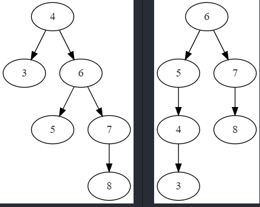
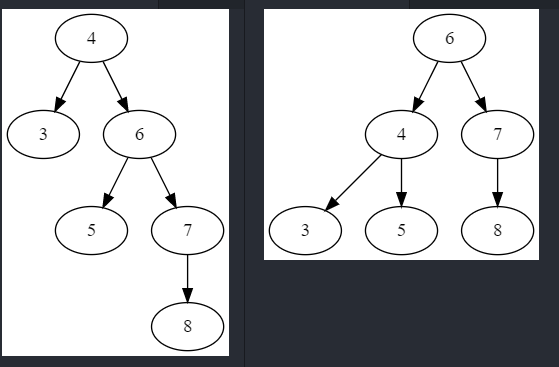
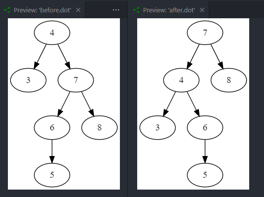
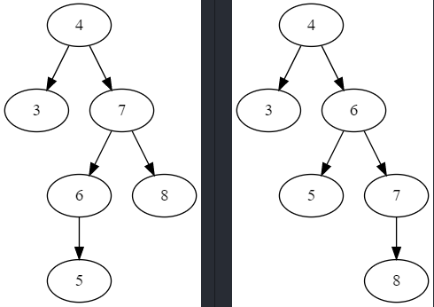
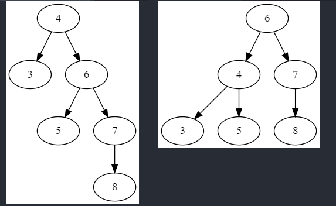

## 前言

还记得很久以前学数据结构只看到二叉树，讲到平衡，但平衡方法当时看纸质书手头也没有实验环境，后来就没继续学下去。现在有闲就重新捡起来学一下。先从AVL树继续看。

## AVL树

AVL 树是以提出者名字命名的，Adelson-Velskii & Landis，俄国人，后来移居以色列。人怎么样不管啦。

AVL 树是一种平衡二叉树，左右子树高度差不超过1。保持平衡的方法是每次插入数据的时候发现子树不平衡，就把较高的子树提升为根，把根变成新的根的子树，把较高的子树变矮，较矮的子树变高，实现平衡。这个过程被叫做旋转，下面介绍旋转。

## 左旋转/右旋转


左旋转和右旋转的逻辑是一样的。如果右子树比左子树高，就把右子树提升成根。如果左子树比右子树高，就把左子树提升成根。提升右子树叫左旋转，提升左子树叫右旋转。

把子树提升成根会有点麻烦。比如右子树提升为根，原来的根和左子树怎么办？我们并不想重新平衡树的时候把整个左子树都删掉，那原来的根和左子树就必须插回新的树里。

我们知道右子树的 key 肯定比根和左子树所有节点大，所以根要插回树的话，一个很直接的想法就是把旧的根接到右子树左下角的叶子节点。



的确，这样保持了二叉搜索树的特征，但新的树依然不平衡：节点5的左子树高度2，右子树高度0，高度差超过了1。稍微想想就知道，旧的根和左子树直接接到左下角叶子节点的话，会让原本平衡的新树左子树高度增加，进而失去平衡。

解决方法也很简单，不要把旧的树接到新的树最小值上，而是把新树的左子树，移植成旧树的右子树，再把旧树移植成新树的左子树。这样一来，右子树的左子树和左子树的右子树不管怎么旋转，高度都一样。



为什么这样可以保持平衡呢？首先AVL树的子树也是AVL树，所以子树的子树之间高度差也不超过1。左旋转、右旋转的的作用是让子树高度一侧升高，一侧降低——注意，左旋转只能降低右儿子的右子树高度，右儿子的左子树高度不变。右旋转只能降低左儿子的左子树高度，左儿子的右子树高度不变。

举例来说，上图中右儿子的右子树（4-6-7-8）较高，旋转后变成了（6-7-8），而原本的（4-6-5）变成了（6-4-5），高度不变。

这个规律很好理解，因为原来的右子树变成了根，整个右子树剩下的节点高度都降低了。而右子树的左子树变成了现在的左子树的右子树，和根的距离一样，所以高度不变。

**左旋转让右子树的右子树高度-1，左子树的左子树高度+1。左子树的右子树高度等于右子树的左子树，旋转后新树的左右子树的高度相等。**

## 双旋转

对于往左儿子的左子树插入节点造成的不平衡，右旋转可以实现降低左儿子的左子树高度，再次平衡。往右儿子的右子树插入节点造成的不平衡，左旋转可以降低右儿子的右子树高度，再次平衡。但对于左儿子的右子树或右儿子的左子树插入节点造成的不平衡，一次左、右旋转无法实现再平衡。

再看一个例子。



旋转前，右儿子的左子树（4-7-6-5）高度是4，旋转后（7-4-6-5）高度不变，依然是4，树仍然不平衡。解决办法也很简单，先把右子树（7）右旋，让右儿子的左子树高度低于右子树，再对整棵树左旋，也就是AVL树的双旋转。

一步一步看双旋转是怎么解决这个问题的。

第一步，右儿子的左子树比右儿子右子树高，所以将右儿子右旋，使得右儿子的右子树高于右儿子的左子树。



我们知道的左旋转时右儿子的左子树高度不变，右儿子的右子树高度-1。这一步前，直接对整棵树左旋时，最高的那颗子树（右儿子的左子树）高度没有变化，树依然不平衡，只是变成了右子树更矮，左子树更高而已。

而这一步之后，最高的子树变成了右子树的右子树。现在对整棵树左旋，右子树的右子树高度下降了，和原本右子树的左子树高度一致，达成平衡。



这个原则简单地说，就是左子树下最高的子树应该是左子树，右子树下最高的子树应该是右子树。如果新增节点后不满足这个条件，就要先对左子树左旋，或者对右子树右旋，来满足这个条件。

## 代码实现

```python
from typing import Optional


class AVLTreeNode:
    """树节点
    """
    def __init__(self, value: int, parent: 'AVLTreeNode') -> None:
        self.value = value
        self.parent = parent
        self.left: Optional['AVLTreeNode'] = None
        self.right: Optional['AVLTreeNode'] = None

    @property
    def height(self) -> int:
        """子树高度

        Returns:
            int: 子树高度
        """
        return max(self._left_height, self._right_height)+1

    @property
    def _left_height(self):
        return self.left.height if self.left is not None else 0

    @property
    def _right_height(self):
        return self.right.height if self.right is not None else 0

    @property
    def balance(self) -> bool:
        """是否平衡

        Returns:
            bool: 是否平衡
        """
        return abs(self._left_height-self._right_height) <= 1

    def right_rotate(self):
        """节点右旋
        """
        if self.left is None:
            raise Exception('can not rotate tree with empty left node')
        # 旧的根成为右节点
        # 旧的根的左节点成为新的根
        # 新的根的右节点变成旧的根的左节点
        # 旧的根变成新的根的右节点
        old_root = self
        new_root = old_root.left

        old_root.left = new_root.right
        new_root.right = old_root

        # 新根替换旧根
        if old_root.parent is not None:
            if old_root.parent.left == old_root:
                old_root.parent.left = new_root
            else:
                old_root.parent.right = new_root

        new_root.parent = old_root.parent
        old_root.parent = new_root
        if old_root.left is not None:
            old_root.left.parent = old_root

    def left_rotate(self):
        """节点左旋
        """
        if self.right is None:
            raise Exception('can not rotate tree with empty right node')
        # 旧的根成为左节点
        # 旧的根的右节点成为新的根
        # 新的根的左节点作为旧的根的右子树
        # 旧的根变成新的根的左子树
        old_root = self
        new_root = self.right

        old_root.right = new_root.left
        new_root.left = old_root

        # 新根替换旧根
        if old_root.parent is not None:
            if old_root.parent.left == old_root:
                old_root.parent.left = new_root
            else:
                old_root.parent.right = new_root

        new_root.parent = old_root.parent
        old_root.parent = new_root
        if old_root.right is not None:
            old_root.right.parent = old_root

        assert new_root.right.value > new_root.value
        assert new_root.left.value < new_root.value

    def _rebalance(self):
        if self.balance:
            return

        if self._left_height > self._right_height:
            # 如果最高的子树是左子树的右子树，先对左子树左旋
            if self.left.left is not None \
                    and self.left.right is not None \
                    and self.left.left.height < self.left.right.height:
                self.left.left_rotate()
            self.right_rotate()
        else:
            # 如果最高的子树是右子树的左子树，先对右子树右旋
            if self.right.right is not None \
                    and self.right.left is not None \
                    and self.right.right.height < self.right.left.height:
                self.right.right_rotate()
            self.left_rotate()

    def insert(self, value: int) -> None:
        """插入新节点

        Args:
            value (int): 要插入的数据
        """
        if self.value > value:
            if self.left is None:
                self.left = AVLTreeNode(value, self)
            else:
                self.left.insert(value)
        elif self.value < value:
            if self.right is None:
                self.right = AVLTreeNode(value, self)
            else:
                self.right.insert(value)
        else:
            return

        self._rebalance()

    def search(self, value: int) -> bool:
        """搜索值

        Args:
            value (int): 待搜索的值

        Returns:
            bool: 值是否存在
        """
        if self.value == value:
            return True
        elif self.value > value and self.left is not None:
            return self.left.search(value)
        elif self.value < value and self.right is not None:
            return self.right.search(value)
        else:
            return False


class AVLTree:
    """AVL tree
    """

    def __init__(self) -> None:
        self.root: Optional[AVLTreeNode] = None

    @property
    def height(self):
        """AVL树高度

        Returns:
            int: 树高度
        """
        if self.root is not None:
            return self.root.height
        return 0

    @property
    def balance(self) -> bool:
        """树是否平衡

        Returns:
            bool: 树是否平衡
        """
        if self.root is not None:
            return self.root.balance
        return True

    def insert(self, value: int):
        """insert new value

        Args:
            value (int): new value
        """
        if self.root is None:
            self.root = AVLTreeNode(value, None)
        else:
            self.root.insert(value)

        # AVL 树旋转后根节点可能不再是现在这个节点，需要重新寻找根节点
        top = self.root
        while top.parent is not None:
            top = top.parent
        self.root = top

    def search(self, value: int) -> bool:
        """search a value

        Args:
            value (int): searching value
        """
        if self.root is None:
            return False
        return self.root.search(value)

```

## 总结

AVL树只要理解和左右旋转的方法和作用，就不难理解左右旋转与双旋转的意义了。

单次旋转的目的都是将两侧子树，一颗子树高度+1，一颗子树高度-1，将高度相差2的两颗子树重新平衡。

单次旋转的限制是只能降低子树中一颗子树的高度，左子树的左子树或右子树的右子树，所以一旦出现左右子树中最高的子树不是左-左或右-右，单次旋转就不能重新平衡。对这种情况，先旋转子树，令左-左或右-右成为最高的子树后，再对根节点旋转，就能重新平衡了。