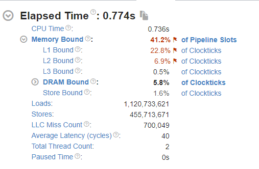
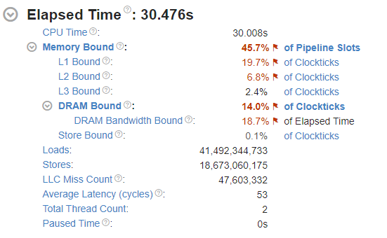
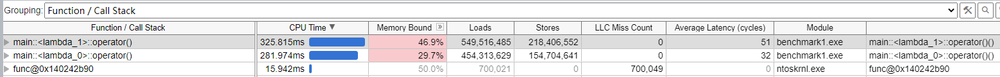
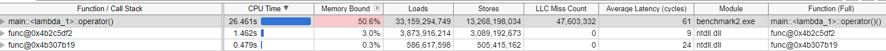
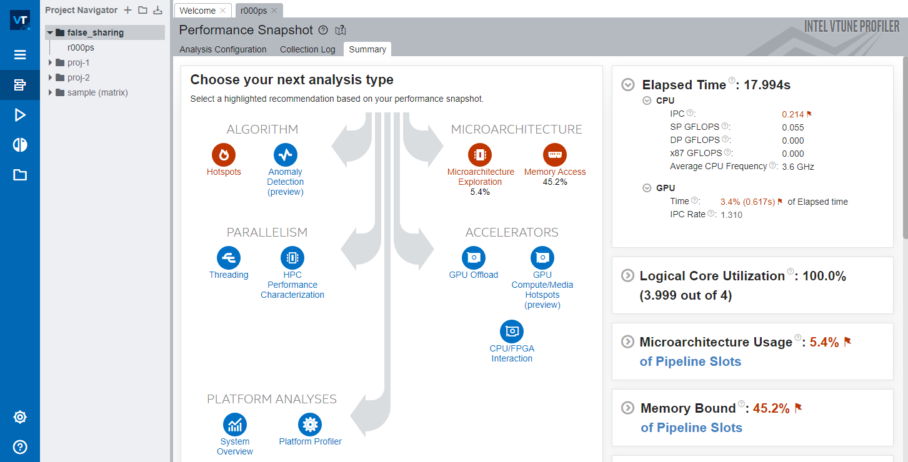
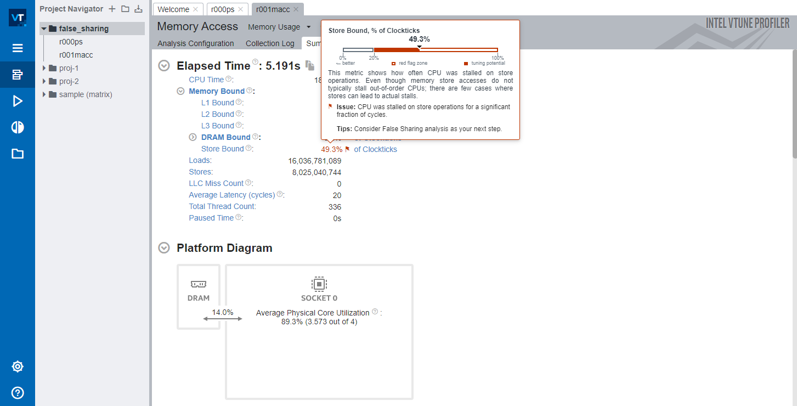
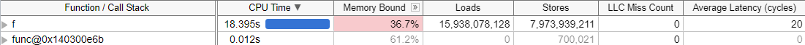

## 前言

看B树的时候发现对缓存还是不够了解，但 cache line 又很神奇。要是有些比较吃CPU的代码改一下结构和访问方式啥的就能白嫖个50%性能提升那岂不是美哉。结合下面的参考文章大概聊一下。

- [Gallery of Processor Cache Effects](http://igoro.com/archive/gallery-of-processor-cache-effects/)

## 缓存行

### 介绍

首先，缓存行**不是**“行”，这是对 *cache line* 的直译，*cache line* 和 *cache block* 是同义的，忽略这个“行”字即可。

cache line 指的是 CPU 高速缓存（L1~L3）中的一个缓存块，通常大小在 32/64/128 bytes ，现在常见的应该是 64 bytes 。cache line 之所以重要，是因为这是 CPU 访问主存的必经之路，频繁访问主存数据的场合，或者并发编程时，cache line 的影响还是不容忽视的。

### 简单的基准测试

光是说 cache line 多重要没有卵用，写个 demo 看看 cache line 的影响更直观。来一个最简单不过的单链表遍历。

```c++
#include <chrono>
#include <cstddef>
#include <functional>
#include <iostream>
#include <iterator>
#include <ostream>
#include <string>

using namespace std;
using namespace std::chrono;

typedef struct _data {
  struct _data *next;
  int value;
} mydata;

void time_it(const std::string name, function<void(void)> fn) {
  auto start = system_clock::now();
  fn();
  auto stop = system_clock::now();
  cout << name << ": " << duration_cast<milliseconds>(stop - start).count()
       << "ms" << endl;
}

int main(void) {
  // 一次分配，内存连续
  auto list1 = new mydata[1024 * 1024 * 64];
  auto cur = list1;
  for (int i = 0; i < 1024 * 1024 * 64 - 1; i++) {
    cur->next = &list1[i + 1];
    cur = cur->next;
  }
  list1[1024 * 1024 - 1].next = NULL;

  // 分别分配，内存不连续
  auto list2 = new mydata();
  auto cur2 = list2;
  for (int i = 0; i < 1024 * 1024 * 64 - 1; i++) {
    cur2->next = new mydata();
    cur2 = cur2->next;
  }

  // 遍历连续的链表
  time_it("first", [&]() {
    for (auto ptr = list1; ptr != NULL; ptr = ptr->next) {
      ptr->value *= 3;
    }
  });

  // 遍历不连续的链表
  time_it("second", [&]() {
    for (auto ptr = list2; ptr != NULL; ptr = ptr->next) {
      ptr->value *= 3;
    }
  });
  return 0;
}
```

为了体现出差异，一共遍历了 `1024*1024*64`个元素，每个元素 8 个字节，一共是512M数据。

结果如下。

```plaintext
weakptr  数据结构  ♥ 09:42  clang++.exe -m32 -O2 main.cpp -o main.exe
weakptr  数据结构  ♥ 09:43  ./main.exe
first: 2ms
second: 239ms
```

启用了`O2`级别优化的情况下，遍历连续分配和不连续分配的链表时，速度相差达到了惊人的一百多倍。

是`O2`优化掉了第一种连续分配的链表遍历吗？`-O0` 禁止优化看看。

```plaintext
weakptr  数据结构  ♥ 09:44  clang++.exe -m32 -O0 main.cpp -o main.exe
weakptr  数据结构  ♥ 09:45  ./main.exe
first: 3ms
second: 262ms
```

并没有任何改善。

因为考虑是和内存相关，影响内存访问性能的因素可以很自然想到缓存和缺页这两条。

缓存指的是 cache line，一般说 false sharing 的时候提加 padding 对齐比较多。另一个情况就是遍历的时候，如果数据比较密集，那从主存刷新 cache line 就会更少，缓存利用更充分。所以像是数组这样的连续内存遍历速度通常远比链表之类的结构快。

缺页又是另一个问题，缺页异常发生的几个常见场景包括：第一次访问分配好的内存，访问被交换到硬盘上的内存，`mmap` ，以及`SIGSEGV`等情况。一般来说的话，连续的内存分配下一次缺页可以得到连续的N个元素，不连续的分配第一次访问N个元素，最坏的情况下可能就要N次缺页异常。

### 缺页异常

先看缺页。这里使用微软的 Process Explorer 来观察 Page Fault 的出现情况。为了有效观察到page fault发生，我修改了一下代码，在 `time_it` 函数里添加上了简单的 page fault 观测。

*提示，也可以用 Process Explorer 等工具观测程序运行时的 Page Fault 数量，但直接在代码里嵌入观测还是最准确的。如果有更好用的性能分析工具的话当然更好。*

```c++
DWORD getPageFaultCount() {
    auto proc = GetCurrentProcess();
    PROCESS_MEMORY_COUNTERS counters;
    if (GetProcessMemoryInfo(proc, &counters, sizeof(counters)) == FALSE) {
        cerr << "GetProcessMemoryInfo failed, error " << GetLastError() << endl;
    }
    return counters.PageFaultCount;
}

void time_it(const string name, function<void(void)> fn) {
    auto before = getPageFaultCount();
    auto start = system_clock::now();
    fn();
    auto stop = system_clock::now();
    auto after = getPageFaultCount();
    cout << name << ": " << duration_cast<milliseconds>(stop - start).count()
         << "ms, page fault count: " << after - before << endl;
}
```

然后对两个用例进行测试。

```plaintext
initialization-1: 337ms, page fault count: 131329
initialization-2: 3591ms, page fault count: 265660
iteration-1: 3ms, page fault count: 0
iteration-2: 294ms, page fault count: 0
```

可以清晰地看到，在链表的初始化阶段，非连续分配的链表产生了连续分配的链表差不多两倍的 page fault，耗时接近十倍——我还得澄清一下这不是在暗示十倍的耗时都是 page fault 造成的，但 page fault 在其中也消耗了一部分资源总归是毫无疑问的。

但随后的迭代阶段里并没有新的 page fault 产生，因为 两次 512M 的分配再加上循环new，堆维护指针的开销，差不多1.5G，还没有耗尽可用内存。

排除 page fault 的影响后，现在考虑另一个影响因素：缓存。

### 缓存行

关于缓存的分析这里使用了 Intel VTune Profiler 作为分析工具，来提取缓存命中情况。为了让VTune抓取更多信息来分析，对benchmark代码再次修改，遍历一次改成遍历100次。

```c++
for (int i = 0; i < 100; i++) {
    time_it("iteration-2", [&list2]() {
        for (auto ptr = list2; ptr != NULL; ptr = ptr->next) {
            ptr->value *= 3;
        }
    });
}
```

并将连续内存分配和不连续分配分成`benchmark1.cpp`和`benchmark2.cpp`，分别用`-m32 -O0 -g` 参数编译，放进 VTune 分析内存访问性能。





观察图中的 LLC Miss Count 可以发现，Benchmark2 的缓存未命中次数远大于 benchmark1 ，平均时延 Average Latency 高出 13 个cycles 。这如何影响性能呢？继续观察下图 Bottom-up 中的分析。





能发现，在benchmark1（连续分配链表遍历测试）中，初始化耗时和遍历耗时相仿，都在300ms左右。初始化耗时可能主要来自缺页，每次遍历整个链表仅3ms左右，LLC Miss Count 为 0。这说明缓存完美地发挥了作用。

在 benchmark2 （循环分配节点，不连续）中，初始化耗时1.4秒，100次遍历耗时26.461秒，而且注意，LLC Miss Count 高达 47,603,332 。将这个数字除以循环次数，大约等于每个节点访问都会产生 0.7 个 LLC Miss 。

为什么会发生这种事？

benchmark1 一次 new 出连续的 `1024 * 1024 * 64` 个元素，每个元素 8 个字节，连续排列，而且构造链表时是按顺序头尾相连的。所以遍历 benchmark1 的链表时，填充好的 cache line (设为 64字节)一共有8个链表元素且连续，预取机制同时拿了下一个 cache line ，因此 CPU 几乎不用傻等主存给数据，只需要不断一个 cache line 接一个 cache line 读写即可，效率极高。

而 benchmark2 相反，因为链表中的每个元素都是独立分配的，依据 allocator 算法不同表现会有区别，但比较明确的是元素不大可能是在内存中连续分配。在遍历链表时，取下一个链表元素 `cur=cur->next ` 后，`cur` 指向的地址大概率并不在已缓存的 cache line 中，因此每次循环里 CPU 都不得不从主存取数。可是主存取数是L1/L2 缓存取数耗时的成百上千倍，效率极低。

### 伪共享

继续之前再说说伪共享。

```c++
#include <cstddef>
#include <iostream>
#include <thread>
#include <functional>
#include <chrono>

using namespace std;
using namespace std::chrono;

void time_it(const string name, function<void(void)> fn) {
    auto start = system_clock::now();
    fn();
    auto stop = system_clock::now();
    cout << name << ": " << duration_cast<milliseconds>(stop - start).count()
         << "ms" << endl;
}

void f(int *data) {
    for (int i = 0; i < 10000000; i++) {
        *data += 100;
    }
}

int main(void) {
    for (int i = 0; i < 100; i++) {
        time_it("iteration", []() {
            int a = 0, b = 0, c = 0, d = 0;
            thread *threads[4] = {
                new thread(f, &a),
                new thread(f, &b),
                new thread(f, &c),
                new thread(f, &d),
            };

            for (auto t : threads) {
                t->join();
            }
        });
    }
    return 0;
}

```

依然是一个很简单的 benchmark，输出如下。

```plaintext
iteration: 172ms
iteration: 176ms
iteration: 181ms
iteration: 177ms
iteration: 182ms
iteration: 179ms
... 略
```

一个非常简单的操作，4线程无锁，无 `volatile` 递增不同的四个变量，几乎看不出有什么约束导致性能低下的问题。我们通过 Intel VTune 来看看。





可以看到，VTune 提示CPU花费了大量时间在傻等 cache line 写入主存。



函数 f 出现了海量的 loads/store 操作。

在前文中我们聊了 cache line 的作用，这里也能看到 LLC Miss 为 0，那么为什么运行性能会这么差呢？

这个问题还得回到 cache line 上。在多核系统中，cache line 还要求 **一致性** ，一旦写 cache line 中的任意字节，都会让 **整个** cache line 标记为失效。在基准测试代码里，四个 int 变量被连续分配在栈上，也就是说 cache line 极有可能将这四个变量中的多个保存在同一 cache line 内。任意一个线程修改了其中一个变量，都会导致 cache line 被标为失效，其他线程或核心想要访问这四个变量之一都不得不从主存重新取数。

这么做的原因是为了保证数据一致性。CPU0 修改了 cache line 中的数据，还没有写回主存，其他 CPU 都不清楚 CPU0 做了什么修改，只能等待 CPU0 写回主存（或者L3），再重新从主存（或L3）取数。但我们都知道a、b、c、d并不是共享的，每个线程都只访问自己的那个变量。这种问题被称作**伪共享**。

在 VTune 中的表现，就是上图中海量的 Loads/Stores 操作。

如何解决呢？

很简单，让每个线程要操作的变量填满整个 cache line，防止因为cache line 里混入和其他线程要修改的变量造成伪共享。

```c++
typedef struct {
    int8_t _before[60];
    int32_t value;
    int8_t _after[60];
} value;

void f(value *data) {
    for (int i = 0; i < 10000000; i++) {
        data->value += 100;
    }
}

int main(void) {
    for (int i = 0; i < 100; i++) {
        time_it("iteration", []() {
            value a = {0}, b = {0}, c = {0}, d = {0};
            thread *threads[4] = {
                new thread(f, &a),
                new thread(f, &b),
                new thread(f, &c),
                new thread(f, &d),
            };

            for (auto t : threads) {
                t->join();
            }
        });
    }
    return 0;
}
```

将原本的 int 改成前后各有 60 字节填充的结构（前60字节防止 value 混入别人的 cache line，后60字节防止value后的变量混入cache line，124字节，对齐后128字节）。这个解决方法是典型的 **用空间换时间** 。再次运行基准测试，可以看到运行时间缩短了数倍。

```plaintext
iteration: 15ms
iteration: 21ms
iteration: 20ms
iteration: 18ms
iteration: 20ms
iteration: 22ms
iteration: 20ms
iteration: 19ms
iteration: 20ms
iteration: 20ms
... 略
```

### cache line 原理

Intel 在 2016 年发表的一篇文章，[How Memory Is Accessed](https://www.intel.com/content/www/us/en/developer/articles/technical/how-memory-is-accessed.html)这样写道。

> Programming modern computers rarely requires an understanding of underlying hardware and software; consequently, most programmers do not know how the memory subsystem works.
>
> However, such lack of knowledge can ultimately produce a 10x or worse slowdown in application performance – especially since the arrival of [new hardware technologies](http://software.intel.com/en-us/articles/what-s-new-about-modern-hardware).
>
> ...
>
> The accesses propagating through the memory subsystem are a combination of a specific request and the needed physical addresses and, perhaps, data.
>
> Data moves around most of the memory subsystem in 64-byte quantities called *cache lines*. A *cache entry*, which is some transistors that can store a physical address and a cache line, is filled when a cache line is copied into it. Pages are evenly divided into cache lines – the first 64 bytes of a 4096-byte page is a cache line, with the 64 bytes stored together in a cache entry; the next 64 bytes is the next cache line, etc.
>
> Each cache line may:
>
> - Not be cached
> - Occupy an entry in one cache
> - Be duplicated in several caches
>
> Cores, I/O devices, and other devices send requests to caches to either read or write a cache entry for a physical address. The lowest six bits of the physical address are not sent – they are used by the core to select the bytes within the cache line. The core sends separate requests for each cache line it needs.
>
> - **Reads** – If a cache has the requested physical address in a cache entry, the cache returns the data. If not, the cache requests the data from deeper in the memory subsystem and evicts some cache entry to make room. If the evicted cache entry has been modified, it must be written to the deeper memory subsystem as part of this eviction. This means a stream of reads may slow down because an earlier set of writes must be pushed deeper into the memory subsystem. A small queue of written data buffers the communication from the sender to the receiver.
> - **Writes** – If the cache does not have the cache line in a cache entry, the cache reads it from deeper in the memory subsystem. It evicts some other physical address from its cache entry to make room for this cache line. The read is necessary to get all the 64 bytes, because the write is probably changing only some of them. The first time a cache entry is written, the cache entries of this physical address in all other caches are invalidated. This action makes the first write on a cache entry more expensive than later writes.

CPU访问主存时并不是直接从主存取数，而是先读入高速缓存，也就是在CPU的规格说明中提到的 L1/L2/L3 缓存。而且，CPU也不会傻乎乎地只从主存取一个字节、4个字节或8个字节，而是取更多数据放入缓存。

为什么？因为 *局部性原理* 。CPU设计者假设程序访问一个地址，则很快也会访问这个地址附近的其他地址。

这儿有个表格 *Numbers everyone should know*：

```plaintext
           0.5 ns - CPU L1 dCACHE reference
           1   ns - speed-of-light (a photon) travel a 1 ft (30.5cm) distance
           5   ns - CPU L1 iCACHE Branch mispredict
           7   ns - CPU L2  CACHE reference
          71   ns - CPU cross-QPI/NUMA best  case on XEON E5-46*
         100   ns - MUTEX lock/unlock
         100   ns - own DDR MEMORY reference
         135   ns - CPU cross-QPI/NUMA best  case on XEON E7-*
         202   ns - CPU cross-QPI/NUMA worst case on XEON E7-*
         325   ns - CPU cross-QPI/NUMA worst case on XEON E5-46*
      10,000   ns - Compress 1K bytes with Zippy PROCESS
      20,000   ns - Send 2K bytes over 1 Gbps NETWORK
     250,000   ns - Read 1 MB sequentially from MEMORY
     500,000   ns - Round trip within a same DataCenter
  10,000,000   ns - DISK seek
  10,000,000   ns - Read 1 MB sequentially from NETWORK
  30,000,000   ns - Read 1 MB sequentially from DISK
 150,000,000   ns - Send a NETWORK packet CA -> Netherlands
|   |   |   |
|   |   | ns|
|   | us|
| ms|
```

具体数字依赖于具体的硬件平台，这个表格可以对访问速度建立大概的映像。当 L1/L2 缓存未命中，CPU不得不继续向更远、延时更长的设备寻求数据，每个 LLC Miss 都意味着 CPU 不得不花上成百上千倍的时间等待填充 cache line。而 LLC Miss 出现的频率越高，则意味着 CPU 执行的效率越低——绝大部分时间都在等待主存的数据。

更糟糕的是，有时候 CPU 真的就是傻等(stall)，不专门分析甚至都不知道程序根本没跑出应有的速度。

> Modern cores use both [out-of-order execution](https://en.wikipedia.org/wiki/Out-of-order_execution) and [hyperthreading](https://en.wikipedia.org/wiki/Hyper-threading) to find and to do something useful while other instructions wait for data to be fetched.
>
> If nothing useful can be done, the core stalls. Unfortunately, the OS is almost unaware of the stall: the application appears to be running, and it is hard to tell if the application is slower than it should be. You need tools to examine [hardware performance counters](https://en.wikipedia.org/wiki/Hardware_performance_counter) to see stall details.

回顾基准测试代码，仅仅是连续分配内存就可以获得百倍的性能改善，超值。

引用前文来给 cache line 小节结尾：

> However, such lack of knowledge can ultimately produce a 10x or worse slowdown in application performance – especially since the arrival of [new hardware technologies](http://software.intel.com/en-us/articles/what-s-new-about-modern-hardware).


## 总结

什么是 cache line？

> Data moves around most of the memory subsystem in 64-byte quantities called *cache lines*.

cache line 如何影响性能？
