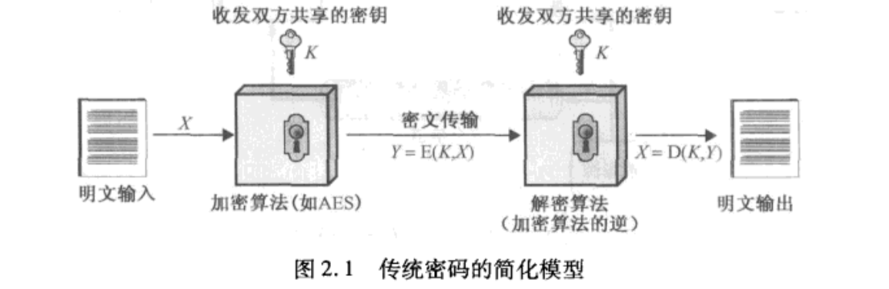
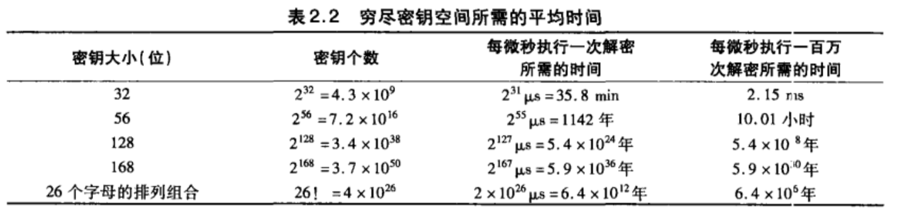
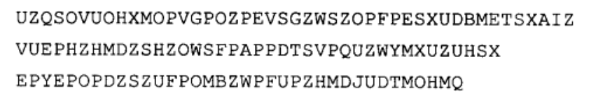
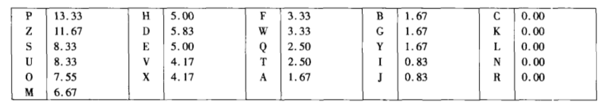
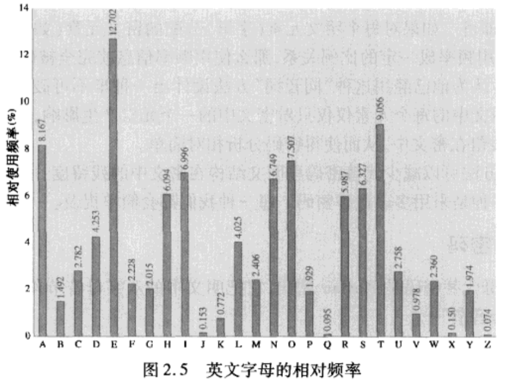
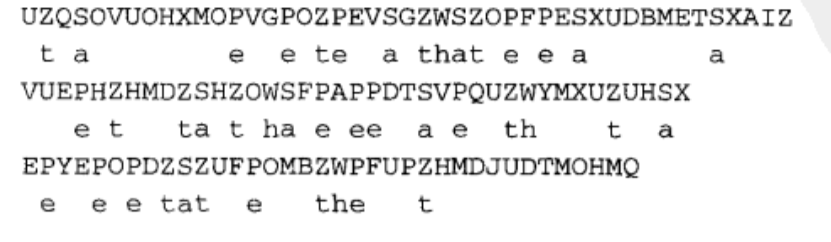
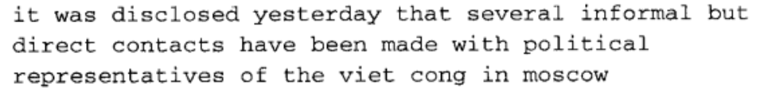

## 前言

本文是学习《密码编码学与网络安全》一书的笔记，关于传统加密技术一章。

## 0x01 对称密码模型

对称加密，也称传统加密或单钥加密，是20世纪70年代公钥密码产生之前唯一的加密类型。迄今为止，它仍是使用最广泛的加密类型。

对称加密方案有5个基本成分：

- 明文：原始可以理解的消息或数据，是算法的输入。
- 加密算法：加密算法对明文进行各种代替和变换。
- 密钥：密钥也是加密算法的输入。密钥独立于明文和算法。算法根据所用的特定密钥而产生不同的输出。算法所用的确切代替和变换也依靠密钥。
- 密文：作为算法的输出，看起来完全随机而杂乱的消息，依赖于明文和密钥。对于给定的消息，不同密钥产生不同的密文，密文看上去是随机的数据流并且其意义是不可理解的。
- 解密算法：本质上是加密算法的逆运算。输入密文和密钥，输出原始明文。



传统密码的安全使用要满足两个要求：

- 加密算法必须是足够强的。即使攻击者拥有一定数量的密文和产生这些密文的明文，他也不能破译密文或发现密钥。
- 发送者和接收者必须在某种安全的形式下获得密钥并保证密钥安全。如果有人发现密钥，并知道算法，就能解读使用该密钥加密的所有通信。

我们假设基于已知密文和加密/解密算法而破译消息是不实际的，我们不需要算法保密，仅需要密钥保密。如果密钥是由信息的发送方产生的，那么它要通过某种安全信道发送到接收方；另一种是由第三方生成密钥后再安全地分发给发送方和接收方。

```cpp
// 明文X，共 m 个元素
byte[m] X = {X1,X2,X3,X4,...,Xm};
// 密钥K，共 j 个元素
byte[j] K = {K1,K2,K3,K4,...,Kj};
// 加密算法E，以明文和密钥为输入，输出密文 Y
byte[n] Y = E(X, K);
// 解密算法D，以密文和密钥为输入，输出明文 X
byte[] X = D(Y, K);
```

### 1.1 密码编码学

密码编码系统有三个独立特征：

- **转换明文为密文的运算类型**。**所有的加密算法都基于两个原理：代替和置换**。代替是将明文中的每个元素（如位、字母、位组或字母组）映射成另一个元素；置换是将明文中的元素重新排列。上述运算的基本要求是不允许有信息丢失（所有运算都是可逆的）。大多密码体制也称为乘积密码系统，都使用了多层代替和置换。
- **所用的密钥数**。如果发送方和接收方使用相同的密钥，这种密码就称为对称密码、单密钥密码或传统密码。如果发收双方使用不同的密钥，这种密码就称为非对称密码、双钥或公钥密码。
- **处理明文的方法**。分组密码每次处理输入的一组元素，相应地输出一组元素。流密码则是连续地处理输入元素，每次输出一个元素。

攻击密码系统的典型目标是恢复使用的密钥，而不仅仅恢复出单个密文对应的明文。攻击传统密码有两种通用的方法。

- **密码分析学**：密码分析学攻击依赖于算法的性质、明文的一般特征或某些明密文对。这种攻击形式企图利用算法的特征来推导出特定的明文或使用的密钥。
- **穷举攻击**：攻击者对一条密文尝试所有可能的密钥，直到把它转化为可读的有意义的明文。平均而言，获得成功至少要尝试所有可能的密钥的一半。

基于密码分析者知道的信息的多少，概括密码攻击的几种类型如下。

| 攻击类型     | 攻击者已知的信息                                             |
| ------------ | ------------------------------------------------------------ |
| 唯密文攻击   | 加密算法；密文；                                             |
| 已知明文攻击 | 加密算法；密文；与待解密密文同一密钥加密的一个或多个明密文对； |
| 选择明文攻击 | 加密算法；密文；分析者选择的明文，以及对应的（使用和待解密密文同一密钥）加密的密文； |
| 选择密文攻击 | 加密算法；密文；分析者选择的密文，以及对应的（使用和待解密密文同一密钥）的解密明文； |
| 选择文本攻击 | 加密算法；密文；分析者选的明文，以及对应的密文；分析者选择的密文，以及对应的明文，使用和待解密密文同一密钥。 |

唯密文攻击最容易防范，但很多情况下分析者可以得到更多的信息。比如 postscript 格式加密的文件总是以相同的格式开头，电子金融消息往往有标准化的文件头或者标志，类似的例子还有很多，这些都是已知明文攻击的例子。有这些知识的分析者就可以从转换明文的方法入手来推导出密钥。

与已知明文攻击紧密相关的是可能词攻击。如果攻击者处理的是一些特定的信息，他就可能知道其中的部分内容。比如说，某公司开发的程序源代码就可能包含该公司的版权信息，并放在某个标准位置。

如果分析者能通过某种方式让发送方在发送的信息中插入一段由他选择的信息，那么选择明文攻击就有可能实现。一般来说，如果分析者有办法选择明文加密，那么他将特意选取那些最有可能会付出密钥的数据。

只有相对较弱的算法才抵挡不住唯密文攻击，一般地说，加密算法起码要能经受住已知明文攻击才行。

如果一个密码体制满足条件：无论有多少可使用的密文，都不足以唯一地确定密文所对应的明文，则称该加密体制是无条件安全的。也就是攻击者无论花多少时间，都无法将密文解密，因为他所需的信息不在密文中。除了一次一密之外所有的加密算法都不是无条件安全的。

加密算法使用者应该尽量挑选满足下面标准的算法：

- 破译密码的代价超过密文信息的价值。
- 破译密码的时间超出密文信息的有效生命期。

如果满足上述标准中任意一条则它在计算上是安全的，但估计攻击者破译密文所需的工作量是非常困难的。

从穷举法入手，考虑所需的时间。穷举要获得成功平均来说必须尝试所有可能密钥的一半，下图给出了不同密钥空间穷举尝试所需的时间。



## 0x02 代替技术

### 2.1 Caesar 凯撒密码

已知最早的代替密码是由 julius caesar 发明的 caesar 密码。caesar 密码非常简单，就是对字母表中的每个字母，用它之后的第三个字母来代替，字母表是首尾相连循环的。

凯撒密码可以这样表达：`C = E(k, p) = (p + k) mod 26`。

凯撒密码的解密算法可以这样表达：`p = D(k, C) = (C - k) mod 26`。

其中 k 的取值范围是 1-25，取值为 0 的情况下就是明文；取值26和取值0相同；取值超过 26 则相当于是取了 `k mod 26` ，因为字母表是循环的；取负数相当于取 `26 + k`，因为字母表是循环的。

一个简单的实现如下。

```cpp
enum class CryptMode {
  encrypt,
  decrypt,
};

std::string caesar(int k, std::string plaintext, CryptMode mode) {
  std::string output;
  for (auto c : plaintext) {
    if (mode == CryptMode::decrypt) {
      output.push_back((c - 'A' - k) % 26 + 'a');
    } else {
      output.push_back((c - 'a' + k) % 26 + 'A');
    }
  }
  return output;
}
```

对于输入 `hello` ，`k=3`，输出为 `KHOOR` 。

如果已知某给定的密文是 caesar 密码，穷举攻击是很容易实现的：只要简单地测试25种可能的密钥。

```cpp
std::vector<std::string> brute_force_caesar(std::string ciphertext) {
  std::vector<std::string> result;
  for (int k = 1; k <= 25; k++) {
    result.push_back(caesar(k, ciphertext, CryptMode::decrypt));
  }
  return result;
}
```

将前面的密文输入，得到输出如下。

```plaintext
brute force caesar: jgnnq
brute force caesar: ifmmp
brute force caesar: hello
brute force caesar: gdkkn
... 下略
```

可以看到明文已经出现。

凯撒密码的三个重要特征使我们可以穷举攻击：

1. 已知加解密的算法
2. 需测试的密钥只有25个
3. 明文所用的语言是已知的，而且意义易于识别

大多情况下，我们假设密码算法是已知的。一般密钥空间很大的算法可以使穷举攻击不太可能，例如3DES算法的密钥长度是 168 位，密钥空间是 2^168，有大于 3.7*10^50 种可能的密钥。

如果明文所用的语言不为我们所知，那么明文输出就不可识别。输入也可能按照某种方式经过缩写或压缩，也就更不可能识别了。例如一个经过zip压缩的文本文件，用一种简单的代替密码来加密，那么即使用穷举法来进行密码分析，恢复出来的明文也是不可识别的。（注：实际上可以通过文件头、magic number 之类的已知特征来猜测出内容是被压缩过的）。

### 2.2 单表代替密码

凯撒密码是一种代替密码，每个明文元素唯一对应代替表中的一个密文元素。因为代替表是字母表的循环移动，故密码范围只有 1-25。


定义术语**置换**：设有限元素的集合 *S* 的置换是 *S* 的所有元素的有序排列，而且每个元素只出现一次。例如，如果有 `S = {a,b,c}` ，则 *S* 有 6 个置换：`abc,acb,bac,bca,cab,cba` 。一般具有 n 个元素的集合有 `n!` 个置换。

如果代替表是26个字母的任意置换，那么就有 `26!` 种可能的密钥，大于 `4*10^26` 种可能，这比 DES 的密钥空间还要大 10 个数量级，看起来能抵挡穷举攻击了。

这种方法被称为单表代替密码，每条消息用一个字母表（给出从明文字母到密文字母的映射）加密。

### 2.3 词频攻击

对于单表代替密码，如果攻击者知道明文的属性，比如知道明文是未经压缩的英文文本，就可以通过语言的一些统计学规律进行攻击。

例如下图中的密文。



已知明文是英文文本，首先把字母使用的相对频率统计出来，与英文字母的使用频率分布进行比较。

密文字母使用频率：



英文字母使用频率：



此时我们可以尝试在密文上做一些代替，填入明文，看看是否形成一个可读消息。更系统一点的方法是寻找其他规律，例如明文中有某些词可能是已知的，或者寻找密文字母中的重复序列，推导它们的等价明文。统计双字母组合的频率会是个很有效的工具。

尝试分析的结果是：



继续进行分析和测试可以很快得出完整的明文。



实践：

实现一个简单的替代密码，用随机生成的密码表。

```cpp
std::string substitution_cipher(const std::string &plaintext, const std::map<char, char> &chart) {
  std::string output;
  for (char c : plaintext) {
    try {
      output.push_back(chart.at(tolower(c)));
    } catch (std::out_of_range err) {
      return "invalid input";
    }
  }
  return output;
}

int main(void) {
  // 替代密码表
  const std::map<char, char> chart = {
      {'a', 'o'}, {'b', 'a'}, {'c', 'f'}, {'d', 'u'}, {'e', 'g'}, {'f', 'y'},   {'g', 'n'}, {'h', 'k'},
      {'i', 'e'}, {'j', 'z'}, {'k', 't'}, {'l', 'b'}, {'m', 'd'}, {'n', 'p'},   {'o', 'l'}, {'p', 'm'},
      {'q', 'j'}, {'r', 'q'}, {'s', 'c'}, {'t', 'i'}, {'u', 'w'}, {'v', 'x'},   {'w', 's'}, {'x', 'v'},
      {'y', 'r'}, {'z', 'h'}, {' ', ' '}, {',', ','}, {'.', '.'}, {'\'', '\''},
  };

  auto ciphertext = substitution_cipher("It can solve simple substitution ciphers often found in newspapers, including puzzles like cryptoquips", chart);
  std::cout << ciphertext << std::endl;
  return 0;
}
```

加密结果：

```plaintext
ei fop clbxg cedmbg cwacieiwielp femkgqc lyigp ylwpu ep pgscmomgqc, epfbwuepn mwhhbgc betg fqrmiljwemc
```

可以在 [quipquip](https://www.quipqiup.com/) 尝试解密。

## 总结

Q：对称密码的本质成分

明文、密文、密钥、加密算法、解密算法。

Q：密码算法中的两个基本函数

替代和置换。

Q：用密码通信的两个人需要多少密钥

1个（对称加密）或 2 个（公钥加密）。

关于这点对书本有点困惑，实际经验告诉我需要至少4个密钥（发送方公钥、发送方私钥、接收方公钥、接收方私钥），书本里可能把一对公私钥算一个密钥。

Q：分组密码和流密码的区别

分组密码一次处理一组元素，一次输出一组元素。流密码连续处理输入元素，每次输出一个元素。

Q：攻击密码的两种一般方法是什么

密码分析和穷举。密码分析学攻击依赖于算法的性质、明文的一般特征或某些明密文对。这种攻击形式企图利用算法的特征来推导出特定的明文或使用的密钥。穷举法则是枚举所有可能的密钥，直到获得有意义的明文。

Q：列出和定义基于攻击者所知信息的密码分析攻击类型

- 唯密文攻击。已知算法和密文。
- 已知明文攻击。已知算法、密文、明文。
- 选择密文攻击。已知算法、密文、攻击者选择的明文和对应的密文。（攻击者可以控制待加密内容）
- 选择明文攻击。已知算法、密文、攻击者选择的密文和对应的明文。（攻击者可以控制待解密内容）
- 选择文本攻击。已知算法、密文、攻击者选择的密文和对应的明文、攻击者选择的明文和对应的密文。（攻击者可以自由加密/解密，但不知道密钥）

Q：无条件安全密码和计算上安全的密码区别是什么

无条件安全密码无法从密文分析出密钥，不可破译。

计算上安全的密码满足两个条件之一：

1. 破译密文的代价大于密文信息的价值。
2. 破译密码的时间超过密文信息的有效期。

Q：简要定义 Caesar 密码

`C = E(k, p) = (p + k) mod 26`

`p = D(k, C) = (C - k) mod 26`

Q：简要定义单表代替密码

允许字母任意替代，明文字母表和密文字母表是[双射](https://baike.baidu.com/item/%E5%8F%8C%E5%B0%84/942799)的。

