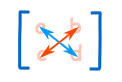
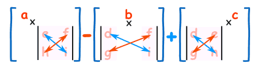
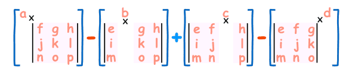

## 前言

学习一下 Hill 密码。

## 0x01 数学基础

参考了 [数学乐](https://www.shuxuele.com/algebra/matrix-introduction.html) 。没有详细介绍矩阵的意义，但基本运算规则之类的讲得很清楚好懂。

### 1.1 矩阵

一个矩阵就是n行m列的数字表格，含义暂不考虑，只学习下矩阵的表示方法、运算规则，不然有点难读懂 Hill 密码的规则。

一个有 *m* 行，*n* 列的矩阵 *A* 的书写形式如下。
$$
A=\begin{bmatrix}
	a_{11} & a_{12} & \dots & a_{1n} \\\\ a_{21} & a_{22} & \dots & a_{2n} \\\\ \vdots & \vdots & & \vdots \\\\ a_{m1} & a_{m2} & \dots & a_{mn} 
\end{bmatrix}
$$

### 1.2 矩阵加法/减法

矩阵加减法规则如下。设有矩阵 *A*、*B* 如下。
$$
A=\begin{bmatrix}
	a_{11} & a_{12} & \dots & a_{1n} \\\\ a_{21} & a_{22} & \dots & a_{2n} \\\\ \vdots & \vdots & & \vdots \\\\ a_{m1} & a_{m2} & \dots & a_{mn} 
\end{bmatrix},B=\begin{bmatrix}
	b_{11} & b_{12} & \dots & b_{1n} \\\\ b_{21} & b_{22} & \dots & b_{2n} \\\\ \vdots & \vdots & & \vdots \\\\ b_{m1} & b_{m2} & \dots & b_{mn} 
\end{bmatrix}
$$
则计算 A±B 的规则如下。
$$
A±B=\begin{bmatrix}
	a_{11}±b_{11} & a_{12}±b_{12} & \dots & a_{1n}±b_{1n} \\\\ a_{21}±b_{21} & a_{22}±b_{22} & \dots & a_{2n}±b_{2n} \\\\ \vdots & \vdots & & \vdots \\\\ a_{m1}±b_{m1} & a_{m2}±b_{m2} & \dots & a_{mn}±b_{mn}
\end{bmatrix}
$$
性质：

- **只有行列数相同的矩阵，加减法才有意义**
- **矩阵的加减法，就是矩阵中相同位置元素加减**
- 矩阵加减法满足 **交换律**（`A+B=B+A`） 和 **结合律** （`A+(B+C)=(A+B)+c`）

### 1.2 矩阵数乘

数λ乘矩阵 *A*，即使将数λ乘矩阵A中的每一个元素，记为 *λA* 或 *Aλ*。

特别的，称 *-A* 为 *A* 的负矩阵。

性质：

- 满足 **结合律** （`(λμ)A=λ(μA); (λ+μ)A=λA+μA`） 和 **分配律** （`λ(A+B)=λA+λB`）

### 1.3 矩阵乘法

先看矩阵的另一种表示形式：*A=(aij)mxs* ，这种表示形式中，*m* 表示行数，*s* 表示列数，*aij* 姑且当占位，表示矩阵元素。

设 *A=(aij)mxs* *B=(bij)sxn* ，则 *A=AB* 是这样一个矩阵：

1. 行数和左矩阵 *A* 相同，列数和右矩阵 *B* 相同，即 *C=(cij)mxn* 。
2. *C* 的第 *i* 行第 *j* 列的元素 *cij* 由 *A* 的第 *i* 行元素和 *B* 的第 *j* 列元素对应相乘，再取乘积之和。

举例来说，将这两个矩阵相乘。

$$
A=\begin{bmatrix}
	1 & 2 \\\\ 1 & -1
\end{bmatrix},B=
\begin{bmatrix}
	1 & 2 & -3 \\\\ -1 & 1 & 2
\end{bmatrix}
$$
结果是一个 2x3 的矩阵，每个元素计算如下：
$$
AB=\begin{bmatrix}
	(1×1+2×-1) & (1×2+2×1) & (1×-3+2×2) \\\\	(1×1+-1×-1) & (1×2+-1×1) & (1×-3+-1×2)
\end{bmatrix}=
\begin{bmatrix}
	-1 & 4 & 1 \\\\	2 & 1 & -5
\end{bmatrix}
$$
先用 *A* 的第1行，分别乘 *B* 的第1、2、3列，作为结果矩阵 *C* 的第1行。然后用 *A* 的第2行，分别乘 *B* 的第1、2、3列，作为结果矩阵 *C* 的第二行。

注意：相乘的矩阵应该满足条件，左侧矩阵列数等于右侧矩阵行数，计算才能进行。

性质（假设运算都是可行的）：

1. 符合结合律 *(AB)C=A(BC)*
2. 符合分配律 *A(B±C)=AB±AC* （左分配律）; *(B±C)A=BA±CA* （右分配律）
3. *(λA)B=λ(AB)=A(λB)*

### 1.4 矩阵转置

将 *A* 矩阵的行换成同序号的列所得到的新矩阵称为 *A* 的转置矩阵，记作 *A'* 或者 *AT* 。
$$
A=
\begin{bmatrix}
	1 & 0 & 3 & -1 \\\\ 2 & 1 & 0 & 2
\end{bmatrix},A'=A^T=
\begin{bmatrix}
	1 & 2 \\\\ 0 & 1 \\\\ 3 & 0 \\\\ -1 & 2
\end{bmatrix}
$$
性质：

1. *(A')'=A*
2. *(A+B)'=A'+B'*
3. *(AB)'=B'A'*
4. *(λA)'=λA'*，λ是常数

### 1.5 对称矩阵

如果矩阵 *A* 满足 *A'=A* ，即 *aij=aji* ，则称 *A* 为 **对称矩阵**。

对称矩阵的特点是它的元素以主对角线为对称轴对应相等。

举例如下。
$$
A=\begin{bmatrix}
	1 & 2 & 3 \\\\ 2 & 1 & 2 \\\\ 3 & 2 & 1
\end{bmatrix}
$$

尝试将这个矩阵转置，令 *aij=aji* ，得到下面的矩阵，发现的确和原矩阵相同。
$$
A'=\begin{bmatrix}
	a_{11} & a_{21} & a_{31} \\\\ a_{12} & a_{22} & a_{32} \\\\ a_{13} & a_{23} & a_{33}
\end{bmatrix}=
\begin{bmatrix}
	1 & 2 & 3 \\\\ 2 & 1 & 2 \\\\ 3 & 2 & 1
\end{bmatrix}
$$

而原矩阵关于主对角线对称。

### 1.6 单位矩阵

单位矩阵是除了主对角线上是1，其他数字都是0的矩阵。**任何矩阵和单位矩阵相乘都等于自身**。

比如下面这个 3x3 矩阵。
$$
I=\begin{bmatrix}
	1 & 0 & 0 \\\\ 0 & 1 & 0 \\\\ 0 & 0 & 1
\end{bmatrix}
$$

### 1.7 逆矩阵

如果有矩阵 *B* ，令 *BA=AB=I*，其中 *I* 为单位矩阵，则称 *B* 为 *A* 的逆矩阵，记为 *A-1* 。对任意矩阵 *A* ，逆矩阵并不一定存在。

逆矩阵的作用是一定程度上代替了矩阵除法运算（矩阵不能做除法），例如已知矩阵A、B，求矩阵X，有下面的式子。

*XA=B*

如果有除法，那可以直接移项 *X=B/A* ，但矩阵只能相乘，所以我们可以在两边都乘上 A 的逆矩阵 *A-1* 。

*XAA-1=BA-1*

因为 *AA-1* 得单位矩阵 *I* ，所以左侧就变成了 *XI*。又因为任何矩阵和单位矩阵相乘都等于自身，所以 *XI* 可以简化为 *X* 。于是就得到了：

*X=BA-1*

但是要**注意次序**！ *AX=B* 不能用上述方法做，因为**矩阵乘法不一定满足结合律** （*AB=BA*），对于 *AX=B* 的情况，可以将 *A-1* 放在式子之前，也就是 *A-1AX=A-1B* 。

### 1.8 行列式（拉普拉斯展开）

矩阵 A 的行列式记为 *|A|* ，和绝对值符号一样。只有**方形矩阵**才能计算行列式。方形矩阵就是行和列数目相等的矩阵。

首先看 2x2 矩阵。
$$
A=\begin{bmatrix}
	a & b \\\\ c & d
\end{bmatrix},|A|=ad-bc
$$
2x2矩阵的行列式就是简单的交叉相乘再相减。下图中蓝色是正，红色是负。

再看 3x3 矩阵的行列式写法，用矩阵第一行的元素，逐个去乘不在和这个元素同一行同一列元素的行列式，最后把这些值用加减号连起来。
$$
\begin{vmatrix}
	a & b & c \\\\ d & e & f \\\\ g & h & i
\end{vmatrix}=
a
\begin{vmatrix}
	e & f \\\\ h & i
\end{vmatrix}
-b
\begin{vmatrix}
	d & f \\\\ g & i
\end{vmatrix}
+c
\begin{vmatrix}
	d & e \\\\ g & h
\end{vmatrix}
=a(ei-fh)-b(di-fg)+c(dh-eg)
$$
更直观的图形化表示：

注意这个过程中的加减符号规律，*a11×(...)* 是正，*a12×(...)* 是负，*a13×(...)* 又是正。

知晓这些规律后再看更大的矩阵，也可以依葫芦画瓢写出行列式。

留意其中正负号出现的规律，*+a11* *-a12* *+a13* *-a14* 。

这种计算方法叫做 **拉普拉斯展开** 。

### 1.9 求逆矩阵的方法

- 2x2 矩阵的逆矩阵
- 初等行运算
- 余子式、代数余子式和伴随来求逆矩阵

2x2 矩阵的逆矩阵是：
$$
A^{-1}=\begin{bmatrix}
	a & b \\\\ c & d
\end{bmatrix}^{-1}=
\frac{1}{|A|}
\begin{bmatrix}
	d & -b \\\\ -c & a
\end{bmatrix}
$$

1. 调换 *a11* 和 *a22*
2. *a12* 和 *a21* 加上负号
3. 除以原矩阵的行列式

3x3 或更大的矩阵的逆矩阵求法可以用 [初等行运算](https://www.shuxuele.com/algebra/matrix-inverse-row-operations-gauss-jordan.html) 或 [用余子式、代数余子式和伴随 来求逆矩阵](https://www.shuxuele.com/algebra/matrix-inverse-minors-cofactors-adjugate.html) 。

## 0x02 Hill 密码

### 2.1 加密过程

首先给定一个密码矩阵 *A*。
$$
A=\begin{bmatrix}
	1 & 2 \\\\	3 & 4
\end{bmatrix}
$$

再给出明文：*The quick brown fox jumps over the lazy dog*

将明文转换成数字（ASCII），两个一组。比如 `Th` 就是 `84 104` ，写成矩阵形式就是这样。

$$
P=\begin{bmatrix}
	84 \\\\    104
\end{bmatrix}
$$

将密码矩阵 *A* 左乘明文矩阵 *P* ，*C=AP*，我们就得到了密文。

$$
C=AP=\begin{bmatrix}
	1 & 2 \\\\	3 & 4
\end{bmatrix}
\begin{bmatrix}
	84 \\\\	104
\end{bmatrix}=
\begin{bmatrix}
	292 \\\\	668
\end{bmatrix}
$$

### 2.2 解密过程

解密过程就是利用密码矩阵的逆矩阵 *A-1* ，从密文求明文的过程，公式 *A-1C=A-1AP* 。

2x2 矩阵的逆矩阵求解方法看前面 1.9，求得逆矩阵如下。

$$
A^{-1}=\begin{bmatrix}
	-2 & 1 \\\\	1.5 & -0.5
\end{bmatrix}
$$

然后使用逆矩阵左乘密文：

$$
P=A^{-1}C=\begin{bmatrix}
	-2 & 1 \\\\	1.5 & -0.5
\end{bmatrix}
\begin{bmatrix}
	292 \\\\	668
\end{bmatrix}=
\begin{bmatrix}
	84 \\\\	104
\end{bmatrix}
$$

即可得到明文。

### 2.3 安全性

Hill密码的安全性体现在隐藏了单个字母的频率信息，加密矩阵越大效果越好。

Hill密码无法抵抗已知明文攻击，已知明文和密文时完全可以计算出加密矩阵。

## 总结

重点：

1. 矩阵乘法、单位矩阵、行列式和逆矩阵

Hill密码是将明文转为矩阵后和加密矩阵相乘，加密矩阵即为加密密钥，加密矩阵越大效果越好。解密使用加密矩阵的逆矩阵作为密钥。

Hill 密码能隐藏字母频率信息，对抗仅密文分析，但无法对抗已知明文分析。
