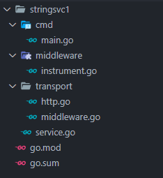
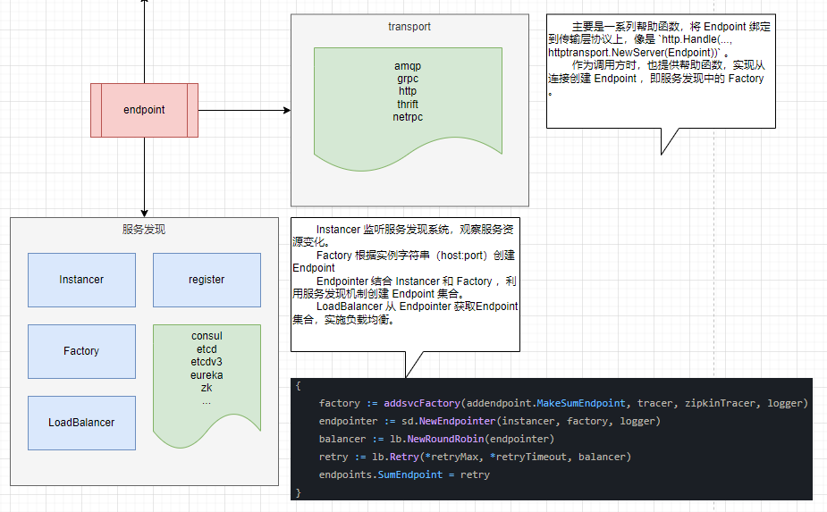
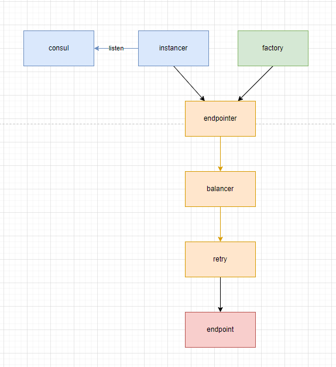
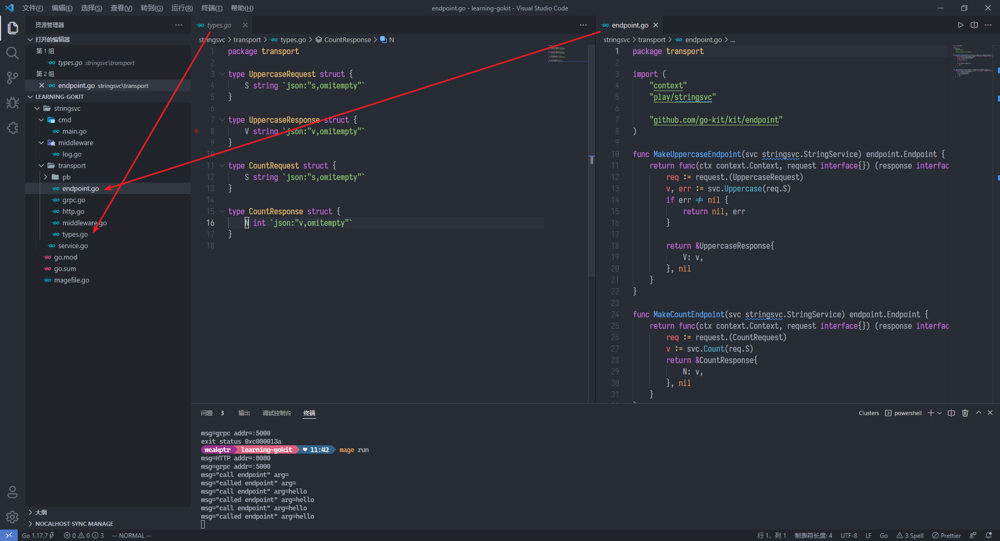
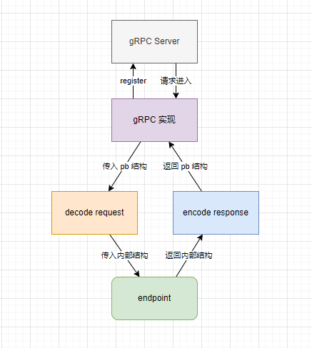

## 前言

初步看了下 gokit 的案例 `stringsvc`和`apigateway`，记录一下对 gokit 的映像。

## gokit定位

> **Go kit** is a **programming toolkit** for building microservices (or elegant monoliths) in Go. We solve common problems in distributed systems and application architecture so you can focus on delivering business value.
>
> Go has emerged as the language of the server, but it remains underrepresented in so-called "modern enterprise" companies like Facebook, Twitter, Netflix, and SoundCloud. Many of these organizations have turned to JVM-based stacks for their business logic, owing in large part to libraries and ecosystems that directly support their microservice architectures.
>
> To reach its next level of success, Go needs more than simple primitives and idioms. It needs a comprehensive toolkit, for coherent distributed programming in the large. Go kit is a set of packages and best practices, which provide a comprehensive, robust, and trustable way of building microservices for organizations of any size.

gokit 大概算是框架，因为和 gokit 打交道基本离不开 gokit 定义的几个接口类型。用 gokit 开发服务的可定制性很强，几乎每个细节都可以控制。

而实际上手体验下来，缺点大概就是海量的样板代码，实现一个服务需要大量的适配代码来控制 Endpoint 。又因为 Go 语言表现力不足，也没有运行时元编程的能力，这些样板代码只能靠代码生成来解决。

还好 gokit 自己也知道，在仓库首页就提供了很多代码生成器的链接。

用 gokit 还有一个好处是一定程度上避免技术栈绑定在某个特定平台或者框架上，毕竟 gokit 比起框架，更像是一个工具箱，组件之间没有特别的依赖关系，顺手就用，不顺手可以换个锤子。

## 框架搭建

### 鸟瞰

gokit 编写的服务有几个基本元素，这些基本元素都是围绕 **Endpoint** 接口转的，gokit 自己把 Endpoint 称为 *构建服务器和客户端的基本块* 。

几个基本元素是：

- 服务接口定义 `type StringService interface { /*...*/ }`
- 应用级中间件定义 `type AppMiddleware struct {} // implement StringService`
- 传输层接口定义，包括 `Endpoint` 定义、序列化、服务发现等
- 传输层中间件定义，`type Middleware func(Endpoint) Endpoint`

此外还有一些可选的组件：

- `tracing`，分布式跟踪
- `ratelimit`，限流
- `metrics`，指标收集
- `log`，日志收集
- `circuitbreaker`，熔断
- `auth`，身份认证

我自己整的目录结构如下。



服务本质是一系列接口的集合，gokit 的 tutorial 中将服务抽象成了一个 `interface` ，在这个接口上用户可以提供不同实现。像是服务端、客户端、中间件，不管传输层怎么定义，最终实现的都是这个接口。

```go
type StringService interface {
	Uppercase(string) (string, error)
	Count(string) int
}
```

微服务的开发者提供这个接口的实现。

```go
type StringServiceImpl struct{}

func (s *StringServiceImpl) Uppercase(arg string) (string, error) {
	if arg == "" {
		return "", nil
	}
	return strings.ToUpper(arg), nil
}

func (s *StringServiceImpl) Count(arg string) int {
	return len(arg)
}
```

然后通过某种传输层协议暴露给调用方。

```go
func MakeUppercaseEndpoint(svc stringsvc1.StringService) endpoint.Endpoint {
	return func(ctx context.Context, request interface{}) (interface{}, error) {
		req := request.(UppercaseRequest)
		v, err := svc.Uppercase(req.S)
		if err != nil {
			return nil, err
		}

		return &UppercaseResponse{
			V: v,
		}, nil
	}
}

// ... 略

func main() {
	logger := log.NewLogfmtLogger(os.Stderr)
	svc := &stringsvc1.StringServiceImpl{}

	uppercase := transport.MakeUppercaseEndpoint(svc)
	uppercaseHandler := httptransport.NewServer(uppercase, transport.DecodeUppercaseRequest, transport.EncodeResponse)
	http.Handle("/uppercase", uppercaseHandler)

	count := transport.MakeCountEndpoint(svc)
	countHandler := httptransport.NewServer(count, transport.DecodeCountRequest, transport.EncodeResponse)
	http.Handle("/count", countHandler)

	logger.Log("msg", "HTTP", "addr", ":8080")
	logger.Log("err", http.ListenAndServe(":8080", nil))
}
```

一个简单的服务提供方需要做的就是这些。下面具体看看其中涉及的概念。

### endpoint 解析

一个最简单的服务 `Endpoint` 定义如下。

```go
package main

import (
	"context"
	"encoding/json"
	"net/http"
	"os"
	"strings"

	httptransport "github.com/go-kit/kit/transport/http"
	"github.com/go-kit/log"
)

type uppercaseRequest struct {
	S string `json:"s,omitempty"`
}

type uppercaseResponse struct {
	S string `json:"s,omitempty"`
}

func main() {
	logger := log.NewLogfmtLogger(os.Stderr)

	http.Handle("/uppercase", httptransport.NewServer(
		// endpoint 定义
		func(ctx context.Context, request interface{}) (response interface{}, err error) {
			req := request.(uppercaseRequest)
			if req.S == "" {
				return uppercaseResponse{""}, nil
			}
			return uppercaseResponse{strings.ToUpper(req.S)}, nil
		},
		// 请求 decoder
		func(c context.Context, r *http.Request) (interface{}, error) {
			var request uppercaseRequest
			if err := json.NewDecoder(r.Body).Decode(&request); err != nil {
				return nil, err
			}
			return request, nil
		},
		// 响应 encoder
		func(c context.Context, w http.ResponseWriter, response interface{}) error {
			return json.NewEncoder(w).Encode(response)
		},
	))

	logger.Log("msg", "HTTP", "addr", ":8080")
	logger.Log("err", http.ListenAndServe(":8080", nil))
}

```

`Endpoint` 本质是一个函数，类型签名如下。

```go
// Endpoint is the fundamental building block of servers and clients.
// It represents a single RPC method.
type Endpoint func(ctx context.Context, request interface{}) (response interface{}, err error)
```

`Endpoint` 抽象了 RPC 调用，隐藏了调用对象是“本地”还是“远程”的。像是上面的案例里，`Endpoint` 背后是本地的代码。而在客户端使用`Endpoint`时，`Endpoint`的背后往往是传输层代码，发起了一次远程调用。

`Endpoint` 本身不做请求/响应的编解码工作，进入 `Endpoint` 的都是已经准备好的结构化数据。

### endpoint.Middleware 解析

`endpoint.Middleware` 是在 `Endpoint` 上包装的中间件，签名如下。

```go
// Middleware is a chainable behavior modifier for endpoints.
type Middleware func(Endpoint) Endpoint
```

和 `gin` 之类的框架中间件体系很相似，都是基于高阶函数的方式。一个简单的日志中间件实现如下。

```go
import (
	"context"

	"github.com/go-kit/kit/endpoint"
	"github.com/go-kit/log"
)

func LoggingMiddleware(logger log.Logger) endpoint.Middleware {
	return func(next endpoint.Endpoint) endpoint.Endpoint {
		return func(ctx context.Context, request interface{}) (interface{}, error) {
			logger.Log("msg", "calling endpoint")
			defer logger.Log("msg", "called endpoint")
			return next(ctx, request)
		}
	}
}
```

像这样定义的中间件用法也很简单，以 `Endpoint` 为参数调用即可。

```go
LoggingMiddleware(log.With(logger, "method", "method-name"))(endpoint)
```

说起这个我就怀念 python 的装饰器。

### 应用中间件

应用中间件不算是 gokit 的一部分，gokit 的示例中给出了[应用级中间件的做法](http://gokit.io/examples/stringsvc.html#application-logging)。实话说我不喜欢。

所谓的应用中间件做法其实就是再定义一个结构，实现你的服务接口，然后在实现的服务接口里加上需要的中间件代码。

如果要说有什么好处的话，就是满足了类型约束，免去了用 `reflect`。`Endpoint`一级的中间件只能拿到一个 `request interface{}` ，但下面这样写的话，参数就是已经填好的了，服务实现里拿到什么参数这个中间件就拿到什么参数。但问题也很明显——为了满足 `type Service interface` 的约束，这样的中间件必须把服务的所有接口都写个 stub 。就算是用编辑器的 `generate interface stubs` 功能也没法直接帮你填好转发参数的代码啊...

我自己倒是折腾出一个有点怪的解法，利用 go 的 embed 字段和动态分发机制，部分实现了有继承的语言里的 override 。

```go
import (
	"play/stringsvc1"

	"github.com/go-kit/log"
)

type LoggingMiddleware struct {
	stringsvc1.StringService // LoggingMiddleware 自己没有实现全部的 stringsvc1.StringService 接口，但这个 embed 字段实现了
	Logger log.Logger
}

// 这个实现覆盖掉了结构里的 stringsvc1.StringService.Uppercase 暴露的实现
// 然后内部又使用了 `.StringService.Uppercase` 这种语法来调用结构里的 
// stringsvc1.StringService.Uppercase 实现
// 就像是有继承的语言里子类通过 super() 或者 ParentClass::Uppercase 这样的方式调用父类实现一样。
func (m *LoggingMiddleware) Uppercase(s string) (string, error) {
	m.Logger.Log("msg", "call endpoint", "arg", s)
	defer m.Logger.Log("msg", "called endpoint", "arg", s)
	return m.StringService.Uppercase(s)
}

```

通过这种办法倒是实现了应用级的特定接口中间件。但还要另外定义一个 `struct` 也比较麻烦。

贴一下示例里的代码。

```go
// middleware.go
type loggingMiddleware struct {
	logger log.Logger
	next   StringService
}

func (mw loggingMiddleware) Uppercase(s string) (output string, err error) {
	defer func(begin time.Time) {
		mw.logger.Log(
			"method", "uppercase",
			"input", s,
			"output", output,
			"err", err,
			"took", time.Since(begin),
		)
	}(time.Now())

	output, err = mw.next.Uppercase(s)
	return
}
```

```go
// main.go
import (
	"os"

	"github.com/go-kit/kit/log"
	httptransport "github.com/go-kit/kit/transport/http"
)

func main() {
	logger := log.NewLogfmtLogger(os.Stderr)

	var svc StringService
	svc = stringService{}
	svc = loggingMiddleware{logger, svc}

	// ...

	uppercaseHandler := httptransport.NewServer(
		makeUppercaseEndpoint(svc),
		// ...
	)
}
```

### 客户端实现

客户端实现可以很简单，同样有很强的扩展性。比如说可以结合服务发现、负载均衡、频率限制、熔断器实现一个功能强大的客户端。

先从简单的开始。一般考虑客户端实现的话，会准备一个特殊的结构来保存服务的 `Endpoint`，再对这个结构实现服务定义的接口。

```go
// https://github.com/go-kit/examples/blob/master/addsvc/pkg/addendpoint/set.go

// Set collects all of the endpoints that compose an add service. It's meant to
// be used as a helper struct, to collect all of the endpoints into a single
// parameter.
type Set struct {
	SumEndpoint    endpoint.Endpoint
	ConcatEndpoint endpoint.Endpoint
}

// Sum implements the service interface, so Set may be used as a service.
// This is primarily useful in the context of a client library.
func (s Set) Sum(ctx context.Context, a, b int) (int, error) {
	resp, err := s.SumEndpoint(ctx, SumRequest{A: a, B: b})
	if err != nil {
		return 0, err
	}
	response := resp.(SumResponse)
	return response.V, response.Err
}

// ... 略
```

这么做的好处是可以像是调用 Go 方法一样去调用 RPC 函数，比起 `grpc` 一类的调用方式来说更直观了。

客户端的 `Endpoint` 的构造方式和服务器不一样，隐藏在 `Endpoint` 背后的不是本地代码，而是一个网络请求。

```go
// Each individual endpoint is an http/transport.Client (which implements
// endpoint.Endpoint) that gets wrapped with various middlewares. If you
// made your own client library, you'd do this work there, so your server
// could rely on a consistent set of client behavior.
var sumEndpoint  = httptransport.NewClient(
    "POST",
    copyURL(u, "/sum"),
    encodeHTTPGenericRequest,
    decodeHTTPSumResponse,
).Endpoint()
```

`github.com/go-kit/kit/transport` 这个包提供了很多有用的助手函数来帮助构造 `Endpoint` ，以及黏合服务端的 `Endpoint` 到传输层代码。（PS：请回顾前文中使用的 `httptransport.NewServer`）

### 服务发现

参考 [apigateway](https://github.com/go-kit/examples/blob/master/apigateway/main.go) 的代码。

```go
// Each method gets constructed with a factory. Factories take an
// instance string, and return a specific endpoint. In the factory we
// dial the instance string we get from Consul, and then leverage an
// addsvc client package to construct a complete service. We can then
// leverage the addsvc.Make{Sum,Concat}Endpoint constructors to convert
// the complete service to specific endpoint.
var (
    tags        = []string{}
    passingOnly = true
    endpoints   = addendpoint.Set{}
    instancer   = consulsd.NewInstancer(client, logger, "addsvc", tags, passingOnly)
)
{
    factory := addsvcFactory(addendpoint.MakeSumEndpoint, tracer, zipkinTracer, logger)
    endpointer := sd.NewEndpointer(instancer, factory, logger)
    balancer := lb.NewRoundRobin(endpointer)
    retry := lb.Retry(*retryMax, *retryTimeout, balancer)
    endpoints.SumEndpoint = retry
}
```



总得来说，go kit 的服务发现机制靠客户端以特定的方式构造 `Endpoint` ，这和反向代理或者 side-car 代理实现的服务发现不一样。

比如说 kubernetes 的 ClusterIP 基于 kube-proxy，后端有多个 POD 的时候 kube-proxy 会自动进行负载均衡，但算法是 kube-proxy 实现决定的，不可依赖。

再比如 nginx 也能一定程度实现服务发现和负载均衡。

再比如，linkerd 这样的 service mesh，非侵入，提供负载均衡、服务发现、重试这些功能。

go kit 的工具箱里提供的是客户端的负载均衡机制。上图里的代码可以用下图表示。



### 多传输层实现

这里尝试实现 `http` 和 `grpc` 两种 rpc 传输层协议。首先为了保证最大化复用代码，在 `http` 实现中定义的结构和 endpoint 肯定是要复用起来的，不然每个传输层都来一次的话没codegen非得手指敲断不可。

先提取 `makeXXXEndpoint` 代码和 `XXXRequest` 这样的结构到单独的文件里。



思路上部分参考的 gokit 案例中 `addsvc`，[链接](https://github.com/go-kit/examples/blob/master/addsvc/README.md)。

proto 文件如下。

```protobuf
// play/stringsvc/transport/pb/stringsvc.proto
syntax = "proto3";
option go_package = "play/stringsvc/transport/pb";

message UppercaseRequest { string s = 1; }

message UppercaseResponse { string v = 1; }

message CountRequest { string s = 1; }

message CountResponse { int32 n = 1; }

service StringService {
  rpc Uppercase(UppercaseRequest) returns (UppercaseResponse);
  rpc Count(CountRequest) returns (CountResponse);
}
```

然后使用 protoc 生成 go 源码，具体参考 [gRPC 的官方文档](https://www.grpc.io/docs/languages/go/quickstart/)。继续下一步之前要先了解 go 语言的 gRPC 服务框架在一般情况下怎么实现。同样建议直接看文档。简单说就是写一个结构，实现 protoc 根据你的 proto 文件生成的接口，最后调用注册方法把你的实现注册到 gRPC 服务器上就可以了。

再考虑请求进入我们的服务代码要经过的流程，gRPC 接口的实现要做事情其实就是把 proto 定义的结构转换成我们之前定义的结构，再调用之前定义的 `Endpoint` 。



其中对请求编解码是个很无聊的过程，字段一一赋值即可。endpoint 继续复用先前 http 的版本。gRPC 实现比较取巧，我们把所有 `Endpoint` 放到一个结构里保存，然后实现 gRPC 的接口。

```go
import (
	"context"
	"play/stringsvc"
	"play/stringsvc/transport/pb"

	grpctransport "github.com/go-kit/kit/transport/grpc"
)

type set struct {
	*pb.UnimplementedStringServiceServer
	uppercase grpctransport.Handler
	count     grpctransport.Handler
}

func NewGRPCServer(svc stringsvc.StringService) *set {
	return &set{
		uppercase: grpctransport.NewServer(MakeUppercaseEndpoint(svc), decodeUppercaseRequestGRPC, encodeUppercaseResponseGRPC),
		count:     grpctransport.NewServer(MakeCountEndpoint(svc), decodeCountRequestGRPC, encodeCountResponseGRPC),
	}
}

func (s *set) Uppercase(ctx context.Context, req *pb.UppercaseRequest) (*pb.UppercaseResponse, error) {
	_, resp, err := s.uppercase.ServeGRPC(ctx, req)
	if err != nil {
		return nil, err
	}
	return resp.(*pb.UppercaseResponse), nil
}

func (s *set) Count(ctx context.Context, req *pb.CountRequest) (*pb.CountResponse, error) {
	_, resp, err := s.count.ServeGRPC(ctx, req)
	if err != nil {
		return nil, err
	}
	return resp.(*pb.CountResponse), nil
}
```

这里利用了一个 `github.com/go-kit/kit/transport/grpc` 的帮助结构，`grpctransport.NewServer` 创建的 `grpctransport.Server`。这个结构的用途和 `httptransport.NewServer`一样，本质上是一个适配器，把 gRPC 的输入适配到我们定义的服务接口。理论上来说不用这玩意儿也没事，但实现代码里就要显式调用 `Decode`和`Encode`。从解耦的角度来说这种设计会更好。

## 总结

之所以说 gokit 大概算是框架，是因为 gokit 提供的这些工具其实有一套自己的最佳实践，但并不强迫遵循。比如 transport 并不是一定要用 gokit 的 transport ，完全可以自己写 `http.Handler` ，把 encode/decode 写到一起。也可以把其他方式编写的 RPC 封装成 `Endpoint`，获得 gokit 提供的一系列支持。

gokit 提供了很多有用的工具，解决一些诸如服务发现、熔断器、分布式跟踪和可观测性这样的问题。gokit 的案例代码示范的实践方式也很有启发性。

