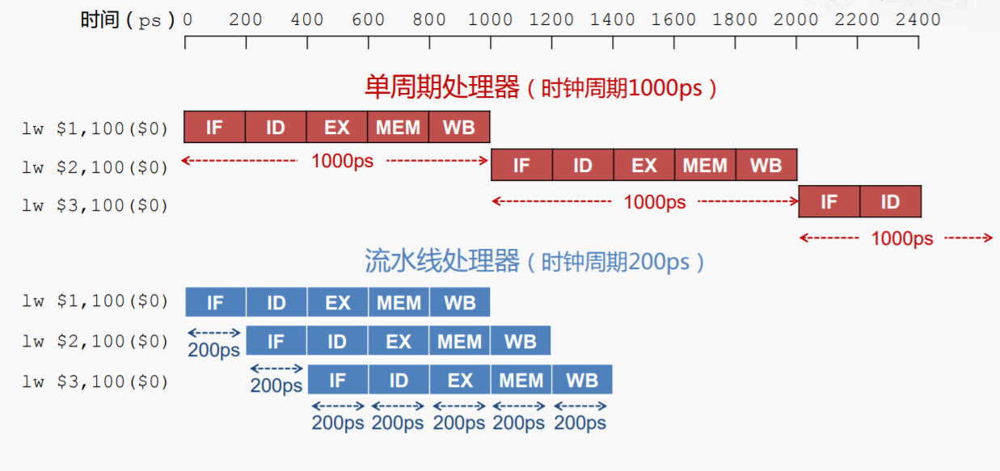
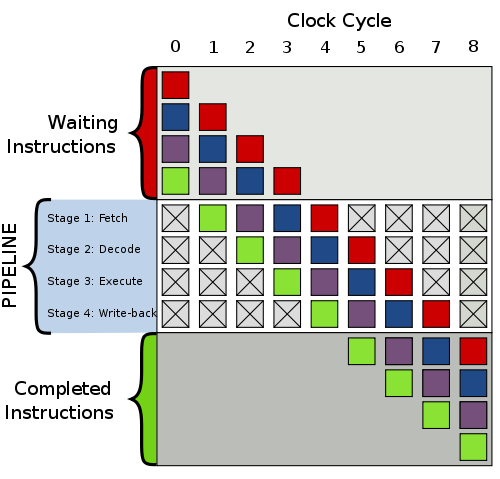

## 前言

还是从 *Igor Ostrvsky* 的博客里发现的一篇有意思的文章，[Fast and slow if-statements: branch prediction in modern processors](http://igoro.com/archive/fast-and-slow-if-statements-branch-prediction-in-modern-processors/) 开始。

## 分支预测对性能的影响

### 介绍

[分支预测器 - Wikipedia](https://zh.wikipedia.org/wiki/%E5%88%86%E6%94%AF%E9%A0%90%E6%B8%AC%E5%99%A8) 我直接抄一段。

> 在[计算机体系结构](https://zh.wikipedia.org/wiki/電腦架構)中，**分支预测器**（英语：Branch predictor）是一种[数字电路](https://zh.wikipedia.org/wiki/數位電路)，在分支指令执行结束之前猜测哪一路[分支](https://zh.wikipedia.org/wiki/分支_(計算機科學))将会被执行，以提高处理器的[指令流水线](https://zh.wikipedia.org/wiki/指令流水线)的性能。使用分支预测器的目的，在于改善[指令流水线](https://zh.wikipedia.org/wiki/指令管線化)的流程，就像一家公司的员工提前预测公司所需要的东西，即交付不同单位进行准备工作，而那各个部门之间的等待交办的时间大大地缩短，整个公司的效率就会提高了。现代使用[指令流水线](https://zh.wikipedia.org/wiki/指令管線化)处理器的性能能够提高，分支预测器对于现今的指令流水线微处理器获得高性能是非常关键的技术。

现代 CPU 的分支预测没有 *Igor Ostrvsky* 的博客里写的分支预测器那么傻了，实际上，那篇博客里的代码在 i5-6600 的环境下跑起来，`TTFF`或者`TTTTFFFF`甚至比`TTTT`还要快。那篇博客创作于 2010 年， 而 Skylake 架构在 2015 年替代 Broadwell 架构，而现在是 2022年， Intel 已经发布了 GoldenCove ，AMD 也要发 Zen 4了。内容过时不可避免。

所以这篇博客主要还是聊一下分支预测对性能的影响，但大概总结不出 Igor Ostrvsky 的博客里的规律。顺带一提，不要随便针对分支预测优化，要是有人看了 Igor Ostrvsky 那篇博客费了老大功夫优化成连续 T/F 分支，换上新 CPU 之后性能还倒退这能找谁说理去。针对微架构分支预测失败回退做优化我还在爆栈上看到个回答很有意思，[avoid stalling pipeline by calculating conditional early](https://stackoverflow.com/questions/49932119/avoid-stalling-pipeline-by-calculating-conditional-early) ，很难想到还能用这种办法榨干 CPU 的每一滴性能。

### 基准测试

这个基准测试的主要目的是体现出分支预测失败对执行时间的影响，测试方法是喂 10MB 的随机 T/F ，为 T 时计数器 +1。除了输入数据外测试代码一样。

```c++
#include <iostream>
#include <functional>
#include <chrono>
#include <stdlib.h>
#include <vector>
#include <cstdlib>

using namespace std;
using namespace std::chrono;

void benchmark(const string name, uint32_t loops, function<void(void)> fn) {
    milliseconds sum = 0ms, lowest = 0ms, highest = 0ms;

    for (int i = 0; i < loops; i++) {
        auto start = system_clock::now();
        fn();
        auto stop = system_clock::now();

        auto d = duration_cast<milliseconds>(stop - start);
        sum += d;
        lowest = lowest == 0ms ? d : min(lowest, d);
        highest = max(highest, d);
    }

    cout << name;
    cout << " avg: " << sum.count() / loops << "ms";
    cout << " best: " << lowest.count() << "ms";
    cout << " worst: " << highest.count() << "ms";
    cout << " total: " << sum.count() << "ms";
    cout << endl;
}

int main(void) {
    srand(duration_cast<seconds>(system_clock::now().time_since_epoch()).count());
    vector<int> always_true, unpredictable;
    always_true.resize(1024 * 1024 * 10, 1);
    unpredictable.resize(1024 * 1024 * 10, 1);
    for (auto &i : unpredictable) {
        i = rand() % 2;
    }

    benchmark("always true", 100, [&always_true]() {
        int sum = 0;
        for (auto i : always_true) {
            if (i) {
                sum++;
            }
        }
    });

    benchmark("unpredictable", 100, [&unpredictable]() {
        int sum = 0;
        for (auto i : unpredictable) {
            if (i) {
                sum++;
            }
        }
    });
    return 0;
}
```

使用 clang++ 编译

```bash
# clang version 13.0.0
# Target: x86_64-pc-windows-msvc
# Thread model: posix
# InstalledDir: C:\Program Files\LLVM\bin
clang++.exe -m32 -O0 -g -std=c++20 .\branch-prediction-1.cpp -o branch-prediction-1.exe
```

统计平均、最佳、最差耗时，输出结果如下。

```plaintext
always true avg: 120ms best: 116ms worst: 246ms total: 12056ms
unpredictable avg: 191ms best: 184ms worst: 265ms total: 19115ms
```

可以看到，数据量相同的情况下，输入数据是随机 T/F 的平均耗时比总为真的耗时高出 50%，总耗时多出 7 秒左右（差不多也是50%多一点）。可想而知，如果输入数据更有规律（比如前半段都是T后半段都是F），数据量不变的情况下，性能也会有相当不错的提高。

顺便我还要说一下这个基准测试不够好，应该每个测试循环都生成一次随机数输入的。

### 分支预测扮演的角色

这还得从CPU执行指令的过程说起。这里聊的 CPU 执行一条指令需要经过下面的步骤，称作流水线。计算机组成原理课应该有说。

- 取指 (fetch)
- 译码 (decode)
- 执行 (算数指令走 ALU)
- 访问主存 (Load/Store)
- 写回



更简化一点的话可以把ALU算数运算和访存都算作指令的“执行”阶段，CPU就是在不断循环执行这四个动作。



流水线处理器为了充分利用硬件，在译码上一条指令时，就开始取指下一条指令了，执行速度可以是单周期处理器的很多倍。显然流水线越长，每个阶段的耗时越短，整体执行的效率就越高。

如果指令一直按顺序执行，流水线只要不断加长加快就能获得更高的性能，但“分支”打破了这个美梦。一个简短的例子如下。

```asm
loop:
inc eax
cmp eax,ebx
jne loop
call exit
```

CPU 从 `cmp eax,ebx` 开始，取指 `jne loop`。译码 `jne loop` 时，问题来了，接下来是取指 `call exit` 还是 `inc eax`？

此时我们还不知道 `cmp eax,ebx` 的结果，CPU 能做的事情只有：傻等(stall)，或者猜测下一条要执行的指令是什么(predict)。

现代处理器的流水线长度可以达到几十，如果 CPU 遇到需要上一条指令的结果来继续下一条指令就开始等，那么流水线就不得不闲置到上一条指令完成，结果就是分支指令的代价会是其他指令的几十倍，对循环语句来说是个噩耗。

影响流水线效率的还有其他元素，比如说上面的 取值-译码-执行-写回 过程里，四个阶段的执行速度也是不同的。通常取值和译码的速度更慢，执行写回更快。如何尽可能让每个执行单元都不浪费时间等待，也是个难题。

关于流水线，[Perf IPC 以及 CPU 利用率](https://plantegg.github.io/2021/05/16/Perf_IPC%E4%BB%A5%E5%8F%8ACPU%E5%88%A9%E7%94%A8%E7%8E%87/) 这篇文章感觉不错。

继续说。既然让流水线退化到单周期不可取，那就瞎猜一个，先把流水线填满再说呗，反正不会比傻等更差了。于是就有了分支预测器：虽然是瞎猜，但尽可能猜得准一点总没坏处。

### 减少分支预测失败的损失

实话说我不确定这个代价有多大，因为没法控制失败率，不知道现在正在用的 CPU 的分支预测器是怎么工作的。

直接构造随机的 T/F 序列是一种办法，前面的基准测试已经验证了随机 T/F 干扰分支预测会产生接近 50% 的多余开销。那么有没有办法降低分支预测失败的损失呢？怎么让 CPU 更早发现到分支预测失败，减少要抛弃、清空的流水线长度？

参考前面爆栈的链接 [avoid stalling pipeline by calculating conditional early](https://stackoverflow.com/questions/49932119/avoid-stalling-pipeline-by-calculating-conditional-early) ，我简单写一个基准测试看看。

```c++
#include <iostream>
#include <functional>
#include <chrono>
#include <vector>
#include <cstdlib>
#include <random>

using namespace std;
using namespace std::chrono;

milliseconds time_it(function<void(void)> fn) {
    auto start = system_clock::now();
    fn();
    auto stop = system_clock::now();
    return duration_cast<milliseconds>(stop - start);
}

void benchmark(const string name, uint32_t loops, function<void(void)> fn) {
    milliseconds sum = 0ms, lowest = 0ms, highest = 0ms;

    for (int i = 0; i < loops; i++) {
        auto d = time_it(fn);
        sum += d;
        lowest = lowest == 0ms ? d : min(lowest, d);
        highest = max(highest, d);
    }

    cout << name;
    cout << " avg: " << sum.count() / loops << "ms";
    cout << " best: " << lowest.count() << "ms";
    cout << " worst: " << highest.count() << "ms";
    cout << " total: " << sum.count() << "ms";
    cout << endl;
}

typedef struct my_node {
    int value;
    my_node *next;

    my_node() : value(0), next(nullptr) {}
} my_node;

typedef struct my_list {
    int length;
    my_node *head;
    my_node *last;

    my_list() : length(0), head(nullptr), last(nullptr) {}
    void append() {
        if (head == nullptr) {
            head = new my_node();
            last = head;
        } else {
            last->next = new my_node();
            last = last->next;
        }
        length++;
    }
} my_list;

void sum_sentinel(my_list list) {
    int sum = 0;
    for (auto cur = list.head; cur != nullptr; cur = cur->next) {
        sum += cur->value;
    }
}

void sum_counter(my_list list) {
    int sum = 0;
    my_node *cur = list.head;
    for (int i = 0; i < list.length; cur = cur->next, i++) {
        sum += cur->value;
    }
}

int main(void) {
    vector<my_list> lists;
    lists.resize(10000000);

    random_device rd;
    mt19937 gen(rd());
    uniform_int_distribution<int> dist(0, 10);
    for (auto &list : lists) {
        auto node_count = dist(gen);
        for (int i = 0; i < node_count; i++) {
            list.append();
        }
    }

    benchmark("sentinel", 100, [&lists]() {
        for (auto list : lists) {
            sum_sentinel(list);
        }
    });

    benchmark("counter", 100, [&lists]() {
        for (auto list : lists) {
            sum_counter(list);
        }
    });

    return 0;
}
```

输出结果

```plaintext
sentinel avg: 471ms best: 470ms worst: 502ms total: 47178ms
counter avg: 407ms best: 402ms worst: 512ms total: 40726ms
```

这简直是黑魔法！`sum_counter`明显需要执行更多的指令，但执行速度比指令更少的`sum_sentinel`平均快70ms！

造成慢的原因是一样的，因为分支预测失败，我们以上面的4阶段流水线来分析，假设每个阶段要一个时钟周期，等CPU发现取错了指令（比如译码完了`add`，发现`cur!=nullptr`是F），于是浪费了两个时钟周期。这被称为 *front end bubble* 。参考 cloud flare 的这篇博客，[branch predictor](https://blog.cloudflare.com/branch-predictor/) 。这个 *front end* 指的是 CPU 微架构中流水线的前端，形象地看，流水线就像是一节一节的水管，指令填满每一节水管，流向下一节。分支预测失败就像是中间一节水管突然空了，后面的指令继续推着空气（预测错误的指令）往前走，就成了水管里的一个泡泡。

但 `sum_counter` 快的原因更神奇：因为指令排列的顺序，让分支预测依赖的指令更早进入流水线，因此分支指令进入流水线后，分支预测会更快发现预测错误。见下面的汇编代码。

```asm
<sum_sentinel(list_head)>:
test   rsi,rsi
je     1fe <sum_sentinel(list_head)+0x1e>
xor    eax,eax
loop:
add    eax,DWORD PTR [rsi] ; --- 1
mov    rsi,QWORD PTR [rsi+0x8] ; --- 2
test   rsi,rsi ; --- 3
jne    loop ; --- 4
cdqe   ; --- 5
ret    ; --- 6


<sum_counter(list_head)>:
test   edi,edi
jle    1d0 <sum_counter(list_head)+0x20>
xor    edx,edx
xor    eax,eax
loop:
add    edx,0x1 ; --- 1
add    eax,DWORD PTR [rsi] ; --- 2
mov    rsi,QWORD PTR [rsi+0x8] ; --- 3
cmp    edi,edx ; --- 4
jne    loop: ; --- 5
cdqe   ; --- 6
ret    
```

想象有一颗 CPU 有 5 级流水线（`IF`、`ID`、`EX`、`MEM`、`WB`），如上标注的顺序执行。

在 `sum_sentinel` 中，开始对 (5) 取指时，(1)才完成写回。对(6)取指时，(2)才写回。等到(3)写回，CPU才发现错误，于是从(4)往后的4级流水线全部作废清空，空泡形成。按每一级1周期算的话，就浪费了4个周期。

在`sum_counter`中，对(5)取指时，(1)已经写回。(4)依赖的寄存器数据就绪，立刻就能确定分支预测结果正确与否，没有浪费时钟周期。

——以上都是想象中的 CPU ，想象中的流水线，实际上的流水线在哪个阶段才能发现分支预测错误，清空流水线，我也不知道。这里能提出的一个论点就是：尽早让分支依赖的数据就绪，尽快让 CPU 发现预测结果不正确，**可能可以**降低分支预测失败的损失。话不能说满。而且针对分支预测器做优化不值得，Igor Ostrvsky 的博客前车之鉴在那里，过几年新架构 CPU 分支预测器说不定就不是这个规律了也不一定。

## 分支预测对安全的影响

### spectre

也许有人会想CPU和安全有什么关系，这不是搞笑吗。但实际上对 CPU 漏洞的利用早已有之，对现代 CPU 高效运行的重要特性：缓存、乱序执行、分支预测进行攻击。近些年最著名的就有 [Meltdown](https://meltdownattack.com/meltdown.pdf) 和 [Spectre](https://spectreattack.com/spectre.pdf) 。

在 [Spectre Attacks: Exploiting Speculative Execution](https://spectreattack.com/spectre.pdf) 论文里这样写道：

> Modern processors use branch prediction and speculative execution to maximize performance. For example, if the destination of a branch depends on a memory value that is in the process of being read, CPUs will try to guess the destination and attempt to execute ahead. When the memory value finally arrives, the CPU either discards or commits the speculative computation. Speculative logic is unfaithful in how it executes, can access the victim’s memory and registers, and can perform operations with measurable side effects.

现代处理器使用分支预测和推测执行来最大化性能。举例来说，如果确定目标分支依赖于读取内存里的值，CPU会在执行前猜测其目标。当内存里的值抵达CPU，CPU要么抛弃，要么提交推测执行的结果。而推测执行的逻辑是不安全的，可能访问到受害程序的内存和寄存器，执行有明显副作用的操作。

Meltdown 和 Spectre 的利用方式很类似，利用乱序执行或分支预测让 CPU 加载一块不属于自己的内存到缓存，而 CPU 发现分支预测失败或乱序执行无效时，并不会抛弃这块缓存。之后再通过瞬态指令创建一个旁路，取得缓存里的数据，就成功利用CPU绕开了隔离机制，非法读取到了任意一块内存。

[meltdown paper summary](https://razorpay.com/blog/meltdown-paper-summary/) 可以读一下。

## 总结

就是聊天，我也不敢说写得有多少对，写博客的过程里东查西找，最后写完有个基本映像就很开心了。

分支预测对性能有影响，比起 cache line 的影响更小，而且优化价值不大，特意做优化反而可能在未来砸自己脚趾头。但分支预测又确实在现代cpu里起到了相当重要的作用，流水线造得再长，分支预测次次都错，那再长的流水线也和单周期没啥区别。

这篇感觉没啥好总结的，反正写完是对计算机了解更深了一点就对啦。