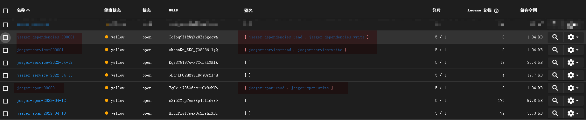
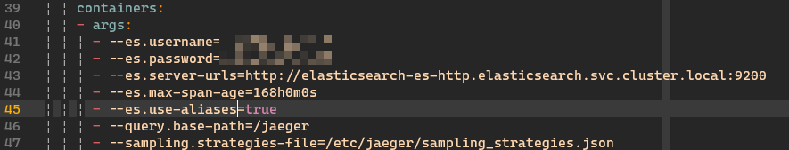
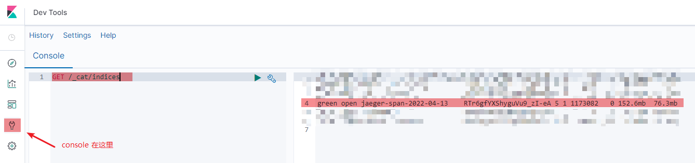

## 前言

jaeger 是一个比较常用的分布式追踪服务，后端可以选 es、cassandra 等存储，我司线上就是用了 es 作为 jaeger 存储。

jaeger 用 es 做查询后端的时候有个坏毛病：它会自动按日期分割日志 span，一天一个 index。直接结果就是一段时间没管线上的 jaeger，过一段时间就会发现 jaege 里啥也查不出来了。翻 jaeger 的日志就会看到下面的内容：

```json
{
    "level": "error",
    "ts": 1649751249.9240348,
    "caller": "config/config.go:141",
    "msg": "Elasticsearch part of bulk request failed",
    "map-key": "index",
    "response": {
        "_index": "jaeger-span-2022-04-12",
        "_type": "_doc",
        "status": 400,
        "error": {
            "type": "illegal_argument_exception",
            "reason": "Validation Failed: 1: this action would add [10] total shards, but this cluster currently has [2998]/[3000] maximum shards open;"
        }
    },
    "stacktrace": "github.com/jaegertracing/jaeger/pkg/es/config.(*Configuration).NewClient.func2\n\tgithub.com/jaegertracing/jaeger/pkg/es/config/config.go:141\ngithub.com/olivere/elastic.(*bulkWorker).commit\n\tgithub.com/olivere/elastic@v6.2.35+incompatible/bulk_processor.go:588\ngithub.com/olivere/elastic.(*bulkWorker).work\n\tgithub.com/olivere/elastic@v6.2.35+incompatible/bulk_processor.go:501"
}
```

此时检查 `GET /_cat/shards` 或 `GET /_cat/allocation` 都能看到分片数量达到了日志里记录的 `2998` 个。

## 原因

### jaeger产生大量分片

[elasticsearch 官方文档指出](https://www.elastic.co/guide/en/elasticsearch/reference/current/size-your-shards.html)，每个 index 会被切分成1或多个分片(shards)，每个分片都可能在节点间复制，以防硬件故障。

> Each index in Elasticsearch is divided into one or more shards, each of which may be replicated across multiple nodes to protect against hardware failures.

而据我观察（sorry，没有文档），jaeger 每天创建的 index 都包含至少 5 个 primary 分片，一个 replica 分片。可以通过请求`index/_settings`这个api端点来检查索引会分配的分片和冗余数量。

```http
HTTP/1.1 200 OK
content-encoding: gzip
content-length: 239
content-type: application/json; charset=UTF-8

{
    "jaeger-span-2022-04-12": {
        "settings": {
            "index": {
                "creation_date": "1649749148182",
                "mapping": {
                    "nested_fields": {
                        "limit": "50"
                    }
                },
                "number_of_replicas": "1",
                "number_of_shards": "5",
                "provided_name": "jaeger-span-2022-04-12",
                "requests": {
                    "cache": {
                        "enable": "true"
                    }
                },
                "uuid": "s2i5GZtpTzm3Kp4fIldwrQ",
                "version": {
                    "created": "7090199"
                }
            }
        }
    }
}
```

而检查 `GET /_cat/indices` 可以发现，`jaeger` 创建的 index 包括 `jaeger-service-yyyy-mm-dd` 和 `jaeger-span-yyyy-mm-dd` 两种，很容易算出预期每月可能产生 336~372 个新的分片。

### es每个节点分片数量受限

关于节点分片数量限制，[官方文档的说法](https://www.elastic.co/guide/en/elasticsearch/reference/current/allocation-total-shards.html)是这样的：

> **`index.routing.allocation.total_shards_per_node`**
>
> The maximum number of shards (replicas and primaries) that will be allocated to a single node. Defaults to unbounded.
>
> ...
>
> **`cluster.routing.allocation.total_shards_per_node`**
>
> ([Dynamic](https://www.elastic.co/guide/en/elasticsearch/reference/current/settings.html#dynamic-cluster-setting)) Maximum number of primary and replica shards allocated to each node. Defaults to `-1` (unlimited).
>
> ...

也就是默认不限制，但显然我们遇到的情况不是这样，要是 shards 数量不限制的话就根本没现在的问题了。

所以在东翻西找了一轮之后，我发现还有另一个设置项。这个设置项用 `shards per node limits` 当关键词搜索的时候没找到，在 `GET /_cluster/settings?include_defaults` 里翻出来了：`max_shards_per_node`。

然后我在文档里搜了下，发现官方文档其实已经做了SEO，我要是直接把错误信息贴进谷歌搜的话说不定早发现这个配置项了...

>this action would add [x] total shards, but this cluster currently has [y]/[z] maximum shards open;
>
>The [`cluster.max_shards_per_node`](https://www.elastic.co/guide/en/elasticsearch/reference/8.1/modules-cluster.html#cluster-max-shards-per-node) cluster setting limits the maximum number of open shards for a cluster. This error indicates an action would exceed this limit.

`max_shards_per_node`的文档也很怪：

> **`cluster.max_shards_per_node`**
>
> ([Dynamic](https://www.elastic.co/guide/en/elasticsearch/reference/8.1/settings.html#dynamic-cluster-setting)) Limits the total number of primary and replica shards for the cluster. Elasticsearch calculates the limit as follows:
>
> ```
> cluster.max_shards_per_node * number of non-frozen data nodes
> ```
>
> Shards for closed indices do not count toward this limit. Defaults to `1000`. A cluster with no data nodes is unlimited.

虽然字面上看就是一个节点可以assign的分片数量，但实际算的是 `total number of primary and replica shards for cluster`。可以简单算一下，单节点集群显然只有一个 `non-frozen data node`，所以集群的分片上限就是 `1000 * 1`。线上的 3 节点集群没有 `frozen data node`，所以全集群最多有 `1000*3` 个分片。

好了问题来了，`max_shards_per_node` 和 `total_shards_per_node` 有啥区别？

`total_shards_per_node` 限制的是 **一个节点能分配多少分片**，`max_shards_per_node` 是 **计算全集群能分配多少分片** 。

例如一个三节点集群里，`total_shards_per_node` 是 `100`，但 `max_shards_per_node` 是 `1000`，可以创建出超过`100`个分片，但超出的分片不会被分配（没有实验过，我猜是不会 assign）。

反过来说 `total_shards_per_node` 比 `max_shards_per_node` 大的时候，虽然节点还能分配更多分片，但集群分片数已经到上限了，就会出现 `this action would add [x] total shards, but this cluster currently has [y]/[z] maximum shards open;` 错误了。

## 处理

总的来说，既然是集群内的 `max_shards_per_node` 配置小了，解决方法就很多：

1. 把 `max_shards_per_node` 调大，比如`10000`，直接10倍。
2. 加 es 服务节点。
3. 删旧的 jaeger 索引。

改配置显然是有点离谱的想法，等于是看到蟑螂在脚下，你选择铺张地毯，眼不见心不烦。

加节点只适合不差钱的公司，而且这么选多少是有点看公司人傻钱多的意思。

删除旧索引就正常很多，算是经典操作。更早些年应该还有个人站长写 crontab 自动删 `/var/log` 日志的，删旧索引本质差不多就是这个意思。

而清理旧索引也有很多做法。

### jaeger-es-rollover

#### 初始化

**注意，我无法确定是否对未启用`--es.use-aliases`时创建的索引有效。**

**注意，rollover init 也会创建索引和分片，如果你已经碰到了上面的问题，直接 rollover init 会失败，必须先手动清理。**

**如果只想看如何清理旧索引，请跳到 删除 部分，还不行就跳到 curator 小节。**

search indices 一节所述，可以使用 jaeger-es-rollover 解决以 es 作为后端存储时的 jaeger 日志轮转问题。我要吐槽下，原文：

参考 [jaeger 部署文档中 shards and replicas for elasticsearch indices 一节所述](https://www.jaegertracing.io/docs/1.32/deployment/#shards-and-replicas-for-elasticsearch-indices)，可以使用 `jaeger-es-rollover` 解决以 es 作为后端存储时的 jaeger 日志轮转问题。我要吐槽下，原文：

> Shards and replicas are some configuration values to take special attention to, because this is decided upon index creation. [This article](https://qbox.io/blog/optimizing-elasticsearch-how-many-shards-per-index) goes into more information about choosing how many shards should be chosen for optimization.

没有任何未配置 es 日志轮转可能产生的问题的警告。我怎么知道`take special attention to`是指性能会在特定条件下拉胯，还是直接把 es 服务的 shards 占满，直接搞得 es 没法服务？`This article` 这个链接更离谱了，半句没提为什么后面有个 `elasticsearch rollover` 小结。

好闲话少叙。我这里是 kubernetes 平台，docker-compose 用户或者真机部署的自己看着改。

```bash
kubectl create job --image jaegertracing/jaeger-es-rollover:latest jaeger-es-rollover-init -- /go/bin/es-rollover init http://elasticsearch-es-http.elasticsearch.svc.cluster.local:9200 --es.username=***censored*** --es.password=***censored***
```

换成 docker 命令就是

```bash
docker run -it --rm --net=host jaegertracing/jaeger-es-rollover:latest init http://localhost:9200 --es.username=***censored*** --es.password=***censored***
```

这一步会创建几个新的 index 和别名



注意图中标记的部分。

下一步修改 jaeger 的启动参数，我这里直接 `kubectl edit -n jaeger deployment jaeger` 编辑。



应用后自动更新 pod，注意看下日志有没有错误或者警告。对于 docker-compose 用户改法差不多，如果 jaeger 是直接 `docker run` 起来的，那是真的牛啤。自己 `docker rm` 再 `docker run` 一次吧。真机部署 jaeger 还没见过直接略，无非是改 systemd 配置或者 /etc/init.d 。

到这里 jaeger 部署的调整就完了，但问题还没解决：要是时间久了，会不会还创建一堆 indices？据我观察，应该不会再每天 2 个 index 的频率高强度创建 index 了（PS：因为第一天动手的时候没注意，jaeger 没加 `--es.use-aliases=true`，所以我也不敢说绝对不会，建议自己改了第二天看一眼。），新的 index 会写入到之前看到的 `jaeger-span-000001` 这种 index 里。

文档里给了个从每日创建索引转到 rollover 的迁移方法：

**这不会删除旧索引，只是把旧索引合并到了别名`jaeger-*-read`里，让 jaeger 能查询到旧的日志。**

```bash
curl -ivX POST -H "Content-Type: application/json" localhost:9200/_aliases -d '{"actions" : [{ "add" : { "index" : "jaeger-span-*-*-*", "alias" : "jaeger-span-read" } }, { "add" : { "index":"jaeger-service-*-*-*", "alias" : "jaeger-service-read" }}]}'
# archive indices
curl -ivX POST -H "Content-Type: application/json" localhost:9200/_aliases -d '{"actions" : [{ "add" : { "index" : "jaeger-span-archive", "alias" : "jaeger-span-archive-read" } }]}'
```

注意如果有归档的话用 第二条 curl 的同时还要给 `jaeger` 加上启动参数`--es.archive.use-aliases=true`。

#### 轮转

到这里，问题解决了90%，但还有个问题：如果所有 jaeger 数据都放在一个 index 里，过上一段时间，数据量膨胀后会不会产生性能问题？这是很自然的想法，日志这种东西是很容易膨胀的，随时间流逝很可能堆成一座难以清理的大山：就像是你想在MySQL里往一个记录超亿级的表里插数据或删数据一样。

`jaeger-es-rollover` 真正的用途就是这个：轮转日志。一个 index 已经有 100M 了，那就换一个 index 吧。

```bash
# 按 CONDITIONS 指定的规则轮转
docker run -it --rm --net=host -e CONDITIONS='{"max_age": "1s"}' jaegertracing/jaeger-es-rollover:latest rollover  http://localhost:9200
```

> Rollover lets you configure when to roll over to a new index based on one or more of the following criteria:
>
> - `max_age` - the maximum age of the index. It uses [time units](https://www.elastic.co/guide/en/elasticsearch/reference/master/common-options.html#time-units): `d`, `h`, `m`.
> - `max_docs` - the maximum documents in the index.
> - `max_size` - the maximum estimated size of primary shards (since Elasticsearch 6.x). It uses [byte size units](https://www.elastic.co/guide/en/elasticsearch/reference/master/common-options.html#byte-units) `tb`, `gb`, `mb`.

目前支持的条件就只有这些。rollover 并不能让 es *替你* 轮转索引，所以这个 rollover 命令只能自己定时执行。

对于 docker-compose 用户或者 docker 用户我没啥好办法，也许你可以在宿主机里写一个 crontab 跑上面的`docker run`。

对于我这样的 kubernetes 用户则可以选择用 kubernetes 的 cronjob 实现。

```yaml
apiVersion: batch/v1beta1 # 对于 kubernetes v1.21.x 已经不是 beta 了，改成 batch/v1
kind: CronJob
metadata:
  name: jaeger-es-index-rollover
  namespace: jaeger
spec:
  schedule: "0 0 * * 0"
  jobTemplate:
    spec:
      template:
        spec:
          containers:
          # see document https://www.jaegertracing.io/docs/1.32/deployment/#remove-old-data
          - image: jaegertracing/jaeger-es-rollover:latest
            name: jaeger-es-rollover
            env:
              - name: CONDITIONS
                value: '{"max_age":"2d"}'
            args:
              - rollover
              - --es.username=***censored***
              - --es.password=***censored***
              - "http://elasticsearch-es-http.elasticsearch.svc.cluster.local:9200"
            resources:
              requests:
                cpu: 100m
                memory: 100Mi
              limits:
                cpu: 100m
                memory: 100Mi
          restartPolicy: Never
```

好，问题解决99%了！

#### 删除

最后就是删除不再需要的数据了，很简单啦。下面的命令中 `14` 表示保留最近14天的日志，同样支持 `--es.username`和`--es.password`参数。

```bash
docker run -it --rm --net=host -e ROLLOVER=true jaegertracing/jaeger-es-index-cleaner:latest 14 http://localhost:9200
```

**注意，虽然文档说 *that is also used for daily indices*，但实际发现好像并不会删。**

我不确定是不是 **ROLLOVER** 这个环境变量的影响，建议自己试试。

### elasticsearch-curator

好了，奇技淫巧环节。[curator](https://github.com/elastic/curator) 是一个 elastic 公司开源的 python 包，介绍比较皮：

> Have indices in Elasticsearch? This is the tool for you!
>
> Like a museum curator manages the exhibits and collections on display, Elasticsearch Curator helps you curate, or manage your indices.

对不起，没去过博物馆，也没做过馆长，Get 不到。

简单地说，curator 是一个 indice 管理的工具，我们用这个工具实现找到旧索引并删除。

curator 的命令行界面像这样：

```plaintext
Usage: curator [OPTIONS] ACTION_FILE

  Curator for Elasticsearch indices.

  See http://elastic.co/guide/en/elasticsearch/client/curator/current

Options:
  --config PATH  Path to configuration file. Default: ~/.curator/curator.yml
  --dry-run      Do not perform any changes.
  --version      Show the version and exit.
  --help         Show this message and exit.
```

关于这个工具，我们主要关注官方文档里的两个部分：[configuration file](https://www.elastic.co/guide/en/elasticsearch/client/curator/current/configfile.html) 和 [action file](https://www.elastic.co/guide/en/elasticsearch/client/curator/current/actionfile.html)。

configuration file 保存的是关于连接 es 所需的配置如地址、用户名密码、验证方法等，以及工具本身的配置如日志。

action file 保存的是我们希望 curator 帮我们完成的操作。

action file 的格式如下：

```yaml
actions:
  1:
    action: ACTION1
    description: OPTIONAL DESCRIPTION
    options:
      option1: value1
      ...
    filters:
    - filtertype: *first*
      filter_element1: value1
      ...
  2:
    ...
```

其中 `action` 是我们希望 curator 做的事，`options` 和 `filters` 控制 `action` 的行为和行为的对象。`action`支持[很多不同的操作](https://www.elastic.co/guide/en/elasticsearch/client/curator/current/actions.html)。

好了，现在看实例。我们想删除名称符合 `jaeger-span-yyyy-mm-dd` 格式的 index，并且`yyyy-mm-dd`小于指定的日期。

```yaml
    actions:
      1:
        action: delete_indices
        description: >-
          delete old jaeger-span indices
        options:
          ignore_empty_list: True
          timeout_override:
          continue_if_exception: True
          disable_action: False
        filters:
          - filtertype: pattern
            kind: prefix
            value: jaeger-span
            exclude:
          - filtertype: age
            source: name
            direction: older
            timestring: '%Y-%m-%d'
            unit: days
            unit_count: 7
            exclude:
```

动作：`delete_indices`；忽略空输入，即使异常也继续执行；要删除的对象以 `jaeger-span` 开头，并且名称包含 `%Y-%m-%d` 模式的日期，且早于 7 天前。

done！把上面的配置复制一份套用到 `jaeger-service-yyyy-mm-dd` 上，删除 jaeger-span 的任务就算配置好了。

接下来把删除工作配置成定时任务，这里还是用了 cronjob。

先把配置保存成 ConfigMap。

```yaml
---
# https://kubernetes.io/docs/concepts/configuration/configmap/
kind: ConfigMap
apiVersion: v1
metadata:
  name: curator-config
  namespace: jaeger
data:
  curator.yml: |
    client:
      hosts:
        - ****
        - ****
        - ****
      port: 9200
      username: ***censored***
      password: ***censored***
    logging:
      loglevel: INFO
      logformat: default
  action.yml: |
    actions:
      1:
        action: delete_indices
        description: >-
          delete old jaeger-span indices
        options:
          ignore_empty_list: True
          timeout_override:
          continue_if_exception: True
          disable_action: False
        filters:
          - filtertype: pattern
            kind: prefix
            value: jaeger-span
            exclude:
          - filtertype: age
            source: name
            direction: older
            timestring: '%Y-%m-%d'
            unit: days
            unit_count: 7
            exclude:
      2:
        action: delete_indices
        description: >-
          delete old jaeger-service indices
        options:
          ignore_empty_list: True
          timeout_override:
          continue_if_exception: True
          disable_action: False
        filters:
          - filtertype: pattern
            kind: prefix
            value: jaeger-service
            exclude:
          - filtertype: age
            source: name
            direction: older
            timestring: '%Y-%m-%d'
            unit: days
            unit_count: 7
            exclude:
```

再编写一个 CronJob

```yaml
apiVersion: batch/v1beta1
kind: CronJob
metadata:
  name: jaeger-es-index-cleanup
  namespace: jaeger
spec:
  schedule: "0 0 * * 0"
  jobTemplate:
    spec:
        template:
          spec:
            volumes:
              - name: curator-config
                configMap:
                  name: curator-config
            containers:
            - image: bitnami/elasticsearch-curator:5.8.4
              name: elasticsearch-curator
              command:
                - sh
                - -c
                - curator --config /cfg/curator.yml /cfg/action.yml
              volumeMounts:
                - mountPath: /cfg
                  name: curator-config
              resources:
                requests:
                  cpu: 100m
                  memory: 100Mi
                limits:
                  cpu: 100m
                  memory: 100Mi
            restartPolicy: Never
```

这里用了 `bitnami/elasticsearch-curator` 镜像，如果不信任的话可以自己写个 Dockerfile 也不会很麻烦。我主要看中 bitnami 镜像大小优化还不错（98M），要是我自己随便写一个的话可能就不止这么大了。看了眼镜像的 Dockerfile 没有什么可疑的地方就直接用啦。

对于需要立刻跑一次的情况，可以把 jobTemplate 下面的内容复制出来单独写个 Job 先跑起来。

### 手动

手动法我说个思路。首先你得有个 kibana console 可以访问，或者能直接请求到 es 的 9200 端口。

`GET /_cat/indices` 拿到 indices 列表，按名字正则过滤 `jaeger-(span|service)-\d{4}-\d{2}-\d{2}`，然后把后面的日期解析一下；或者粗暴点，直接`^(2022-04-\d{2})`过滤出本月（4月）以外的所有索引，拿到一个索引列表。

具体点说，像是 kibana console 拿到的是一个每行格式如 `green open jaeger-span-2022-03-01 ....`  这样的纯文本，你可以放到 vscode 里然后用 `Filter Lines` 这样的插件快速正则过滤出来，再按 `alt+shift+方向键` 多光标，快速编辑出一个索引名称列表。



然后把索引名前面加上 `DELETE /`，产生 `DELETE /jaeger-span-2022-03-01` 这样的列表，贴到 kibana console 里，全选运行，done。

要是没 kibana ，只有 9200 访问，就改成 curl 请求，或者 httpie ，反正总有办法。最后批量执行就好。

要是都没有，讲道理啊你跟负责人说下要个访问权限好吧......

要是对自己的脚本编程能力有自信的话，大可直接写个 bash 脚本定时跑，也是 ok 的。

## 总结

总之，`jaeger-es-rollover` 配 `jaeger-es-index-cleaner`；或者`elasticsearch-curator`都行。手动法无非是手工拿到 indices 然后用各种编辑器批量编辑技巧或者正则替换，拼出个脚本。正则表达式当真是每个开发者的必备良药。

讲道理地说要不是 jaeger 给我整这一出我可能还想不到拿 es 当 jaeger 后端还会有这种坑。但这也算给我提了个醒，挂在 es 上的数据虽然不多而且都是从 MySQL 同步过去的，es 的一些基本配置如分片啥的还是得关注一下，不能只顾着接 api。这就是所谓的 *运维压力* 了吧。

应该还有不少小公司的开发其实是缺乏能力运维诸如 es 这样的项目的，对 MySQL 也是仅限于精通 **安装和使用** ，但问起怎么怎么高可用，怎么做主备，怎么做读写分离，怎么分库分表，其实一个也不会（对，我也差不多）。

k8s 也是个很大的坑，现在甚至有点感觉后端一路走下来真正坑人的都是这些大框架，大概念，比如前段时间流行过的**中台**，风口上的**云计算**、**云原生**，好像沾个**云**就牛逼起来了。我不是说 k8s 没用嗷，我是说媒体吹的时候个个都是银弹，老板吹的时候各个都是**给我也整一个！**

还好压力最后都转化成了见鬼的需求和莫名其妙的技术选型，最底层的开发只要放弃思考就完事了，写什么代码不是写，大家都是给资本服务嘛。

