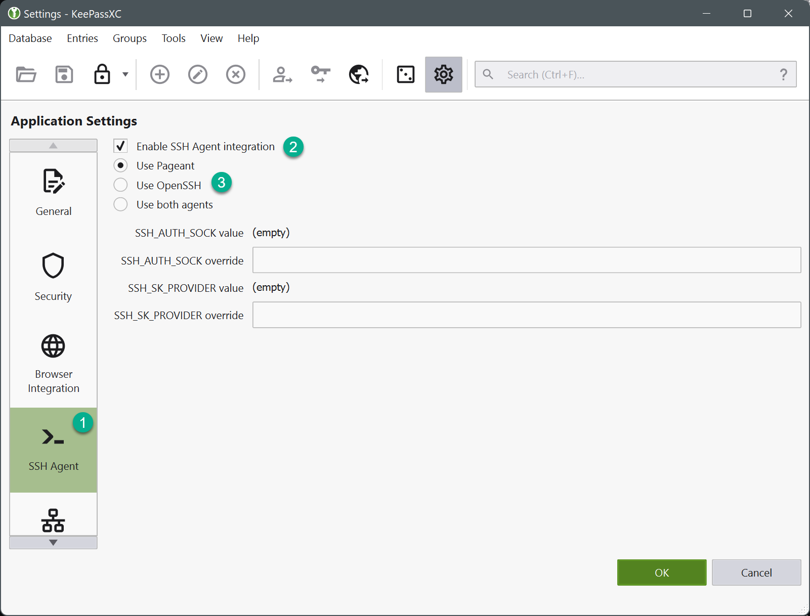
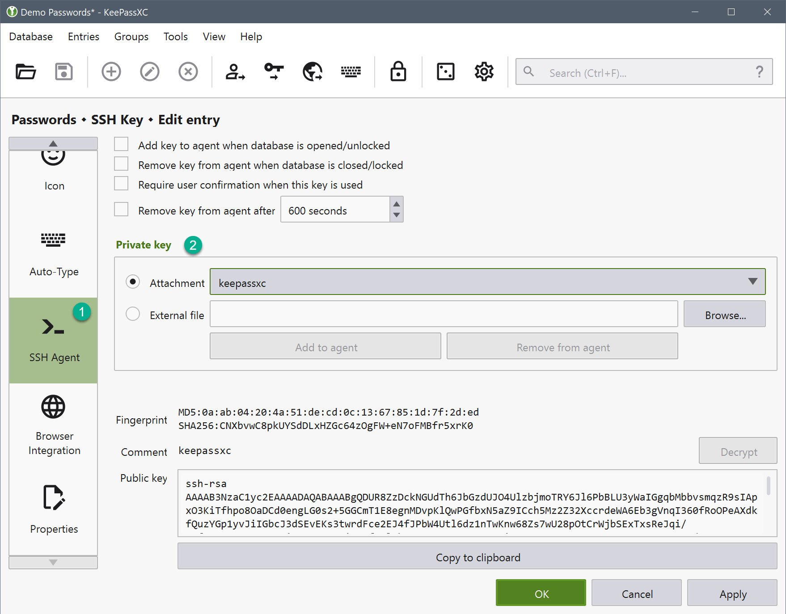
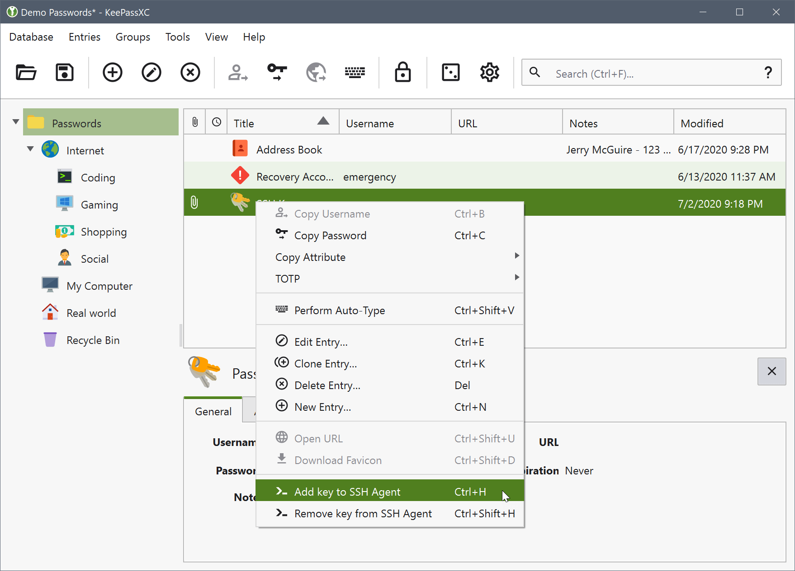
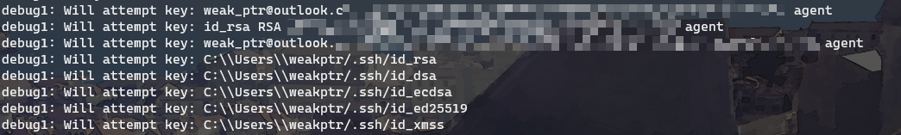
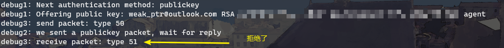
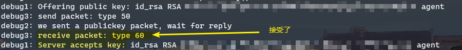

## 前言

突发奇想，先前一直把密码存在 keepassxc 里，但 SSH 秘钥是存在 keepassxc 的备注里，用的时候还得先复制出来建个文件，虽然只用折腾一次但还是嫌麻烦。

于是想到 keepassxc 自带 SSH 集成，于是研究了下怎么用 SSH 集成在 keepassxc 里保存秘钥对，省掉复制出秘钥内容到文件里的过程，还更安全。

## 过程

### 平台和选型

首先确定 keepassxc 和 ssh 运行的平台，keepassxc 本体是支持 Windows/MacOS/Linux 三端的，ssh 在Windows上倒是有几种不同的选型。

在 Windows 10 Build 1809 版本之后，Windows 已经内置了 OpenSSH 软件，还在用 PuTTY 的可以省掉 PuTTY 了。

旧点的 Windows 可以选择 PuTTY 或者装一个基于 MinGW 的 OpenSSH，如 Git-SCM 自带的 OpenSSH 或者 MSYS2、MinGW64 一类。

### 原理

keepassxc 的 ssh 集成本质是主动往 ssh-agent 添加秘钥，ssh 命令从 ssh-agent 读到秘钥，尝试用秘钥连接服务器。表现出的效果就是和直接把秘钥放在 `.ssh/id_rsa` 也没什么区别。

keepassxc 还支持解锁自动添加和锁定时自动删除，还有超时自动删除，安全性会稍再好一点，可惜 Windows 自带的 OpenSSH 不支持使用秘钥时给用户确认（见 issue [#1056](https://github.com/PowerShell/Win32-OpenSSH/issues/1056)），导致开启 keepassxc 的确认功能时会添加秘钥失败。

至于 ssh-agent 的原理就略过不提了，可以理解成一个秘钥代理，ssh 自动问 ssh-agent 有什么秘钥可用，就像保管钥匙的管家。

### 配置 OpenSSH

参考 keepassxc 的文档，先启动 Windows 自带的 OpenSSH 的 ssh-agent 服务。

```powershell
PS C:\Users\user> Get-Service ssh-agent | Set-Service -StartupType Automatic
PS C:\Users\user> Start-Service ssh-agent
```

注意上面的命令需要 **管理员权限** 运行。

就是这样！

### 配置 keepassxc

之后在 keepassxc 里打开 ssh 集成，选中 OpenSSH 作为代理。



然后添加一个常规的密码记录，在高级里添加秘钥文件，并在 SSH 里启用：



注意勾选 `Add key to agent when database is opened/unlocked` 和 `Remove key from agent when database is closed/locked`，这两个选项会让 keepassxc 解锁的情况下自动在后台添加 SSH 秘钥到 ssh-agent，同时当你关闭 keepassxc 之后 SSH 就无法再从 ssh-agent 拿到秘钥，体验会更自然。

如果不勾选这两个选项，也可以手动在设置了 SSH 代理的项目上右击添加到 ssh-agent。



这种方式添加到 ssh-agent 的秘钥不会自动从 ssh-agent 删除或自动添加，每次重启都要自己右键添加，比较麻烦。

### 检查

如何确认配置正确无误？

可以通过几个方面：

1. 在设置-SSH代理界面，顶部有个绿条，提示 ”SSH代理连接工作正常！“
2. 在命令行运行`ssh-add -l`，会列出你刚添加的秘钥。
3. 尝试`ssh`连接你的服务器，公钥登陆成功。

如果 “SSH 代理连接工作正常” 没出现的话可能是 ssh-agent 服务没启动或者有问题，可以 `stop-service ssh-agent` 停止 `ssh-agent` 这个系统服务后再在命令行运行 `ssh-agent -d`，输出调试日志，看看具体什么问题。

如果`ssh-add -l`没有输出，也是一样，检查`ssh-agent`是否在运行，如果在运行但依然没有，用`-d`参数启动 ssh-agent 看看添加秘钥的步骤有什么问题。

如果 `ssh-add -l` 有输出了，但 ssh 连接依然问你要密码，有两种可能：

1. 你的 ssh 秘钥有密码保护，一般是 `ssh-keygen` 的时候设置的。
2. 秘钥被拒绝了。

有密码保护的秘钥 ssh 命令有提示，注意看 ssh 命令的输出就行。秘钥被拒绝的情况表面很难看出来，可以用 `-vvv` 参数再运行 ssh 命令，看命令输出。







如果 `will attempt key` 没有出现 `ssh-add -l` 列出的秘钥，还可能是因为 `.ssh/config` 里，给你要连接的 Host 设置了 `IdentitiesOnly yes`。这个设置项会强制 ssh 只使用本地的 `.ssh/id_rsa` 等私钥文件。

另外 `.ssh/config` 里可能还指定了别的验证方式也会导致不使用公钥，这就要靠自己检查 `.ssh/config` 来排错了。

### 配置 Git

Windows 下还有个坑，在提交博客的时候才发现。 Git-SCM 默认使用的 SSH 命令不是 Windows 自带的 OpenSSH。这会导致 Git 在推送的时候不使用我们添加到 ssh-agent （Windows 自带的 OpenSSH 版 ssh-agent）的秘钥，而是用 Git-SCM 自带的 MinGW 版 OpenSSH，造成推送时提示 `Permission Denied (publickey)` 。

解决办法也很简单，`git config --global core.SshCommand "C:/Windows/System32/OpenSSH/ssh.exe"` 把 Windows 自带的 OpenSSH 设置成 Git 默认使用的 ssh 即可。需要注意 **这里的路径用正斜杠`/`分隔，不要用反斜杠`\`** 。

## 总结

总的来说用 ssh-agent 配合 keepassxc 玩 ssh 还是很舒服的，特别是迁移起来的时候，只要同步和备份 keepassxc 的数据库就完事。

keepassxc 的附加文件也非常适合把 GPG 之类的秘钥备份起来，换工作机或者自己电脑重装迁移的时候都能省不少心思。