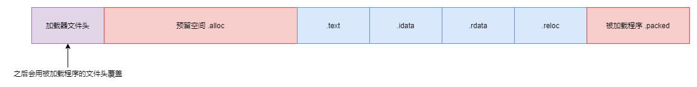
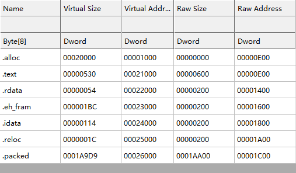

## 前言

距离上一篇加壳原理已经过去挺久了，这段时间稍微折腾了一下 nasm，尝试手工制作了 PE32 文件，积累了一些基本的知识吧。

所以现在继续学习加壳——如何对不支持 ASLR 的 PE32 程序进行加壳？

## 0x01 关于ASLR

ASLR是一项内存保护技术，用于防范内存损坏漏洞，比如缓冲区溢出。需要注意的是 ASLR 并不是 *解决* 了相关威胁，而是让利用相关的漏洞变得更加困难和具有挑战性。

ASLR 的全名是 *Address Space Layout Randomization* ，地址空间布局随机化技术。一个典型的 PE32 程序在没有 ASLR 支持的情况下， 地址空间布局是确定的：程序镜像总会加载到固定的地址。这个地址会在文件头里指定。攻击者可以利用这一特点来构造恶意数据，让存在内存损坏漏洞的程序按攻击者意图跳过或执行特定逻辑，造成安全威胁。

对应 ASLR 的地址空间布局随机化，程序需要再次编译来支持重定位 *Relocation* ，别无他法（大概）。

## 0x02 思路

对于加壳一个没有重定位，不支持 ASLR 的 PE32 程序，假设这个程序的基址是 `0x04000000`，原先的 `VirtualAlloc` 方式分配内存是行不通的。加壳后程序若开启 ASLR，则 `0x04000000` 可能已经存在其他模块，并不能保证这个基址可用。**所以加壳后的程序必须也使用 `0x04000000` 这个基址，而且标记为不支持 ASLR**，避免基址已经被其他模块使用造成加载器无法工作。

将加壳后程序的基址设置为固定的 `0x04000000` 又会产生新的问题：加载器的代码段不能放在 `0x04000000` ，否则加载器运行时就会出现被被加载的代码覆盖的情况，导致程序跑飞。所以**编译后的加载器所有 Section 都必须有一定的偏移，这个偏移值就是被加载程序的 Section 大小之和（对齐后）**。而因此多出来的空间单独分成一个 Section ，正好用来放要加载的程序。

另外，还必须确认文件头大小是否一致，因为**我们需要将被加载程序的文件头覆盖加载器的文件头**。而**最开始预留的空间必须分配为一个 Section**，让 Windows 的加载器能顺利加载程序而不报“不是有效的Win32程序”错误。

内存布局示意图如下：



所以加载器的加载步骤如下：

1. 寻找被加载的 Section 。
2. 复制文件头覆盖自己的文件头。
3. 以自己的基址为被加载程序的基址，完成加载。

加壳机的加壳步骤如下：

1. 解析被加壳程序，获取 Section 大小、文件头大小、对齐大小等信息。
2. 生成加载器程序，根据上一步取得的数据计算出加载器 Section 的偏移和对齐。
3. 合并被加壳程序和加载器，生成被加壳程序。

案例程序如下：

```c
#include <Windows.h>

int main(void) {
  MessageBoxA(NULL, "Hello world!", "MSGBOX", MB_OK);
  return 0;
}
```

## 0x03 加载器修改

加载器需要把 `VirtualAlloc` 改成 `GetModuleHandleA`，并解除当前程序文件头的写保护，并在随后的复制 Section 阶段同样用 `VirtualProtect` 解除写保护，添加执行权限。

```c
void *load_PE(char *PE_data) {
  IMAGE_DOS_HEADER *p_DOS_header = (IMAGE_DOS_HEADER *)PE_data;
  IMAGE_NT_HEADERS *p_NT_headers = (IMAGE_NT_HEADERS *)(PE_data + p_DOS_header->e_lfanew);

  // extract information from PE header
  DWORD size_of_image = p_NT_headers->OptionalHeader.SizeOfImage;
  DWORD entry_point_RVA = p_NT_headers->OptionalHeader.AddressOfEntryPoint;
  DWORD size_of_headers = p_NT_headers->OptionalHeader.SizeOfHeaders;

  // base address
  char *p_image_base = (char *)GetModuleHandleA(NULL);
  if (p_image_base == NULL) {
    return NULL;
  }
    
  // make sure we can write in allocated memory
  DWORD oldProtect;
  VirtualProtect(p_image_base, p_NT_headers->OptionalHeader.SizeOfHeaders, PAGE_READWRITE, &oldProtect);

  // copy PE headers in memory
  mymemcpy(p_image_base, PE_data, size_of_headers);

  // Section headers starts right after the IMAGE_NT_HEADERS struct, so we do some pointer arithmetic-fu here.
  IMAGE_SECTION_HEADER *sections = (IMAGE_SECTION_HEADER *)(p_NT_headers + 1);

  for (int i = 0; i < p_NT_headers->FileHeader.NumberOfSections; i++) {
    // calculate the VA we need to copy the content, from the RVA
    // section[i].VirtualAddress is a RVA, mind it
    char *dest = p_image_base + sections[i].VirtualAddress;

    // check if there is Raw data to copy
    if (sections[i].SizeOfRawData > 0) {
      // make sure we can write in allocated sections
      VirtualProtect(dest, sections[i].SizeOfRawData, PAGE_READWRITE, &old_protect);
      // We copy SizeOfRaw data bytes, from the offset PointerToRawData in the file
      mymemcpy(dest, PE_data + sections[i].PointerToRawData, sections[i].SizeOfRawData);
    } else {
      VirtualProtect(dest, sections[i].Misc.VirtualSize, PAGE_READWRITE, &old_protect);
      for (size_t i = 0; i < sections[i].Misc.VirtualSize; i++) {
        dest[i] = 0;
      }
    }
  }
    
    // ...
}
```

此外还有一个坑：不知道为啥，我用 lief python 生成的 DataDirectories 实际只有15个元素（包括最后一个 null 元素），但 `winnt.h` 里定义的 DataDirectories 是固定长度 16 个元素，所以直接算 `p_NT_header + 1` 得到的偏移值会比预期的大 8 个字节，导致报找不到 `.packed` 。

改成这样。

```c
int _start(void) {
  char *unpacker_VA = (char *)GetModuleHandleA(NULL);

  IMAGE_DOS_HEADER *p_DOS_header = (PIMAGE_DOS_HEADER)unpacker_VA;
  IMAGE_NT_HEADERS *p_NT_headers = (PIMAGE_NT_HEADERS)(unpacker_VA + p_DOS_header->e_lfanew);
  IMAGE_SECTION_HEADER *sections = (PIMAGE_SECTION_HEADER)(p_NT_headers + 1);
  // 注意看这里再计算了一次偏移
  sections = (PIMAGE_SECTION_HEADER)((char *)sections - (IMAGE_NUMBEROF_DIRECTORY_ENTRIES -
                                                         p_NT_headers->OptionalHeader.NumberOfRvaAndSizes) *
                                                            sizeof(IMAGE_DATA_DIRECTORY));
```

## 0x04 加壳器

加壳器这次用 python 写，MinGW 下又要重新编译 LIEF 太折磨人了。

### 4.1 工具函数

先是导入和定义必要的工具。

```python
import lief

def align(x, al):
    """ return <x> aligned to <al> """
    return ((x+(al-1))//al)*al
```

### 4.2 解析

先分析案例程序，获得必要的数据。

```python
binary = lief.PE.parse('example.exe')

# calculate shift offset and reserved section size
image_base = binary.optional_header.imagebase
lowest_rva = min([s.virtual_address for s in binary.sections])
highest_rva = max([s.virtual_address + s.size for s in binary.sections])
sect_alignment = binary.optional_header.section_alignment
print('[+] analyze origin demo program binary success.')
```

取得基址、所有 section 中最低的起始 rva 和最高的结束 rva，得到整个 PE 镜像的 Sections 覆盖的内存范围。

### 4.3 构造加载器

使用 MinGW 来完成加载器构造——当然有其他更好的做法，加壳还要装一个 MinGW 未免太麻烦，但我也不知道该怎么做就是了（我猜的话，大概拿 nasm 应该就刑。）

编译命令在 Python 脚本里生成并执行。

```python
# compile shifted loader program
compile_args = [
    'loader.c',
    '-m32',
    '-O2',
    '-Wall',
    '-Wl,--entry=__start',
    '-nodefaultlibs',
    '-nostartfiles',
    '-lkernel32',
    '-luser32',
    f'-Wl,--image-base={hex(image_base)}',
    f'-Wl,--section-start=.text={hex(align(image_base+highest_rva,sect_alignment))}',
    '-o',
    'shifted-loader.exe'
]

try:
    check_output(' '.join(['gcc', *compile_args]), shell=True, stderr=STDOUT)
    print('[+] compile shifted loader program success.')
except CalledProcessError as e:
    print(f'[!] loader compilation failed, {e.stdout.decode()}')
    raise

shifted_loader = lief.PE.parse('shifted-loader.exe')
sect_alignment = shifted_loader.optional_header.section_alignment
file_alignment = shifted_loader.optional_header.file_alignment
```

`-luser32` 是因为我添加了一个 `MessageBoxA` 的调用。

`-Wl,--image-base=...` 设置了加载器的基址，确保加载器和被加壳的程序落在同一个基址上。

`-Wl,--section-start=...` 因为知道第一个 section 一定是 `.text` 所以只设置了第一个 section 的地址，之后的 section 会自动往后挪。

其他参数不多解释了。

编译完成后，再解析出加载器的对齐信息，准备用于构造完整的被加壳程序。

### 4.4 构造加壳程序

加载器和被加载的程序都已经就绪，接下来就是把加载器和程序合并成加壳后的程序了。这一步还是先在创建 lief 的PE32 对象，然后填充基址、Section 对齐、文件对齐，并且把 DLL Characteristics 重置到 0，目的是声明不支持 ASLR。

```python
# create new binary from scratch
output = lief.PE.Binary('packed', lief.PE.PE_TYPE.PE32)

# copy essential fields from shifted_loader
output.optional_header.imagebase = shifted_loader.optional_header.imagebase
output.optional_header.section_alignment = shifted_loader.optional_header.section_alignment
output.optional_header.file_alignment = shifted_loader.optional_header.file_alignment

# disable ASLR
output.optional_header.dll_characteristics = 0
```

先准备这些文件头字段，接下来开始填充 Section ，最先填充的就是准备用作被加载程序内存空间的 `.alloc` 节。

```python
# add .alloc section
allocate_size = align(highest_rva-lowest_rva, sect_alignment)
allocate_section = lief.PE.Section(".alloc")
allocate_section.virtual_address = lowest_rva
allocate_section.virtual_size = allocate_size
allocate_section.characteristics = (lief.PE.SECTION_CHARACTERISTICS.MEM_READ
                                    | lief.PE.SECTION_CHARACTERISTICS.MEM_WRITE
                                    | lief.PE.SECTION_CHARACTERISTICS.CNT_UNINITIALIZED_DATA)
output.add_section(allocate_section)
```

将 `.alloc` 节起始点放置在低位，长度为被加载程序的节大小之和对齐。

之后开始复制加载器的节。

```python
# copy sections
for s in shifted_loader.sections:
    # let lief recalculate section offset and sizeof raw data
    s.offset = 0
    s.sizeof_raw_data = 0
    output.add_section(s)
```

**需要注意** 把 `offset` 和 `sizeof_raw_data` 置零，让 `lief` 去计算偏移和大小，后面添加的一应节都按这样操作。新创建的 Section 还好，对于从加载器里复制的 Section，保留 `offset` 和 `sizeof_raw_data` 会导致最终成品的 Section 数据不正确，造成 `ntdll` 里加载PE文件时，读取PE数据结构时出错。可以自行用 x32dbg 验证。

最后把被加载的文件打包进去。

```python
# add packed section
with open('example.exe', 'rb') as f:
    packed_section = lief.PE.Section('.packed')
    packed_section.content = list(f.read())
    packed_section.characteristics = (lief.PE.SECTION_CHARACTERISTICS.MEM_READ |
                                      lief.PE.SECTION_CHARACTERISTICS.CNT_INITIALIZED_DATA)
    output.add_section(packed_section)
```

同样，让 lief 去计算偏移和大小。复制好节，继续复制 Data Directories，这又有一个坑。

```python
# copy data directories
for i in range(0, 15):
    src = shifted_loader.data_directories[i]
    output.data_directories[i].rva = src.rva
    output.data_directories[i].size = src.size
    
# correct number of data directories
# warning: size of data directories may disagree with IMAGE_NT_HEADERS.DataDirectory in winnt.h
output.optional_header.numberof_rva_and_size = len(output.data_directories)
```

需要注意到，**lief 的数据结构里，允许的 data_directories 只有 15 个**！**但 `winnt.h` 里定义的 DATA_DIRECTORIES 数组，是固定16个元素**！

如果直接 `range(16)` 去遍历，会出现 `IndexError` ，如果忽视这个长度问题，直接在加载器里采用 Windows SDK 的头文件定义的结构，会导致取节表指针的时候比预期的多偏移 8 个字节，造成问题。调试起来简直太折磨人了。

之后再复制入口点和镜像大小。

```python
# copy original address of entrypoint
output.optional_header.addressof_entrypoint = shifted_loader.optional_header.addressof_entrypoint
# let lief recalculate size of image
output.optional_header.sizeof_image = 0
```

注意，入口点和镜像大小的字段必须在复制完 Section 之后再复制，不然 lief 会犯傻，原因不明，有兴趣可以自己改一改顺序看看结果。

到这里，基本准备就绪，就可以把构造好的可执行文件写入硬盘了。

```python
# build output binary
builder = lief.PE.Builder(output)
builder.build()
builder.write('packed.exe')
```

### 4.5 完整代码

```python
# %%
import lief
from subprocess import STDOUT, CalledProcessError, check_output


def align(x, al):
    """ return <x> aligned to <al> """
    return ((x+(al-1))//al)*al


# %%
# compile origin demo program
try:
    check_output('gcc example.c -m32 -O2 -o example.exe', shell=True, stderr=STDOUT)
except CalledProcessError as e:
    print(f'[!] demo program compilation failed, {e.stdout.decode()}')
    raise

binary = lief.PE.parse('example.exe')
print('[+] compile origin demo program success.')

# %%
# calculate shift offset and reserved section size
image_base = binary.optional_header.imagebase
lowest_rva = min([s.virtual_address for s in binary.sections])
highest_rva = max([s.virtual_address + s.size for s in binary.sections])
sect_alignment = binary.optional_header.section_alignment
print('[+] analyze origin demo program binary success.')

# %%
# compile shifted loader program
compile_args = [
    'loader.c',
    '-m32',
    '-O2',
    '-Wall',
    '-Wl,--entry=__start',
    '-nodefaultlibs',
    '-nostartfiles',
    '-lkernel32',
    '-luser32',
    f'-Wl,--image-base={hex(image_base)}',
    f'-Wl,--section-start=.text={hex(align(image_base+highest_rva,sect_alignment))}',
    '-o',
    'shifted-loader.exe'
]

try:
    check_output(' '.join(['gcc', *compile_args]), shell=True, stderr=STDOUT)
    print('[+] compile shifted loader program success.')
except CalledProcessError as e:
    print(f'[!] loader compilation failed, {e.stdout.decode()}')
    raise

shifted_loader = lief.PE.parse('shifted-loader.exe')
sect_alignment = shifted_loader.optional_header.section_alignment
file_alignment = shifted_loader.optional_header.file_alignment

# %%
# create new binary from scratch
output = lief.PE.Binary('packed', lief.PE.PE_TYPE.PE32)

# copy essential fields from shifted_loader
output.optional_header.imagebase = shifted_loader.optional_header.imagebase
output.optional_header.section_alignment = shifted_loader.optional_header.section_alignment
output.optional_header.file_alignment = shifted_loader.optional_header.file_alignment

# disable ASLR
output.optional_header.dll_characteristics = 0

# add .alloc section
allocate_size = align(highest_rva-lowest_rva, sect_alignment)
allocate_section = lief.PE.Section(".alloc")
allocate_section.virtual_address = lowest_rva
allocate_section.virtual_size = allocate_size
allocate_section.characteristics = (lief.PE.SECTION_CHARACTERISTICS.MEM_READ
                                    | lief.PE.SECTION_CHARACTERISTICS.MEM_WRITE
                                    | lief.PE.SECTION_CHARACTERISTICS.CNT_UNINITIALIZED_DATA)
output.add_section(allocate_section)

# copy sections
for s in shifted_loader.sections:
    # let lief recalculate section offset and sizeof raw data
    s.offset = 0
    s.sizeof_raw_data = 0
    output.add_section(s)

# add packed section
with open('example.exe', 'rb') as f:
    packed_section = lief.PE.Section('.packed')
    packed_section.content = list(f.read())
    packed_section.characteristics = (lief.PE.SECTION_CHARACTERISTICS.MEM_READ |
                                      lief.PE.SECTION_CHARACTERISTICS.CNT_INITIALIZED_DATA)
    output.add_section(packed_section)

# copy data directories
for i in range(0, 15):
    src = shifted_loader.data_directories[i]
    output.data_directories[i].rva = src.rva
    output.data_directories[i].size = src.size

# correct number of data directories
# warning: size of data directories may disagree with IMAGE_NT_HEADERS.DataDirectory in winnt.h
output.optional_header.numberof_rva_and_size = len(output.data_directories)
# copy original address of entrypoint
output.optional_header.addressof_entrypoint = shifted_loader.optional_header.addressof_entrypoint
# let lief recalculate size of image
output.optional_header.sizeof_image = 0

# build output binary
builder = lief.PE.Builder(output)
builder.build()
builder.write('packed.exe')
print('[+] create packed binary success.')

```

只放一下加载器代码，一共三个代码文件托管在 Gist 上，需要安装 MinGW 和 LIEF，配置方式不赘述。还不会 C 和 Python 的话建议学一下先呢。

[完整代码的 GIST](https://gist.github.com/nnnewb/28ca24ed4ee53f446120d64570c7ad01)

## 0x05 成果

加壳机运行效果。


`packed.exe` 的节表信息如下。



## 结论

整个过程里踩了不少坑，几乎都要靠 x32dbg 调试和 CFF Explorer 挨个文件头字段检查。有个比较实用的做法是拿 LIEF 解析好加壳后的文件，把输出结果和原始加载器对比。

```python
import lief

packed = lief.PE.parse('packed.exe')
loader = lief.PE.parse('shifted-loader.exe')

with open('packed-analysis.txt', 'w+', encoding='utf-8') as out:
    print('-----'*20, file=out)
    print('packed.exe', file=out)
    print('-----'*20, file=out)
    print(packed.header, file=out)
    print(packed.optional_header, file=out)

    for entry in packed.data_directories:
        print(entry, file=out)

    for s in packed.sections:
        print(s, file=out)

with open('loader-analysis.txt', 'w+', encoding='utf-8') as out:
    print('-----'*20, file=out)
    print('shifted-loader.exe', file=out)
    print('-----'*20, file=out)
    print(loader.header, file=out)
    print(loader.optional_header, file=out)

    for entry in loader.data_directories:
        print(entry, file=out)

    for s in loader.sections:
        print(s, file=out)

```

分析好之后就可以拿 vscode 去比较了。

```shell
code -n -d packed-analysis.txt loader-analysis.txt
```

比起直接拿 CFF Explorer 硬看字段哪儿不对，和编译器产生的正常文件比较能排除掉一些无关的字段。但也不是万能，比如说之前没有写 `section.offset=0`，结果生成的 PE32 文件导入表内容坏了，一直没意识到。直到 x32dbg 调试中发现 ntdll 里加载导入表时碰到了一个无效地址（我怎么知道是加载导入表时呢，胆大心细加上99%的运气...），然后看 CFF Explorer 才发现导入表完全挂了，再回头看节表才发现 `.idata` 的偏移和大小都是坏的...

还有 data directories 的坑，也是靠 x32dbg，跳转到内存，才发现 `(IMAGE_SECTION_HEADER*)(PIMAGE_NT_HEADERS+1)` 算出来的偏移值多了8字节，冥思苦想这8字节怎么回事，胡乱分析，然后突然意识到 data directory 正好 8 字节，加壳机里又有个很迷惑的 `range(0,15)`，反复确认了几次才发现真的是 LIEF 就给了 15 个 Data directory —— 但 Windows SDK 里 `winnt.h` 定义的是 **固定 16 个元素** ，之后去翻 PE Format 文档才发现微软早就挖好了这个坑等你翻文档：

> Note that the number of directories is not fixed. Before looking for a specific directory, check the NumberOfRvaAndSizes field in the optional header.

原先的文章预计是要做一个压缩壳，简单试验了一下没啥难度，代码都不用几行（VS+CMake+VCPKG 同时用 LIEF 和 ZLIB/LZO 什么的有点费劲，所以用 Windows Compression API），就这样水一篇文章有点不好意思。所以就先去看怎么对付不能重定位的PE32了，结果搞 LIEF 的各种环境编译、折腾VC++的Pragma、翻 Linker Script 手册看能不能改节表偏移、学NASM、从国庆坑到现在。

本篇的参考文章是：https://bidouillesecurity.com/tutorial-writing-a-pe-packer-part-4/

文中有些地方比较怪，比如说先编译了正常 loader 再编译 shifted_loader 就让人不是很理解，照抄抄出一堆bug。所以本文的脚本和参考的脚本已经有点对不上了。

受制于不知道怎么编译出没有重定位的程序，我拿一个有重定位的做了实验（理论上来说，应该是一样的吧？），所以到头也不确定是不是真的能把没有重定位的程序跑起来。

就这样吧，这个结论有点长。到这就差不多了。

