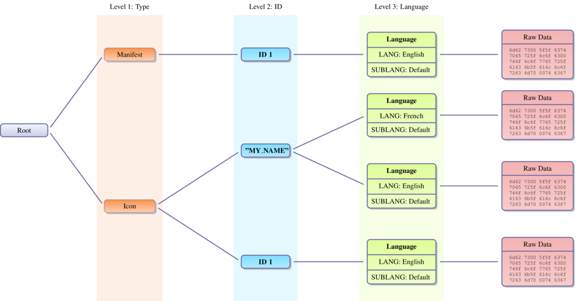
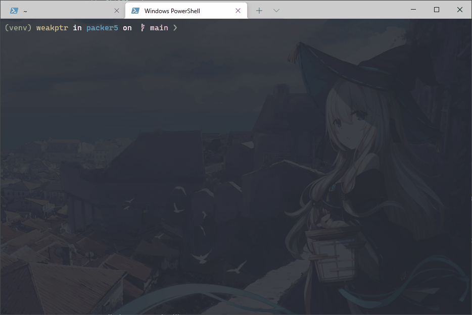
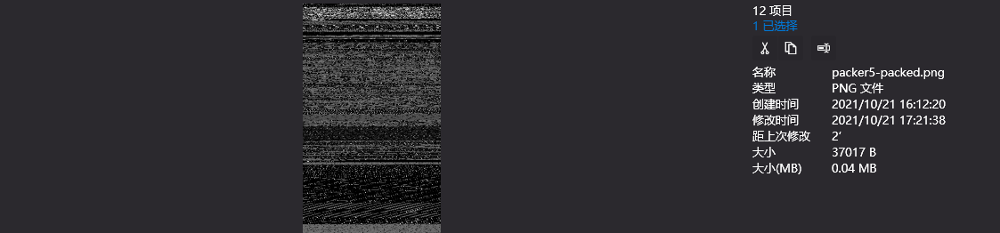
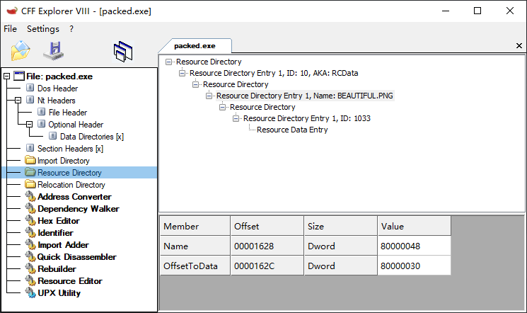
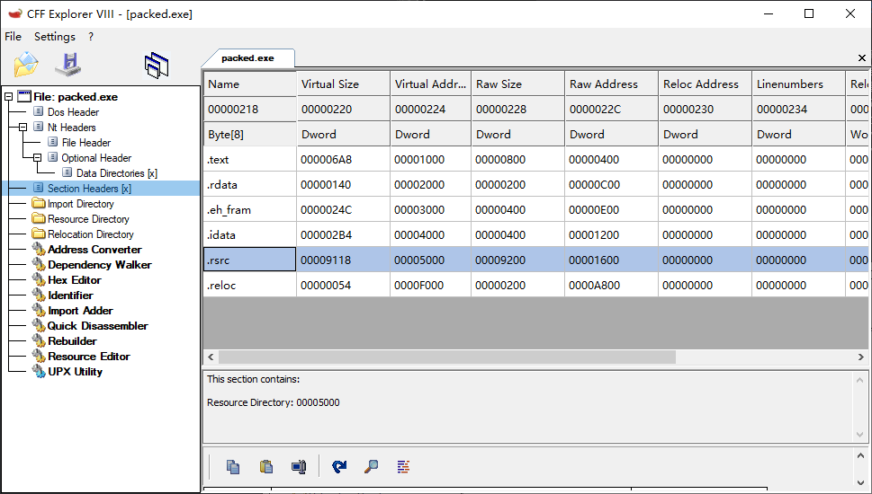

## 前言

完成了简单的压缩壳之后放松下，在52论坛病毒分析区看到过几次把代码隐藏到图片里的做法，也看到过把程序转成图片后训练神经网络来判断有没有恶意的，于是就想，淦，这不是挺好玩的嘛。

## 0x01 思路

用图片保存程序最简单的做法就是直接把程序每个字节都转成像素，然后输出成灰度图。比较进阶的做法就像是二维码了，大色块，容错校验，图片被压到包浆也能扫出来。但那个有点点难（我菜）最终成果也大到不现实，而且实话说打包到程序里就不用考虑被二次压缩的情况了。所以简单的8bit灰度图就刑。

说到位图肯定有人想到了 BMP ，我记得上学那会儿还跟着网上哪儿找的教程，学着用 ffmpeg 把 *Bad Apple* 转成位图序列，再转成字符图合并成 HTML，用 js 播放。说起来都是泪。

现在已经成了正经的码农，再折腾 BMP 就没意思了，PNG 就挺好的。

图片可以放到 Section 里——但并没有意义，所以我选择放到资源里。写一个 `.rc` 文件用 `windres` 编译出目标文件，再拿 `gcc` 链接就行了。如此一来并没有 lief 出场的机会，编译好的加载器就是加完壳的程序。

加载器则采用开启 ASLR 的模式，这样程序的节表会比较干净，没有明显特征（虽然也没什么卵用）。

## 0x02 加载器

### 2.1 资源介绍

参考微软的文档 [Using Resources](https://docs.microsoft.com/en-us/windows/win32/menurc/using-resources)、[Menu and Other Resources](https://docs.microsoft.com/en-us/windows/win32/menurc/resources)。

> A *resource* is binary data that you can add to the executable file of a Windows-based application. A resource can be either standard or defined. The data in a *standard resource* describes an icon, cursor, menu, dialog box, bitmap, enhanced metafile, font, accelerator table, message-table entry, string-table entry, or version information. An *application-defined resource*, also called a *custom resource*, contains any data required by a specific application.

资源就是一堆打包进可执行文件里的二进制数据，有标准资源类型和自定义的资源类型，标准的回头看就全是微软的历史包袱了，自定义的就是随便什么东西。

资源本身是有结构的，大体上分三层：

1. 类型；比如图标、对话框、位图、Manifest等等。
2. ID；资源的标识符，可以是数字或字符串。
3. 语言；英语法语等等..

经过这样三层索引就能找到对应资源的原始数据了。

如图：



### 2.2 查找并加载资源

步骤很简单：

1. `FindResource` 找到你要的资源
2. `SizeofResource` 确定你要的资源大小
3. `LoadResource` 加载资源，得到 HANDLE
4. `LockResource` 锁定资源，得到资源首字节指针

实现比较啰嗦，主要是错误检查很啰嗦。我这返回值都是随便 return 的，更好的做法应该是 `GetLastError` 去拿错误码。

```c
int get_resource(const char *name, void **buffer, size_t *length) {
  HRSRC res_found = FindResourceA(NULL, "BEAUTIFUL.PNG", RT_RCDATA);
  if (res_found == NULL) {
    MessageBoxA(NULL, "find resource failed", "FindResourceA", MB_OK);
    return 1;
  }

  DWORD sizeof_res = SizeofResource(NULL, res_found);
  if (sizeof_res == 0) {
    MessageBoxA(NULL, "sizeof resource failed", "SizeofResource", MB_OK);
    return 2;
  }

  HGLOBAL res_loaded = LoadResource(NULL, res_found);
  if (res_loaded == NULL) {
    MessageBoxA(NULL, "load resource failed", "LoadResource", MB_OK);
    return 3;
  }

  LPVOID res_acquired = LockResource(res_loaded);
  if (res_acquired == NULL) {
    MessageBoxA(NULL, "lock resource failed", "LockResource", MB_OK);
    return 3;
  }

  *buffer = malloc(sizeof_res);
  *length = sizeof_res;
  memcpy(*buffer, res_acquired, sizeof_res);
  UnlockResource(res_loaded);
  FreeResource(res_loaded);

  return 0;
}
```

得到数据后复制到新分配的内存里返回出去就完事了。

### 2.3 解析图片

得到了资源图片的内容之后，下一步就是把图片解码成像素，还原到程序本身了。

```c
#include "png.h"
#include <stddef.h>
#include <stdint.h>
#include <stdio.h>
#include <stdlib.h>
#include <string.h>

typedef uint8_t u8, *u8p;
typedef uint32_t u32, *u32p;

// decode PNG in memory
// https://stackoverflow.com/questions/53237065/using-libpng-1-2-to-write-rgb-image-buffer-to-png-buffer-in-memory-causing-segme
u8p read_program_from_png(u8p data, size_t length) {
  png_image image;
  memset(&image, 0, sizeof(image));
  image.version = PNG_IMAGE_VERSION;
  if (png_image_begin_read_from_memory(&image, data, length) == 0) {
    return NULL;
  }

  png_bytep buffer;
  image.format = PNG_FORMAT_GRAY;
  size_t input_data_length = PNG_IMAGE_SIZE(image);
  buffer = (png_bytep)malloc(input_data_length);
  memset(buffer, 0, input_data_length);

  if (png_image_finish_read(&image, NULL, buffer, 0, NULL) == 0) {
    return NULL;
  }

  u32 actual_len = *((u32 *)buffer);
  void *program = malloc(actual_len);
  memcpy(program, buffer + 4, actual_len);
  free(buffer);

  return (u8p)program;
}
```

面向 stackoverflow 编程，照着抄一个 libpng 的解码实现。不同的是把解码后的头4个字节作为小端序无符号整型，认为是程序的实际大小。因为程序的大小可能并不正好是图片的像素数量（width*height）。

最后是把解码后的内容复制到新分配的内存里返回。现在返回的指针应该就指向我们的 PE 文件内容了。

### 2.4 入口点

在入口点，调用加载资源函数获得资源数据的指针，传给解码的函数，得到解码后的PE文件指针，然后加载并跳转到被加载程序的入口点，就这么简单。

```c
int _start(void) {
  void *buffer = NULL;
  size_t length = 0;
  if (get_resource("BEAUTIFUL.PNG", &buffer, &length) != 0) {
    return 1;
  }

  u8p program = read_program_from_png((u8p)buffer, length);
  free(buffer);

  if (program != NULL) {
    void (*entrypoint)(void) = (void (*)(void))load_PE((char *)program);
    entrypoint();

    free(program);
    return 0;
  }

  MessageBoxA(NULL, ".packed section not found", "loader error", MB_OK);
  return 0;
}
```

## 0x03 加壳机

### 3.1 程序转图片

使用 `pypng` 这个包实现把二进制程序转图片。

```python
IMG_PATH = 'packer5-packed.png'
ROW_LEN = 256
with open('example.exe', 'rb') as f:
    arr = []
    content = f.read()
    content = struct.pack('<I', len(content))+content

    for i in range(len(content)//ROW_LEN):
        t = content[i*ROW_LEN:i*ROW_LEN+ROW_LEN]
        arr.append(t)

    png.from_array(arr, 'L').save(IMG_PATH)
```

非常简单的一段脚本。把内容长度和内容拼接后，以 `ROW_LEN` 每行，拆成一个二维数组，然后用 pypng 编码并保存。

### 3.2 编译资源

随便新建一个 `rsrc.rc` 。

别问 `.rc` 怎么写，不知道，问就是面向谷歌编程抄的。

```plain
beautiful.png RCDATA "packer5-packed.png"
```

然后在脚本里调用 `windres` 编译。

```python
def windres(sources, output):
    executable = 'windres'
    args = ''
    if isinstance(sources, (str, bytes)):
        args += sources
    elif isinstance(sources, (list, tuple)):
        args += ' '.join(sources)

    cmd = f'{executable} {args} -o {output}'
    proc = run(cmd, shell=True, stderr=STDOUT)
    if proc.returncode != 0:
        raise CompilationError(proc.returncode, proc.stdout)

windres(path.join(src_dir, 'rsrc.rc'), path.join(src_dir, 'rsrc.o'))
```

就得到了 `rsrc.o` 。

### 3.3 编译加载器

```python
# compile shifted loader program
def compile(sources, flags):
    args = ''
    compiler = 'gcc'

    args += ''
    if isinstance(sources, (str, bytes)):
        args += sources
    elif isinstance(sources, (list, tuple)):
        args += ' '.join(sources)

    args += ' '
    if isinstance(flags, (str, bytes)):
        args += flags
    elif isinstance(flags, (list, tuple)):
        args += ' '.join(flags)

    cmd = f'{compiler} {args}'
    proc = run(cmd, shell=True, stderr=STDOUT)
    if proc.returncode != 0:
        raise CompilationError(proc.returncode, proc.stdout)

cflags = [
    '-m32',
    '-O2',
    '-Wall',
    '-I.',
    '-Wl,--entry=__start',
    '-nodefaultlibs',
    '-nostartfiles',
    '-lkernel32',
    '-luser32',
    '-lmsvcrt',
    '-lpng',
    '-o',
    'packed.exe'
]
compile([path.join(src_dir, src) for src in ['loader.c', 'png_decode.c', 'rsrc.o']], cflags)
print('[+] compile loader with resource success.')
```

主要是加上 `-lpng` 链接参数，链接 `libpng` 。输入文件里加上 `png_decode.c` 这个里面实现了 `read_program_from_png`，还有编译好的资源 `rsrc.o`。

## 0x04 成果展示

### 4.1 完整代码

[github.com - packer05](https://github.com/nnnewb/learning-packer/tree/main/packer5)

### 4.2 成果









## 总结

这次实验主要是验证了从资源加载程序，本质和之前的其他加壳方式没有区别。把应用程序转换成图片后看到的效果确实比较有趣，我想如果用一张普通的图片或者其他文件类型，藏起来可能更隐蔽。

但到这里还是有明显的问题：壳和被加载的程序还是泾渭分明。

