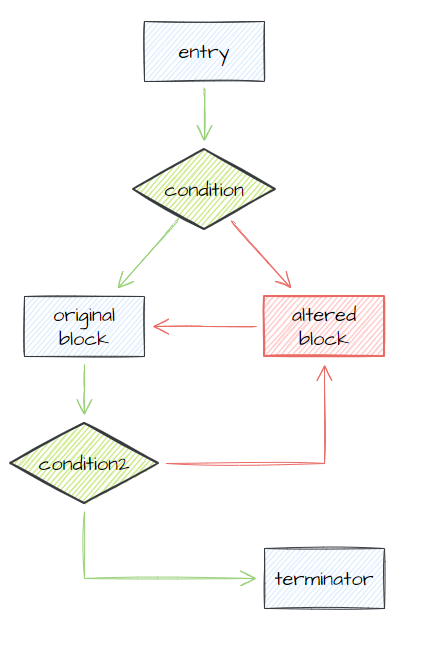
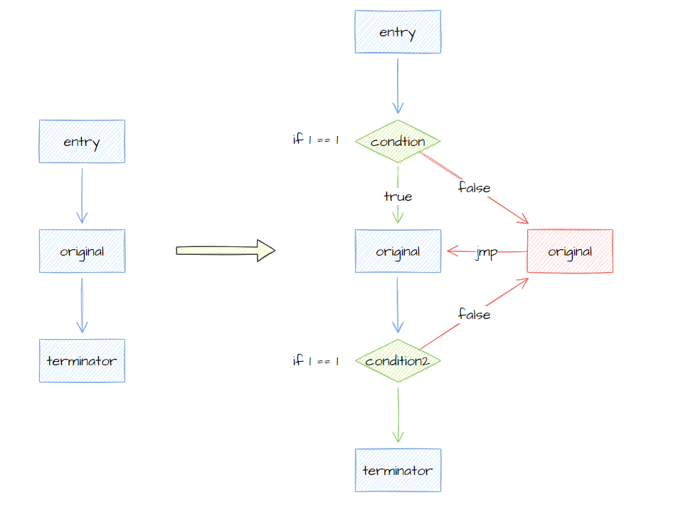
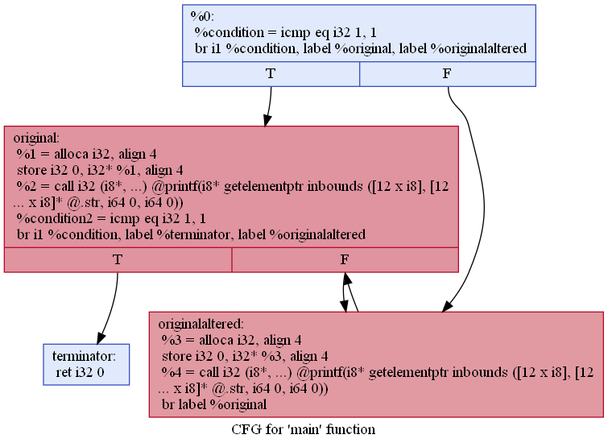
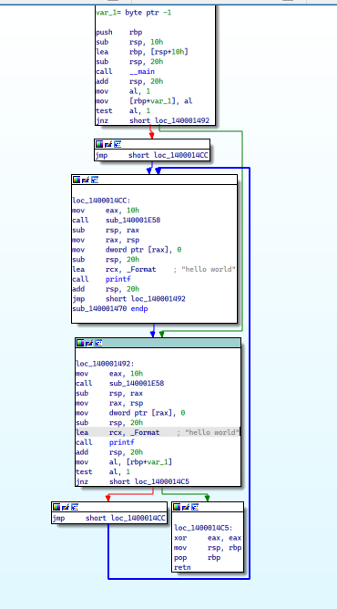
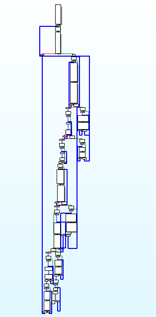

## 前言

本篇尝试学习通过动手写一个 LLVM Pass 来学习编译阶段进行代码混淆的技术。

## 0x01 环境设置

LLVM 是个相当大的项目，做好环境设置是首先要做的事情。这里选择 msys2 作为首要开发环境，不然光是 MSVC 把 LLVM 源码编译一遍就够呛了。

安装好MSYS2之后安装 clang 工具链（2021年11月3日，clang32工具链默认不在msys2的源里，需要手动改 `pacman.conf` 加入 `clang32` 源，这里以 x86_64 的 LLVM 工具链进行实践）。

```shell
pacman -Sy mingw-w64-clang-x86_64-toolchain
```

完成后添加环境变量，把 msys2 安装目录下的 `clang64/bin` 加入环境变量，方便 VSCode + CMake 找到工具链。另外注意装一个 Ninja，同样加入 Path。

VSCode 里装上微软的 C/C++ 和 clangd，禁用微软 C/C++ 的 Intellisense，实在太慢。

手动编译整个LLVM源码树实在是太费时间了，我选择用MSYS2的工具链。参考这篇文档去配置一个 LLVM 源码树外的 Pass 工程：[CMake out of source pass - LLVM](https://llvm.org/docs/CMake.html#cmake-out-of-source-pass) 。写一个简单的 CMakeLists.txt ，跟着 [Writing an LLVM Pass - LLVM](https://llvm.org/docs/WritingAnLLVMPass.html) 这篇文档快速实现一个遍历函数的 Pass 。

下面是 `CMakeLists.txt` 的内容

```cmake
cmake_minimum_required(VERSION 3.13.4)
project(Hello)
find_package(LLVM REQUIRED CONFIG)

message(STATUS "Found LLVM ${LLVM_PACKAGE_VERSION}")
message(STATUS "Using LLVMConfig.cmake in: ${LLVM_DIR}")

include_directories(${LLVM_INCLUDE_DIRS})
separate_arguments(LLVM_DEFINITIONS_LIST NATIVE_COMMAND ${LLVM_DEFINITIONS})
add_definitions(${LLVM_DEFINITIONS_LIST})

list(APPEND CMAKE_MODULE_PATH "${LLVM_CMAKE_DIR}")
include(AddLLVM)
add_llvm_library(Hello MODULE hello.cpp PLUGIN_TOOL opt)
```

然后是实现 pass 的源码，源码的详细解释直接读 LLVM 给的文档。

```c++
#include "llvm/IR/Function.h"
#include "llvm/IR/LegacyPassManager.h"
#include "llvm/Pass.h"
#include "llvm/Support/raw_ostream.h"
#include "llvm/Transforms/IPO/PassManagerBuilder.h"

using namespace llvm;

namespace {
  struct Hello : public FunctionPass {
    static char ID;
    Hello() : FunctionPass(ID) {}
    bool runOnFunction(Function &F) override {
      errs() << "Hello:";
      errs().write_escaped(F.getName()) << "\n";
      return false;
    }
  };
} // namespace

char Hello::ID = 0;

static RegisterPass<Hello> X("hello", "hello world pass", false, false);

static RegisterStandardPasses Y(PassManagerBuilder::EP_EarlyAsPossible,
                                [](const PassManagerBuilder &builder, legacy::PassManagerBase &pm) {
                                  pm.add(new Hello());
                                });
```

再准备一个简单的样本，用来实验 Pass 的效果。

```c
#include <stdio.h>

int main(void) {
  printf("hello world");
  return 0;
}
```

接着是实验步骤：

```shell
clang -O3 -emit-llvm sample.c -c -o sample.bc
opt -enable-new-pm=0 -load build/hello.dll -hello sample.bc -o sample.exe
```

如果一切顺利，输出如下：

```plain
Hello:main
```

不顺利的话只能自己谷歌。

## 0x02 OLLVM bcf 混淆初窥

这部分先看看知名的 OLLVM 项目是怎么做的，先看 *bcf* 混淆，源码在 `llvm/lib/Transforms/Obfuscation/BogusControlFlow.cpp`， 入口在 `runOnFunction` 函数。

### 2.1 runOnFunction

```cpp
    /* runOnFunction
     *
     * Overwrite FunctionPass method to apply the transformation
     * to the function. See header for more details.
     */
    virtual bool runOnFunction(Function &F){
      // Check if the percentage is correct
      if (ObfTimes <= 0) {
        errs()<<"BogusControlFlow application number -bcf_loop=x must be x > 0";
		return false;
      }

      // Check if the number of applications is correct
      if ( !((ObfProbRate > 0) && (ObfProbRate <= 100)) ) {
        errs()<<"BogusControlFlow application basic blocks percentage -bcf_prob=x must be 0 < x <= 100";
		return false;
      }
      // If fla annotations
      if(toObfuscate(flag,&F,"bcf")) {
        if (isInvoke(&F)) {
          bogus(F);
          doF(*F.getParent());
          return true;
        }
      }

      return false;
    } // end of runOnFunction()
```

前两个 `if` 都是在判断参数，先忽略。`if(toObfuscate(flag,&F,"bcf"))` 判断是否是否需要混淆，`if (isInvoke(&F))` 判断能否混淆。

真正的混淆逻辑在 `bogus(F)` 里。

### 2.2 bogus

裁剪掉了调试输出后的 `bogus` 函数内容。

```c++
void bogus(Function &F) {
  // For statistics and debug
  ++NumFunction;
  int NumBasicBlocks = 0;
  bool firstTime = true; // First time we do the loop in this function

  NumTimesOnFunctions = ObfTimes;
  int NumObfTimes = ObfTimes;

  // Real begining of the pass
  // Loop for the number of time we run the pass on the function
  do {
    // Put all the function's block in a list
    std::list<BasicBlock *> basicBlocks;
    for (Function::iterator i = F.begin(); i != F.end(); ++i) {
      basicBlocks.push_back(&*i);
    }

    while (!basicBlocks.empty()) {
      NumBasicBlocks++;
      // Basic Blocks' selection
      if ((int)llvm::cryptoutils->get_range(100) <= ObfProbRate) {
        ++NumModifiedBasicBlocks;
        NumAddedBasicBlocks += 3;
        FinalNumBasicBlocks += 3;
        // Add bogus flow to the given Basic Block (see description)
        BasicBlock *basicBlock = basicBlocks.front();
        addBogusFlow(basicBlock, F);
      }
      // remove the block from the list
      basicBlocks.pop_front();

      if (firstTime) { // first time we iterate on this function
        ++InitNumBasicBlocks;
        ++FinalNumBasicBlocks;
      }
    } // end of while(!basicBlocks.empty())

    firstTime = false;
  } while (--NumObfTimes > 0);
}
```

尝试分析上面的函数逻辑：

1. 循环混淆一定次数（`NumObfTimes`）
   1. 遍历原函数基本块（`basicBlocks`）
      1. 选择基本块（`cryptoutils->get_range(100) <= ObfProbRate`）
         1. 各种计数自增
         2. 添加伪造控制流（`addBogusFlow(basicBlock, F)`）

混淆次数和基本块遍历没什么好说的，选择基本块这里，`get_range(100)` 实际上是一个安全的随机数生成器，`ObfProbRate` 是基本块被混淆的机率。也就是说一个函数内的基本块是随机被混淆的，加上混淆次数的设计，会出现有的基本块被混淆多次有的没有被混淆的情况。

### 2.2 addBogusFlow

接着继续看添加伪造控制流的逻辑，同样裁剪掉了调试输出。

```c++
/* addBogusFlow
  *
  * Add bogus flow to a given basic block, according to the header's description
  */
virtual void addBogusFlow(BasicBlock *basicBlock, Function &F) {
      // Split the block: first part with only the phi nodes and debug info and terminator
      //                  created by splitBasicBlock. (-> No instruction)
      //                  Second part with every instructions from the original block
      // We do this way, so we don't have to adjust all the phi nodes, metadatas and so on
      // for the first block. We have to let the phi nodes in the first part, because they
      // actually are updated in the second part according to them.
      BasicBlock::iterator i1 = basicBlock->begin();
      if (basicBlock->getFirstNonPHIOrDbgOrLifetime())
        i1 = (BasicBlock::iterator)basicBlock->getFirstNonPHIOrDbgOrLifetime();
      Twine *var;
      var = new Twine("originalBB");
      BasicBlock *originalBB = basicBlock->splitBasicBlock(i1, *var);

      // Creating the altered basic block on which the first basicBlock will jump
      Twine *var3 = new Twine("alteredBB");
      BasicBlock *alteredBB = createAlteredBasicBlock(originalBB, *var3, &F);

      // Now that all the blocks are created,
      // we modify the terminators to adjust the control flow.
      alteredBB->getTerminator()->eraseFromParent();
      basicBlock->getTerminator()->eraseFromParent();

      // Preparing a condition..
      // For now, the condition is an always true comparaison between 2 float
      // This will be complicated after the pass (in doFinalization())
      Value *LHS = ConstantFP::get(Type::getFloatTy(F.getContext()), 1.0);
      Value *RHS = ConstantFP::get(Type::getFloatTy(F.getContext()), 1.0);

      // The always true condition. End of the first block
      Twine *var4 = new Twine("condition");
      FCmpInst *condition = new FCmpInst(*basicBlock, FCmpInst::FCMP_TRUE, LHS, RHS, *var4);

      // Jump to the original basic block if the condition is true or
      // to the altered block if false.
      BranchInst::Create(originalBB, alteredBB, (Value *)condition, basicBlock);

      // The altered block loop back on the original one.
      BranchInst::Create(originalBB, alteredBB);

      // The end of the originalBB is modified to give the impression that sometimes
      // it continues in the loop, and sometimes it return the desired value
      // (of course it's always true, so it always use the original terminator..
      //  but this will be obfuscated too;) )

      // iterate on instruction just before the terminator of the originalBB
      BasicBlock::iterator i = originalBB->end();

      // Split at this point (we only want the terminator in the second part)
      Twine *var5 = new Twine("originalBBpart2");
      BasicBlock *originalBBpart2 = originalBB->splitBasicBlock(--i, *var5);
      // the first part go either on the return statement or on the begining
      // of the altered block.. So we erase the terminator created when splitting.
      originalBB->getTerminator()->eraseFromParent();
      // We add at the end a new always true condition
      Twine *var6 = new Twine("condition2");
      FCmpInst *condition2 = new FCmpInst(*originalBB, CmpInst::FCMP_TRUE, LHS, RHS, *var6);
      BranchInst::Create(originalBBpart2, alteredBB, (Value *)condition2, originalBB);
} // end of addBogusFlow()
```

尝试分析上面的函数逻辑：

1. 分割基本块，把 `phinode` 和调试信息之类的分割到原始块，新创建出来的块不包含 `phinode` 之类的东西。（`entry`）
2. 创建伪造分支。（`altered`）
3. 创建恒真条件，这里是利用浮点比较 `FCMP_TRUE`。（`condition`）
4. 创建分支指令，真跳转原始块，假跳转伪造块，伪造块的末尾又跳回原始块。
5. 在原始块的结束部分再次分割基本块，分割后的块包含原始块的 terminator （`terminator`）
6. 创建一个恒真条件，跳转到原始块的 terminator，假则跳转到伪造块 （`condition2`）



混淆后的控制流长这样，两个 condition 都是恒真条件，原始块被分成了三个部分，`entry`、`origin`、`terminator` 。图中红色的部分是伪造块，包含垃圾指令，绿色的条件块都是恒真条件，只有绿色箭头的控制流能走通。蓝色节点是从原始基本块上分割出来的部分。

### 2.3 createAlteredBasicBlock

再看伪造块是如何生成的。

```c++
    /* createAlteredBasicBlock
     *
     * This function return a basic block similar to a given one.
     * It's inserted just after the given basic block.
     * The instructions are similar but junk instructions are added between
     * the cloned one. The cloned instructions' phi nodes, metadatas, uses and
     * debug locations are adjusted to fit in the cloned basic block and
     * behave nicely.
     */
    virtual BasicBlock *createAlteredBasicBlock(BasicBlock *basicBlock, const Twine &Name = "gen", Function *F = 0) {
      // Useful to remap the informations concerning instructions.
      ValueToValueMapTy VMap;
      BasicBlock *alteredBB = llvm::CloneBasicBlock(basicBlock, VMap, Name, F);
      // Remap operands.
      BasicBlock::iterator ji = basicBlock->begin();
      for (BasicBlock::iterator i = alteredBB->begin(), e = alteredBB->end(); i != e; ++i) {
        // Loop over the operands of the instruction
        for (User::op_iterator opi = i->op_begin(), ope = i->op_end(); opi != ope; ++opi) {
          // get the value for the operand
          Value *v = MapValue(*opi, VMap, RF_None, 0);
          if (v != 0) {
            *opi = v;
          }
        }
        // Remap phi nodes' incoming blocks.
        if (PHINode *pn = dyn_cast<PHINode>(i)) {
          for (unsigned j = 0, e = pn->getNumIncomingValues(); j != e; ++j) {
            Value *v = MapValue(pn->getIncomingBlock(j), VMap, RF_None, 0);
            if (v != 0) {
              pn->setIncomingBlock(j, cast<BasicBlock>(v));
            }
          }
        }
        // Remap attached metadata.
        SmallVector<std::pair<unsigned, MDNode *>, 4> MDs;
        i->getAllMetadata(MDs);
        // important for compiling with DWARF, using option -g.
        i->setDebugLoc(ji->getDebugLoc());
        ji++;

      } // The instructions' informations are now all correct


      // add random instruction in the middle of the bloc. This part can be improve
      for (BasicBlock::iterator i = alteredBB->begin(), e = alteredBB->end(); i != e; ++i) {
        // in the case we find binary operator, we modify slightly this part by randomly
        // insert some instructions
        if (i->isBinaryOp()) { // binary instructions
          unsigned opcode = i->getOpcode();
          BinaryOperator *op, *op1 = NULL;
          UnaryOperator *op2;
          Twine *var = new Twine("_");
          // treat differently float or int
          // Binary int
          if (opcode == Instruction::Add || opcode == Instruction::Sub || opcode == Instruction::Mul ||
              opcode == Instruction::UDiv || opcode == Instruction::SDiv || opcode == Instruction::URem ||
              opcode == Instruction::SRem || opcode == Instruction::Shl || opcode == Instruction::LShr ||
              opcode == Instruction::AShr || opcode == Instruction::And || opcode == Instruction::Or ||
              opcode == Instruction::Xor) {
            for (int random = (int)llvm::cryptoutils->get_range(10); random < 10; ++random) {
              switch (llvm::cryptoutils->get_range(4)) { // to improve
              case 0:                                    // do nothing
                break;
              case 1:
                op = BinaryOperator::CreateNeg(i->getOperand(0), *var, &*i);
                op1 = BinaryOperator::Create(Instruction::Add, op, i->getOperand(1), "gen", &*i);
                break;
              case 2:
                op1 = BinaryOperator::Create(Instruction::Sub, i->getOperand(0), i->getOperand(1), *var, &*i);
                op = BinaryOperator::Create(Instruction::Mul, op1, i->getOperand(1), "gen", &*i);
                break;
              case 3:
                op = BinaryOperator::Create(Instruction::Shl, i->getOperand(0), i->getOperand(1), *var, &*i);
                break;
              }
            }
          }
          // Binary float
          if (opcode == Instruction::FAdd || opcode == Instruction::FSub || opcode == Instruction::FMul ||
              opcode == Instruction::FDiv || opcode == Instruction::FRem) {
            for (int random = (int)llvm::cryptoutils->get_range(10); random < 10; ++random) {
              switch (llvm::cryptoutils->get_range(3)) { // can be improved
              case 0:                                    // do nothing
                break;
              case 1:
                op2 = UnaryOperator::CreateFNeg(i->getOperand(0), *var, &*i);
                op1 = BinaryOperator::Create(Instruction::FAdd, op2, i->getOperand(1), "gen", &*i);
                break;
              case 2:
                op = BinaryOperator::Create(Instruction::FSub, i->getOperand(0), i->getOperand(1), *var, &*i);
                op1 = BinaryOperator::Create(Instruction::FMul, op, i->getOperand(1), "gen", &*i);
                break;
              }
            }
          }
          if (opcode == Instruction::ICmp) { // Condition (with int)
            ICmpInst *currentI = (ICmpInst *)(&i);
            switch (llvm::cryptoutils->get_range(3)) { // must be improved
            case 0:                                    // do nothing
              break;
            case 1:
              currentI->swapOperands();
              break;
            case 2: // randomly change the predicate
              switch (llvm::cryptoutils->get_range(10)) {
              case 0:
                currentI->setPredicate(ICmpInst::ICMP_EQ);
                break; // equal
              case 1:
                currentI->setPredicate(ICmpInst::ICMP_NE);
                break; // not equal
              case 2:
                currentI->setPredicate(ICmpInst::ICMP_UGT);
                break; // unsigned greater than
              case 3:
                currentI->setPredicate(ICmpInst::ICMP_UGE);
                break; // unsigned greater or equal
              case 4:
                currentI->setPredicate(ICmpInst::ICMP_ULT);
                break; // unsigned less than
              case 5:
                currentI->setPredicate(ICmpInst::ICMP_ULE);
                break; // unsigned less or equal
              case 6:
                currentI->setPredicate(ICmpInst::ICMP_SGT);
                break; // signed greater than
              case 7:
                currentI->setPredicate(ICmpInst::ICMP_SGE);
                break; // signed greater or equal
              case 8:
                currentI->setPredicate(ICmpInst::ICMP_SLT);
                break; // signed less than
              case 9:
                currentI->setPredicate(ICmpInst::ICMP_SLE);
                break; // signed less or equal
              }
              break;
            }
          }
          if (opcode == Instruction::FCmp) { // Conditions (with float)
            FCmpInst *currentI = (FCmpInst *)(&i);
            switch (llvm::cryptoutils->get_range(3)) { // must be improved
            case 0:                                    // do nothing
              break;
            case 1:
              currentI->swapOperands();
              break;
            case 2: // randomly change the predicate
              switch (llvm::cryptoutils->get_range(10)) {
              case 0:
                currentI->setPredicate(FCmpInst::FCMP_OEQ);
                break; // ordered and equal
              case 1:
                currentI->setPredicate(FCmpInst::FCMP_ONE);
                break; // ordered and operands are unequal
              case 2:
                currentI->setPredicate(FCmpInst::FCMP_UGT);
                break; // unordered or greater than
              case 3:
                currentI->setPredicate(FCmpInst::FCMP_UGE);
                break; // unordered, or greater than, or equal
              case 4:
                currentI->setPredicate(FCmpInst::FCMP_ULT);
                break; // unordered or less than
              case 5:
                currentI->setPredicate(FCmpInst::FCMP_ULE);
                break; // unordered, or less than, or equal
              case 6:
                currentI->setPredicate(FCmpInst::FCMP_OGT);
                break; // ordered and greater than
              case 7:
                currentI->setPredicate(FCmpInst::FCMP_OGE);
                break; // ordered and greater than or equal
              case 8:
                currentI->setPredicate(FCmpInst::FCMP_OLT);
                break; // ordered and less than
              case 9:
                currentI->setPredicate(FCmpInst::FCMP_OLE);
                break; // ordered or less than, or equal
              }
              break;
            }
          }
        }
      }
      return alteredBB;
    } // end of createAlteredBasicBlock()
```

主要是分两部分：

1. 复制原始块，并修复伪造块的调试信息与元数据
2. 在伪造块中寻找二元运算、浮点运算、比较指令，在其中插入垃圾指令。

## 0x03 创建自己的混淆

对 OLLVM 的 bcf 混淆有了初步的映像之后，接下来就可以依样画葫芦抄一个自己的混淆出来啦。

### 3.1 方案



作为概念验证，我们的 pass 将原始代码分割成三个基本块，称为 `entry`、`original`和`terminator`。`entry` 通过一个恒真判断跳转至 `original`，`original` 通过恒真判断跳转至 `terminator`。伪造块 `altered` 则是 false 分支，内容仅复制 `original` 块，并在末尾跳转至 `original` 块。

伪造块应该永远不会被执行。

### 3.2 LLVM编程的重要概念

参考文章：[LLVM IR C++ API Tutorial](https://mukulrathi.com/create-your-own-programming-language/llvm-ir-cpp-api-tutorial/)

#### 关键类型：

清单如下：

- `Value`
- `Module`
- `Type`
- `Function`
- `BasicBlock`
- `BranchInst`

列出的这些是 LLVM C++ 接口定义的类，可以通过 `Module` 获取 `Function`，可以从 `Function` 获取 `BasicBlock`，也可以从 `BasicBlock` 反过来获取 `Function`，这些容器间组织成层级关系。

`Module`->`Function`->`BasicBlock`->`Instruction`

`Value` 是公共基类，`Function`、`BasicBlock`，包括各种指令类都是从`Value`继承。

#### PHINode：

参考文章：[PhiNode in LLVM](http://mayuyu.io/2018/06/04/PhiNode-in-LLVM/)

LLVM的指令类型中包含一种特殊节点叫 PhiNode，PhiNode 的存在是为了解决 LLVM IR 中因 SSA （静态单次赋值）引起的条件初始化问题。示例如下。

```c
int foooooo(int bar){
    int i=0;
    if(bar%2==0){
        i=1; //BasicBlock 1
    }
    else{
        i=2; //BasicBlock 2
    }
    return i;
}
```

可以看到我们需要按 `bar` 的取值来初始化 `i`，但 SSA 要求 `i` 只能被赋值一次。PhiNode 允许根据基本块选择赋值。

```c
int foooooo(int bar) {
    if(bar%2==0){
        //BasicBlock1
    }
    else{
        //BasicBlock2
    }
    int i=Phi([BasicBlock1,1],[BasicBlock2,2]);
    return i;
}
```

上面的例子也可以改成在栈或堆上开辟空间，以类似指针的方式避开 SSA 约束。

```c
int foooooo(int bar) {
    int* i=malloc(sizeof(int));
    if(bar%2==0){
        Store Value 1 to the memory location pointed to by i;
    }
    else{
        Store Value 2 to the memory location pointed to by i;
    }
    int j=load from the address pointed by i;
    return j;
}
```

#### Terminator:

参考文章：[How do Terminator work in LLVM IR](https://www.quora.com/How-do-Terminators-work-in-the-LLVM-IR)

LLVM中，一个基本块 *BasicBlock* 总是以终结指令 *TerminatorInst* 结束的。终结指令不能出现在基本块末尾以外的任何地方。粗略地说，终结指令标识控制流在基本块结束后去往何方。

每个终结指令都包含一定的后继基本块。

几个常见的终结指令类型：

- `ReturnInst` 就像是普通编程中的的`return`语句。
- `BranchInst` 是跳转指令，包括两类：
  - 条件跳转，满足条件时跳转分支1，否则跳转分支2。
  - 非条件跳转，总是跳转到某个分支。

- `SwitchInst` 类似于普通编程里的 `switch` 语句，可以包含更多的后继块。

还有些不那么常见的终结指令：

- `invoke` 和 `catchswitch`
- `unreachable`

### 3.3 工具链

参考文章：[LLVM Command Guide](https://llvm.org/docs/CommandGuide/index.html)

实际动手前先了解下 LLVM工具链，列出一些会涉及到的命令行工具。

- `llc` 将输入的 LLVM IR(`.ll`) 编译成指定架构的汇编（或二进制对象文件）
- `lli` 将输入的 BitCode(`.bc`) 解释执行。
- `llvm-as` 汇编器
- `llvm-dis` 反汇编器，可以反汇编 BitCode
- `opt` BITCODE/IR 优化器

最好再安装一个 graphviz，因为很多编程语言的命令行工具如果提供图形输出的话，大多是以 dot 形式提供（比如 go 的 pprof 和 LLVM opt 的 dot-cfg）。

### 3.3 runOnFunction

参考 OLLVM 的代码，抄出过滤函数。原理不明暂且不深究。

```c++
bool isObfuscateable(const Function &fn) {
    if (fn.isDeclaration()) {
        return false;
    }

    if (fn.hasAvailableExternallyLinkage()) {
        return false;
    }

    if (!isInvoke(fn)) {
        return false;
    }

    return true;
}

bool isInvoke(const Function &fn) {
    for (const BasicBlock &bb : fn) {
        if (isa<InvokeInst>(bb.getTerminator())) {
            return false;
        }
    }
    return true;
}
```

然后在入口点简单过滤掉不能混淆的函数，接着遍历基本块，对每个基本块都进行一次混淆。

```c++
bool runOnFunction(Function& F) {
    if (!isObfuscateable(F)) {
        errs()<<"function "<< F.getName() <<" is not obfuscateable\n";
        return false;
    }
    
    list<BasicBlock *> blocks;
    for (BasicBlock &block : F) {
        blocks.push_back(&block);
    }

    for (BasicBlock *block : blocks) {
        // 原始块分割为三个基本块：entry、original、terminator
        // 通过两个恒真条件连接
        auto entryBB = &block;
        auto originalBB = entryBB->splitBasicBlock(entryBB->getFirstNonPHIOrDbgOrLifetime(), Twine("original"));
        auto terminatorBB = originalBB->splitBasicBlock(--originalBB->end(), Twine("terminator"));

        // 构造伪造块
        // 这一步已经构造好了 altered 跳转 original
        auto alteredBB = createAlteredBB(originalBB, F);

        // 清理 terminator，重新构造跳转关系
        entryBB->getTerminator()->eraseFromParent();
        originalBB->getTerminator()->eraseFromParent();

        // 构造恒真条件，从 entry 跳转到 original
        auto lhs = ConstantInt::get(Type::getInt32Ty(F.getContext()), 1);
        auto rhs = ConstantInt::get(Type::getInt32Ty(F.getContext()), 1);
        auto condition = new ICmpInst(*entryBB, ICmpInst::ICMP_EQ, lhs, rhs, Twine("condition"));
        BranchInst::Create(originalBB, alteredBB, (Value *)condition, entryBB);

        // 构造恒真条件，从 original 跳转到 terminator
        auto lhs2 = ConstantInt::get(Type::getInt32Ty(F.getContext()), 1);
        auto rhs2 = ConstantInt::get(Type::getInt32Ty(F.getContext()), 1);
        auto condition2 = new ICmpInst(*originalBB, ICmpInst::ICMP_EQ, lhs, rhs, Twine("condition2"));
        BranchInst::Create(terminatorBB, alteredBB, (Value *)condition, originalBB);
    }

    return false;
}
```

混淆过程非常简单，原始基本块分割成三个部分，清除`entry`和`original`的`terminator`并加入恒真条件跳转，false 分支都指定为 `altered` 即可。

### 3.4 createAlteredBB

```c++
BasicBlock *createAlteredBB(BasicBlock *original, Function &F) {
    // 构造伪造块
    ValueToValueMapTy VMap;
    auto altered = CloneBasicBlock(original, VMap, Twine("altered"), &F);

    // 修复伪造块的指令
    auto originalInstIt = original->begin();
    for (auto &inst : *altered) {
        // NOTE:
        // 参考链接： https://bbs.pediy.com/thread-266201.htm
        //
        // ... 但是CloneBasicBlock函数进行的克隆并不是完全的克隆，第一他不会对指令的操作数进行替换，比如：
        //
        // ```
        // orig:
        //   %a = ...
        //   %b = fadd %a, ...
        //
        // clone:
        //   %a.clone = ...
        //   %b.clone = fadd %a, ... ; Note that this references the old %a and
        // not %a.clone!
        // ```
        //
        // 在clone出来的基本块中，fadd指令的操作数不是%a.clone，而是%a。
        // 所以之后要通过VMap对所有操作数进行映射，使其恢复正常：
        //
        for (auto opi = inst.op_begin(); opi != inst.op_end(); opi++) {
            Value *v = MapValue(*opi, VMap, RF_None, 0);
            if (v != 0) {
                *opi = v;
            }
        }

        // 第二，它不会对PHI Node进行任何处理，PHI Node的前驱块仍然是原始基本块的前驱块，
        // 但是新克隆出来的基本块并没有任何前驱块，所以我们要对PHI Node的前驱块进行remap：
        if (auto pn = dyn_cast<PHINode>(&inst)) {
            for (unsigned j = 0, e = pn->getNumIncomingValues(); j != e; ++j) {
                Value *v = MapValue(pn->getIncomingBlock(j), VMap, RF_None, 0);
                if (v != 0) {
                    pn->setIncomingBlock(j, cast<BasicBlock>(v));
                }
            }
        }

        // 元数据
        SmallVector<pair<unsigned, MDNode *>, 4> MDs;
        inst.getAllMetadata(MDs);

        // 修复调试
        inst.setDebugLoc(originalInstIt->getDebugLoc());
        ++originalInstIt;
    }

    // 清理原来的 terminator，无条件从 altered 跳转到 original
    altered->getTerminator()->eraseFromParent();
    BranchInst::Create(original, altered);

    return altered;
}
```

去除修复指令操作数和 PhiNode 的部分，其实就是复制了原始块的指令，然后将终结指令改成跳转到原始块而已。

### 3.5 编译和测试

使用 CMake 编译，在环境设置一节中已经说明了怎么配置，编译得到了 `Hello.dll` 后用下面的案例程序测试。

```c
#include <stdio.h>

int main(void) {
    printf("hello world");
    return 0;
}
```

程序保存在 `sample/sample.c`，测试命令如下。

```shell
# clang 编译得到 bitcode
clang -emit-llvm .\sample\sample.c -c -o .\sample\sample.bc
# opt 启用 hello pass 创建混淆后的新 bitcode
opt -enable-new-pm=0 -load .\build\Hello.dll -hello .\sample\sample.bc -o .\sample\sample-optimized.bc
# llvm-dis 反汇编混淆后的 bitcode，得到 sample-optimized.ll ，可以拿来看混淆结果
llvm-dis .\sample\sample-optimized.bc
# llc 将混淆后的 bitcode 编译出汇编文件，也可以编译出 obj 文件，用 -filetype=obj 就行
# 注意 -O0，不然默认优化就会直接把我们伪造的分支给干掉
llc .\sample\sample-optimized.bc -O0 -o .\sample.s
# 用 clang 完成最后的汇编和链接
clang sample.s -o sample.exe
```

也可以用 opt 来获得混淆后的代码控制流视图。

```shell
opt -enable-new-pm=0 -dot-cfg -cfg-func-name=main .\sample\sample-optimized.bc
```



在IDA打开后看到的结果如下。



再来个更复杂的例子：[main.c](https://github.com/nnnewb/crackmes/blob/main/cm02/main.c)



### 3.6 扩展：不透明谓词

参考文章：[what is an opaque predicate](https://reverseengineering.stackexchange.com/questions/1669/what-is-an-opaque-predicate)

PS：本人没有相关学术背景，内容东拼西凑，如果存在理解错误或者陈述不准确请指出。

概括地说，不透明谓词就是“某种如果程序分析不够充分，就可能错过的东西”。学术上说不透明谓词是始终在一个方向上执行的分支，对程序创建者已知，对分析器未知。

例如我们知道程序运行时，`LoadLibraryA` 加载一个不存在的库会返回 `null`，但分析器并不清楚我们运行的环境里是否真的存在/不存在这个库，对于分析器来说用`LoadLibraryA`构造出来的条件跳转就是一个不透明谓词。

那透明呢？不知道有没有这样的说法，不透明是分析器可能错过的东西的话，透明就是分析器不会错过的东西，比如 `xor eax,eax` 再紧跟着 `test eax,eax`，那么`jnz`的走向对分析器来说就是已知的——除非分析器根本没这功能。

## 总结

首先是完整案例代码：[packer8 - GitHub](https://github.com/nnnewb/learning-packer/tree/main/packer8)

总结知识点：

- 关键类型：`Module`、`Function`、`BasicBlock`、`Instruction` ...
- PhiNode
- 终结指令，`BranchInst`、`ReturnInst`
- LLVM 工具链：`opt`、`llc`、`lli`、`llvm-dis`
- 关于 new pass manager 的坑：`-fno-experimental-new-pass-manager`、`-enable-new-pm=0`

用 opt 单独搞混淆很麻烦，也不能集成到已有的 cmake/make 项目里。用 clang 加载混淆器的只需要这样：`-Xclang -load -Xclang bcf.dll -fno-experimental-new-pass-manager` 就可以直接使用 `bcf.dll` 参与混淆啦。

LLVM 13.x 版本的新 pass manager 带来了很多问题，主要是 LLVM 的文档没写怎么把 Pass 注册到新的 PM 里，结果 opt 能跑 clang 又没运行 pass ，就搜来搜去花了很多时间...不过实际动手写过之后会发现 LLVM 是个大宝库，特别适合发挥想象。Pass 来扩展编译器功能还是挺方便扩展的，也能一窥LLVM内部的奇妙世界。

原本还打算看看控制流扁平化，毕竟OLLVM都已经开始看了，控制流扁平化不看一下感觉有点说不过去。但是实际上手发现没耐心再读一遍这代码了=。=也许下次。OLLVM代码解读好像有不少帖子了吧，不献丑了。控制流扁平化的代码量也不是很多，慢慢读还是能捋清楚逻辑的。

另外还可以发挥想象：能不能用 LLVM Pass 往代码里插入花指令？

参考资料：

- [CMake out of source pass - LLVM](https://llvm.org/docs/CMake.html#cmake-out-of-source-pass)
- [Writing an LLVM Pass - LLVM](https://llvm.org/docs/WritingAnLLVMPass.html)
- [LLVM IR C++ API Tutorial](https://mukulrathi.com/create-your-own-programming-language/llvm-ir-cpp-api-tutorial/)
- [PhiNode in LLVM](http://mayuyu.io/2018/06/04/PhiNode-in-LLVM/)
- [How do Terminator work in LLVM IR](https://www.quora.com/How-do-Terminators-work-in-the-LLVM-IR)
- [LLVM Command Guide](https://llvm.org/docs/CommandGuide/index.html)
- [OLLVM 虚假控制流源码学习笔记 - 看雪论坛](https://bbs.pediy.com/thread-266201.htm)
- [0x3f97/ollvm-12.x](https://github1s.com/0x3f97/ollvm-12.x/blob/HEAD/README.md)

