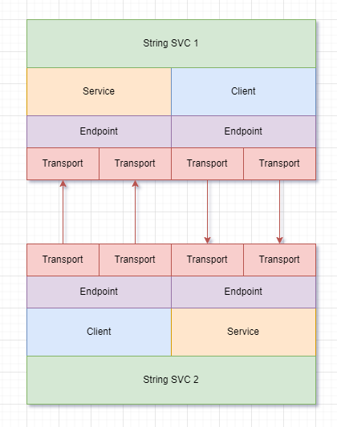
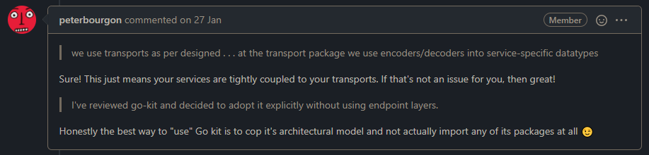

## 前言

这是看了 [Go kit: the road ahead](https://github.com/go-kit/kit/issues/843) 之后，对 go kit 这套抽象的一些想法。主要是关于 endpoint 是否有必要、generic 会如何影响 go kit 的架构、go kit 的代码生成这些问题。

## endpoint 抽象层是否必要存在

我的看法是需要。原因下面分析。

一个没有额外功能的 Endpoint 其实是起到了把请求类型适配到 Go 函数签名的作用。[stringsvc](http://gokit.io/examples/stringsvc.html#endpoints) 实现如下。

```go
import (
	"context"
	"github.com/go-kit/kit/endpoint"
)

func makeUppercaseEndpoint(svc StringService) endpoint.Endpoint {
	return func(_ context.Context, request interface{}) (interface{}, error) {
		req := request.(uppercaseRequest)
		v, err := svc.Uppercase(req.S)
		if err != nil {
			return uppercaseResponse{v, err.Error()}, nil
		}
		return uppercaseResponse{v, ""}, nil
	}
}

func makeCountEndpoint(svc StringService) endpoint.Endpoint {
	return func(_ context.Context, request interface{}) (interface{}, error) {
		req := request.(countRequest)
		v := svc.Count(req.S)
		return countResponse{v}, nil
	}
}
```

对于写过 rpcx 或者 gRPC 的朋友来说，Endpoint 更像是个脱裤子放屁的封装。只要把接口参数约定成 `func (ctx context.Context, req interface{}) (interface{}, error)` 不就完了？传输层收到的请求解码成本地数据类型，然后按约定传入，就万事大吉了。

空口无凭，不如看看如果不要 endpoint，实际编写的代码会变成什么样。

像是 go kit 提供的这种帮助函数：

```go
uppercaseHandler := httptransport.NewServer(
    makeUppercaseEndpoint(svc),
    decodeUppercaseRequest,
    encodeResponse,
)

countHandler := httptransport.NewServer(
    makeCountEndpoint(svc),
    decodeCountRequest,
    encodeResponse,
)
```

可能就会变成这样：

```go
uppercaseHandler := httptransport.NewServer(
    svc.Uppercase,
    decodeUppercaseRequest,
    encodeResponse,
)

countHandler := httptransport.NewServer(
    svc.Count,
    decodeCountRequest,
    encodeResponse,
)
```

当然，为了让 Go 语言的类型系统开心，这里的 `svc.Uppercase` 和 `svc.Count` 得是一样的签名，或者用 `interface{}` 做形参，又或者考虑还没有发布的泛型能不能支持。

看起来是舒服了很多对吧？Endpoint 没了。但还有个问题：中间件。要怎么实现通用的中间件，应用在每个原本应该是 Endpoint 的地方？

例如在微服务系统里很常见的分布式跟踪、metrics收集，无论最终采用的是 opentracing、opencecus、opentelemetry 还是 zipkin、prometheus，跟踪调用链路是一个很基本的可观测性要求。当然，你可以说用 linkerd 一类的 service mesh 解决方案（虽然我觉得不能替代上面提到的这些东西），但也应该有所警惕：我们是不是还有需要在每个接口上都执行、和传输层无关的代码？对，还有身份验证和鉴权工作。还有吗？

当然，也不是脱离了 Endpoint 就别无他法，只是在需要的时候，我想总还是会有意无意抽象出一个类似 endpoint 的层级——可能隐藏在 service 中间件里，也可能交给了传输层。可能写得更好，也可能又是在堆屎山。经验告诉我在一个需要长期支持的系统里，人是靠不住的，但规范可以。endpoint 并没有牺牲多少编码上的自由度，但一定程度上避免了潜在的堆屎可能，我觉得完全可以接受。

## generic 会如何影响 go kit 架构

我直说，Go 的泛型（beta1）就是一泡狗屎，我向来不喜欢 Go 团队的品味，从 slice 和 interface{} 泄露语言的实现细节到其他更离谱的东西。但现在 Go 泛型还没有正式公布（预期就在本月），现在我也没什么好评论的。

generic 会影响 go kit 的架构吗？我的看法是不会。泛型也许能极大帮助各种容器类型、迭代器之类饱受 `interface{}` 折磨的组件，但是 go kit 用得上泛型的地方其实不多。少数常见的 `interface{}` 场合，都是在从一个类型适配到另一个类型，代码编写者清楚自己要处理的两个类型，但 go kit 不知道。

```go
func makeUppercaseEndpoint(svc StringService) endpoint.Endpoint {
	return func(_ context.Context, request interface{}) (interface{}, error) {
		req := request.(uppercaseRequest)
		v, err := svc.Uppercase(req.S)
		if err != nil {
			return uppercaseResponse{v, err.Error()}, nil
		}
		return uppercaseResponse{v, ""}, nil
	}
}
```

这部分适配代码如果把 `interface{}` 替换成具体的 `uppercaseRequest` 和 `uppercaseResponse` 的话，就需要 go kit 提供泛型形式的 Endpoint 接口了，像是这样：

```go
type Endpoint[RequestType,ResponseType] = func(context.Context, RequestType) (ResponseType, error)
```

上面的代码有效无效先不说，我记得在 beta1 尝试泛型的时候发现 Go 在推断类型的时候存在问题，这个 `RequestType` 和 `ResponseType` 在实际用的时候怕是要写不止一次。又是 Go 特色的啰嗦。

可即便是这样恐怕还有问题，如果修改了 `Endpoint` 的签名，那么 `endpoint.Middleware` 恐怕也要泛型化，原来的所有中间件库，`trace`、`auth`、`metrics` 可能也得做泛型化改造。对一个已经深度开发过的系统来说，为了这一点类型检查的好处付出如此代价恐怕是不能接受的。

总而言之，我的观点是 Generic 可能带来变化，但根本上的几个抽象不大可能跟着重构，这是由 go kit 性质决定的。

## go kit 代码生成

但凡跟着 go kit 写过一个 stringsvc 的人都会感觉到 go kit 有多少样板代码，适配传输层需要编写 encode/decode，本地结构转函数签名所需的参数又要一次转换，传输层协议监听、注册`Handler`、客户端连接都要自己编写代码，构造和注册 `Endpoint` 复杂性无非是从 `func main` 移动到 `transport` 或者反过来，尽管很烦，但又无法根本上消除。

如果是 C++ 恐怕会有模板元编程大佬晒自己的 `template`，但 Go 基本没有编译时和运行时的元编程能力。唯一比较擅长的就只有个代码生成了。Go 提供的 `ast/parser` 包很赞，别的语言少有提供这么方便的接口的。

go kit 的代码生成，从目前体验中感受来看，主要是需要下面的功能：

1. 从 `interface` 定义生成对应的 `makeEndpoint` 函数和请求/响应结构体。这部分代码基本没什么特别的。 
2. 从 `interface` 定义生成对应的 `transport` 包，可以自己选择协议。主要解决 encode/decode 手写麻烦的问题。
3. 从 `interface` 定义生成服务构造和启动代码，应用可以自己构造，但 `endpoint` 的构造和 `middleware` 的应用就可以不用自己写了。

这三处的样板代码最多，而且代码本身并不特别，都是简单地对类型进行适配，手写完全是浪费时间，还会引入人为的不确定性，不如让机器搞定。目前考察过的 [kit](https://github.com/GrantZheng/kit) 实现了其中一大部分，但 transport 支持太少，也没有生成注册 endpoint 的代码，依然存在很多手写的样板代码。我简单看了下实现，用 [jennifer](https://github.com/dave/jennifer) 生成代码好是挺好，就是 go 代码显得有点乱 ...

我寻思对 generator 简单重构下实现关注点分离的话，还是能满足上面提到的这些东西的。最好的情况是定义好 interface 之后，生成代码，编写主函数，就能直接运行了。同时又不伤害 go kit 架构本身的扩展性和可定制性。

## 总结



蛮喜欢 go kit 项目作者的一句话：



> Honestly the best way to "use" Go kit is to cop it's architectural model and not actually import any of its packages at all 😉

其实我也想把这套架构搬进项目里，可惜条件不允许，还有更严重的问题要处理，只能先眼馋一下，吸收下精神。