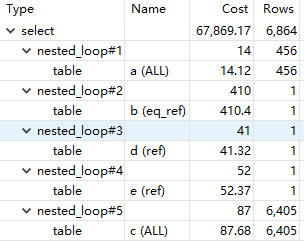
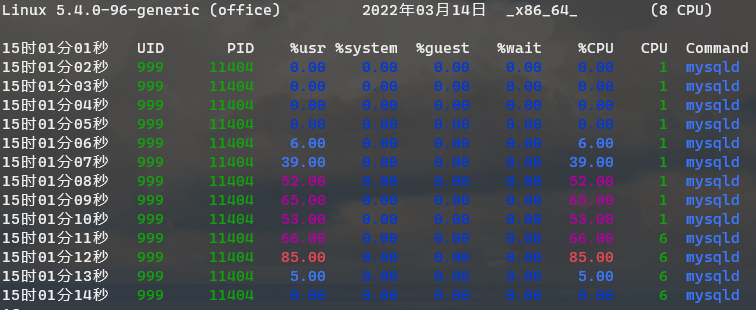

## 前言

长话短说，这个性能问题是上周修一个bug的时候企图偷懒引入的。因为 xorm 在连接查询的时候模型结构必须是和 `join` 的顺序保持一致，中间还不能有遗漏，不然查询结果填充到结构里的时候就会错位。

而业务里这个条件又是可选的——用户不传的时候不需要 `INNER JOIN`；但为了让 xorm 开心，同时尽量别把整个函数签名和返回类型都改了把影响范围搞太大，所以就偷了个懒：既然 xorm 要 `JOIN` ，那就 `LEFT JOIN`加个恒假的条件呗。于是就顺手写下了下面的代码。

```sql
LEFT JOIN tbl ON 1 <> 1
```

没啥问题对吧？我当时也这么想的。

## 问题

好了，问题来了。先把整个 SQL写下来。

```sql
SELECT *
FROM a
INNER JOIN b ON a.resource_id = b.id
LEFT JOIN c ON 1 <> 1
LEFT JOIN d ON d.resource_id = a.resource_id
LEFT JOIN e ON e.resource_id = a.resource_id
WHERE
	a.result != 4
	AND b.resource_type = 2
limit 10 offset 0;
```

整个查询的实际耗时是 **919ms**。

*why ?*

## 性能分析

查询慢了第一反应还是是不是没索引，于是先看看 `explain` 的结果。

| id   | select_type | table | partitions | type   | possible_keys     | key               | key_len | ref           | rows |
| ---- | ----------- | ----- | ---------- | ------ | ----------------- | ----------------- | ------- | ------------- | ---- |
| 1    | SIMPLE      | a     |            | ALL    | IDX_a_resource_id |                   |         |               | 456  |
| 1    | SIMPLE      | b     |            | eq_ref | PRIMARY           | PRIMARY           | 8       | a.resource_id | 1    |
| 1    | SIMPLE      | d     |            | ref    | IDX_d_resource_id | IDX_d_resource_id | 8       | a.resource_id | 1    |
| 1    | SIMPLE      | e     |            | ref    | IDX_e_resource_id | IDX_e_resource_id | 9       | a.resource_id | 1    |
| 1    | SIMPLE      | c     |            | ALL    |                   |                   |         |               | 6405 |

驱动表是 `a`，做了全表扫描，但数据量很小，只有400多行。但这个表是只增的，全表扫描还是不太对劲，于是看了眼索引，发现 `result` 没有索引——但这个字段区分度不算很高，只有4个枚举值。

网上随便搜的博客看到列区分度计算可以用 `SELECT count(distinct col)/count(*) FROM tbl` 来计算，区分度越接近 1 则索引效果越好。`result`的区分度只有`0.0088`，个人感觉区别不大。这种情况下使用result索引滤出来的结果集会比较大，回表查询次数过多的话还不如就遍历一遍原表。

想归想，但还是老实加上了 `result` 索引，再 `explain` 了一次，结果是 `possible keys` 里多了 `IDX_a_result`，但最 `type` 还是 `ALL`，说明确实和 `result` 字段有没有索引没关系。

再接着看下面，其他表基本不是主键就是二级索引，唯独 `c` 表特立独行——也是`ALL`。但这个表的 `JOIN` 子句是这样的。

```sql
LEFT JOIN c ON 1 <> 1
```

这为啥要遍历？



但看到 cost 只有 87.68，又松了口气，可能只是 `explain` 输出不对吧，怎么想 `ON 1 <> 1` 这样的条件也应该是常数时间内完成。

到这里，思路已经完全走歪了，开始觉得是不是磁盘 IO 或者网络 IO 上有瓶颈？

### sysstat 工具

这里介绍下一个很好用的 Linux 下性能分析工具，[sysstat](https://github.com/sysstat/sysstat)。大部分发行版都可以直接用内置包管理器安装，如 Debian/Ubuntu 可以用 `apt-get install sysstat` 安装。

`sysstat` 包含了各种在Unix、Linux环境下通用的工具，来监视系统性能和使用情况。这里面有很多好用的工具比如 `sar`、`iostat`、`pidstat`。

安装`sysstat`之后还需要配置。

```bash
sudo dpkg-reconfigure sysstat
```

然后选 `yes` 来启用定时任务自动收集数据到 `/var/log/sysstat` ，这样 `sar` 就可以导出报告了。

`sar` 是一个综合性的工具，可以收集、导出、保存系统活动数据，收集的数据包括：I/O、CPU、物理内存/Hugepage/Swap、虚拟内存、进程创建、中断、网络接口、socket、等等...非常全面，基本能想到的都有。

放在这个场景里，用 `sar` 可以看到运行查询时的磁盘使用情况：`sudo sar -bd 1`

```plaintext
14时48分14秒       tps      rtps      wtps      dtps   bread/s   bwrtn/s   bdscd/s
14时48分15秒     40.00      1.00     39.00      0.00      8.00    312.00      0.00

14时48分14秒       DEV       tps     rkB/s     wkB/s     dkB/s   areq-sz    aqu-sz     await     %util
14时48分15秒    dev7-0      0.00      0.00      0.00      0.00      0.00      0.00      0.00      0.00
14时48分15秒    dev7-1      0.00      0.00      0.00      0.00      0.00      0.00      0.00      0.00
14时48分15秒    dev7-2      0.00      0.00      0.00      0.00      0.00      0.00      0.00      0.00
14时48分15秒    dev7-3      0.00      0.00      0.00      0.00      0.00      0.00      0.00      0.00
14时48分15秒    dev7-4      0.00      0.00      0.00      0.00      0.00      0.00      0.00      0.00
14时48分15秒    dev7-5      0.00      0.00      0.00      0.00      0.00      0.00      0.00      0.00
14时48分15秒    dev7-6      0.00      0.00      0.00      0.00      0.00      0.00      0.00      0.00
14时48分15秒    dev7-7      0.00      0.00      0.00      0.00      0.00      0.00      0.00      0.00
14时48分15秒    dev8-0     40.00      4.00    156.00      0.00      4.00      0.00      0.20      2.00
14时48分15秒  dev253-0     42.00      4.00    156.00      0.00      3.81      0.00      0.00      2.00
14时48分15秒    dev7-8      0.00      0.00      0.00      0.00      0.00      0.00      0.00      0.00
14时48分15秒    dev7-9      0.00      0.00      0.00      0.00      0.00      0.00      0.00      0.00
```

不能说毫无波动，但显然和瓶颈应该扯不上关系了。但出于谨慎考虑，还是用 `pidstat` 指定了 `mysqld` 进程的 PID 来观察。这里多嘴一句，MySQL 是用 kubernetes 部署在办公室的服务器上的，我得提一嘴 `sysstat` 是在宿主机上直接运行而不是容器里——这得说到容器隔离的原理，`namespace`和`cgroup`，在外层`namespace`下是可以看到内层`namespace`的进程的，但内层的`namespace`看不到外层，是单向的隔离。所以可以直接在宿主机上用 `ps` 看到 `pause` 容器的进程以及 `mysqld` 这种容器里的进程，也可以收集到各种使用率信息——因为共享宿主机的内核嘛。

```bash
pidstat -d -p 11404 1
```

```plaintext
14时57分19秒   UID       PID   kB_rd/s   kB_wr/s kB_ccwr/s iodelay  Command
14时57分20秒   999     11404     -1.00     -1.00     -1.00       0  mysqld
14时57分21秒   999     11404     -1.00     -1.00     -1.00       0  mysqld
14时57分22秒   999     11404     -1.00     -1.00     -1.00       0  mysqld
14时57分23秒   999     11404     -1.00     -1.00     -1.00       0  mysqld
14时57分24秒   999     11404     -1.00     -1.00     -1.00       0  mysqld
```

这就只能说毫无波动了，说那么多，并没有卵用。

## 转折

一上午几乎都花费在这个查询上，终于在一次胡乱分析中注意到 CPU 使用率不同寻常：`pidstat  -p 11404 -d 1`

```plaintext
15时01分01秒   UID       PID    %usr %system  %guest   %wait    %CPU   CPU  Command
15时01分02秒   999     11404    0.00    0.00    0.00    0.00    0.00     1  mysqld
15时01分03秒   999     11404    0.00    0.00    0.00    0.00    0.00     1  mysqld
15时01分04秒   999     11404    0.00    0.00    0.00    0.00    0.00     1  mysqld
15时01分05秒   999     11404    0.00    0.00    0.00    0.00    0.00     1  mysqld
15时01分06秒   999     11404    6.00    0.00    0.00    0.00    6.00     1  mysqld
15时01分07秒   999     11404   39.00    0.00    0.00    0.00   39.00     1  mysqld
15时01分08秒   999     11404   52.00    0.00    0.00    0.00   52.00     1  mysqld
15时01分09秒   999     11404   65.00    0.00    0.00    0.00   65.00     1  mysqld
15时01分10秒   999     11404   53.00    0.00    0.00    0.00   53.00     1  mysqld
15时01分11秒   999     11404   66.00    0.00    0.00    0.00   66.00     6  mysqld
15时01分12秒   999     11404   85.00    0.00    0.00    0.00   85.00     6  mysqld
15时01分13秒   999     11404    5.00    0.00    0.00    0.00    5.00     6  mysqld
15时01分14秒   999     11404    0.00    0.00    0.00    0.00    0.00     6  mysqld
```



在运行查询时，CPU使用率飙升到了50%~85%，一个简单的查询几乎跑满了一个核心？如果 ctrl+enter 按得稍微勤快一点，这个使用率最高能跑到 105% ——这还是因为我在 kubernetes 只给了 1 CPU 的配额的缘故。于是瓶颈终于暴露了出来：CPU。这谁能想到呢。

再回过头分析查询，结合一下脑子里沉睡已久的记忆+谷歌一下，问题终于浮出水面。


对，`nested_loop#5`，MySQL 的执行计划忠实反映了实际做的事情。MySQL 真就，对着 `LEFT JOIN ... ON 1 <> 1` 这个条件，在嵌套循环里，做了个全表扫描......

所谓`nested_loop`，就是`for range { for range {}}` 这样的执行路径，简单地把 `Rows` 乘一下就能得到实际处理了多少行：`6450*456=2920680`，一共 292 万行，难怪 CPU 使用率会如此之高，难怪数据量这么小的两个表做查询居然会花费接近1s的时间。

## 解决

知道了瓶颈，找到了造成瓶颈的代码，那么应该就好解决了——话虽如此，要我给出解决办法的话确实就是一句话的事情，但为了找出这个解决办法反而浪费了不少时间。

回顾造成问题的 `JOIN` 子句，`LEFT JOIN ... ON 1 <> 1`，`1 <> 1` 是恒假条件，但 MySQL 对这个条件选择了全表扫描这种完全无法理解的处理方式。

行，那我直接改成 `ON FALSE`，总不至于连 `FALSE` 也能给个全表扫描的执行计划吧？对，还真能，MySQL 真有你的...

随后还试了 `0 > 1`、`1 < 0`、`1=2`、`1 is null` 等等条件，无一例外 MySQL 的执行计划都是 nested_loop + 全表扫描，就在快放弃的时候偶然想到既然说什么都要扫表，那我让 MySQL 扫就是了，给个有索引的字段让 MySQL 不要全表扫描，也能改善很多吧？然后就随手写下 `c.id=-1`。

然后 MySQL 的执行计划就从全表扫描变成了常数时间...真有你的啊 MySQL！

又试了下 `c.id is null` 同样也是常数时间，所以MySQL犯傻的原因是优化器没考虑到有我这样的 **聪（臭）明（傻）人（B）** 会往条件里写个 FALSE 是吧...真有你的啊 MySQL！

## 总结

0. 不要忽略 explain 给出的线索。
1. 注意 `nested_loop`，`join` 的条件不能太宽泛，否则遍历的数据量会爆炸性增长，后果就是查询时间随随便便翻几百倍。
   1. 最高效的 `join` 当然是直接走主键，查一个元素，聚簇索引，不用回表，查询时间复杂度不变。
   2. 次一级的走二级索引，查一个元素，回表一次也就完了，查询时间复杂度不变。
   3. 再次一级的索引区分度不足1，查找出来多个元素，回表多次，嵌套循环的话会成倍放大驱动表的时间复杂度。
   4. 最差的情况，索引区分度太差或者没索引，被迫嵌套循环+全表扫描，也就是我碰到的情况，生产下负载提上来一点就大概率要GG。
2. MySQL 的优化器需要在条件里给个列，就算是恒真或者恒假的条件，也一定要给个列，不然MySQL就会跟个傻逼一样选择全表扫描。
   1. 我的环境是 MySQL 5.7.33，InnoDB 5.7.33，MySQL Community Server，新版本 MySQL 不知道有没有解决。
3. `sysstat` 这套工具很好用，如果没把可观测性的基础设施(各种`reporter`+`prometheus`+`grafana`)搞好的话，`sysstat` 值得拥有。

